# Manuel utilisateur SoftAppli

Socle applicatif et shell des modules  
Date de generation : 12 juin 2026

## 1. Objet du manuel

Ce manuel explique le fonctionnement du socle SoftAppli du point de vue d'un utilisateur final. Il couvre les ecrans communs a la suite applicative : connexion, accueil multi-applications, navigation entre modules, recherche globale, notifications, changement de langue et administration centrale des utilisateurs, projets/sites et licences.

Les ecrans propres a chaque module metier, comme le depot detaille d'un document SoftDocs ou la validation SoftSign, ne sont pas detailles ici, sauf lorsqu'ils servent a expliquer le shell commun.

## 2. Profils utilisateurs concernes

| Role utilisateur | Utilisation principale |
|---|---|
| Utilisateur interne | Se connecter, ouvrir les applications auxquelles il a acces, consulter les notifications, changer de langue et utiliser la recherche globale. |
| Administrateur global / Super Admin | Administrer les utilisateurs, les acces aux applications, les projets, les sites et les licences. |
| Administrateur applicatif | Utiliser les fonctions d'administration dans les modules autorises, selon les droits attribues. |
| Utilisateur sans droit sur une application | Voit l'application dans le portail, mais ne peut pas l'ouvrir si l'acces n'est pas accorde. |

## 3. Parcours global

1. L'utilisateur ouvre l'ecran de connexion SoftAppli.
2. Il saisit son adresse email et son mot de passe.
3. Apres connexion, il arrive sur l'accueil SoftAppli, qui presente les applications disponibles.
4. Il ouvre une application ou un raccourci metier.
5. Dans un module, il utilise la barre superieure commune pour rechercher, changer d'application, consulter les notifications, changer de langue ou se deconnecter.
6. Si son profil est Super Admin, il peut revenir a l'accueil SoftAppli et administrer les utilisateurs, les projets/sites et les licences.

---

# 4. Ecran de connexion

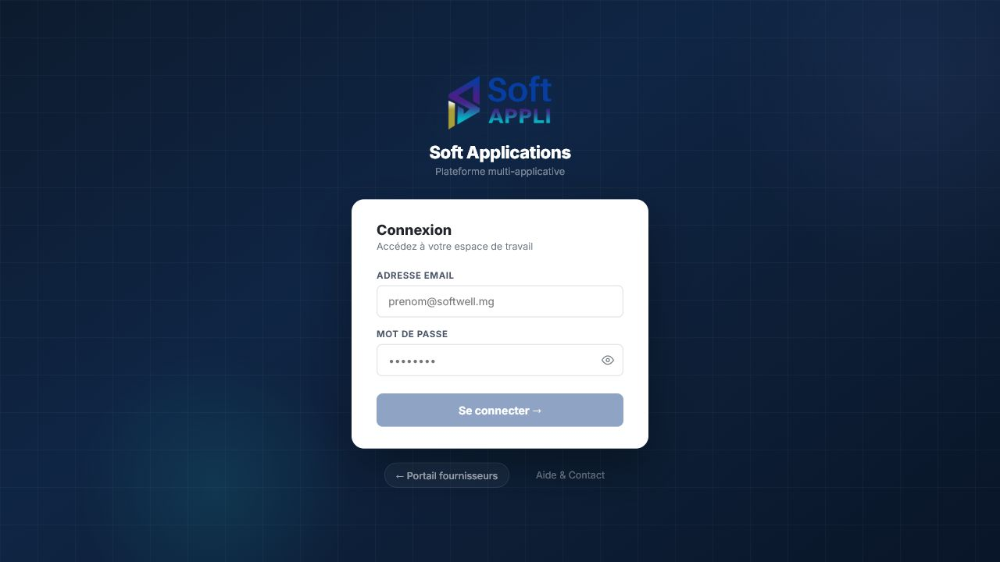

## Presentation generale

L'ecran de connexion permet aux collaborateurs internes d'acceder a leur espace de travail SoftAppli. Il intervient au debut de chaque session utilisateur. Il est utilise par tous les utilisateurs internes disposant d'un compte.

## Champs et zones de saisie

| Champ / zone | Fonction | Format attendu | Obligatoire | Relations avec les autres champs |
|---|---|---|---|---|
| Adresse email | Identifie l'utilisateur qui souhaite acceder a SoftAppli. | Adresse email professionnelle, par exemple `prenom@softwell.mg`. | Oui | Le bouton **Se connecter** reste inactif tant que ce champ n'est pas renseigne. |
| Mot de passe | Verifie l'identite de l'utilisateur. | Texte masque pendant la saisie. | Oui | Le bouton **Se connecter** reste inactif tant que ce champ n'est pas renseigne. |
| Message d'erreur | Informe l'utilisateur si les identifiants ne correspondent pas a un compte connu. | Message affiche dans un encadre rouge. | Non | Apparait uniquement apres une tentative de connexion incorrecte. |

## Boutons et actions

| Action | Role | Conditions d'activation | Consequences |
|---|---|---|---|
| Se connecter | Lance la verification des identifiants. | Actif uniquement lorsque l'adresse email et le mot de passe sont saisis. | En cas de succes, ouvre l'accueil SoftAppli. En cas d'echec, affiche un message d'erreur. |
| Afficher / masquer le mot de passe | Permet de verifier temporairement le mot de passe saisi. | Actif des que le champ mot de passe est visible. | Alterne entre affichage masque et affichage lisible du mot de passe. |
| Portail fournisseurs | Ouvre l'espace public ou fournisseur. | Toujours actif. | Redirige vers le portail fournisseurs. |
| Aide & Contact | Donne acces a une page d'aide ou de contact. | Toujours actif. | Ouvre le site d'assistance associe. |

## Elements d'affichage

| Element | Signification | Interpretation |
|---|---|---|
| Logo SoftAppli | Indique que l'utilisateur est sur la plateforme centrale. | Confirme que l'acces concerne l'ensemble des applications SoftAppli. |
| Sous-titre "Plateforme multi-applicative" | Rappelle que la connexion donne acces a plusieurs modules. | Les applications visibles apres connexion dependront des droits de l'utilisateur. |

---

# 5. Accueil SoftAppli - Lanceur d'applications

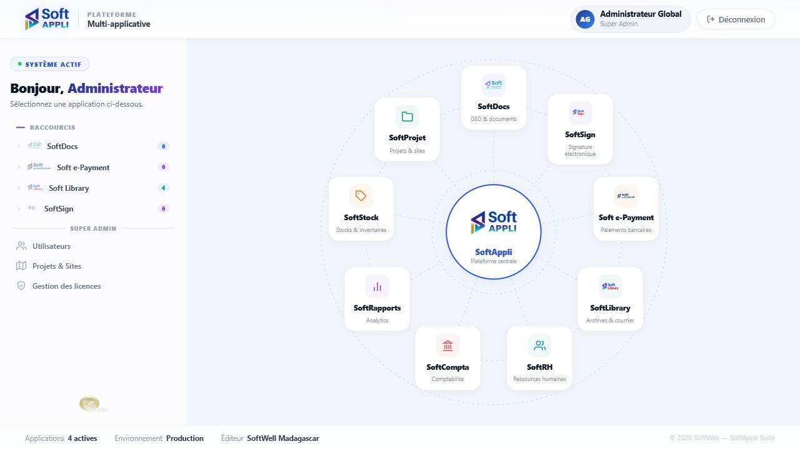

## Presentation generale

L'accueil SoftAppli est le point d'entree apres connexion. Il permet de choisir l'application a ouvrir et d'acceder aux fonctions d'administration centrale lorsque l'utilisateur est Super Admin.

Il est utilise par tous les utilisateurs connectes. Les applications et raccourcis disponibles dependent des droits attribues au compte.

## Zones et champs

| Zone | Fonction | Format attendu | Obligatoire | Relations avec les autres zones |
|---|---|---|---|---|
| Bandeau utilisateur | Affiche les initiales, le nom et le role de l'utilisateur connecte. | Informations de compte. | Automatique | Se remplit automatiquement apres connexion. |
| Etat systeme | Indique que la plateforme est active. | Badge de statut. | Automatique | Sert de repere visuel, sans saisie utilisateur. |
| Raccourcis par application | Presente les applications accessibles et le nombre de raccourcis disponibles. | Liste d'applications avec libelle et compteur. | Automatique | Les raccourcis affiches dependent des applications autorisees pour l'utilisateur. |
| Carte centrale SoftAppli | Represente la plateforme centrale et les modules disponibles autour d'elle. | Carte visuelle et cartes applicatives. | Automatique | Les modules non encore disponibles peuvent etre visibles, mais ne donnent pas forcement acces a une application. |
| Zone Super Admin | Donne acces aux fonctions d'administration centrale. | Liens d'administration. | Visible uniquement pour les Super Admin | N'apparait pas pour les utilisateurs sans role Super Admin. |
| Pied de page | Affiche le nombre d'applications actives, l'environnement et l'editeur. | Informations de contexte. | Automatique | Le nombre d'applications actives est lie aux produits actives dans la plateforme. |

## Boutons et actions

| Action | Role | Conditions d'activation | Consequences |
|---|---|---|---|
| Ouvrir une application | Accede au module selectionne. | Actif si l'utilisateur a le droit d'acces a l'application. | Ouvre le tableau de bord ou l'ecran principal du module. |
| Raccourci d'application | Ouvre directement une fonction du module, par exemple tableau de bord ou suivi. | Actif si l'utilisateur a acces au module. | Ouvre le module et positionne l'utilisateur sur l'ecran choisi. |
| Utilisateurs | Ouvre l'administration centrale des utilisateurs. | Visible et actif pour le Super Admin. | Affiche l'ecran de gestion des utilisateurs. |
| Projets & Sites | Ouvre le referentiel central des projets et sites. | Visible et actif pour le Super Admin. | Affiche l'ecran Projets & Sites. |
| Gestion des licences | Ouvre l'administration des produits actives et quotas. | Visible et actif pour le Super Admin. | Affiche l'ecran Gestion des licences. |
| Deconnexion | Termine la session utilisateur. | Toujours actif lorsque l'utilisateur est connecte. | Retourne a l'ecran de connexion. |

## Elements d'affichage

| Element | Signification | Interaction |
|---|---|---|
| Compteur de raccourcis | Nombre de raccourcis rapides disponibles pour une application. | Sert a evaluer la richesse d'acces rapide d'un module. |
| Applications actives | Nombre d'applications actuellement activees dans la suite. | Information de contexte affichee en bas de page. |
| Environnement "Production" | Indique l'environnement de travail affiche dans la maquette. | Aucune action directe. |
| Modules autour de SoftAppli | Vue d'ensemble de la suite applicative. | Clic possible sur les modules ouverts a l'utilisateur. |

---

# 6. Shell commun dans un module

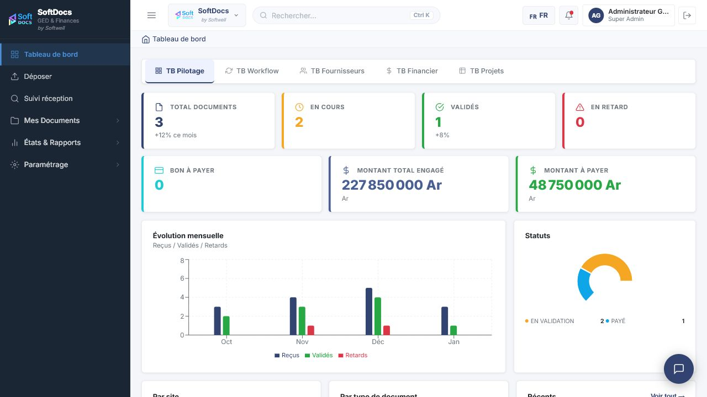

## Presentation generale

Le shell commun est l'habillage commun visible une fois qu'un module est ouvert. Il organise l'ecran en trois parties : menu lateral du module, barre superieure commune et zone de travail.

Dans la capture, le module SoftDocs est ouvert, mais les principes de navigation communs s'appliquent au socle SoftAppli.

## Zones et champs

| Zone | Fonction | Format attendu | Obligatoire | Relations avec les autres zones |
|---|---|---|---|---|
| Menu lateral du module | Donne acces aux principales rubriques du module courant. | Liste de rubriques cliquables. | Automatique | Change selon le module ouvert. |
| Bouton de repli du menu | Permet de reduire ou afficher le menu lateral. | Bouton icone. | Optionnel | Influence seulement l'affichage, pas les donnees. |
| Selecteur d'application | Affiche l'application active et permet de changer de module. | Menu deroulant applicatif. | Automatique | Le choix d'une application modifie le module affiche. |
| Recherche globale | Lance la recherche transversale dans les documents, utilisateurs et autres objets visibles. | Champ de recherche ouvert dans une fenetre. | Optionnel | Les resultats varient selon le texte saisi. |
| Langue | Affiche la langue courante de l'interface. | Choix parmi les langues disponibles. | Optionnel | Le choix modifie les libelles de l'interface. |
| Notifications | Affiche les alertes et messages recents. | Menu de notifications. | Optionnel | Le contenu depend des evenements et retards disponibles. |
| Identite utilisateur | Affiche l'utilisateur connecte. | Initiales, nom et role. | Automatique | Se base sur le compte utilise a la connexion. |
| Zone de travail | Affiche l'ecran metier courant. | Contenu du module. | Automatique | Change selon la rubrique selectionnee. |

## Boutons et actions

| Action | Role | Conditions d'activation | Consequences |
|---|---|---|---|
| Menu lateral | Affiche ou reduit la navigation du module. | Toujours actif dans le shell. | Donne plus ou moins d'espace a la zone de travail. |
| Changer d'application | Ouvre la liste des modules disponibles. | Toujours actif pour un utilisateur connecte. | Permet de passer a un autre module ou de revenir a l'accueil SoftAppli. |
| Rechercher | Ouvre la recherche globale. | Toujours actif. | Affiche une fenetre de recherche au-dessus de l'ecran courant. |
| Changer de langue | Ouvre le menu de langue. | Toujours actif. | Change les libelles de l'interface apres selection. |
| Notifications | Ouvre la liste des alertes. | Toujours actif. | Affiche les notifications recentes. |
| Deconnexion | Termine la session. | Toujours actif. | Retourne a l'ecran de connexion. |

## Elements d'affichage

| Element | Signification | Interpretation |
|---|---|---|
| Fil d'Ariane / libelle de page | Situe l'utilisateur dans le module. | Permet de comprendre l'ecran courant. |
| Badges et indicateurs du tableau de bord | Resument l'activite du module. | A interpreter selon le module affiche. |
| Assistant flottant | Donne acces a une aide conversationnelle si elle est disponible. | Peut etre utilise pour obtenir une assistance contextuelle. |

---

# 7. Menu "Changer d'application"

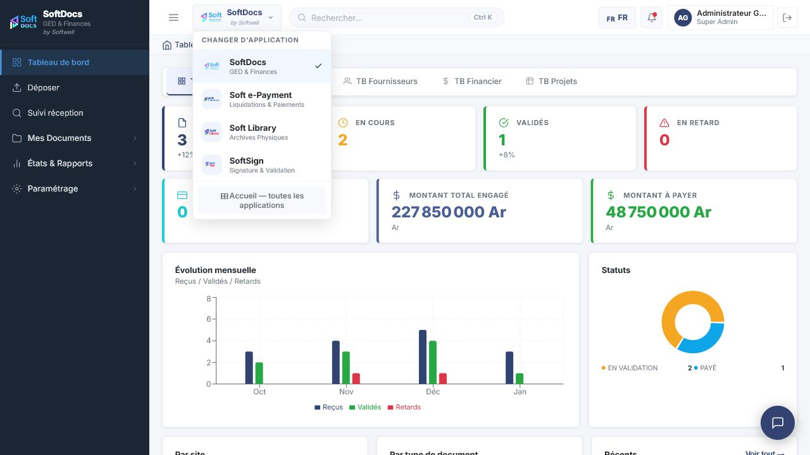

## Presentation generale

Ce menu permet de passer rapidement d'un module SoftAppli a un autre sans se reconnecter. Il est utilise par les utilisateurs ayant acces a plusieurs applications.

## Elements affiches

| Element | Signification | Interaction |
|---|---|---|
| Application courante | Application actuellement ouverte. | Elle est mise en evidence dans la liste. |
| Liste des applications | Applications disponibles : SoftDocs, Soft e-Payment, Soft Library, SoftSign. | Clic sur une application pour l'ouvrir. |
| Accueil - toutes les applications | Retour au lanceur SoftAppli. | Clic pour revenir a l'accueil central. |

## Actions

| Action | Role | Conditions d'activation | Consequences |
|---|---|---|---|
| Selectionner une application | Changer de module. | Active si l'utilisateur a acces a l'application. | Ouvre le tableau de bord du module choisi. |
| Accueil - toutes les applications | Revenir au lanceur SoftAppli. | Toujours actif. | Affiche l'accueil SoftAppli. |
| Cliquer a l'exterieur du menu ou sur le selecteur | Refermer le menu. | Lorsque le menu est ouvert. | Retourne a l'ecran courant sans changer de module. |

---

# 8. Recherche globale

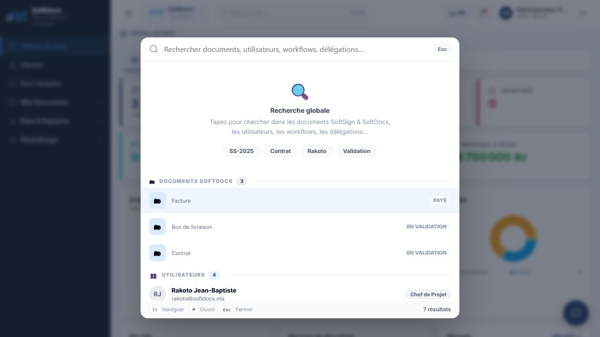

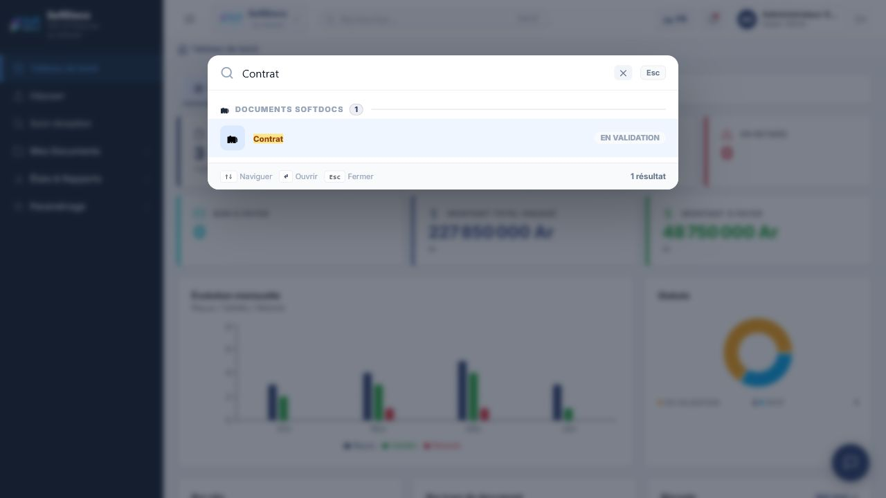

## Presentation generale

La recherche globale permet de retrouver rapidement des documents, utilisateurs, workflows ou delegations sans parcourir manuellement les menus. Elle est utile lorsqu'un utilisateur connait un mot-cle, une reference, un nom ou une partie d'intitule.

## Champs et zones de saisie

| Champ / zone | Fonction | Format attendu | Obligatoire | Relations avec les autres champs |
|---|---|---|---|---|
| Champ de recherche | Saisir le mot-cle recherche. | Texte libre : reference, nom, type de document, utilisateur, projet. | Non | Les resultats se mettent a jour selon le texte saisi. |
| Suggestions rapides | Proposent des exemples de recherche. | Boutons de mots-cles. | Non | Un clic remplit la recherche avec le mot choisi. |

## Boutons et actions

| Action | Role | Conditions d'activation | Consequences |
|---|---|---|---|
| Ouvrir la recherche | Affiche la fenetre de recherche. | Toujours actif depuis la barre superieure. | Met le curseur dans le champ de recherche. |
| Effacer la recherche | Vide le champ saisi. | Actif lorsqu'un texte est present. | Revient a l'etat initial de la recherche. |
| Selectionner un resultat | Ouvre l'element trouve. | Actif lorsqu'au moins un resultat est affiche. | Oriente l'utilisateur vers l'ecran correspondant. |
| Fermer | Ferme la recherche globale. | Toujours actif lorsque la fenetre est ouverte. | Retourne a l'ecran precedent. |
| Touches de navigation affichees | Aident a parcourir les resultats au clavier. | Disponibles lorsqu'il y a des resultats. | Permettent de naviguer, ouvrir ou fermer plus rapidement. |

## Elements d'affichage

| Element | Signification | Interpretation |
|---|---|---|
| Groupes de resultats | Classent les resultats par famille : documents, utilisateurs, workflows, delegations. | Permettent de comprendre le type d'information trouvee. |
| Nombre de resultats | Indique combien d'elements correspondent a la recherche. | Si le nombre est nul, il faut modifier le mot-cle. |
| Badge de statut | Indique l'etat d'un document ou d'un objet trouve. | Exemple : "En validation" signifie que le document est dans un circuit de validation. |

---

# 9. Menu de langue

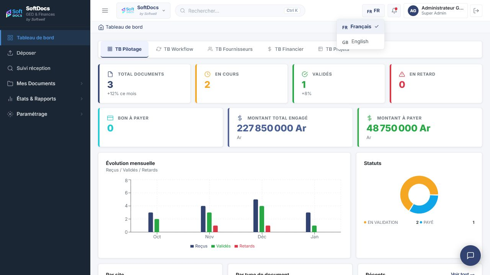

## Presentation generale

Le menu de langue permet de choisir la langue d'affichage de l'interface. Il est disponible depuis la barre superieure du shell.

## Elements affiches

| Element | Signification | Interaction |
|---|---|---|
| Langue courante | Langue actuellement utilisee. | Affichee dans le bouton de la barre superieure. |
| Francais | Interface en francais. | Clic pour passer ou rester en francais. |
| English | Interface en anglais. | Clic pour passer en anglais. |
| Coche de selection | Indique la langue active. | Sert de repere visuel. |

## Actions

| Action | Role | Conditions d'activation | Consequences |
|---|---|---|---|
| Choisir Francais | Affiche l'interface en francais. | Toujours actif. | Les libelles sont affiches en francais. |
| Choisir English | Affiche l'interface en anglais. | Toujours actif. | Les libelles disponibles sont affiches en anglais. |
| Refermer le menu | Quitter le choix de langue. | Lorsque le menu est ouvert. | Aucun changement si aucune langue n'est selectionnee. |

---

# 10. Notifications

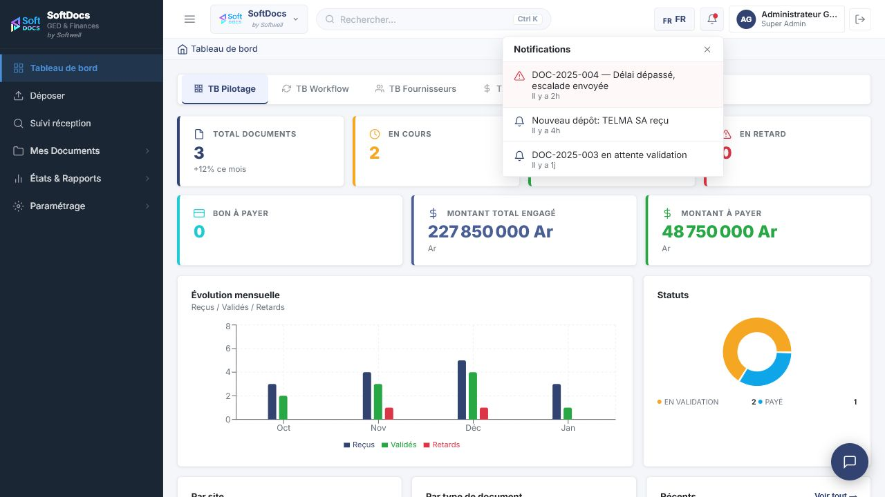

## Presentation generale

Le menu des notifications regroupe les alertes et informations recentes utiles a l'utilisateur. Il permet de prendre connaissance des evenements sans quitter l'ecran courant.

## Elements d'affichage

| Element | Signification | Interpretation |
|---|---|---|
| Titre Notifications | Indique que la liste d'alertes est ouverte. | Regroupe les messages recents. |
| Notification d'alerte | Signale un retard, une escalade ou un point d'attention. | A traiter en priorite si elle concerne l'utilisateur. |
| Notification informative | Signale un evenement, par exemple un nouveau depot. | Informe l'utilisateur d'une activite recente. |
| Indication de temps | Affiche depuis combien de temps l'evenement est survenu. | Permet d'evaluer l'urgence. |

## Actions

| Action | Role | Conditions d'activation | Consequences |
|---|---|---|---|
| Ouvrir les notifications | Affiche la liste des messages. | Toujours actif. | Ouvre le menu de notifications. |
| Fermer les notifications | Referme la liste. | Lorsque le menu est ouvert. | Retourne a l'ecran courant. |

---

# 11. Administration des utilisateurs

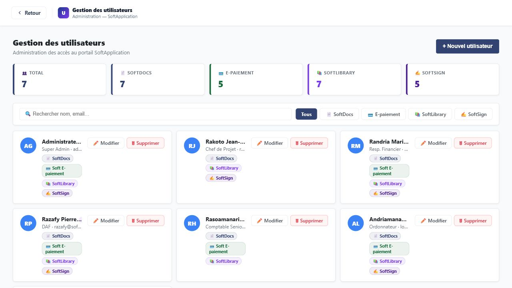

## Presentation generale

L'ecran de gestion des utilisateurs sert a administrer les comptes et les acces aux applications SoftAppli. Il intervient lors de l'arrivee d'un nouvel utilisateur, d'un changement de fonction, d'un changement d'acces applicatif ou de la suppression d'un compte.

Cet ecran est destine au Super Admin.

## Champs et filtres

| Champ / zone | Fonction | Format attendu | Obligatoire | Relations avec les autres champs |
|---|---|---|---|---|
| Recherche nom, email | Filtre la liste des utilisateurs. | Texte libre : nom, prenom ou adresse email. | Non | La liste se met a jour selon le texte saisi. |
| Filtre Tous | Affiche tous les utilisateurs. | Bouton de filtre. | Non | Annule le filtre par application. |
| Filtre SoftDocs | Affiche les utilisateurs ayant acces a SoftDocs. | Bouton de filtre. | Non | Ne montre que les cartes utilisateurs associees a cette application. |
| Filtre E-paiement | Affiche les utilisateurs ayant acces a Soft e-Payment. | Bouton de filtre. | Non | Ne montre que les cartes utilisateurs associees a cette application. |
| Filtre SoftLibrary | Affiche les utilisateurs ayant acces a Soft Library. | Bouton de filtre. | Non | Ne montre que les cartes utilisateurs associees a cette application. |
| Filtre SoftSign | Affiche les utilisateurs ayant acces a SoftSign. | Bouton de filtre. | Non | Ne montre que les cartes utilisateurs associees a cette application. |

## Boutons et actions

| Action | Role | Conditions d'activation | Consequences |
|---|---|---|---|
| Nouvel utilisateur | Ouvre le formulaire de creation d'un utilisateur. | Toujours actif pour le Super Admin. | Affiche la fenetre "Nouvel utilisateur". |
| Modifier | Ouvre le formulaire de modification du compte choisi. | Actif sur chaque carte utilisateur. | Permet de modifier les informations et acces de l'utilisateur. |
| Supprimer | Supprime le compte de la liste. | Actif sur chaque carte utilisateur. | Demande une confirmation, puis retire l'utilisateur si l'action est confirmee. |
| Boutons de filtre | Reduisent la liste affichee. | Toujours actifs. | Ne modifient pas les comptes, seulement l'affichage. |

## Elements d'affichage

| Element | Signification | Interpretation |
|---|---|---|
| Total | Nombre total d'utilisateurs connus. | Permet de controler la taille du referentiel. |
| Compteurs par application | Nombre d'utilisateurs ayant acces a chaque application. | Utile pour verifier la repartition des acces. |
| Carte utilisateur | Resume un compte : initiales, nom, role affiche, email et applications. | Chaque carte represente un utilisateur. |
| Badge Super Admin | Indique un profil d'administration globale. | L'utilisateur a acces aux fonctions centrales du socle. |
| Badges d'applications | Indiquent les applications autorisees pour l'utilisateur. | Determinent ce que l'utilisateur verra ou pourra ouvrir dans l'accueil SoftAppli. |

---

# 12. Formulaire utilisateur

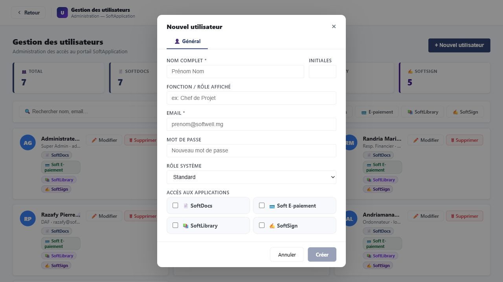

## Presentation generale

Le formulaire utilisateur permet de creer un nouvel utilisateur ou de modifier un compte existant. Il est utilise par le Super Admin lorsqu'il attribue des informations d'identite, un role d'affichage, un role systeme et des acces applicatifs.

## Champs et zones de saisie

| Champ / zone | Fonction | Format attendu | Obligatoire | Relations avec les autres champs |
|---|---|---|---|---|
| Nom complet | Nom de l'utilisateur affiche dans SoftAppli. | Texte, par exemple "Prenom Nom". | Oui | Lors d'une creation, les initiales peuvent se remplir automatiquement a partir du nom saisi. |
| Initiales | Initiales affichees dans l'avatar utilisateur. | 1 a 3 lettres. | Non | Peut etre renseigne automatiquement depuis le nom, puis modifie manuellement. |
| Fonction / Role affiche | Fonction metier ou intitule lisible par les autres utilisateurs. | Texte libre, par exemple "Chef de Projet". | Non | S'affiche dans le bandeau utilisateur et les cartes. |
| Email | Adresse de contact et identifiant de connexion. | Adresse email. | Oui | Necessaire pour identifier le compte. |
| Mot de passe | Mot de passe associe au compte. | Texte masque. | Non dans la maquette ; recommande pour permettre la connexion. | En modification, laisser vide permet de conserver le mot de passe existant. |
| Role Systeme | Niveau global d'autorisation. | Liste de choix : Superadmin, Admin, Standard, Lecture seule. | Oui, avec une valeur par defaut. | Le role Superadmin donne acces aux ecrans centraux d'administration. |
| Acces aux applications | Determine les modules disponibles pour l'utilisateur. | Cases a cocher par application. | Non | Les applications cochees apparaissent comme accessibles dans l'accueil SoftAppli. |

## Boutons et actions

| Action | Role | Conditions d'activation | Consequences |
|---|---|---|---|
| Creer | Enregistre un nouveau compte. | Actif lorsque le nom complet et l'email sont renseignes. | Ajoute l'utilisateur a la liste. |
| Enregistrer | Sauvegarde les modifications d'un compte existant. | Actif lorsque le nom complet et l'email sont renseignes. | Met a jour la carte utilisateur. |
| Annuler | Ferme le formulaire sans enregistrer. | Toujours actif. | Les informations saisies sont abandonnees. |
| Fermer | Ferme la fenetre. | Toujours actif. | Revient a la liste des utilisateurs. |
| Cocher une application | Donne ou retire l'acces a une application. | Toujours actif dans le formulaire. | Met a jour les badges applicatifs apres enregistrement. |

---

# 13. Administration Projets & Sites - Onglet Projets

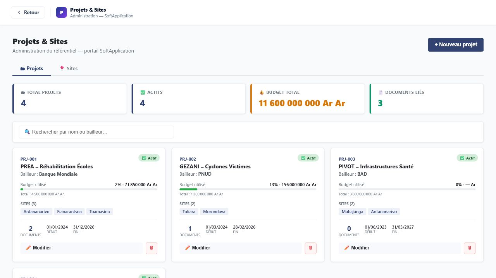

## Presentation generale

L'onglet Projets permet d'administrer le referentiel des projets utilises par les applications SoftAppli. Il intervient lors de la creation d'un projet, du suivi de son budget, de son rattachement a des sites ou de sa desactivation.

Cet ecran est destine au Super Admin.

## Champs et filtres

| Champ / zone | Fonction | Format attendu | Obligatoire | Relations avec les autres champs |
|---|---|---|---|---|
| Recherche par nom ou bailleur | Filtre les projets affiches. | Texte libre. | Non | La liste se met a jour selon le nom du projet ou du bailleur saisi. |
| Onglet Projets | Affiche les cartes projets. | Onglet de navigation. | Non | Selectionne la vue des projets. |
| Onglet Sites | Affiche le referentiel des sites. | Onglet de navigation. | Non | Bascule vers la gestion des sites. |

## Boutons et actions

| Action | Role | Conditions d'activation | Consequences |
|---|---|---|---|
| Nouveau projet | Ouvre le formulaire de creation d'un projet. | Actif dans l'onglet Projets. | Affiche la fenetre "Nouveau projet". |
| Modifier | Ouvre le projet selectionne en modification. | Actif sur chaque carte projet. | Permet de changer les informations du projet. |
| Supprimer | Supprime un projet du referentiel. | Actif sur chaque carte projet. | Demande confirmation avant suppression. |
| Changer d'onglet | Passe de Projets a Sites ou inversement. | Toujours actif. | Change la vue affichee sans quitter l'ecran. |

## Elements d'affichage

| Element | Signification | Interpretation |
|---|---|---|
| Total projets | Nombre de projets dans le referentiel. | Permet de controler le volume de projets. |
| Actifs | Nombre de projets actuellement actifs. | Un projet inactif n'est plus utilise pour de nouvelles operations. |
| Budget total | Somme des budgets des projets affiches. | Donne une vue globale des montants suivis. |
| Documents lies | Nombre de documents rattaches aux projets. | Indique l'activite documentaire associee. |
| Carte projet | Resume un projet : identifiant, nom, bailleur, budget, sites, dates, documents. | Permet de lire rapidement l'etat du projet. |
| Barre de budget utilise | Compare le montant consomme au budget total. | Plus la barre avance, plus le budget est utilise. |
| Badge Actif / Inactif | Statut d'utilisation du projet. | Un projet actif peut etre utilise dans les processus metier. |

---

# 14. Formulaire projet

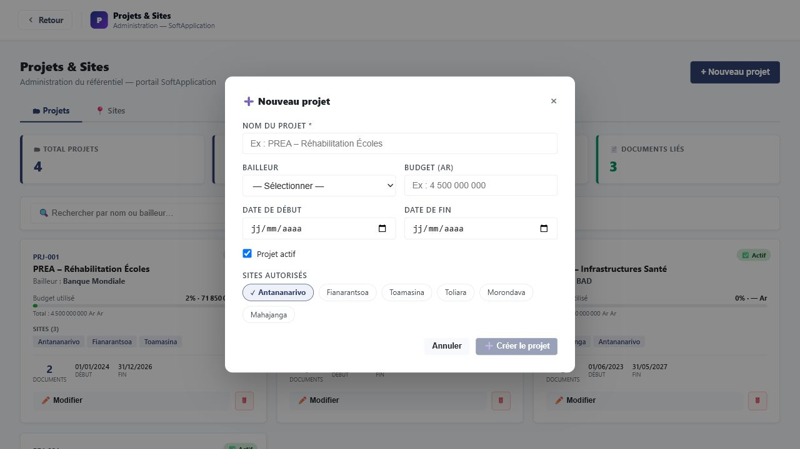

## Presentation generale

Le formulaire projet permet de creer ou modifier un projet central. Il est utilise pour renseigner les informations de base du projet, son bailleur, son budget, sa periode et ses sites autorises.

## Champs et zones de saisie

| Champ / zone | Fonction | Format attendu | Obligatoire | Relations avec les autres champs |
|---|---|---|---|---|
| Nom du projet | Identifie le projet dans les listes et ecrans metier. | Texte libre, par exemple "PREA - Rehabilitation Ecoles". | Oui | Le bouton de creation reste visuellement limite tant que le nom est vide. |
| Bailleur | Indique l'organisme financeur ou partenaire. | Liste de choix : Banque Mondiale, PNUD, BAD, FIDA, AFD, UE, USAID, Autre. | Non | Utilise dans la recherche et l'affichage de la carte projet. |
| Budget (Ar) | Montant global du projet en ariary. | Nombre. | Non | Sert au calcul du pourcentage de budget utilise. Si vide, le budget est considere comme nul. |
| Date de debut | Date de demarrage du projet. | Date. | Non | Affichee sur la carte projet. |
| Date de fin | Date previsionnelle de fin du projet. | Date. | Non | Affichee sur la carte projet. |
| Projet actif | Indique si le projet est utilisable. | Case a cocher. | Non | Si decoche, le projet est affiche comme inactif. |
| Sites autorises | Sites rattaches au projet. | Selection multiple par etiquettes. | Non | Les sites selectionnes apparaissent sur la carte projet et limitent le rattachement metier au projet. |

## Boutons et actions

| Action | Role | Conditions d'activation | Consequences |
|---|---|---|---|
| Creer le projet | Enregistre un nouveau projet. | Possible lorsque le nom du projet est renseigne. | Ajoute le projet a la liste. |
| Enregistrer | Sauvegarde les modifications. | Possible lorsque le nom du projet est renseigne. | Met a jour la carte projet. |
| Annuler | Abandonne la saisie. | Toujours actif. | Ferme la fenetre sans enregistrer. |
| Fermer | Ferme la fenetre. | Toujours actif. | Retourne a l'onglet Projets. |
| Selectionner un site | Ajoute ou retire un site du projet. | Toujours actif. | Met a jour la liste des sites rattaches apres enregistrement. |

---

# 15. Administration Projets & Sites - Onglet Sites

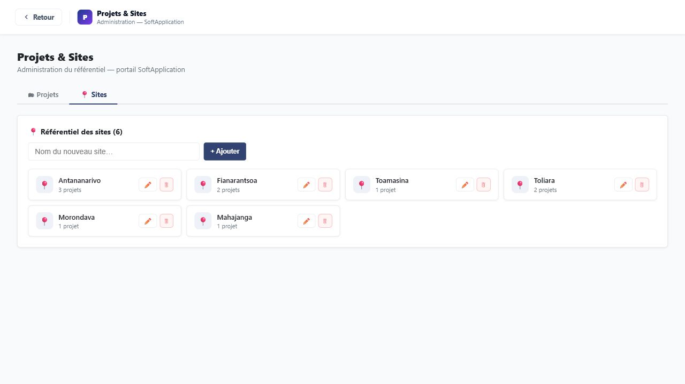

## Presentation generale

L'onglet Sites permet de maintenir la liste des sites utilises par les projets. Il sert a ajouter, renommer ou supprimer des sites afin de conserver un referentiel propre et coherent.

Cet ecran est destine au Super Admin.

## Champs et zones de saisie

| Champ / zone | Fonction | Format attendu | Obligatoire | Relations avec les autres champs |
|---|---|---|---|---|
| Nom du nouveau site | Permet de saisir un site a ajouter au referentiel. | Texte libre, par exemple "Antsirabe". | Oui pour ajouter un site | Le bouton Ajouter n'ajoute rien si le champ est vide ou si le site existe deja. |
| Champ de renommage | Permet de modifier le nom d'un site existant. | Texte libre. | Oui pour confirmer un renommage | Le nouveau nom remplace l'ancien dans la liste et dans les projets rattaches. |

## Boutons et actions

| Action | Role | Conditions d'activation | Consequences |
|---|---|---|---|
| Ajouter | Ajoute le nouveau site. | Fonctionne si le nom est renseigne et non deja present. | Le site apparait dans le referentiel. |
| Modifier | Passe un site en mode modification. | Actif sur chaque site. | Affiche un champ de saisie a la place du nom. |
| Valider le renommage | Confirme le nouveau nom. | Actif en mode modification. | Met a jour le site dans le referentiel et dans les projets concernes. |
| Annuler le renommage | Abandonne la modification du nom. | Actif en mode modification. | Restaure l'affichage initial du site. |
| Supprimer | Retire un site du referentiel. | Actif sur chaque site. | Demande confirmation, puis retire le site de tous les projets. |

## Elements d'affichage

| Element | Signification | Interpretation |
|---|---|---|
| Nombre de sites | Nombre total de sites du referentiel. | Permet de controler la couverture geographique. |
| Carte site | Affiche le nom du site et le nombre de projets associes. | Aide a identifier l'impact d'un renommage ou d'une suppression. |
| Nombre de projets | Nombre de projets qui utilisent le site. | Plus ce nombre est eleve, plus il faut etre attentif avant suppression. |

---

# 16. Gestion des licences

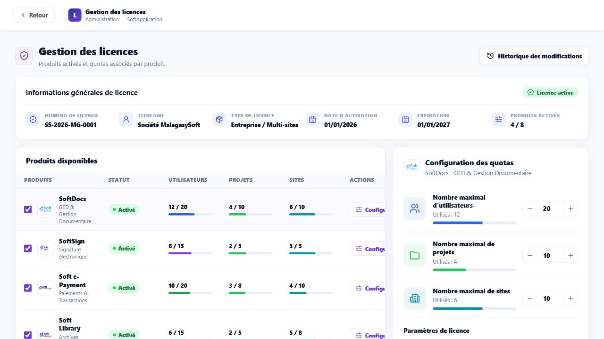

## Presentation generale

L'ecran Gestion des licences permet au Super Admin de consulter les produits actives, les quotas associes et les informations generales de licence. Il sert aussi a activer ou desactiver des produits et a ajuster les limites d'utilisation.

Si un utilisateur non Super Admin tente d'acceder a cet ecran, un message indique que l'acces est reserve au Super Admin.

## Zones et champs

| Champ / zone | Fonction | Format attendu | Obligatoire | Relations avec les autres champs |
|---|---|---|---|---|
| Numero de licence | Identifiant de la licence plateforme. | Code de licence. | Automatique | Information generale non saisie dans cet ecran. |
| Titulaire | Organisation beneficiaire de la licence. | Nom d'organisation. | Automatique | Information generale non saisie dans cet ecran. |
| Type de licence general | Type global de contrat. | Libelle de type de licence. | Automatique | Resume la licence de la plateforme. |
| Date d'activation generale | Date de demarrage de la licence. | Date. | Automatique | Sert a situer le debut de validite. |
| Expiration generale | Date de fin de validite. | Date. | Automatique | A surveiller pour renouvellement. |
| Produits actives | Nombre de produits actifs sur le total disponible. | Compteur. | Automatique | Lie aux cases d'activation de la liste des produits. |
| Produits disponibles | Liste des produits SoftAppli. | Tableau. | Automatique | La selection d'une ligne affiche sa configuration de quotas a droite. |
| Quotas utilisateurs | Limite d'utilisateurs pour le produit selectionne. | Nombre. | Oui pour configurer le produit | Ne peut pas etre inferieur au nombre deja utilise. |
| Quotas projets | Limite de projets pour le produit selectionne. | Nombre. | Oui pour configurer le produit | Ne peut pas etre inferieur au nombre deja utilise. |
| Quotas sites | Limite de sites pour le produit selectionne. | Nombre. | Oui pour configurer le produit | Ne peut pas etre inferieur au nombre deja utilise. |
| Type | Type de licence du produit selectionne. | Liste de choix : Entreprise, Entreprise / Multi-sites, Projet, Site, Essai. | Oui, avec valeur existante. | S'applique au produit selectionne. |
| Support | Niveau de support du produit. | Liste de choix : Standard, Premium, Critique. | Oui, avec valeur existante. | S'applique au produit selectionne. |
| Activation | Date d'activation du produit. | Date. | Non | Peut etre renseignee automatiquement lors de l'activation d'un produit. |
| Expiration | Date d'expiration du produit. | Date. | Non | A surveiller pour renouvellement produit. |
| Alerte quota a 80 % | Active une alerte lorsque l'utilisation approche du quota. | Interrupteur oui/non. | Non | Lie aux quotas du produit selectionne. |
| Blocage au depassement du quota | Bloque l'utilisation lorsque le quota est atteint ou depasse. | Interrupteur oui/non. | Non | Lie aux quotas du produit selectionne. |

## Boutons et actions

| Action | Role | Conditions d'activation | Consequences |
|---|---|---|---|
| Historique des modifications | Ouvre la liste des changements de licence. | Toujours actif pour le Super Admin. | Affiche une fenetre d'historique. |
| Case d'activation produit | Active ou desactive un produit. | Toujours active sur chaque produit. | Met a jour le statut du produit et le compteur des produits actives. |
| Configurer | Selectionne un produit actif pour modifier ses quotas. | Actif sur les produits actives. | Affiche les quotas du produit dans le panneau de droite. |
| Activer | Active un produit non actif. | Actif sur les produits non actives. | Passe le produit au statut active et ouvre sa configuration. |
| Diminuer un quota | Reduit la limite autorisee. | Inactif si le quota atteint deja le nombre utilise. | Diminue la limite sans passer sous l'utilisation actuelle. |
| Augmenter un quota | Augmente la limite autorisee. | Toujours actif sur un produit actif. | Augmente la capacite du produit. |
| Saisir un quota | Modifie directement la limite autorisee. | La valeur doit etre un nombre au moins egal a l'utilisation actuelle. | Met a jour la limite du produit. |
| Enregistrer | Confirme la configuration du produit selectionne. | Actif sur un produit actif. | Ajoute une entree dans l'historique et confirme visuellement l'enregistrement. |
| Options | Bouton d'actions complementaires. | Visible dans la ligne produit. | Aucun effet visible dans la maquette actuelle. |

## Elements d'affichage

| Element | Signification | Interpretation |
|---|---|---|
| Badge Licence active | Indique que la licence generale est active. | La plateforme est consideree comme utilisable. |
| Badge Active / Non active | Statut d'un produit. | Un produit non actif n'est pas disponible pour les utilisateurs. |
| Barres de progression | Comparaison entre utilisation actuelle et quota. | Une barre proche de la limite signale un risque de saturation. |
| Panneau Configuration des quotas | Detail du produit selectionne. | Les modifications concernent uniquement ce produit. |

---

# 17. Historique des licences

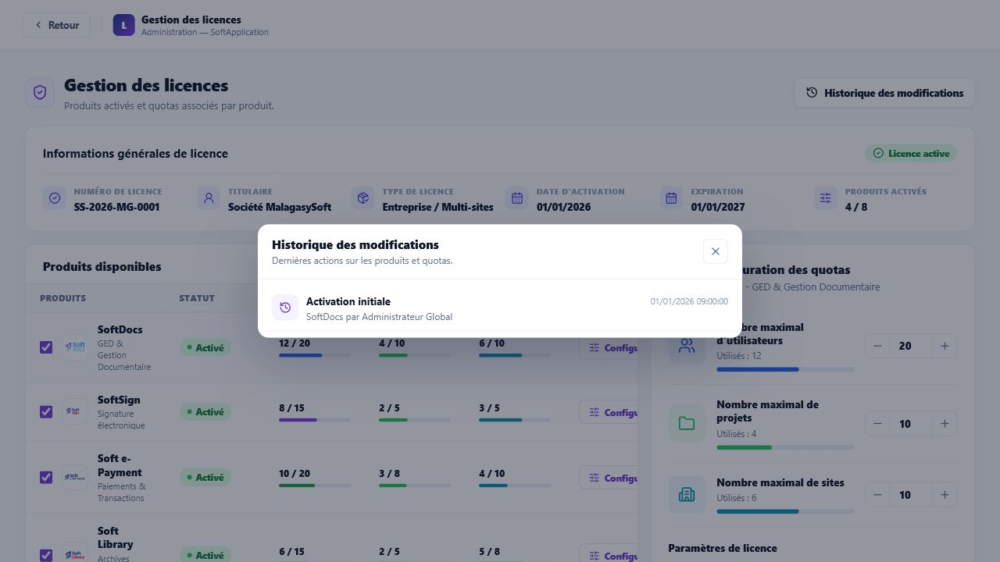

## Presentation generale

L'historique des licences permet de consulter les actions recentes effectuees sur les produits et quotas. Il sert de trace de suivi pour comprendre qui a modifie quoi et quand.

## Elements d'affichage

| Element | Signification | Interpretation |
|---|---|---|
| Action | Nature de la modification effectuee. | Exemple : activation initiale, produit active, quotas enregistres. |
| Date et heure | Moment de la modification. | Permet de retrouver la chronologie des changements. |
| Produit concerne | Produit sur lequel porte l'action. | Permet d'identifier l'application impactee. |
| Utilisateur | Personne ayant realise l'action. | Sert a la tracabilite. |

## Boutons et actions

| Action | Role | Conditions d'activation | Consequences |
|---|---|---|---|
| Fermer l'historique | Referme la fenetre. | Toujours actif lorsque l'historique est ouvert. | Retourne a la gestion des licences. |
| Cliquer hors de la fenetre | Ferme aussi l'historique. | Lorsque la fenetre est ouverte. | Retourne a l'ecran precedent sans modification. |

---

# 18. Synthese des enchainements utilisateur

## Connexion et acces a une application

1. L'utilisateur saisit son email et son mot de passe.
2. Il clique sur **Se connecter**.
3. Il arrive sur l'accueil SoftAppli.
4. Il choisit une application disponible.
5. Le module s'ouvre avec le shell commun.

## Changement d'application en cours de session

1. Depuis un module, l'utilisateur clique sur le selecteur d'application dans la barre superieure.
2. Il choisit un autre module ou revient a l'accueil.
3. Le contenu de l'ecran est remplace par le module choisi.
4. La session reste ouverte.

## Recherche d'un element

1. L'utilisateur clique sur **Rechercher** ou utilise le raccourci affiche.
2. Il saisit un mot-cle.
3. Les resultats apparaissent par categorie.
4. Il selectionne le resultat souhaite.
5. SoftAppli ouvre l'ecran correspondant.

## Administration d'un nouvel utilisateur

1. Le Super Admin ouvre **Utilisateurs** depuis l'accueil SoftAppli.
2. Il clique sur **Nouvel utilisateur**.
3. Il renseigne au minimum le nom complet et l'email.
4. Il choisit le role systeme et les applications accessibles.
5. Il clique sur **Creer**.
6. Le nouvel utilisateur apparait dans la liste avec ses badges d'applications.

## Administration d'un projet

1. Le Super Admin ouvre **Projets & Sites**.
2. Dans l'onglet **Projets**, il clique sur **Nouveau projet**.
3. Il renseigne le nom, le bailleur, le budget, les dates et les sites autorises.
4. Il confirme la creation.
5. Le projet apparait dans la grille avec son budget et ses sites.

## Maintenance du referentiel des sites

1. Le Super Admin ouvre **Projets & Sites**.
2. Il selectionne l'onglet **Sites**.
3. Il ajoute, renomme ou supprime un site.
4. Les projets rattaches sont mis a jour en cas de renommage ou suppression.

## Gestion des licences et quotas

1. Le Super Admin ouvre **Gestion des licences**.
2. Il consulte les produits actives et leurs niveaux d'utilisation.
3. Il selectionne un produit.
4. Il ajuste les quotas ou les parametres de licence.
5. Il clique sur **Enregistrer**.
6. Une entree est ajoutee dans l'historique.

## Fin de session

1. L'utilisateur clique sur **Deconnexion**.
2. La session est terminee.
3. L'ecran de connexion est affiche.
