# Manuel utilisateur SoftDocs

Ce manuel accompagne les utilisateurs finaux dans l'utilisation quotidienne de SoftDocs. Il explique les écrans, les champs, les actions, les statuts et les parcours métier, sans vocabulaire technique.

Le périmètre couvert comprend le dépôt de documents, le suivi de réception, la gestion des listes de documents, le détail d'un document, les validations, les refus, les redirections, l'intégration SoftSign, les états et rapports, ainsi que les principaux paramètres qui influencent le fonctionnement métier.

## Repères généraux

SoftDocs est organisé autour d'un menu latéral, d'une barre supérieure et d'une zone principale de travail.

| Élément | Description fonctionnelle |
|---|---|
| Menu latéral | Permet d'accéder aux grands espaces : tableau de bord, dépôt, suivi, documents, rapports et paramétrage. Les menus visibles dépendent des droits de l'utilisateur. |
| Fil d'Ariane | Indique où l'utilisateur se trouve dans l'application. Il aide à comprendre le chemin parcouru, par exemple Tableau de bord puis Mes Documents puis Envoyés. |
| Recherche générale | Sert à rechercher rapidement un contenu ou un écran. Elle est utile lorsque l'utilisateur connaît une référence ou un mot-clé. |
| Profil utilisateur | Affiche l'utilisateur connecté et son rôle. Les actions disponibles dépendent de ce rôle et des droits associés. |
| Langue | Permet de visualiser la langue active de l'interface. |
| Déconnexion | Ferme la session de l'utilisateur connecté. |

Les statuts principaux à connaître sont les suivants.

| Statut | Signification pour l'utilisateur |
|---|---|
| Reçu | Le document a été déposé mais n'est pas encore entré dans son circuit complet de validation. Il doit être réceptionné ou affecté à un type de document selon le cas. |
| En validation | Le document circule dans les étapes du WorkFlow. Un ou plusieurs validateurs doivent intervenir. |
| En retard | Une étape de validation a dépassé son délai prévu. Une relance peut être envoyée selon les droits de l'utilisateur et le paramétrage. |
| Validé | Le circuit de validation est terminé. Le document peut ensuite suivre une étape de paiement ou d'archivage selon le processus. |
| Rejeté | Le document a été refusé avec au moins une cause de refus et un commentaire. |
| Payé | Le document a atteint l'état de paiement ou de traitement financier final. |
| En validation SoftSign | Le document a été envoyé dans SoftSign pour signature. Les actions de validation SoftDocs sont suspendues jusqu'au retour ou rattachement du document signé. |

# Tableau de bord

## Tableau de bord - Pilotage

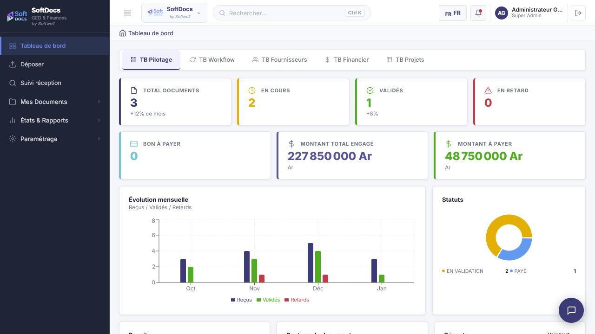

### Objectif de l'écran

Le tableau de bord donne une vision synthétique de l'activité documentaire. Il est utilisé par les responsables, gestionnaires, validateurs et administrateurs pour suivre les volumes, les retards et les priorités de traitement.

L'onglet Pilotage sert à comprendre rapidement la situation globale : nombre de documents, évolution, répartition par statut et éléments nécessitant une action.

### Zones affichées

| Élément | Description fonctionnelle |
|---|---|
| Cartes d'indicateurs | Présentent les volumes clés : documents reçus, en validation, en retard, traités ou rejetés. Ces cartes sont uniquement informatives. |
| Graphiques | Permettent de visualiser les tendances et la répartition de l'activité. Ils aident à repérer les pics, les retards ou les catégories les plus fréquentes. |
| Listes de documents récents ou prioritaires | Affichent les dossiers à surveiller. Un document peut être ouvert depuis une ligne lorsque l'utilisateur dispose des droits nécessaires. |

### Actions disponibles

| Action | Rôle et conditions |
|---|---|
| Changer d'onglet | Permet de passer d'une vue Pilotage à une vue Workflow, Fournisseurs, Financier ou Projets. L'action est toujours disponible si l'utilisateur voit le tableau de bord. |
| Ouvrir un document depuis une liste | Affiche la fiche détaillée du document. L'action est possible uniquement si l'utilisateur est autorisé à consulter ce document. |

## Tableau de bord - Workflow

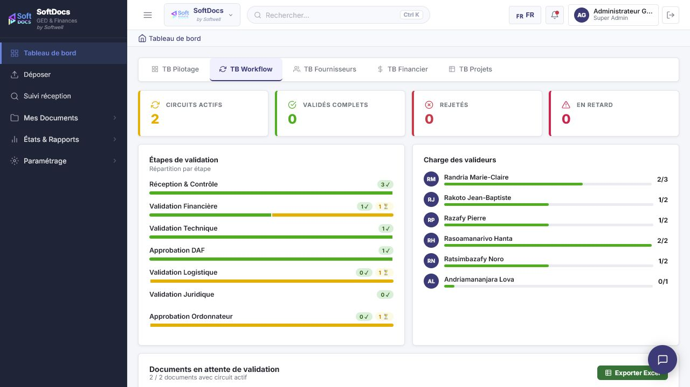

### Objectif de l'écran

Cette vue met l'accent sur les circuits de validation. Elle est utile aux responsables de traitement pour identifier les étapes bloquantes, les documents en attente et les validateurs sollicités.

### Éléments à interpréter

| Élément | Signification |
|---|---|
| Étapes de validation | Représentent les niveaux du circuit documentaire : réception, validation métier, validation financière, approbation finale. |
| Volumes par étape | Indiquent combien de documents se trouvent dans chaque étape. Un volume élevé peut signaler une charge ou un blocage. |
| Retards | Signalent les documents dont l'étape en cours a dépassé son délai prévu. Ces retards alimentent aussi les relances. |

### Relation avec les autres écrans

Les délais, validateurs, check-lists et obligations de signature affichés dans le suivi des documents proviennent du paramétrage WorkFlow. Lorsqu'un type de document est modifié dans WorkFlow, les nouveaux dépôts de ce type suivent cette configuration.

## Tableau de bord - Fournisseurs

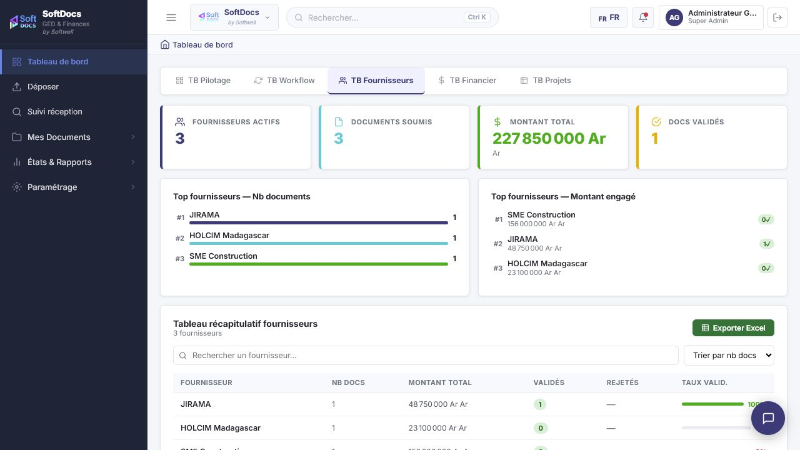

### Objectif de l'écran

Cette vue aide à suivre l'activité documentaire par fournisseur : volumes reçus, montants, documents traités et éventuels rejets.

### Éléments affichés

| Élément | Description fonctionnelle |
|---|---|
| Fournisseurs principaux | Liste les fournisseurs les plus présents dans les documents. |
| Montants associés | Permet d'évaluer l'importance financière des dossiers par fournisseur. |
| Statuts par fournisseur | Aide à repérer les fournisseurs dont les dossiers sont souvent en attente ou refusés. |

### Utilisation métier

Un gestionnaire peut utiliser cette vue pour prioriser les fournisseurs stratégiques, vérifier les documents en retard et préparer les échanges avec les équipes achats ou finance.

## Tableau de bord - Financier

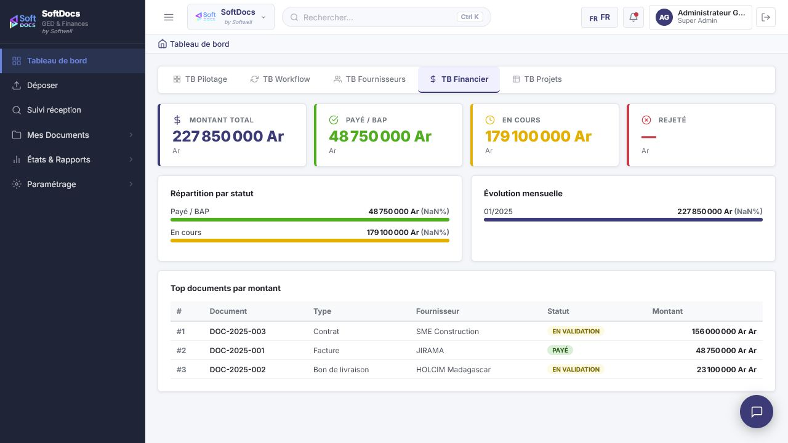

### Objectif de l'écran

L'onglet Financier présente une synthèse des montants liés aux documents : montants en cours de validation, montants traités, montants rejetés ou à payer.

### Éléments affichés

| Élément | Description fonctionnelle |
|---|---|
| Montants globaux | Affichent les totaux financiers de la sélection visible. |
| Répartition par statut | Permet de savoir si les montants sont encore en validation, validés ou rejetés. |
| Tendances financières | Aident à anticiper la charge de paiement ou de contrôle. |

### Relation avec le détail document

Le montant présenté dans le tableau de bord provient des informations du document. Lors de la validation, un utilisateur autorisé peut ajuster le montant réel à payer. Cette correction se répercute ensuite dans les vues financières.

## Tableau de bord - Projets

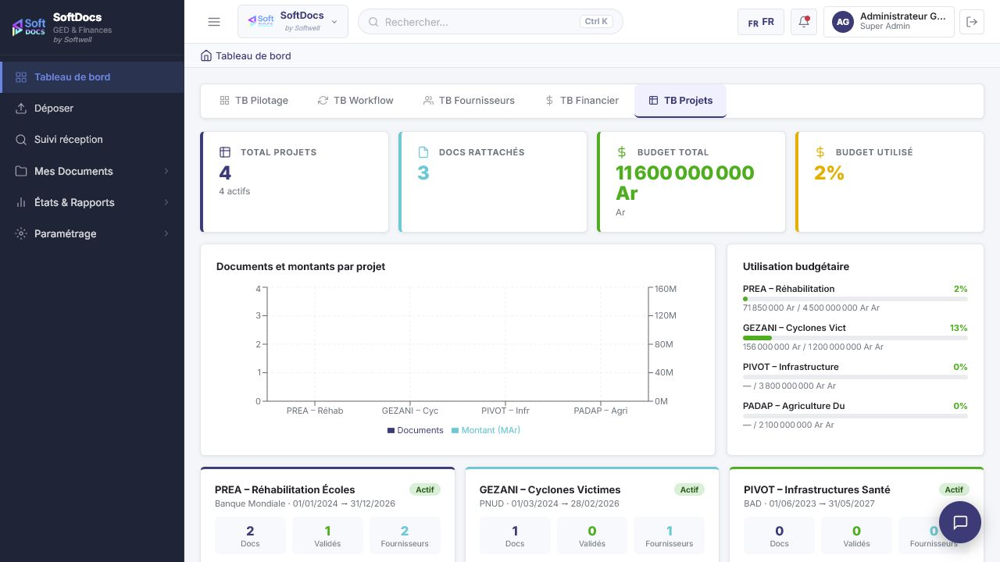

### Objectif de l'écran

Cette vue permet de suivre les documents par projet et par site. Elle est utilisée par les chefs de projet, ordonnateurs, gestionnaires et responsables financiers.

### Éléments affichés

| Élément | Description fonctionnelle |
|---|---|
| Projet | Regroupe les documents liés à un programme ou à une convention. |
| Site | Précise le lieu ou l'entité opérationnelle concernée. La liste des sites dépend du projet sélectionné lors du dépôt. |
| Montant par projet | Permet de suivre l'engagement financier associé aux documents. |
| Taux de traitement | Indique la part des documents déjà traités par rapport au total. |

# Déposer un document

Le dépôt se déroule en quatre étapes : OCR, Informations, Annexes puis Confirmation. L'utilisateur avance progressivement et peut revenir en arrière tant que le dépôt n'est pas finalisé.

## Étape OCR

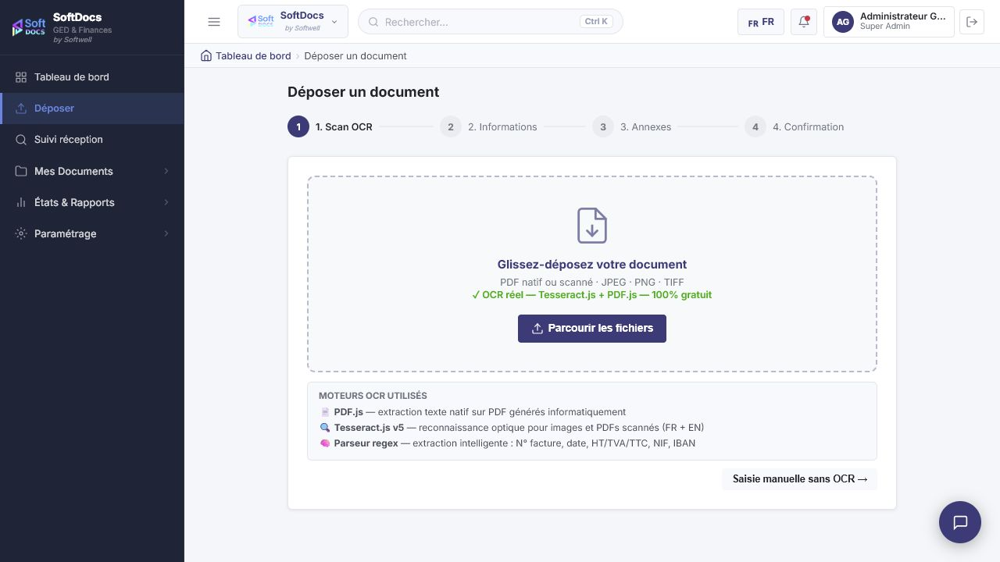

### Objectif de l'écran

L'étape OCR sert à charger le document principal et, si possible, à préremplir certaines informations à partir de son contenu. Elle intervient au début d'un dépôt de document.

Elle est utilisée par les personnes qui déposent des documents internes ou fournisseurs : gestionnaires, assistants, agents courrier ou utilisateurs habilités.

### Champs et zones de saisie

| Élément | Description fonctionnelle |
|---|---|
| Zone de dépôt du fichier | Permet de sélectionner ou déposer le document principal. Format attendu : fichier PDF ou image lisible. Le fichier est nécessaire pour un dépôt complet. |
| Parcourir les fichiers | Ouvre la sélection de fichier. L'utilisateur choisit le document à analyser. |
| Saisie manuelle sans OCR | Permet de continuer sans analyse automatique. Cette option est utile si le fichier n'est pas disponible ou si l'analyse n'est pas nécessaire. |
| Données extraites | Affichent les informations reconnues : numéro de document, date, émetteur, NIF, IBAN ou RIB, montant HT, TVA et total TTC. Ces informations peuvent être vérifiées avant l'étape suivante. |
| Score OCR | Indique le niveau de confiance de l'analyse. Un score élevé signifie que les données semblent fiables ; un score faible demande une vérification plus attentive. |

### Actions disponibles

| Action | Rôle et conditions |
|---|---|
| Parcourir les fichiers | Disponible tant qu'aucun fichier n'est sélectionné ou lorsqu'il faut remplacer le fichier. |
| Saisie manuelle sans OCR | Disponible dès l'entrée dans l'étape. Elle permet de passer directement aux informations sans données préremplies. |
| Utiliser ces données | Disponible après l'analyse d'un fichier. L'action reprend les informations détectées dans l'étape Informations. |
| Nouveau fichier | Permet de recommencer l'analyse avec un autre fichier. |

### Relations avec les autres écrans

Les données extraites sont reprises dans l'étape Informations puis visibles dans l'onglet OCR du détail document. Elles peuvent aussi servir aux rapports financiers et à la recherche.

## Étape Informations

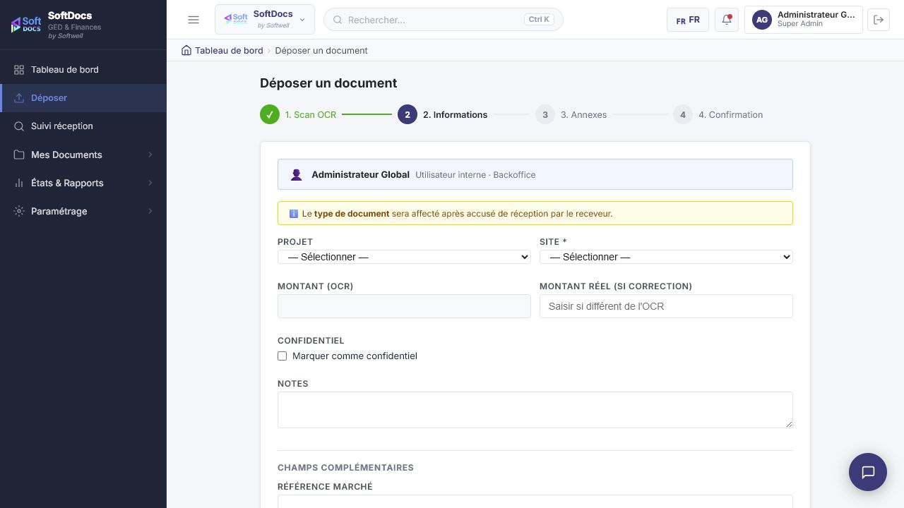

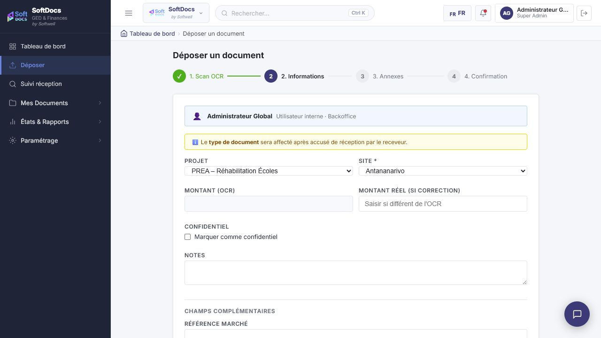

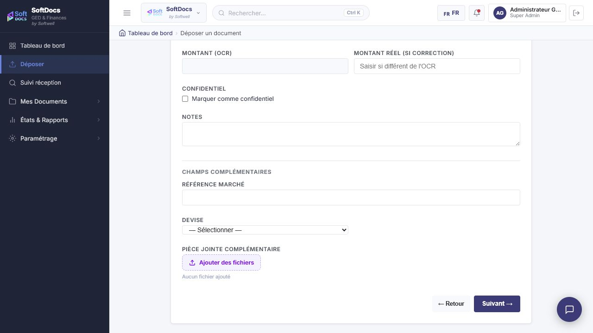

### Objectif de l'écran

Cette étape sert à compléter les informations métier du document : projet, site, fournisseur, date, montant, confidentialité et champs additionnels.

### Champs et zones de saisie

| Élément | Description fonctionnelle |
|---|---|
| Type de document | Peut être défini immédiatement ou plus tard lors de la réception, selon le parcours. Il détermine le WorkFlow appliqué au document. Si aucun type n'est affecté, le document reste à définir. |
| Projet | Liste de choix. Le projet relie le document à un programme ou dossier métier. Il est obligatoire pour continuer. |
| Site | Liste de choix. Le site dépend du projet sélectionné. Il est obligatoire pour continuer. Lorsque le projet change, la liste des sites disponibles est recalculée. |
| Fournisseur ou expéditeur | Identifie l'origine du document. La valeur peut provenir de l'OCR ou être saisie manuellement. Elle est importante pour la recherche, le suivi fournisseur et les rapports. |
| Date document | Date figurant sur le document. Format attendu : date. Elle peut être préremplie par l'OCR. |
| Montant | Montant total du document. Format attendu : valeur numérique en ariary ou devise prévue. Il est utilisé dans les tableaux de bord et les états financiers. |
| Document confidentiel | Case à cocher. Lorsqu'elle est cochée, le document est classé dans les espaces confidentiels et visible uniquement par les utilisateurs autorisés. |
| Champs dynamiques | Champs supplémentaires définis par l'administrateur. Leur format peut être texte, date, liste, case à cocher, choix unique ou fichier. Ils peuvent être obligatoires selon le paramétrage. |

### Actions disponibles

| Action | Rôle et conditions |
|---|---|
| Précédent | Retourne à l'étape OCR sans perdre les informations déjà saisies. |
| Suivant | Passe à l'étape Annexes. Il est actif lorsque les informations obligatoires sont renseignées, notamment le projet et le site. |
| Annuler | Interrompt le dépôt. Les informations non enregistrées ne sont pas prises en compte. |

### Relations avec les autres écrans

Le projet et le site déterminent les listes de documents, les rapports et certains droits de consultation. Le type de document détermine les étapes de validation, les check-lists, les validateurs et l'éventuelle obligation de signature SoftSign.

Les champs dynamiques affichés ici sont configurés dans Paramétrage puis Champs dynamiques. Si un champ est marqué comme requis, il devient obligatoire au dépôt.

## Étape Annexes

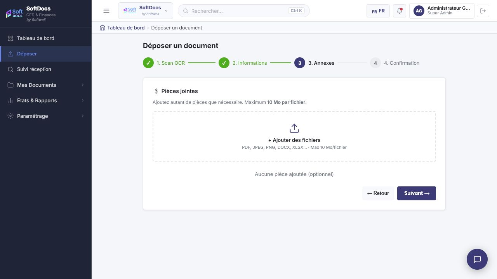

### Objectif de l'écran

Cette étape permet d'ajouter des pièces complémentaires au document principal : justificatifs, bons de commande, contrats, correspondances ou tout document attendu par le processus.

### Champs et zones de saisie

| Élément | Description fonctionnelle |
|---|---|
| Liste des annexes | Présente les pièces déjà ajoutées ou attendues. |
| Ajout de fichier | Permet de joindre une annexe. Format attendu : document lisible, généralement PDF ou image. |
| Statut de l'annexe | Indique si l'annexe est fournie ou manquante. |

### Actions disponibles

| Action | Rôle et conditions |
|---|---|
| Ajouter une annexe | Disponible lorsque l'utilisateur peut joindre des fichiers au dépôt. |
| Supprimer une annexe | Retire une pièce ajoutée avant confirmation. |
| Précédent | Retourne aux informations du document. |
| Suivant | Passe à la confirmation. |

### Relation avec le détail document

Les annexes ajoutées au dépôt sont consultables ensuite dans l'onglet Annexes de la fiche détaillée du document.

## Étape Confirmation

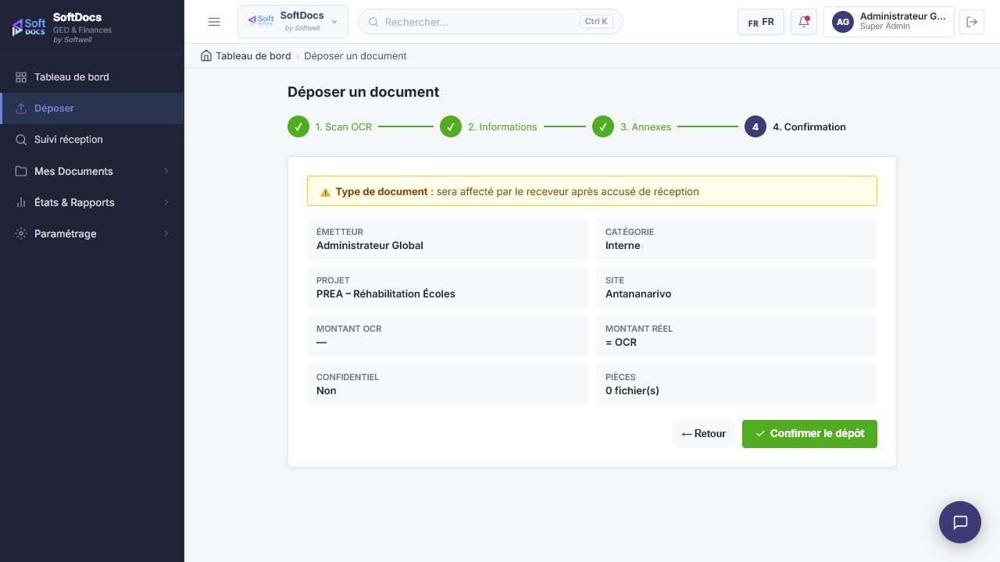

### Objectif de l'écran

La confirmation permet de relire le dépôt avant envoi définitif. Elle récapitule les informations principales, le document, les annexes et les données extraites.

### Zones affichées

| Élément | Description fonctionnelle |
|---|---|
| Résumé du document | Présente les informations saisies : projet, site, fournisseur, date, montant et confidentialité. |
| Données OCR | Rappelle les données détectées ou saisies manuellement. |
| Annexes | Liste les pièces jointes ajoutées. |

### Actions disponibles

| Action | Rôle et conditions |
|---|---|
| Précédent | Permet de corriger les annexes ou les informations avant dépôt. |
| Déposer le document | Finalise l'envoi. Le document reçoit une référence et entre dans le parcours de réception ou de validation selon son type et son origine. |

### Conséquences du dépôt

Après confirmation, le document apparaît dans les listes adaptées : documents envoyés, documents reçus, documents confidentiels ou documents en attente selon le contexte. Si le type n'est pas encore affecté, un receveur devra le sélectionner avant le lancement complet du circuit.

# Suivi de réception

## Recherche d'un document

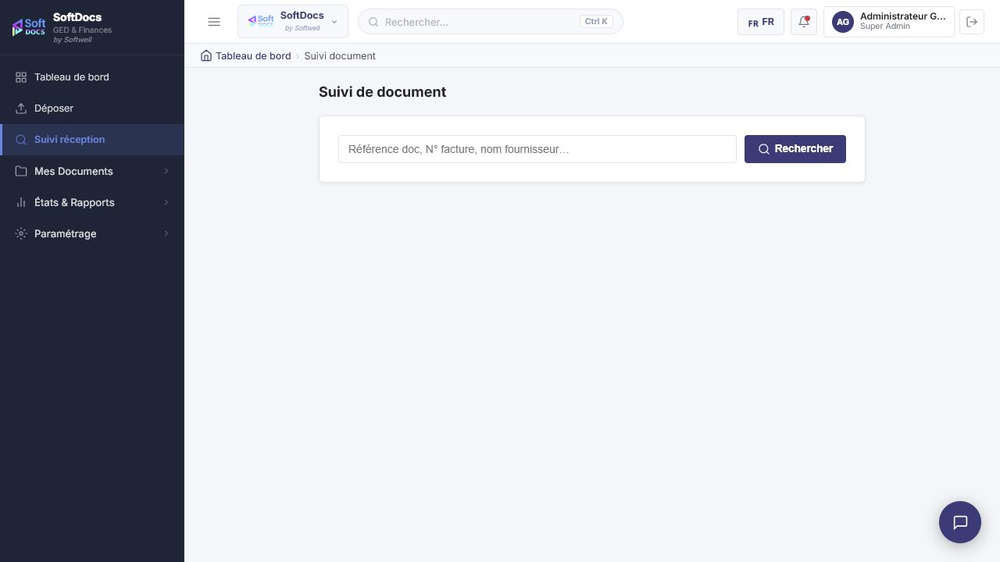

### Objectif de l'écran

Le suivi de réception permet de retrouver rapidement un document à partir de sa référence, d'un numéro de facture ou du nom du fournisseur. Il est utilisé par les déposants, les gestionnaires et les personnes qui veulent connaître l'état d'avancement d'un dossier.

### Champs et zones de saisie

| Élément | Description fonctionnelle |
|---|---|
| Recherche | Champ texte. L'utilisateur peut saisir une référence SoftDocs, un numéro de facture ou le nom d'un fournisseur. Le champ est obligatoire pour lancer une recherche ciblée. |

### Actions disponibles

| Action | Rôle et conditions |
|---|---|
| Rechercher | Lance la recherche. L'action est utile dès qu'une valeur est saisie. |

## Résultat de recherche

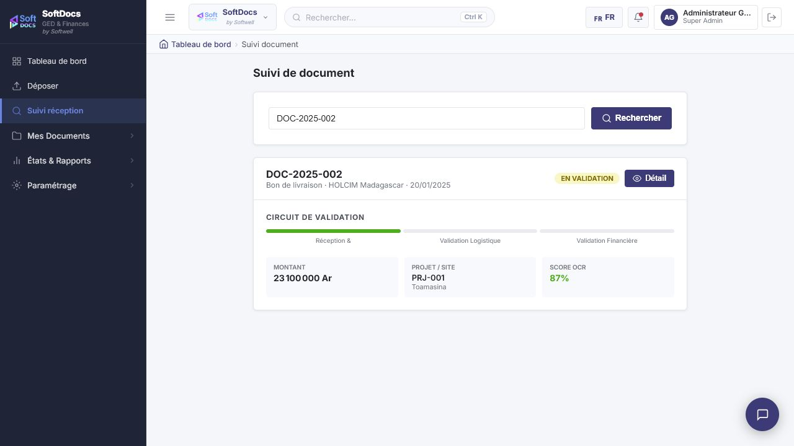

### Éléments affichés

| Élément | Description fonctionnelle |
|---|---|
| Carte résultat | Affiche la référence, le type de document, l'expéditeur, la date et le statut. |
| Circuit de validation | Montre les étapes du parcours et l'étape actuelle. |
| Montant | Présente le montant associé au document. |
| Projet et site | Indiquent le rattachement métier du dossier. |
| Score OCR | Rappelle la fiabilité de l'analyse de lecture automatique. |

### Actions disponibles

| Action | Rôle et conditions |
|---|---|
| Détail | Ouvre la fiche détaillée du document. L'action dépend des droits de consultation de l'utilisateur. |

# Listes de documents

Les listes de documents regroupent les dossiers selon leur origine, leur statut ou leur niveau de confidentialité.

## Liste En cours

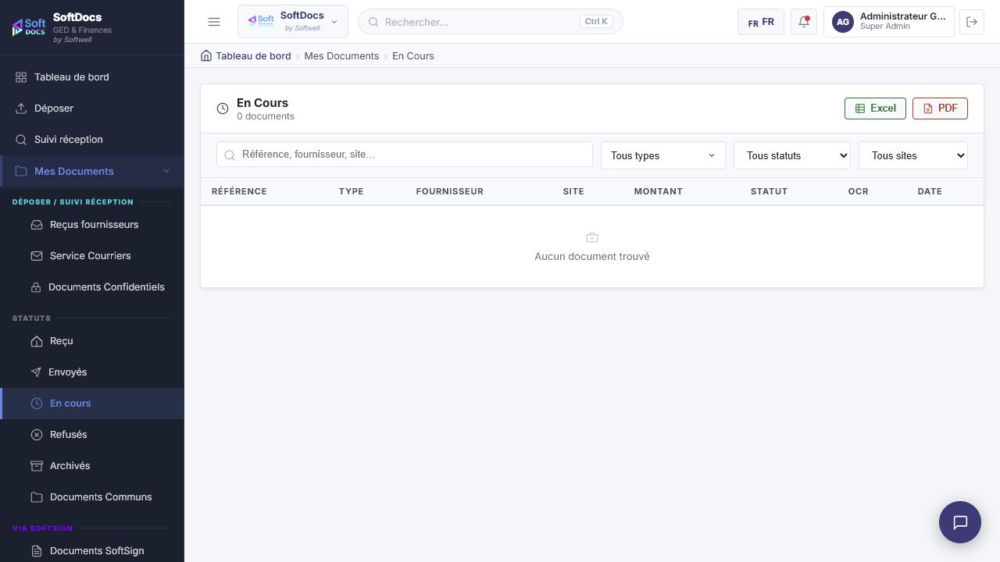

## Liste Envoyés

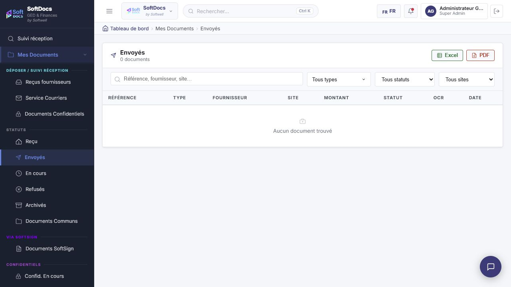

### Objectif de l'écran

Les listes permettent de consulter et filtrer les documents selon un contexte : reçus fournisseurs, service courriers, documents confidentiels, reçus, envoyés, en cours, refusés, archivés, communs ou SoftSign.

### Filtres et champs

| Élément | Description fonctionnelle |
|---|---|
| Recherche par référence, fournisseur ou site | Champ texte optionnel. Il réduit la liste aux documents correspondant à la saisie. |
| Type de document | Liste de choix optionnelle. Elle permet d'afficher un ou plusieurs types de documents. |
| Statut | Liste de choix optionnelle. Elle limite la liste à un état précis, par exemple En validation ou Rejeté. |
| Site | Liste de choix optionnelle. Elle filtre les documents rattachés à un site. |

### Colonnes affichées

| Colonne | Signification |
|---|---|
| Référence | Identifiant unique du document dans SoftDocs. |
| Type | Type de document affecté, par exemple facture, contrat ou bon de livraison. |
| Fournisseur | Fournisseur ou expéditeur du document. |
| Site | Site métier associé au document. |
| Montant | Montant total ou montant réel selon l'avancement. |
| Statut | État actuel du document. |
| OCR | Score de reconnaissance ou indicateur de qualité des données extraites. |
| Date | Date du document ou date de dépôt selon la vue. |

### Actions disponibles

| Action | Rôle et conditions |
|---|---|
| Excel | Exporte la liste affichée dans un fichier exploitable en tableur. L'export respecte les filtres actifs. |
| PDF | Exporte la liste affichée au format PDF. |
| Ouvrir une ligne | Affiche la fiche détaillée du document. L'action est possible si l'utilisateur a le droit de consulter le dossier. |
| Réinitialiser ou vider les filtres | Remet la liste dans son état initial lorsque des filtres sont appliqués. |

### Relations entre menus

| Menu | Interprétation métier |
|---|---|
| Reçus fournisseurs | Documents arrivés depuis un fournisseur et en attente de traitement de réception. |
| Service Courriers | Documents internes ou courriers à orienter. |
| Documents Confidentiels | Documents reçus avec confidentialité active. |
| Reçu | Documents réceptionnés ou affectés qui attendent l'intervention de l'utilisateur ou de son groupe. |
| Envoyés | Documents déposés par l'utilisateur connecté. |
| En cours | Documents en validation auxquels l'utilisateur participe ou qu'il peut suivre. |
| Refusés | Documents rejetés visibles par l'utilisateur. |
| Archivés | Documents dont le traitement est terminé. |
| Documents Communs | Documents finalisés et consultables par les participants autorisés. |
| Menus Confidentiels | Variantes des menus précédents, limitées aux documents confidentiels. |

# Détail d'un document

## Fiche document - vue générale

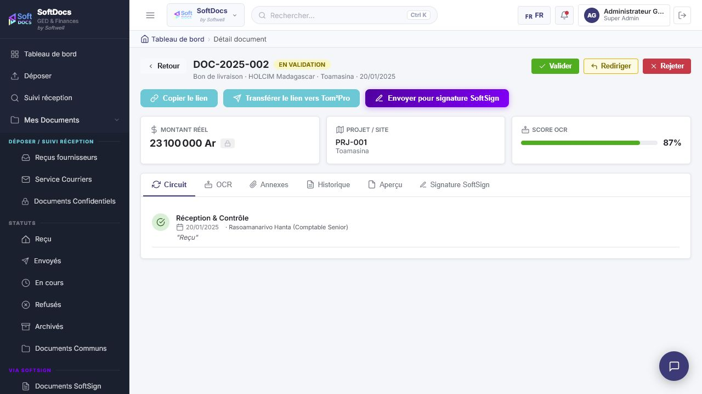

### Objectif de l'écran

La fiche document est l'écran central de SoftDocs. Elle regroupe les informations du dossier, son circuit, ses données OCR, ses annexes, son historique, ses actions de validation et son lien éventuel avec SoftSign.

Elle est utilisée par les receveurs, validateurs, responsables financiers, ordonnateurs, administrateurs et déposants selon leurs droits.

### Zones principales

| Élément | Description fonctionnelle |
|---|---|
| Référence document | Identifiant unique du document. Il permet de suivre le dossier dans les recherches, rapports et échanges. |
| Badge de statut | Indique l'état actuel du document : reçu, en validation, rejeté, validé, payé ou en signature SoftSign. |
| Informations de synthèse | Affichent le type, le fournisseur, le site et la date. |
| Montant réel | Montant retenu pour traitement. Il peut être modifié par les utilisateurs autorisés lors de la validation. |
| Projet et site | Rattachement métier du document. |
| Score OCR | Niveau de confiance des données extraites. Un score faible invite à vérifier les informations. |
| Onglets | Donnent accès au circuit, à l'OCR, aux annexes, à l'historique, à l'aperçu et à SoftSign. |

### Boutons et actions de l'en-tête

| Action | Rôle, conditions et conséquences |
|---|---|
| Retour | Revient à l'écran précédent. |
| Valider | Ouvre la fenêtre de validation de l'étape en cours. Le bouton est actif lorsqu'une étape attend une validation et que le document n'est pas rejeté ni verrouillé par SoftSign. |
| Rediriger | Renvoie le document vers une étape précédente. Disponible lorsque le document se trouve au-delà de la première étape et qu'il n'est pas verrouillé par SoftSign. |
| Rejeter | Ouvre la fenêtre de refus. Le rejet exige au moins une cause et un commentaire. Une fois confirmé, le document passe au statut Rejeté. |
| Relancer | Disponible lorsqu'une étape est en retard et que l'utilisateur a le droit d'effectuer une relance. L'action ajoute une trace dans l'historique. |
| Accuser réception | Disponible dans les vues de réception lorsque le document reçu n'a pas encore été accusé. L'action confirme que le dossier est pris en charge. |
| Affecter un type de document | Disponible après réception lorsque le type n'est pas encore défini. Le choix du type lance le WorkFlow associé. |
| Bon à payer | Disponible pour un document validé lorsque l'utilisateur intervient dans le contexte prévu. L'action marque l'étape de bon à payer. |
| Copier le lien | Copie le lien de la fiche document afin de le partager à un utilisateur autorisé. |
| Transférer le lien vers Tom²Pro | Prépare ou simule le transfert du lien vers l'outil financier. |
| Envoyer pour signature SoftSign | Lance l'assistant de signature. Fonctionnellement, ce bouton ne doit être actif que lorsque l'étape courante du WorkFlow est marquée Document à signer. Si cette option n'est pas cochée dans WorkFlow, l'envoi vers SoftSign n'est pas attendu à cette étape. |

### Règle importante SoftSign

L'action Envoyer pour signature SoftSign dépend du paramétrage WorkFlow. Dans le type de document, chaque étape peut être marquée Document à signer. Lorsque le document arrive sur une étape marquée ainsi, l'utilisateur autorisé peut envoyer le document vers SoftSign. Après l'envoi, le document est verrouillé dans SoftDocs : les actions Valider, Rediriger, Rejeter et Relancer sont suspendues jusqu'au retour ou rattachement du document signé.

Cette même règle est expliquée dans le chapitre WorkFlow, car elle doit être comprise à la fois par les utilisateurs qui traitent les documents et par les administrateurs qui configurent les circuits.

## Onglet OCR

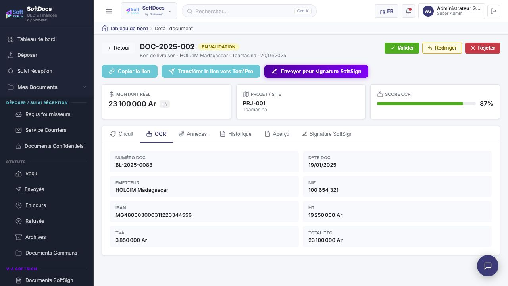

### Objectif de l'onglet

L'onglet OCR affiche les informations lues ou saisies au moment du dépôt. Il sert à vérifier rapidement les données du document sans rouvrir le fichier principal.

### Champs affichés

| Champ | Description fonctionnelle |
|---|---|
| Numéro doc | Numéro figurant sur le document, par exemple numéro de facture ou bon de livraison. Format : texte ou numéro métier. |
| Date doc | Date mentionnée sur le document. Format : date. |
| Émetteur | Fournisseur ou entité qui a émis le document. Format : texte. |
| NIF | Numéro d'identification fiscale. Format : texte ou numéro selon les règles de l'organisation. |
| IBAN ou RIB | Coordonnées bancaires lues sur le document. Format : texte structuré. |
| HT | Montant hors taxes. Format : montant. |
| TVA | Montant de taxe. Format : montant. |
| Total TTC | Montant total toutes taxes comprises. Format : montant. |

### Relations avec les autres écrans

Ces informations peuvent provenir de l'étape OCR du dépôt. Elles alimentent aussi les recherches, la fiche détail, les tableaux de bord et les états financiers.

## Onglet Annexes

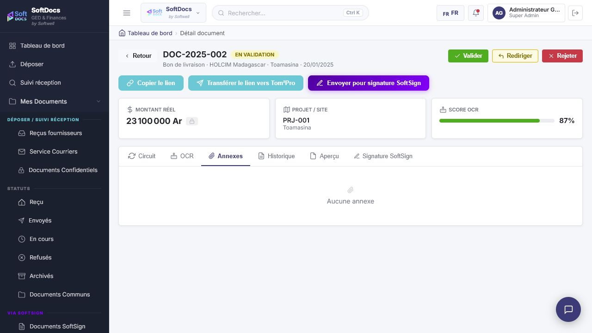

### Objectif de l'onglet

L'onglet Annexes présente les pièces jointes associées au document. Il permet de vérifier si les justificatifs nécessaires sont disponibles.

### Éléments affichés

| Élément | Description fonctionnelle |
|---|---|
| Liste des annexes | Affiche les fichiers complémentaires liés au document. |
| Statut Fourni ou Manquant | Indique si l'annexe attendue est disponible. |
| Voir | Ouvre l'annexe si elle est consultable. |
| Télécharger | Télécharge l'annexe pour consultation hors de l'application. |

### Cas sans annexe

Si aucune annexe n'a été jointe, l'écran indique qu'aucune annexe n'est disponible. Cela ne bloque pas nécessairement le traitement, sauf si une règle métier ou une check-list impose une pièce justificative.

## Onglet Historique

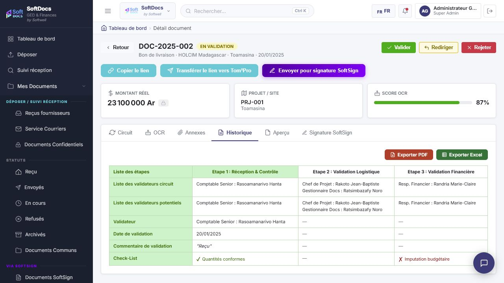

### Objectif de l'onglet

L'historique conserve la trace des étapes, des validateurs, des dates, des commentaires, des check-lists et des relances. Il sert à justifier le traitement d'un document.

### Éléments affichés

| Élément | Description fonctionnelle |
|---|---|
| Liste des étapes | Montre toutes les étapes prévues dans le circuit. |
| Liste des validateurs circuit | Indique les profils ou personnes prévus dans chaque étape. |
| Liste des validateurs potentiels | Montre les personnes autorisées à traiter une étape. |
| Validateur | Affiche la personne qui a effectivement validé. |
| Date de validation | Date à laquelle l'étape a été traitée. |
| Commentaire de validation | Commentaire saisi lors de la validation. |
| Check-list | Résultat des points de contrôle de l'étape. |
| Relances | Liste les relances envoyées pour retard, lorsqu'il y en a. |

### Actions disponibles

| Action | Rôle et conditions |
|---|---|
| Exporter PDF | Produit une version PDF de l'historique affiché. |
| Exporter Excel | Produit une version tableur de l'historique. |

## Onglet Signature SoftSign

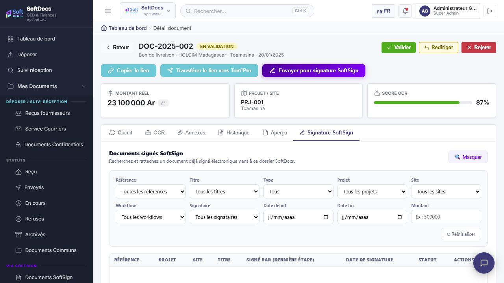

### Objectif de l'onglet

Cet onglet sert à rechercher, rattacher ou envoyer un document vers SoftSign pour signature électronique. Il est utilisé lorsque le processus métier exige une signature.

### Filtres de recherche SoftSign

| Champ | Description fonctionnelle |
|---|---|
| Référence | Filtre les documents SoftSign par référence. Optionnel. |
| Titre | Filtre par nom ou titre du document signé. Optionnel. |
| Type | Filtre par nature de document SoftSign : devis, contrat, avenant, rapport, protocole, bon de commande, facture ou autre. Optionnel. |
| Projet | Filtre les documents signés par projet. Optionnel. |
| Site | Filtre par site. Optionnel. |
| WorkFlow | Filtre selon le circuit SoftSign utilisé. Optionnel. |
| Signataire | Filtre par dernier signataire ou intervenant. Optionnel. |
| Date début et date fin | Délimitent la période de signature. Format : dates. Optionnel. |
| Montant | Filtre par montant. Format : valeur numérique. Optionnel. |

### Actions disponibles

| Action | Rôle, conditions et conséquences |
|---|---|
| Masquer ou afficher les filtres | Réduit ou affiche la zone de recherche. |
| Réinitialiser | Efface les filtres de recherche SoftSign. |
| Actualiser | Recharge la liste des documents disponibles côté SoftSign. |
| Rattacher | Lie un document signé existant au dossier SoftDocs. L'action est disponible lorsqu'un document signé est sélectionnable. |
| Envoyer pour signature SoftSign | Ouvre l'assistant d'envoi vers SoftSign. L'action doit être réservée aux étapes WorkFlow marquées Document à signer. |
| Type SoftSign | Sélectionne la nature du document envoyé vers SoftSign. Obligatoire pour un envoi. |
| Lancer le workflow suggéré | Case optionnelle. Si elle est cochée, SoftDocs propose le circuit SoftSign adapté au document. |
| Envoyer | Lance l'envoi vers SoftSign lorsque les informations obligatoires sont renseignées. Après envoi, le document est verrouillé côté SoftDocs jusqu'au retour de la signature. |

## Fenêtre de validation

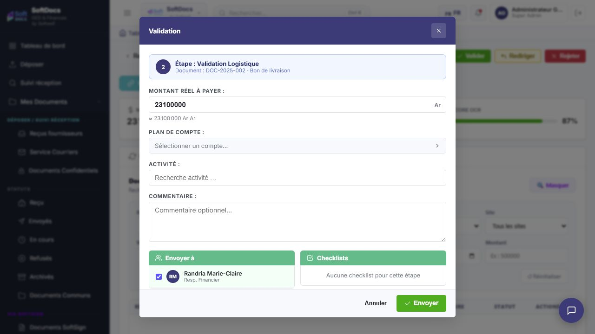

### Objectif de la fenêtre

La fenêtre de validation permet de traiter l'étape en cours du WorkFlow. Elle est utilisée par le validateur désigné ou autorisé.

### Champs et zones de saisie

| Champ | Description fonctionnelle |
|---|---|
| Montant réel à payer | Montant retenu par le validateur. Format : montant. Il peut être obligatoire selon la politique interne. Il influence les tableaux financiers. |
| Plan de compte | Liste de choix avec recherche. Permet d'associer le document à un compte comptable. Les valeurs proviennent du paramétrage Plan de Comptes. |
| Activité | Champ texte optionnel permettant de préciser l'activité ou l'imputation métier. |
| Commentaire | Champ texte optionnel ou recommandé selon les pratiques. Il apparaît ensuite dans l'historique. |
| Envoyer à | Liste des validateurs de l'étape suivante. Lorsque l'étape suivante existe, le choix des personnes détermine qui pourra traiter la suite. |
| Check-lists | Points de contrôle définis dans le WorkFlow. Réponse attendue : Oui, Non ou Non applicable. Elles documentent la décision du validateur. |

### Actions disponibles

| Action | Rôle et conséquences |
|---|---|
| Annuler | Ferme la fenêtre sans valider. |
| Envoyer | Valide l'étape. Si une étape suivante existe, le document lui est transmis. Si toutes les étapes sont terminées, le document devient validé. |

### Relations avec les autres écrans

Les check-lists affichées viennent du paramétrage WorkFlow. Les comptes disponibles viennent du Plan de Comptes. Le commentaire, le validateur et les réponses de check-list alimentent l'onglet Historique.

## Fenêtre de redirection

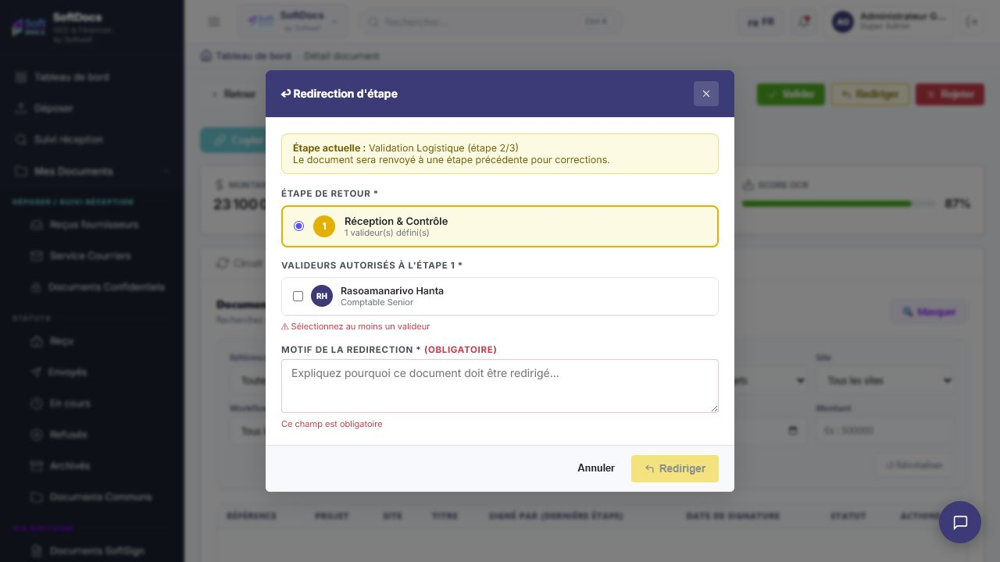

### Objectif de la fenêtre

La redirection sert à renvoyer un document vers une étape précédente lorsqu'une correction ou un contrôle complémentaire est nécessaire.

### Champs et zones de saisie

| Champ | Description fonctionnelle |
|---|---|
| Étape de retour | Choix obligatoire. L'utilisateur sélectionne l'étape précédente à laquelle le document doit revenir. |
| Validateurs autorisés | Choix obligatoire. Permet de désigner les personnes qui pourront reprendre l'étape de retour. |
| Motif de la redirection | Commentaire obligatoire. Il explique pourquoi le document est renvoyé en arrière. |

### Actions disponibles

| Action | Rôle et conditions |
|---|---|
| Annuler | Ferme la fenêtre sans changement. |
| Rediriger | Disponible lorsque l'étape de retour, au moins un validateur et le motif sont renseignés. Le document revient à l'étape choisie et l'historique conserve la redirection. |

## Fenêtre de rejet

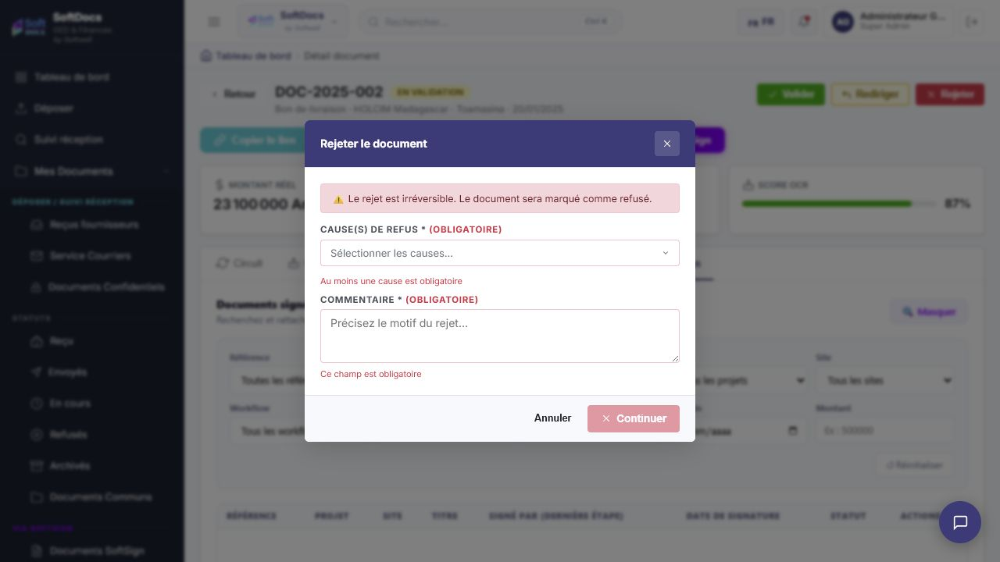

### Objectif de la fenêtre

La fenêtre de rejet permet de refuser un document de manière justifiée. Elle est utilisée lorsqu'un document n'est pas conforme ou ne doit pas continuer son circuit.

### Champs et zones de saisie

| Champ | Description fonctionnelle |
|---|---|
| Cause(s) de refus | Choix obligatoire. L'utilisateur sélectionne une ou plusieurs causes prédéfinies. Les causes disponibles proviennent du paramétrage Causes de refus. |
| Commentaire | Champ texte obligatoire. Il détaille le motif du refus pour permettre le suivi et la compréhension du rejet. |

### Actions disponibles

| Action | Rôle et conditions |
|---|---|
| Annuler | Ferme la fenêtre sans rejet. |
| Continuer | Disponible lorsque la cause et le commentaire sont renseignés. L'utilisateur doit ensuite confirmer le rejet. |

### Conséquences

Après confirmation, le document passe au statut Rejeté. Le rejet est présenté comme irréversible dans le parcours normal. Le document apparaît dans les listes de documents refusés et dans les rapports de rejet.

## Assistant d'envoi SoftSign - Paramètres

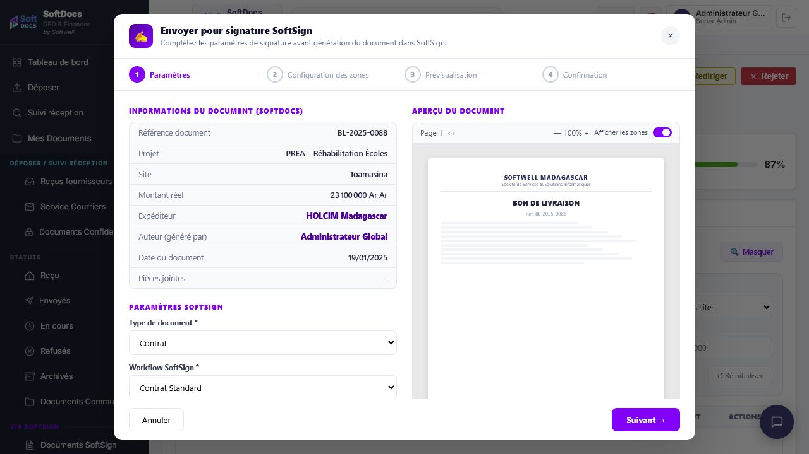

### Objectif de l'écran

L'assistant prépare l'envoi du document vers SoftSign pour signature électronique. Il reprend les informations du document SoftDocs et demande les paramètres nécessaires à la signature.

### Champs et zones de saisie

| Champ | Description fonctionnelle |
|---|---|
| Référence document | Rappel de l'identifiant ou numéro métier du document. Non modifiable dans l'assistant. |
| Projet | Rappel du projet associé. Non modifiable ici. |
| Site | Rappel du site associé. Non modifiable ici. |
| Montant réel | Rappel du montant retenu. Non modifiable ici. |
| Expéditeur | Rappel du fournisseur ou émetteur. Non modifiable ici. |
| Type de document SoftSign | Liste de choix obligatoire. Elle détermine la nature du document signé côté SoftSign. |
| WorkFlow SoftSign | Liste de choix obligatoire. Les workflows affichés dépendent du type SoftSign sélectionné. |
| Aperçu du document | Prévisualise le document et les zones de signature proposées. |
| Afficher les zones | Permet de visualiser les emplacements de signature ou de paraphe. |

### Actions disponibles

| Action | Rôle et conditions |
|---|---|
| Annuler | Ferme l'assistant sans envoi. |
| Suivant | Passe à la configuration des zones lorsque les choix obligatoires sont renseignés. |

## Assistant d'envoi SoftSign - Zones

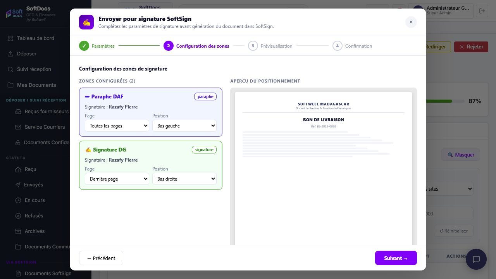

### Objectif de l'écran

Cette étape permet de vérifier et ajuster les zones de signature ou de paraphe avant l'envoi.

### Champs et zones de saisie

| Champ | Description fonctionnelle |
|---|---|
| Zone configurée | Représente une signature, un paraphe ou un contrôle attendu. |
| Signataire | Personne ou rôle qui doit intervenir sur la zone. |
| Page | Choix de portée : toutes les pages, première page, dernière page ou page spécifique. |
| Position | Emplacement de la zone : bas gauche, bas droite, bas centre, haut droite ou position personnalisée. |
| Aperçu du positionnement | Montre le document avec les zones prévues. |

### Actions disponibles

| Action | Rôle et conditions |
|---|---|
| Précédent | Retourne aux paramètres SoftSign. |
| Suivant | Passe à la prévisualisation ou à la confirmation selon l'étape. |

### Conséquence de l'envoi final

Lorsque l'utilisateur confirme la génération dans SoftSign, le document SoftDocs est verrouillé. Tant que la signature n'est pas terminée ou rattachée, les actions de validation SoftDocs ne doivent pas être utilisées.

# Documents SoftSign

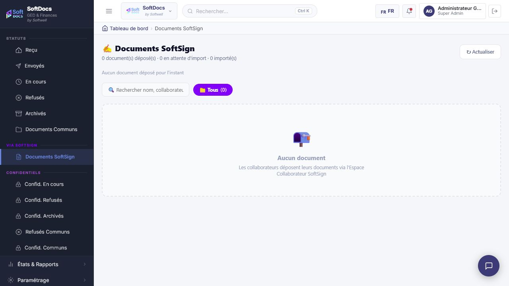

## Objectif de l'écran

L'écran Documents SoftSign présente les documents déposés via l'espace SoftSign et pouvant être importés ou rattachés à SoftDocs. Il sert de passerelle entre la signature électronique et la gestion documentaire.

## Zones affichées

| Élément | Description fonctionnelle |
|---|---|
| Total documents déposés | Nombre total de documents disponibles depuis SoftSign. |
| En attente d'import | Documents SoftSign qui ne sont pas encore repris dans SoftDocs. |
| Importés | Documents déjà intégrés ou rattachés. |
| Filtres par type | Permettent de visualiser tous les documents ou uniquement certaines catégories. |
| Liste des documents | Affiche les informations disponibles : type, document, déposant, date, statut SoftSign, statut SoftDocs et action. |

## Actions disponibles

| Action | Rôle et conséquences |
|---|---|
| Actualiser | Recharge la liste des documents SoftSign. |
| Importer | Ouvre l'assistant d'import lorsque des documents sont disponibles. L'import crée ou complète un dossier SoftDocs. |

## Relation avec la fiche document

Un document signé peut être rattaché depuis l'onglet Signature SoftSign de la fiche document. Inversement, un document envoyé depuis la fiche document apparaît dans le suivi SoftSign avec son statut de signature.

# États et rapports

## Rapport Dossiers traités par projet

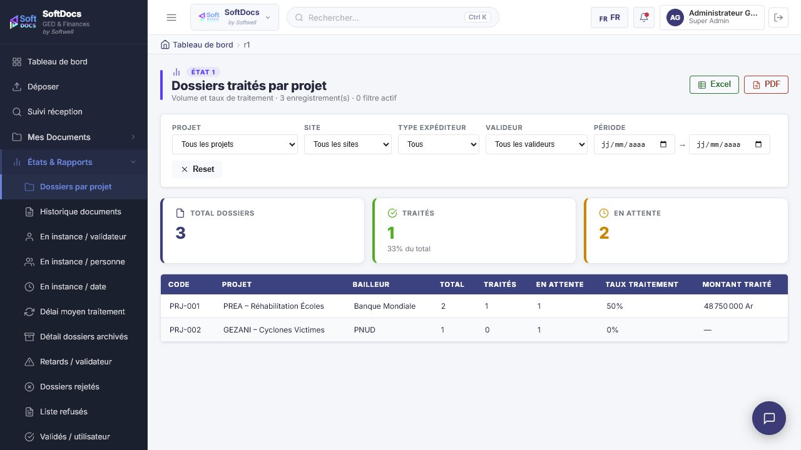

### Objectif de l'écran

Les états et rapports servent à analyser l'activité documentaire et financière. Ils sont utilisés par les responsables, contrôleurs, administrateurs et équipes de suivi.

### Filtres disponibles

| Filtre | Description fonctionnelle |
|---|---|
| Projet | Limite le rapport à un projet. Optionnel. |
| Site | Limite le rapport à un site. Optionnel. |
| Type expéditeur | Sépare les documents fournisseurs et internes. Optionnel. |
| Valideur | Filtre selon l'utilisateur impliqué dans la validation. Optionnel. |
| Période | Date de début et date de fin. Format : dates. Optionnel. |

### Actions disponibles

| Action | Rôle et conséquences |
|---|---|
| Excel | Exporte le rapport avec les filtres actifs. |
| PDF | Produit une version imprimable du rapport. |
| Reset | Supprime les filtres pour revenir à la vue complète. |

### Rapports disponibles

| Rapport | Utilisation métier |
|---|---|
| Dossiers traités par projet | Mesurer le volume et le taux de traitement par projet. |
| Historique des documents | Suivre les étapes et actions réalisées sur les documents. |
| En instance par validateur | Identifier les validateurs ayant des documents à traiter. |
| Dossiers en instance par personne | Voir les dossiers bloqués par utilisateur. |
| Dossiers en instance par date | Analyser l'ancienneté des documents en attente. |
| Délai moyen de traitement | Mesurer les délais sur les documents archivés ou terminés. |
| Détail traitement - dossiers archivés | Examiner les documents clôturés. |
| Dossiers en retard par validateur | Suivre les retards et préparer les relances. |
| Nombre de dossiers rejetés | Mesurer les refus par période ou catégorie. |
| Liste des dossiers refusés | Consulter le détail des documents rejetés. |
| Documents validés par utilisateur | Mesurer les validations réalisées par personne. |
| Situation financière par projets | Suivre les montants par projet. |
| Situation financière par fournisseurs | Suivre les montants par fournisseur. |

## Statistiques et KPIs

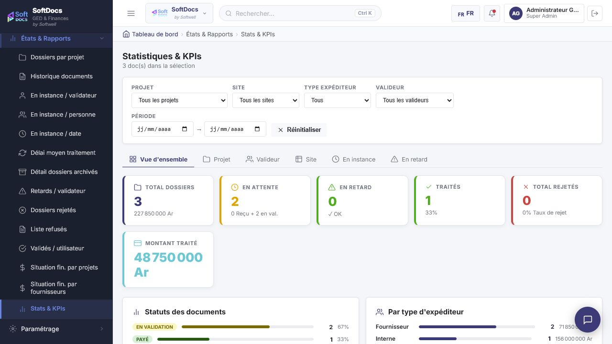

### Objectif de l'écran

Les statistiques et KPIs donnent une vision consolidée de la sélection courante : volumes, montants, statuts, retards, documents récents et répartition par critères.

### Onglets disponibles

| Onglet | Utilisation |
|---|---|
| Vue d'ensemble | Synthèse générale : total, en attente, en retard, traités, rejetés et montants. |
| Projet | Analyse par projet. |
| Valideur | Analyse de la charge et des actions par validateur. |
| Site | Répartition des documents par site. |
| En instance | Vue des documents encore à traiter. |
| En retard | Vue des documents qui ont dépassé leur délai. |

### Relation avec les autres écrans

Les indicateurs s'appuient sur les statuts, les montants, les projets, les sites, les validateurs et les dates des documents. Une action réalisée dans le détail document peut donc modifier les statistiques.

# Paramétrage

Les écrans de paramétrage sont généralement réservés aux administrateurs ou aux utilisateurs habilités. Ils influencent directement ce que les utilisateurs voient et ce qu'ils peuvent faire dans les écrans métier.

## Utilisateurs et droits

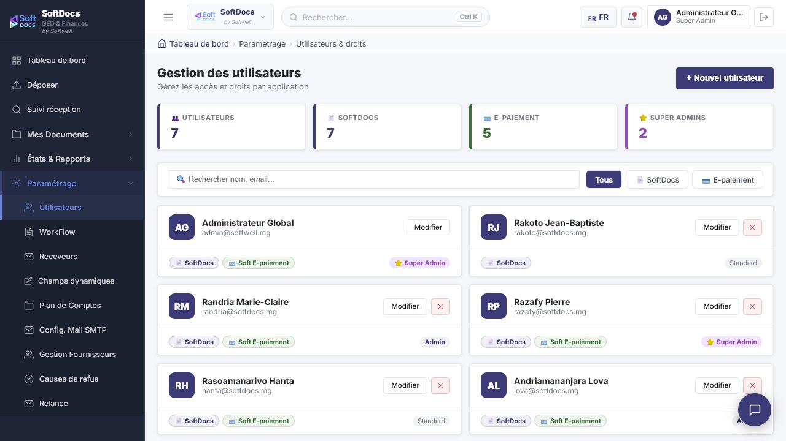

### Objectif de l'écran

Cet écran permet de gérer les utilisateurs et leurs accès. Il détermine qui peut se connecter, quelles applications sont accessibles et quels rôles sont attribués.

### Éléments affichés

| Élément | Description fonctionnelle |
|---|---|
| Liste des utilisateurs | Présente les utilisateurs, leur adresse, leurs accès et leur rôle. |
| Indicateurs SoftDocs et E-paiement | Montrent les applications auxquelles l'utilisateur a accès. |
| Rôle | Indique si l'utilisateur est standard, administrateur ou super administrateur. |

### Actions disponibles

| Action | Rôle et conditions |
|---|---|
| Nouvel utilisateur | Crée un utilisateur. Disponible aux administrateurs autorisés. |
| Modifier | Ouvre la fiche de l'utilisateur pour mettre à jour ses informations ou droits. |
| Supprimer ou désactiver | Retire ou bloque un accès selon les règles de l'organisation. |
| Filtres Tous, SoftDocs, E-paiement | Filtrent la liste selon l'application. |

### Relation avec les autres écrans

Les droits déterminent l'accès aux menus, aux listes, aux actions de validation, aux exports et au paramétrage.

## WorkFlow - Liste des types

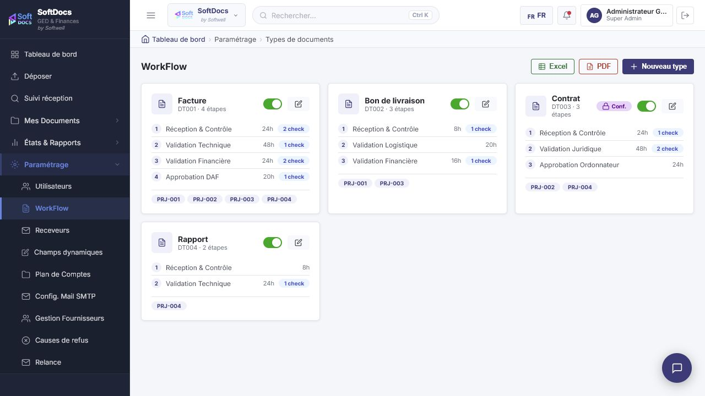

### Objectif de l'écran

L'écran WorkFlow définit les types de documents et leurs circuits de traitement. Il est central : il détermine les étapes, les délais, les validateurs, les check-lists et les obligations de signature.

### Éléments affichés

| Élément | Description fonctionnelle |
|---|---|
| Carte type de document | Représente un type, par exemple Facture, Bon de livraison, Contrat ou Rapport. |
| Code du type | Identifiant interne du type de document. L'utilisateur le voit comme repère. |
| Nombre d'étapes | Indique combien d'étapes composent le circuit. |
| Étapes | Présentent l'ordre du traitement, les délais et le nombre de check-lists. |
| Badge Confidentiel | Signale que le type est traité dans les espaces confidentiels. |
| Projets autorisés | Projets dans lesquels le type peut être utilisé. |

### Actions disponibles

| Action | Rôle et conditions |
|---|---|
| Nouveau type | Crée un nouveau type de document. |
| Modifier | Ouvre le paramétrage d'un type existant. |
| Export Excel ou PDF | Exporte la liste des types et leurs informations principales. |

## WorkFlow - Modifier un type

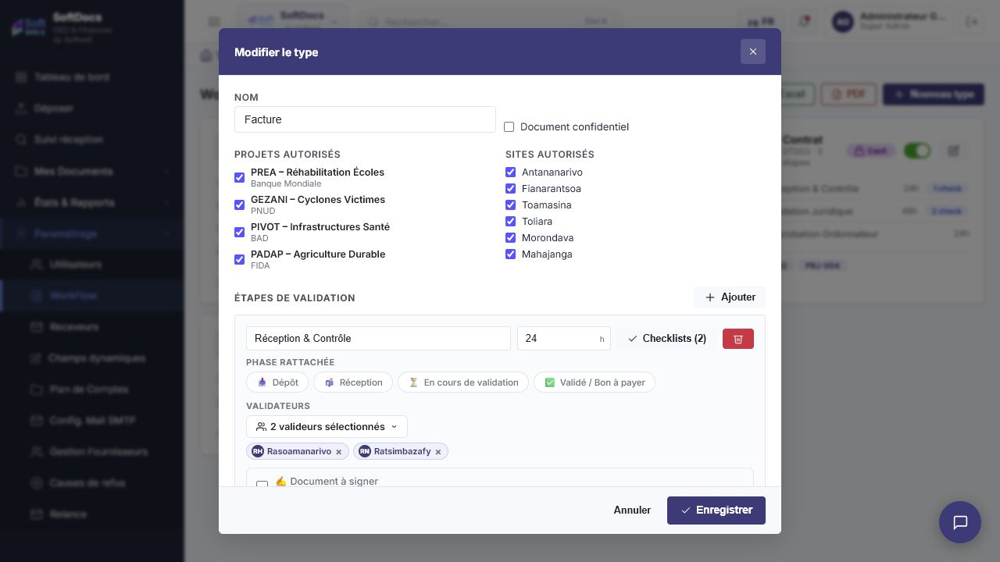

### Champs et zones de saisie

| Champ | Description fonctionnelle |
|---|---|
| Nom | Nom fonctionnel du type de document. Format : texte. Obligatoire. |
| Document confidentiel | Case à cocher. Si elle est cochée, les documents de ce type suivent les menus et droits confidentiels. |
| Projets autorisés | Cases à cocher. Elles déterminent dans quels projets ce type peut être utilisé. Au moins un projet est généralement attendu. |
| Sites autorisés | Cases à cocher. Elles restreignent les sites possibles pour ce type. |
| Étapes de validation | Liste ordonnée des étapes du circuit. Chaque étape correspond à un niveau de traitement. |
| Nom de l'étape | Texte obligatoire pour identifier l'étape, par exemple Réception et Contrôle. |
| Durée | Nombre d'heures prévu pour traiter l'étape. Format : nombre. Cette durée sert à détecter les retards. |
| Phase rattachée | Choix fonctionnel : dépôt, réception, en cours de validation ou validé bon à payer. Elle indique à quel moment du processus l'étape intervient. |
| Validateurs | Liste des personnes autorisées ou désignées pour traiter l'étape. |
| Document à signer | Case à cocher. Si elle est cochée, cette étape exige un rattachement ou un envoi SoftSign. C'est cette option qui rend l'action Envoyer pour signature SoftSign pertinente dans la fiche document. |

### Actions disponibles

| Action | Rôle et conditions |
|---|---|
| Ajouter | Ajoute une étape au circuit. |
| Checklists | Ouvre la liste des contrôles à réaliser dans l'étape. |
| Supprimer une étape | Retire l'étape du circuit si le type est en modification. |
| Annuler | Ferme sans enregistrer les changements. |
| Enregistrer | Sauvegarde le type, ses projets, sites, étapes, validateurs et règles de signature. |

### Règle SoftSign à retenir

La case Document à signer est la règle qui relie WorkFlow et SoftSign. Lorsqu'elle est cochée sur une étape, le validateur qui traite cette étape doit pouvoir envoyer le document en signature ou rattacher un document signé. Lorsqu'elle n'est pas cochée, l'étape suit le traitement SoftDocs classique sans obligation de signature électronique.

Dans la fiche document, le bouton Envoyer pour signature SoftSign doit donc être compris comme une action conditionnée par cette case. Après l'envoi vers SoftSign, le document est verrouillé et les actions de validation SoftDocs attendent le retour de la signature.

## WorkFlow - Check-lists

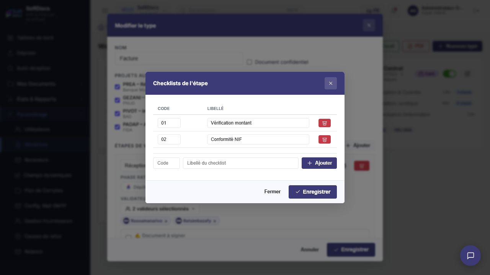

### Objectif de la fenêtre

Les check-lists définissent les points de contrôle à renseigner lors de la validation d'une étape. Elles servent à formaliser les vérifications attendues.

### Champs et zones de saisie

| Champ | Description fonctionnelle |
|---|---|
| Code | Identifiant court du point de contrôle. Format : texte ou numéro court. |
| Libellé | Intitulé compréhensible par le validateur. Format : texte. Obligatoire pour qu'un contrôle soit utile. |

### Actions disponibles

| Action | Rôle |
|---|---|
| Ajouter | Ajoute une ligne de check-list. |
| Fermer | Ferme la fenêtre. |
| Enregistrer | Sauvegarde les check-lists de l'étape. |

### Relation avec la validation

Lorsqu'un document atteint l'étape concernée, ces check-lists apparaissent dans la fenêtre de validation avec les réponses Oui, Non ou Non applicable. Les réponses sont ensuite visibles dans l'historique.

## Receveurs

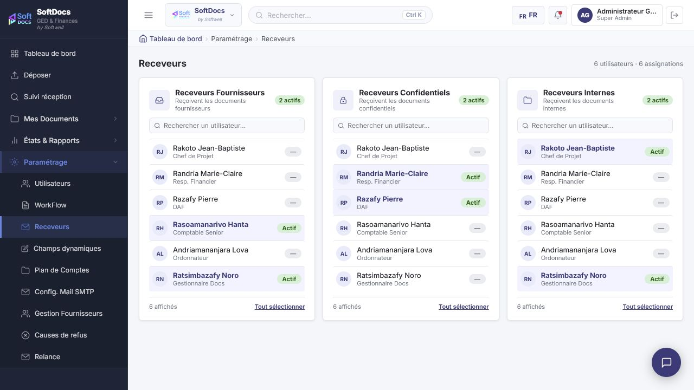

### Objectif de l'écran

Cet écran définit qui reçoit les documents selon leur origine ou leur confidentialité. Il est utilisé par les administrateurs pour organiser la prise en charge initiale.

### Zones affichées

| Zone | Description fonctionnelle |
|---|---|
| Receveurs Fournisseurs | Utilisateurs qui voient et prennent en charge les documents provenant des fournisseurs. |
| Receveurs Confidentiels | Utilisateurs autorisés à réceptionner les documents confidentiels. |
| Receveurs Internes | Utilisateurs qui prennent en charge les documents internes ou courriers. |
| Actif | Indique qu'un utilisateur est receveur dans la catégorie. |

### Actions disponibles

| Action | Rôle |
|---|---|
| Activer ou désactiver un utilisateur | Ajoute ou retire l'utilisateur de la catégorie de receveurs. |
| Tout sélectionner | Active tous les utilisateurs affichés pour la catégorie. |

### Relation avec les listes de documents

Ce paramétrage détermine quels utilisateurs voient les menus de réception : Reçus fournisseurs, Service Courriers et Documents Confidentiels. Un utilisateur non désigné comme receveur peut ne pas voir les documents à réceptionner.

## Champs dynamiques

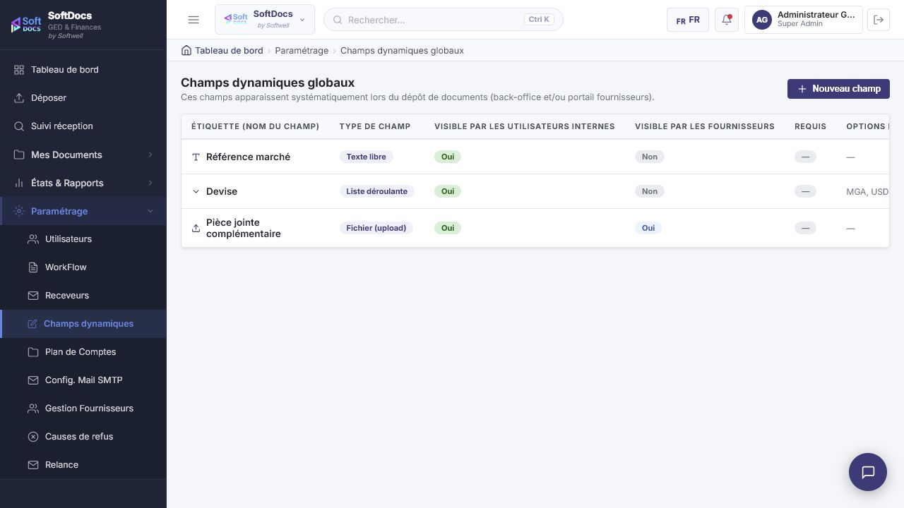

### Objectif de l'écran

Les champs dynamiques permettent d'ajouter des informations supplémentaires au dépôt des documents sans modifier le processus général.

### Champs configurables

| Champ | Description fonctionnelle |
|---|---|
| Étiquette | Nom affiché à l'utilisateur lors du dépôt. Format : texte. Obligatoire. |
| Type de champ | Format attendu : texte libre, date, case à cocher, liste, choix unique ou fichier. |
| Visible par les utilisateurs internes | Si Oui, le champ apparaît dans le dépôt réalisé par les utilisateurs internes. |
| Visible par les fournisseurs | Si Oui, le champ apparaît dans le dépôt côté fournisseur lorsque le portail est utilisé. |
| Requis | Si Oui, le champ devient obligatoire au dépôt. |
| Options disponibles | Valeurs proposées pour les listes ou choix uniques. |

### Actions disponibles

| Action | Rôle |
|---|---|
| Nouveau champ | Crée un champ supplémentaire. |
| Modifier | Met à jour un champ existant. |
| Supprimer | Retire un champ qui ne doit plus apparaître. |

### Relation avec le dépôt

Les champs visibles apparaissent dans l'étape Informations du dépôt. Si un champ est requis, l'utilisateur doit le renseigner avant de continuer.

## Plan de Comptes

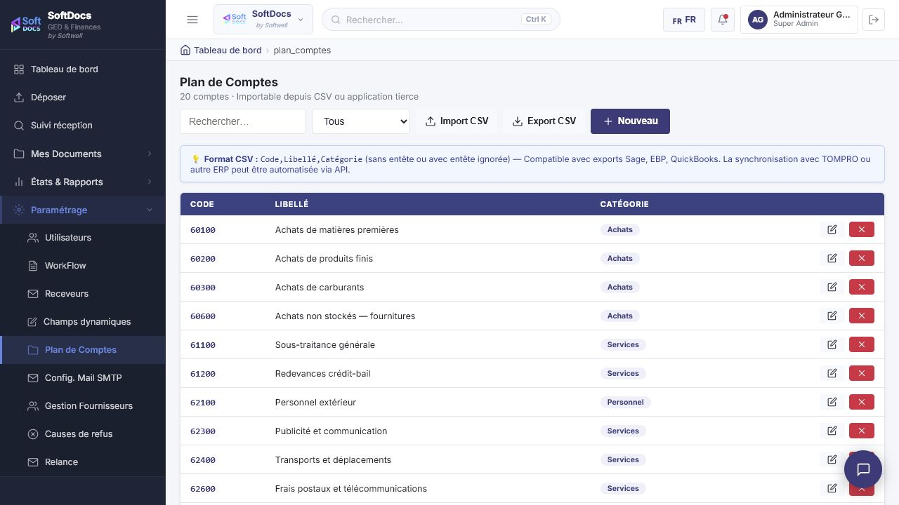

### Objectif de l'écran

Le Plan de Comptes fournit les comptes comptables proposés lors de la validation d'un document. Il est utilisé par les équipes financières ou les administrateurs.

### Champs et colonnes

| Élément | Description fonctionnelle |
|---|---|
| Code | Code du compte comptable. Format : numéro ou texte court. Obligatoire lors de la création. |
| Libellé | Nom du compte. Format : texte. Obligatoire. |
| Catégorie | Regroupement du compte : achats, services, personnel, finances, fiscalité, produits, charges, exceptionnel ou autre. |
| Filtre catégorie | Permet de limiter la liste aux comptes d'une catégorie. |

### Actions disponibles

| Action | Rôle |
|---|---|
| Import CSV | Ajoute ou met à jour les comptes à partir d'un fichier. |
| Export CSV | Exporte la liste des comptes. |
| Nouveau | Crée un compte manuellement. |
| Modifier | Met à jour un compte. |
| Supprimer | Retire un compte si l'utilisateur y est autorisé. |

### Relation avec la validation

La liste Plan de compte de la fenêtre de validation utilise ce référentiel. Si un compte n'existe pas ici, il ne peut pas être sélectionné lors de la validation.

## Configuration Mail SMTP

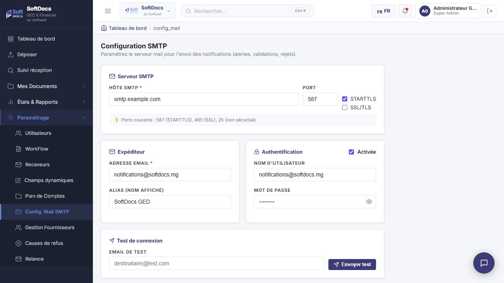

### Objectif de l'écran

Cet écran sert à configurer l'envoi des notifications par email : alertes, validations, rejets et relances.

### Champs et zones de saisie

| Champ | Description fonctionnelle |
|---|---|
| Hôte SMTP | Adresse du serveur d'envoi. Format : texte. Obligatoire. |
| Port | Numéro du port d'envoi. Format : nombre. |
| STARTTLS | Option de sécurisation du courrier. À cocher selon le serveur mail. |
| SSL/TLS | Option de sécurisation du courrier. À cocher selon le serveur mail. |
| Adresse email | Adresse utilisée comme expéditeur. Format : email. Obligatoire. |
| Alias | Nom affiché comme expéditeur. Optionnel. |
| Authentification activée | Indique si un identifiant et un mot de passe sont requis. |
| Nom d'utilisateur | Identifiant du compte mail. Obligatoire si l'authentification est activée. |
| Mot de passe | Mot de passe du compte mail. Obligatoire si l'authentification est activée. |
| Email de test | Adresse utilisée pour tester la configuration. Format : email. |

### Actions disponibles

| Action | Rôle et conditions |
|---|---|
| Envoyer test | Envoie un message de test. L'action nécessite au minimum le serveur et l'adresse d'envoi. |
| Enregistrer la configuration | Sauvegarde les paramètres mail. |

### Relation avec les autres écrans

Les notifications de validation, de rejet et de relance dépendent de cette configuration. Si elle n'est pas correcte, les utilisateurs peuvent ne pas recevoir les emails attendus.

## Gestion Fournisseurs

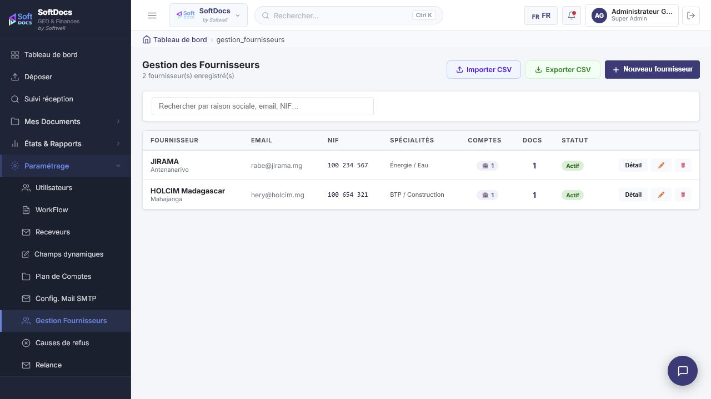

### Objectif de l'écran

La gestion fournisseurs centralise les informations des fournisseurs : identité, email, NIF, spécialités, comptes bancaires, statut et documents associés.

### Colonnes affichées

| Colonne | Description fonctionnelle |
|---|---|
| Fournisseur | Raison sociale et localisation. |
| Email | Contact principal. Format : email. |
| NIF | Numéro fiscal du fournisseur. |
| Spécialités | Domaines d'intervention du fournisseur. |
| Comptes | Nombre de coordonnées bancaires connues. |
| Docs | Nombre de documents associés au fournisseur. |
| Statut | Indique si le fournisseur est actif ou non. |

### Actions disponibles

| Action | Rôle |
|---|---|
| Importer CSV | Ajoute ou met à jour les fournisseurs depuis un fichier. |
| Exporter CSV | Exporte la liste des fournisseurs. |
| Nouveau fournisseur | Ouvre la création d'une fiche fournisseur. |
| Détail | Ouvre la fiche complète du fournisseur. |
| Modifier | Met à jour les informations fournisseur. |
| Supprimer | Retire le fournisseur si les règles internes le permettent. |

### Relation avec les documents

Le fournisseur apparaît dans le dépôt, les listes, le détail document, les rapports fournisseurs et les recherches. Des informations cohérentes facilitent le suivi et réduisent les erreurs d'identification.

## Causes de refus

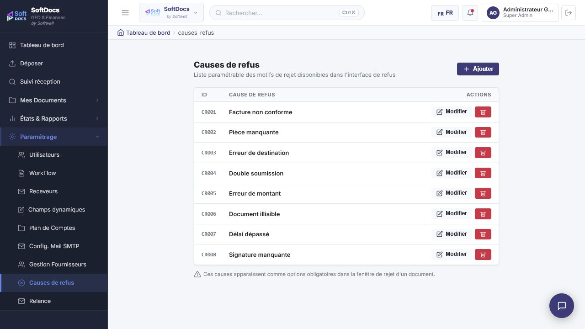

### Objectif de l'écran

Cet écran configure les motifs proposés lors du rejet d'un document. Il garantit que les refus sont classés de manière homogène.

### Champs et colonnes

| Élément | Description fonctionnelle |
|---|---|
| ID | Identifiant de la cause de refus. |
| Cause de refus | Libellé visible dans la fenêtre de rejet. |

### Actions disponibles

| Action | Rôle |
|---|---|
| Ajouter | Crée une nouvelle cause. |
| Modifier | Change le libellé d'une cause existante. |

### Relation avec le rejet

Lorsqu'un validateur rejette un document, il doit sélectionner au moins une cause parmi celles configurées ici. Les causes alimentent ensuite les rapports sur les dossiers refusés.

## Relance

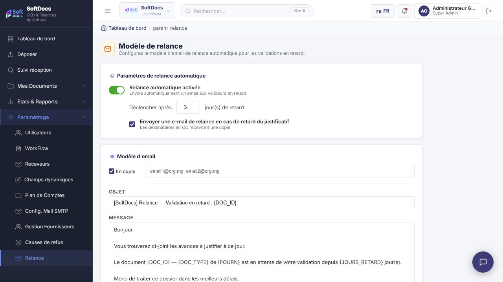

### Objectif de l'écran

Le paramétrage de relance définit le comportement et le contenu des emails envoyés lorsque des validations sont en retard.

### Champs et zones de saisie

| Champ | Description fonctionnelle |
|---|---|
| Relance automatique activée | Case à cocher. Si elle est active, SoftDocs envoie automatiquement des relances aux validateurs en retard. |
| Déclencher après | Nombre de jours de retard avant relance. Format : nombre. |
| En copie | Adresses ou destinataires en copie. Optionnel selon la politique interne. |
| Objet | Sujet de l'email de relance. Format : texte. |
| Message | Corps de l'email. Format : texte. |
| Variables disponibles | Codes remplacés automatiquement par les informations du document, par exemple référence, type, fournisseur, jours de retard, valideur, date de dépôt, projet ou site. |
| Aperçu de l'email | Montre le résultat attendu avec des données d'exemple. |

### Actions disponibles

| Action | Rôle |
|---|---|
| Enregistrer le modèle | Sauvegarde le paramétrage de relance. |
| Réinitialiser | Restaure le modèle par défaut ou annule les modifications courantes. |

### Relation avec le détail document

Lorsqu'un document est en retard, le bouton Relancer peut être disponible dans sa fiche. Le contenu envoyé s'appuie sur ce modèle et sur la configuration mail.

# Parcours utilisateur complets

## Parcours 1 - Dépôt puis réception

1. L'utilisateur ouvre Déposer.
2. Il ajoute le document principal dans l'étape OCR ou choisit la saisie manuelle.
3. Il complète les informations obligatoires, notamment projet et site.
4. Il ajoute les annexes si nécessaire.
5. Il confirme le dépôt.
6. Le document est visible dans les listes de réception adaptées à son origine et à sa confidentialité.
7. Un receveur accuse réception.
8. Si le type de document n'est pas défini, le receveur affecte un type.
9. Le WorkFlow du type choisi détermine les étapes suivantes, les validateurs, les check-lists et les délais.

## Parcours 2 - Validation standard

1. Le validateur retrouve le document depuis Reçu, En cours, une recherche ou un rapport.
2. Il ouvre le détail document.
3. Il vérifie les onglets OCR, Annexes, Circuit et Historique.
4. Il clique sur Valider.
5. Il renseigne le montant réel, le plan de compte si nécessaire, le commentaire et les check-lists.
6. Il sélectionne les validateurs de l'étape suivante lorsque cela est demandé.
7. Il envoie la validation.
8. Le document passe à l'étape suivante ou devient Validé si le circuit est terminé.

## Parcours 3 - Redirection vers une étape précédente

1. Le validateur constate qu'une correction ou vérification précédente est nécessaire.
2. Il clique sur Rediriger.
3. Il choisit l'étape de retour.
4. Il sélectionne les validateurs autorisés à reprendre l'étape.
5. Il saisit un motif obligatoire.
6. Il confirme la redirection.
7. Le document revient à l'étape choisie et l'historique conserve la trace de l'opération.

## Parcours 4 - Rejet d'un document

1. Le validateur clique sur Rejeter.
2. Il sélectionne au moins une cause de refus.
3. Il saisit un commentaire obligatoire.
4. Il continue puis confirme le rejet.
5. Le document passe au statut Rejeté.
6. Il devient visible dans les listes et rapports liés aux refus.

## Parcours 5 - Signature SoftSign

1. L'administrateur configure dans WorkFlow une étape avec la case Document à signer.
2. Le document arrive à cette étape.
3. Dans la fiche document, l'utilisateur autorisé ouvre l'action Envoyer pour signature SoftSign.
4. Il sélectionne le type SoftSign et le WorkFlow SoftSign compatible.
5. Il vérifie ou ajuste les zones de signature.
6. Il confirme l'envoi vers SoftSign.
7. Le document passe en état de validation SoftSign et les actions SoftDocs de validation sont suspendues.
8. Lorsque le document signé revient, il peut être rattaché depuis l'onglet Signature SoftSign.
9. Le traitement SoftDocs peut ensuite reprendre selon les règles de l'organisation.

## Parcours 6 - Relance d'un retard

1. Un document dépasse le délai défini dans son étape WorkFlow.
2. Il apparaît en retard dans les tableaux de bord, rapports ou listes.
3. Selon le paramétrage, une relance automatique peut être envoyée.
4. Un utilisateur autorisé peut aussi utiliser le bouton Relancer depuis la fiche document.
5. La relance est tracée dans l'historique.

# Bonnes pratiques utilisateur

| Situation | Recommandation |
|---|---|
| Score OCR faible | Vérifier les montants, dates, NIF et fournisseur avant validation. |
| Document sans type | Affecter le type correct avant de lancer le circuit, car le type détermine tout le WorkFlow. |
| Document confidentiel | Vérifier que la confidentialité est bien justifiée, car elle limite l'accès aux seuls utilisateurs autorisés. |
| Refus | Toujours choisir la cause la plus précise et rédiger un commentaire compréhensible. |
| Redirection | Expliquer clairement ce qui doit être corrigé afin d'éviter un nouveau blocage. |
| Signature SoftSign | Vérifier dans WorkFlow que l'étape est marquée Document à signer avant d'attendre une action SoftSign dans le détail document. |
| Relance | Utiliser les relances pour débloquer les retards, mais vérifier d'abord que le validateur attendu est correct. |

# Synthèse des relations importantes

| Paramétrage ou écran source | Effet dans les écrans métier |
|---|---|
| WorkFlow - étapes | Définit le circuit affiché dans le détail document et l'ordre des validations. |
| WorkFlow - durée | Détermine les retards et les relances. |
| WorkFlow - validateurs | Détermine qui peut traiter chaque étape. |
| WorkFlow - check-lists | Alimente la fenêtre de validation et l'onglet Historique. |
| WorkFlow - Document à signer | Conditionne l'action Envoyer pour signature SoftSign dans la fiche document. |
| Receveurs | Détermine qui voit les documents à réceptionner. |
| Champs dynamiques | Ajoute des champs dans le dépôt et peut rendre certaines informations obligatoires. |
| Plan de Comptes | Alimente le champ Plan de compte dans la validation. |
| Causes de refus | Alimente les choix obligatoires dans la fenêtre de rejet. |
| Configuration mail | Permet l'envoi des notifications et relances. |
| Relance | Définit quand et comment les emails de retard sont envoyés. |
| Fournisseurs | Alimente les informations fournisseur dans le dépôt, les listes, le détail et les rapports. |

