# Manuel utilisateur SoftLibrary

## 1. Présentation générale du module

SoftLibrary est le module de gestion des archives physiques, du courrier et des opérations associées : classement, conservation, consultation, inventaire, numérisation et liaison avec SoftDocs.

Il s'adresse principalement aux gestionnaires d'archives, agents courrier, responsables métiers, validateurs, auditeurs et administrateurs fonctionnels. Un utilisateur consulte le module selon ses habilitations : certains écrans sont destinés à la saisie opérationnelle, d'autres au pilotage ou au paramétrage.

SoftLibrary manipule trois notions centrales :

- Le **document physique** : une archive décrite par une fiche, un type documentaire, un statut, une confidentialité, une localisation et éventuellement un lien numérique SoftDocs.
- Le **contenant** : boîte, carton, classeur ou dossier qui regroupe des documents physiques. Son statut conditionne les opérations possibles.
- L'**emplacement** : site, bâtiment, salle, rayonnage ou zone de stockage où se trouvent les contenants et documents.

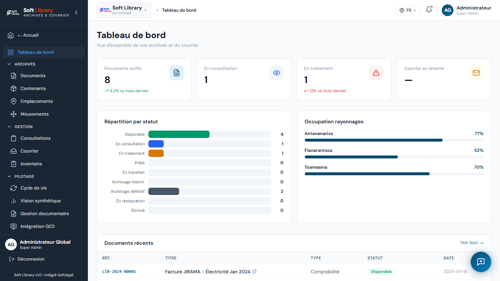

## 2. Repères communs

### 2.1 Navigation

Le menu de gauche donne accès aux familles d'écrans :

| Zone de menu | Fonction |
|---|---|
| Tableau de bord | Vue synthétique de l'activité archives et courrier. |
| Archives | Documents, contenants, emplacements et mouvements physiques. |
| Gestion | Consultations, courrier et inventaire. |
| Pilotage | Cycle de vie, vision synthétique, qualité documentaire et intégration GED. |
| Équipements | Connexion aux copieurs et scanners multifonctions. |
| Administration | Paramétrage des référentiels, workflows, droits et règles de conservation. |

Le sélecteur en haut permet de changer de module SoftAppli. Le choix de SoftLibrary place l'utilisateur dans l'espace archives physiques.

### 2.2 Statuts importants

| Élément | Statuts courants | Interprétation fonctionnelle |
|---|---|---|
| Document | Disponible, En traitement, En consultation, Archivage intermédiaire, Archivage définitif, Détruit ou éliminé | Indique si le document peut être consulté, déplacé, archivé ou soumis à une opération de conservation. |
| Contenant | Ouvert, Fermé, Scellé, En transit | Un contenant ouvert peut recevoir des documents. Un contenant fermé limite les modifications. Un contenant scellé verrouille fortement son contenu. |
| Consultation | Brouillon, En attente, Validation N1, Validation N2, Approuvée, En consultation, En retard, Retard critique, Retournée, Refusée, Annulée | Suit la demande depuis sa saisie jusqu'au retour physique du document. |
| Courrier | Brouillon, Enregistré, En validation, Visé, Signé, Distribué, En traitement, Traité, Archivé, Rejeté | Suit le courrier depuis son enregistrement jusqu'à son traitement et son archivage. |
| Élimination | Proposition, En validation, Approuvée, Refusée, Exécutée, Certifiée | Suit une demande de destruction ou d'élimination réglementaire. |
| MFP | En ligne, Attention, Hors ligne | Indique l'état des équipements de scan connectés à SoftLibrary. |

### 2.3 Relations entre les écrans

Les écrans ne sont pas indépendants. Les informations saisies dans un écran alimentent les autres :

| Information saisie ou action | Effet dans les autres écrans |
|---|---|
| Type documentaire et DUA | Détermine les métadonnées demandées dans la fiche document et les échéances du cycle de vie. |
| Emplacement d'un document ou d'un contenant | Alimente les vues Emplacements, Mouvements, Inventaire et Vision synthétique. |
| Contenant choisi dans la fiche document | Relie le document à une boîte ou un classeur et impacte le remplissage du contenant. |
| Statut d'un contenant | Conditionne la possibilité d'associer, déplacer ou sceller des documents. |
| Demande de consultation | Peut faire sortir physiquement un document, changer son statut et créer un mouvement. |
| Retour d'une consultation | Remet le document en disponibilité et clôture le suivi de circulation. |
| Lien SoftDocs | Relie l'archive physique à son équivalent numérique dans l'écran Intégration GED. |
| Scan MFP validé | Prépare ou crée une fiche documentaire à partir d'un document numérisé. |
| Règle de workflow | Détermine les étapes de validation dans les consultations, courriers ou éliminations. |

## 3. Tableau de bord

### 3.1 Objectif et utilisateurs

Le tableau de bord est l'écran d'accueil du module. Il donne une vue rapide de l'état des archives : volumes, documents actifs, consultations en cours, traitements à surveiller et documents récents.

Il est utilisé par les gestionnaires d'archives, responsables de service et auditeurs pour suivre l'activité quotidienne.

### 3.2 Éléments affichés

| Zone | Signification | Interaction |
|---|---|---|
| Cartes de synthèse | Affichent les indicateurs clés : documents actifs, en consultation, en traitement, courrier en attente. | Elles permettent d'identifier rapidement les priorités. |
| Répartition par statut | Montre la distribution des documents selon leur état. | Sert à comprendre la charge de traitement et les volumes archivés. |
| Documents récents | Liste les derniers documents physiques enregistrés. | Un clic ou une navigation vers Documents permet d'ouvrir leur fiche. |
| Assistant LibAssist | Aide à rechercher des informations ou obtenir des alertes rapides. | Le bouton flottant ouvre une fenêtre de dialogue. |

### 3.3 Relations avec les autres écrans

Les indicateurs sont calculés à partir des documents, contenants, consultations et courriers. Si un document passe en consultation, le tableau de bord reflète l'augmentation des consultations en cours. Si un document est archivé ou détruit, la répartition par statut évolue.

## 4. Documents physiques

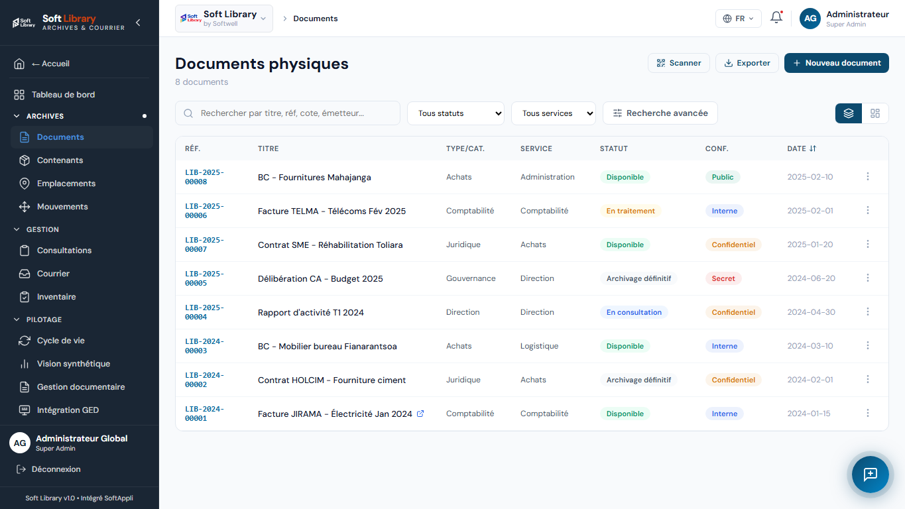

### 4.1 Objectif et utilisateurs

L'écran Documents physiques centralise les fiches d'archives. Il permet de rechercher, créer, modifier, consulter, scanner, imprimer une étiquette, suivre les versions et changer le statut d'un document.

Il est utilisé par les gestionnaires d'archives pour l'enregistrement et le suivi, par les agents autorisés pour la recherche, et par les auditeurs pour l'historique.

### 4.2 Champs et filtres de la liste

| Champ ou filtre | Fonction | Format attendu | Obligatoire | Relations |
|---|---|---|---|---|
| Recherche principale | Recherche un document par titre, référence, cote ou émetteur. | Texte libre. | Optionnel. | Filtre instantanément la liste. |
| Tous statuts | Filtre selon l'état du document. | Liste déroulante. | Optionnel. | Les statuts proviennent du suivi documentaire et du cycle de vie. |
| Tous services | Filtre par service producteur ou détenteur. | Liste déroulante. | Optionnel. | Dépend des services configurés dans le référentiel. |
| Recherche avancée | Ouvre les critères détaillés. | Bouton d'affichage. | Optionnel. | Ajoute des critères combinés avec la recherche simple. |
| Mode liste ou cartes | Change la présentation visuelle. | Boutons icônes. | Optionnel. | N'altère pas les données. |

### 4.3 Colonnes de la liste

| Colonne | Signification | Comment l'interpréter |
|---|---|---|
| Réf. | Identifiant unique de la fiche d'archive. | Sert à retrouver le document et à l'associer à une consultation ou un scan. |
| Titre | Nom fonctionnel du document. | Doit permettre à l'utilisateur de reconnaître l'archive. |
| Type/Cat. | Type documentaire ou catégorie métier. | Influence les métadonnées et la durée de conservation. |
| Service | Service responsable ou producteur. | Sert aux filtres, droits et rapports. |
| Statut | État courant du document. | Indique s'il est disponible, consulté, archivé ou en traitement. |
| Conf. | Niveau de confidentialité. | Peut restreindre la consultation et déclencher une validation. |
| Date | Date du document. | Sert aux échéances de conservation. |
| Actions | Menu de consultation et d'opérations. | Ouvre la fiche, les versions, le statut, le QR ou l'audit. |

### 4.4 Recherche avancée

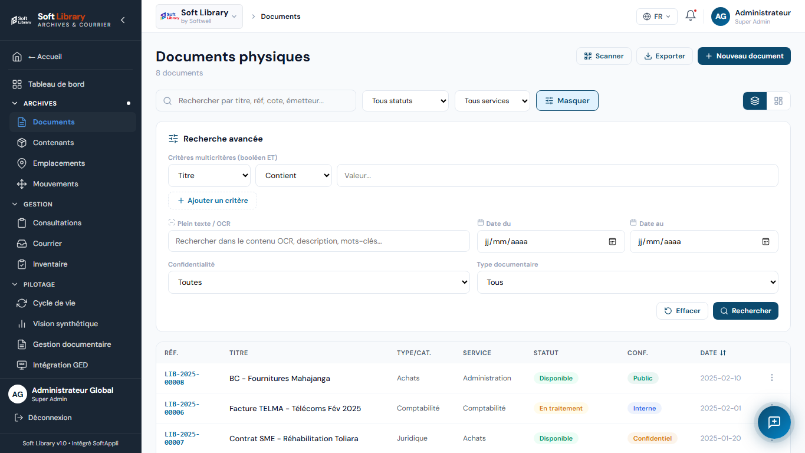

| Champ | Fonction | Format attendu | Obligatoire | Relations |
|---|---|---|---|---|
| Critères multicritères | Ajoute des conditions de recherche. | Champ + opérateur + valeur. | Optionnel. | Les critères sont combinés pour affiner le résultat. |
| Plein texte/OCR | Recherche dans le contenu reconnu par scan, la description ou les mots-clés. | Texte libre. | Optionnel. | Dépend des informations OCR issues du scan ou de la numérisation. |
| Date du / Date au | Limite la recherche à une période. | Dates. | Optionnel. | Utilise la date du document. |
| Confidentialité | Filtre les documents publics, internes, confidentiels ou secrets. | Liste déroulante. | Optionnel. | Peut limiter les résultats selon les droits. |
| Type documentaire | Filtre selon le type configuré. | Liste déroulante. | Optionnel. | Les types proviennent de l'administration. |

Actions :

| Bouton | Rôle | Conditions | Conséquences |
|---|---|---|---|
| Ajouter critère | Ajoute une ligne de recherche. | Toujours disponible. | Permet d'affiner la recherche. |
| Effacer | Réinitialise les critères. | Disponible lorsqu'un filtre est saisi. | La liste revient à un périmètre plus large. |
| Rechercher | Applique les critères. | Toujours disponible. | Met à jour les résultats affichés. |

### 4.5 Création ou modification d'un document

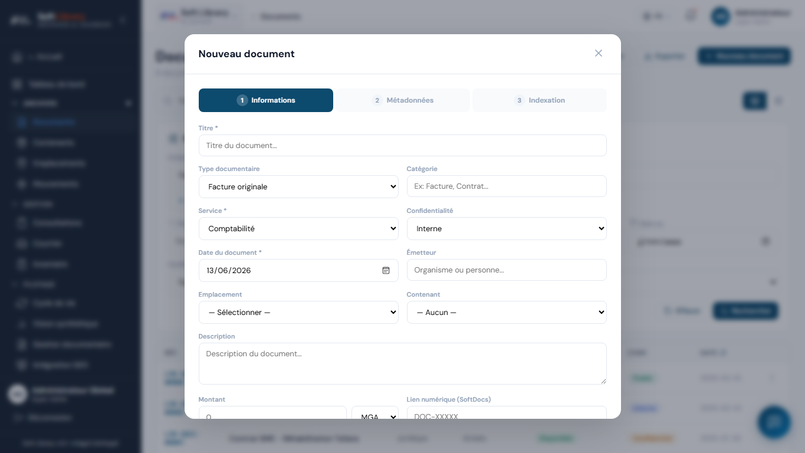

Le formulaire est organisé en étapes. Les champs avec astérisque sont obligatoires.

| Champ | Fonction | Format attendu | Obligatoire | Relations |
|---|---|---|---|---|
| Titre | Nom du document physique. | Texte. | Oui. | Apparaît dans les listes, recherches et rapports. |
| Type documentaire | Classe le document dans un référentiel. | Liste déroulante. | Recommandé. | Déclenche les métadonnées dynamiques et les règles DUA. |
| Catégorie | Précise la famille métier. | Texte ou valeur proposée. | Optionnel. | Sert aux filtres et à la recherche. |
| Service | Service producteur ou responsable. | Liste déroulante. | Oui. | Utilisé dans les rapports, droits et recherche. |
| Confidentialité | Niveau d'accès. | Liste déroulante. | Optionnel. | Peut déclencher une validation pour consultation. |
| Date du document | Date officielle du document. | Date. | Oui. | Sert au calcul des échéances de conservation. |
| Émetteur | Personne ou organisme source. | Texte. | Optionnel. | Utilisé dans la recherche. |
| Emplacement | Localisation physique directe. | Liste d'emplacements. | Optionnel. | Si un contenant est choisi, l'emplacement peut être déduit du contenant. |
| Contenant | Boîte, carton ou classeur. | Liste de contenants. | Optionnel. | Seuls les contenants ouverts doivent recevoir de nouveaux documents. |
| Description | Résumé fonctionnel. | Texte long. | Optionnel. | Alimente la recherche avancée. |
| Montant | Montant associé au document. | Nombre + devise. | Optionnel. | Utile pour factures, contrats et rapports. |
| Lien numérique SoftDocs | Référence d'un document GED. | Référence ou identifiant SoftDocs. | Optionnel. | Crée la relation physique-numérique visible dans Intégration GED. |
| Métadonnées dynamiques | Champs spécifiques au type documentaire. | Texte, nombre, date, liste, oui/non. | Selon configuration. | Les champs obligatoires viennent de l'administration du type. |
| Mots-clés | Termes de recherche. | Texte séparé par des virgules. | Optionnel. | Utilisé par la recherche avancée. |
| Cote / référence classement | Numéro de classement physique. | Texte structuré. | Optionnel. | Sert aux recherches et étiquettes. |
| Contenant physique | Affectation finale au classement. | Liste de contenants. | Optionnel. | Impacte le remplissage du contenant et l'inventaire. |

Actions :

| Bouton | Rôle | Conditions | Conséquences |
|---|---|---|---|
| Précédent | Revient à l'étape précédente. | Actif à partir de la deuxième étape. | Les données saisies restent affichées. |
| Suivant | Passe à l'étape suivante. | Actif si les champs obligatoires de l'étape sont remplis. | Affiche les métadonnées ou l'indexation. |
| Annuler | Ferme le formulaire sans sauvegarder. | Toujours disponible. | Les modifications non enregistrées sont perdues. |
| Enregistrer | Crée ou met à jour la fiche. | Actif à la dernière étape. | La fiche devient visible dans Documents et les autres écrans liés. |

### 4.6 Scanner un document

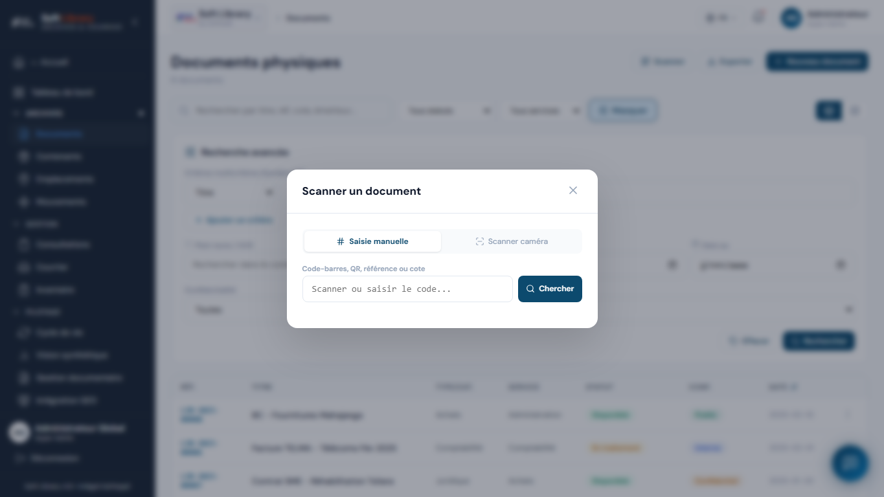

| Champ ou action | Fonction | Conditions | Conséquences |
|---|---|---|---|
| Code-barres, QR, référence ou cote | Recherche une fiche à partir d'un code scanné ou saisi. | Texte ou scan. | Affiche le document correspondant si trouvé. |
| Chercher | Lance la recherche manuelle. | Actif si une valeur est saisie. | Affiche le résultat ou l'absence de correspondance. |
| Activer le scanner | Passe en mode capture scanner. | Disponible dans le panneau. | Prépare la lecture automatique. |
| Simuler un scan | Remplit un exemple de scan. | Disponible lorsque le scanner est activé. | Affiche un résultat de test. |
| Ouvrir la fiche | Ouvre le document trouvé. | Actif uniquement lorsqu'un document est identifié. | Redirige vers la fiche documentaire. |

### 4.7 Fiche documentaire et statuts

La fiche documentaire présente les informations principales, les métadonnées, les versions, l'indexation, l'historique et les actions d'impression ou de statut.

Actions principales :

| Bouton | Rôle | Conditions | Conséquences |
|---|---|---|---|
| Étiquette | Prépare une étiquette d'archive. | Document existant. | Affiche un aperçu imprimable. |
| QR | Prépare un QR code ou code-barres. | Document existant. | Sert au scan, à l'inventaire et à la circulation. |
| Historique | Affiche l'audit du document. | Document existant. | Permet de voir les modifications et consultations. |
| Modifier | Ouvre le formulaire de modification. | Selon droits. | Met à jour la fiche. |
| Versions | Ouvre l'historique des versions physiques ou numériques. | Document existant. | Permet de suivre l'évolution du document. |
| Statut | Ouvre le changement de statut. | Document existant. | Déclenche une transition contrôlée. |

Le changement de statut est conditionné par les transitions autorisées. Un statut ne se choisit pas librement : par exemple un document disponible peut passer en consultation ou traitement, tandis qu'un document détruit ne doit plus être remis en circulation. Le motif explique la raison du changement et facilite l'audit.

## 5. Contenants

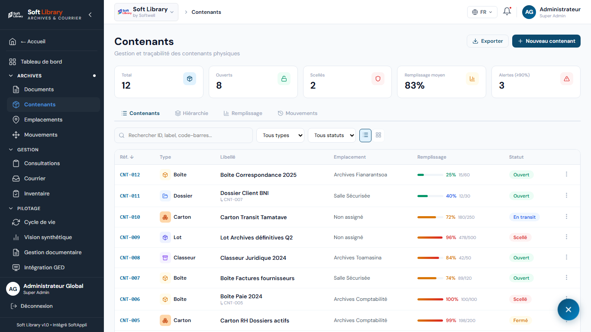

### 5.1 Objectif et utilisateurs

L'écran Contenants gère les boîtes, cartons, classeurs, dossiers ou lots qui regroupent les archives physiques. Il sert à connaître leur capacité, leur remplissage, leur emplacement, leur statut et leur historique.

### 5.2 Liste et indicateurs

| Élément | Signification | Interaction |
|---|---|---|
| Recherche ID, libellé, code-barres | Retrouve un contenant. | Saisie texte. |
| Type | Filtre par nature du contenant. | Liste déroulante. |
| Statut | Filtre ouvert, fermé, scellé ou transit. | Liste déroulante. |
| Remplissage | Affiche le nombre de documents ou la capacité utilisée. | Sert à éviter la surcharge. |
| Actions | Voir, modifier, QR, associer, déplacer, sceller, historique. | Les actions dépendent du statut. |

### 5.3 Création d'un contenant

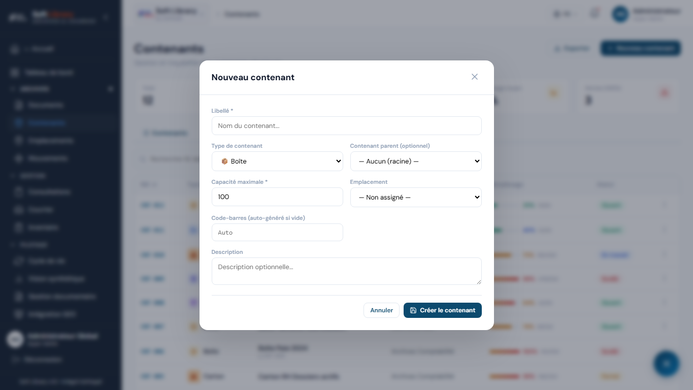

| Champ | Fonction | Format attendu | Obligatoire | Relations |
|---|---|---|---|---|
| Libellé | Nom du contenant. | Texte. | Oui. | Affiché dans les listes et fiches document. |
| Type de contenant | Boîte, carton, dossier, classeur ou lot. | Liste déroulante. | Oui. | Influence l'interprétation du volume. |
| Contenant parent | Place le contenant dans une hiérarchie. | Liste de contenants. | Optionnel. | Permet un classement contenant dans contenant. |
| Capacité maximale | Nombre maximal d'unités ou documents. | Nombre. | Oui. | Utilisé dans le taux de remplissage. |
| Emplacement | Localisation physique. | Liste d'emplacements. | Optionnel. | Alimente Emplacements et Inventaire. |
| Code-barres | Identifiant imprimable. | Texte ou valeur générée. | Optionnel. | Utilisé pour le scan. |
| Description | Commentaire libre. | Texte long. | Optionnel. | Aide les gestionnaires. |

Actions :

| Bouton | Rôle | Conditions | Conséquences |
|---|---|---|---|
| Créer le contenant | Enregistre un nouveau contenant. | Libellé et capacité renseignés. | Le contenant devient disponible pour association. |
| Enregistrer | Sauvegarde une modification. | Contenant existant. | Met à jour listes, capacités et emplacements. |
| Annuler | Ferme sans sauvegarder. | Toujours disponible. | Aucune modification n'est conservée. |

### 5.4 Mouvements des contenants

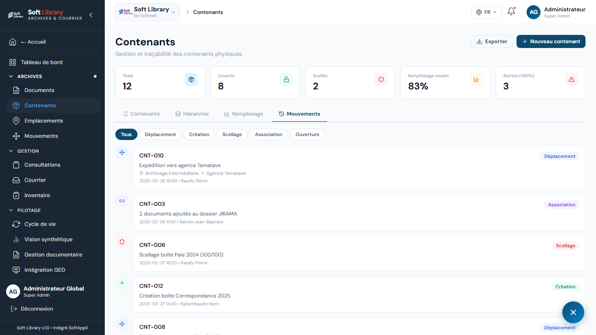

| Action | Rôle | Conditions | Conséquences |
|---|---|---|---|
| Associer | Ajoute des documents au contenant. | Le contenant doit être ouvert ou autorisé à recevoir des documents. | Les documents héritent du lien contenant. |
| Déplacer | Change l'emplacement du contenant. | Un nouvel emplacement doit être choisi. | Les documents contenus suivent le déplacement physique. |
| Sceller | Verrouille le contenant. | Motif obligatoire. | Le scellement est présenté comme irréversible et bloque les ajouts. |
| Fermer | Ferme le contenant sans scellement définitif. | Motif obligatoire. | Limite les ajouts et signale une boîte complète ou terminée. |
| QR / étiquette | Imprime ou télécharge l'identifiant. | Contenant existant. | Facilite scan, inventaire et circulation. |
| Historique | Affiche les actions réalisées. | Contenant existant. | Permet l'audit du contenant. |

Relation importante : un document ne doit être ajouté qu'à un contenant cohérent avec son classement. Si un contenant est scellé, l'utilisateur doit comprendre qu'il ne peut plus être manipulé comme un contenant ouvert.

## 6. Emplacements

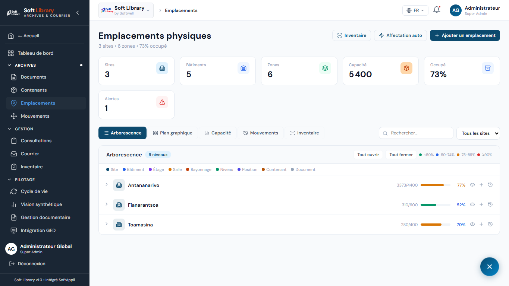

### 6.1 Objectif et utilisateurs

L'écran Emplacements décrit l'organisation physique des archives : sites, bâtiments, étages, salles, rayonnages et positions. Il sert à localiser les documents et à piloter la capacité de stockage.

### 6.2 Arborescence

| Élément | Signification | Interaction |
|---|---|---|
| Arborescence | Représente la hiérarchie des lieux. | Ouvrir ou fermer les branches. |
| Bouton détail | Affiche les informations d'un emplacement. | Disponible sur les nœuds de classement. |
| Ajouter enfant | Crée un sous-emplacement. | Disponible sur les nœuds qui peuvent contenir un niveau inférieur. |
| Mouvements | Affiche l'historique du lieu. | Disponible sur les emplacements. |

### 6.3 Plan et capacité

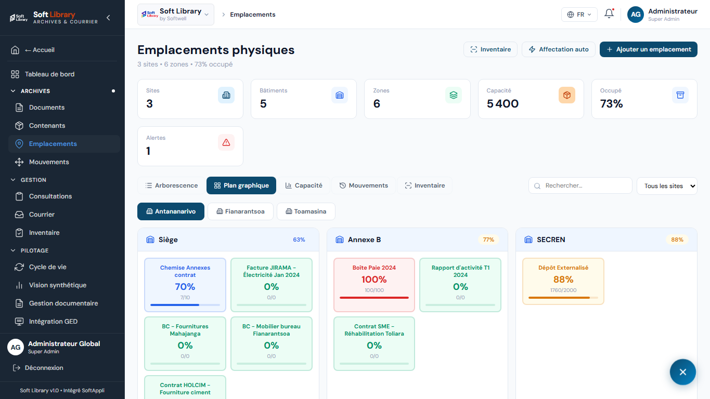

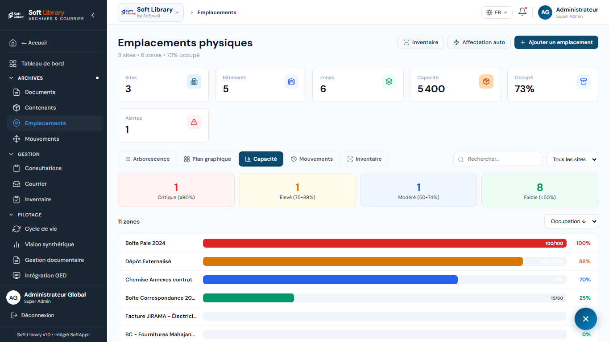

| Zone | Fonction | Comment l'utiliser |
|---|---|---|
| Vue Plan | Visualise la répartition physique. | Utile pour repérer les zones de stockage. |
| Vue Capacité | Compare capacité, occupation et alertes. | Priorise les zones saturées. |
| Inventaire | Prépare le scan d'une zone. | Sert aux contrôles terrain. |

### 6.4 Affectation automatique

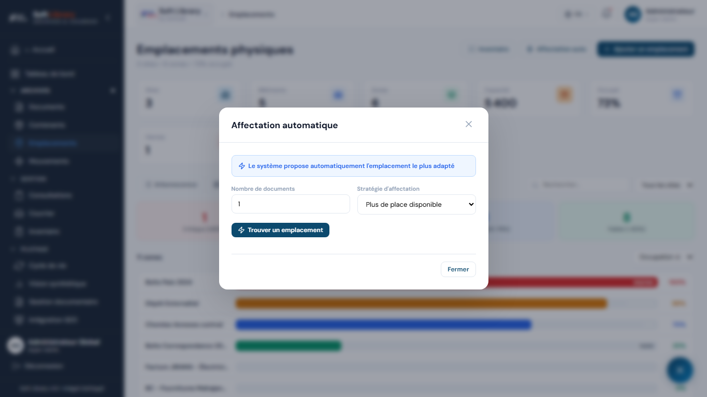

| Champ | Fonction | Format attendu | Obligatoire | Relations |
|---|---|---|---|---|
| Nombre de documents | Indique le volume à classer. | Nombre. | Oui. | Sert à trouver une zone avec capacité suffisante. |
| Stratégie d'affectation | Choisit la logique de proposition. | Liste : plus proche, plus vide, équilibrée. | Oui. | Influence l'emplacement proposé. |

Actions :

| Bouton | Rôle | Conditions | Conséquences |
|---|---|---|---|
| Trouver un emplacement | Calcule la recommandation. | Nombre de documents renseigné. | Affiche l'emplacement recommandé. |
| Affecter | Confirme l'affectation proposée. | Actif quand une proposition existe. | Affecte les documents à l'emplacement choisi. |
| Fermer | Quitte l'assistant. | Toujours disponible. | Aucun changement si non confirmé. |

### 6.5 Création d'un emplacement

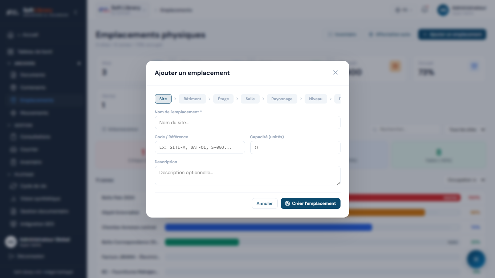

| Champ | Fonction | Format attendu | Obligatoire | Relations |
|---|---|---|---|---|
| Nom de l'emplacement | Libellé lisible du site, bâtiment ou salle. | Texte. | Oui. | Affiché dans documents, contenants et inventaires. |
| Code / référence | Code de classement. | Texte court. | Optionnel. | Utilisé pour les recherches et plans. |
| Site parent / bâtiment parent | Replace le nouvel élément dans l'arborescence. | Liste. | Selon le niveau. | Détermine le chemin complet. |
| Capacité | Volume disponible. | Nombre. | Optionnel mais recommandé. | Alimente les taux d'occupation. |
| Type de rayonnage | Nature du stockage. | Liste. | Optionnel. | Aide à la planification. |
| Description | Commentaire de localisation. | Texte long. | Optionnel. | Utile pour les consignes terrain. |

## 7. Mouvements et classement

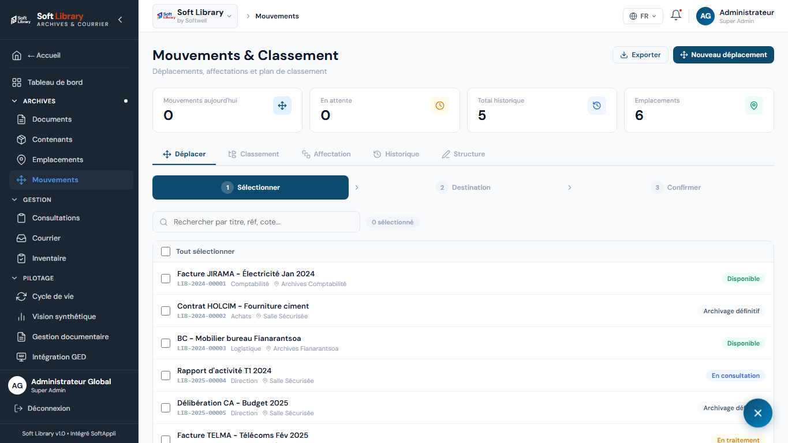

### 7.1 Objectif et utilisateurs

L'écran Mouvements sert à déplacer des documents, affecter plusieurs documents à un emplacement, consulter l'historique des circulations et modifier le plan de classement.

### 7.2 Déplacer des documents

Le parcours est en trois étapes : sélectionner les documents, choisir la destination, confirmer.

| Champ ou étape | Fonction | Format attendu | Obligatoire | Relations |
|---|---|---|---|---|
| Recherche par titre, référence ou cote | Retrouve les documents à déplacer. | Texte. | Optionnel. | Filtre la liste de sélection. |
| Sélection des documents | Choisit un ou plusieurs documents. | Cases à cocher. | Oui. | Les documents sélectionnés seront déplacés ensemble. |
| Type de mouvement | Nature du mouvement. | Liste : déplacement, transfert, prêt, retour, affectation, élimination. | Oui. | Détermine l'interprétation dans l'historique. |
| Emplacement de destination | Nouveau lieu physique. | Liste d'emplacements. | Oui. | Met à jour la localisation. |
| Motif | Raison du déplacement. | Texte long. | Recommandé. | Alimente l'audit. |

Actions :

| Bouton | Rôle | Conditions | Conséquences |
|---|---|---|---|
| Suivant | Passe à l'étape suivante. | Sélection ou destination renseignée selon l'étape. | Prépare la confirmation. |
| Précédent | Revient à l'étape précédente. | À partir de l'étape 2. | Permet de corriger la sélection. |
| Confirmer le déplacement | Enregistre le mouvement. | Documents et destination obligatoires. | Met à jour l'historique et la localisation. |

### 7.3 Classement, affectation, historique et structure

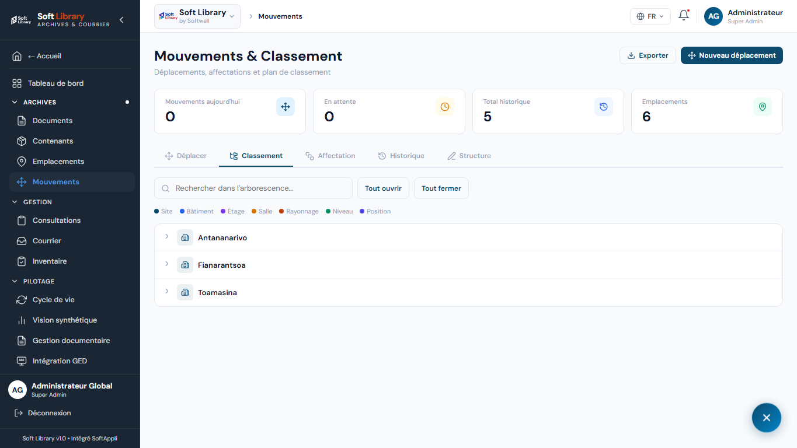

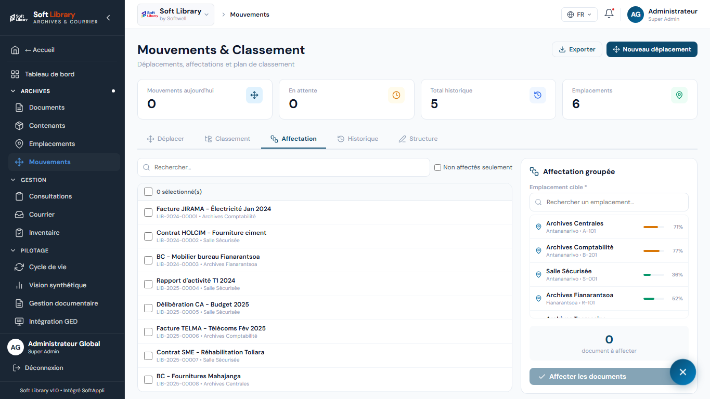

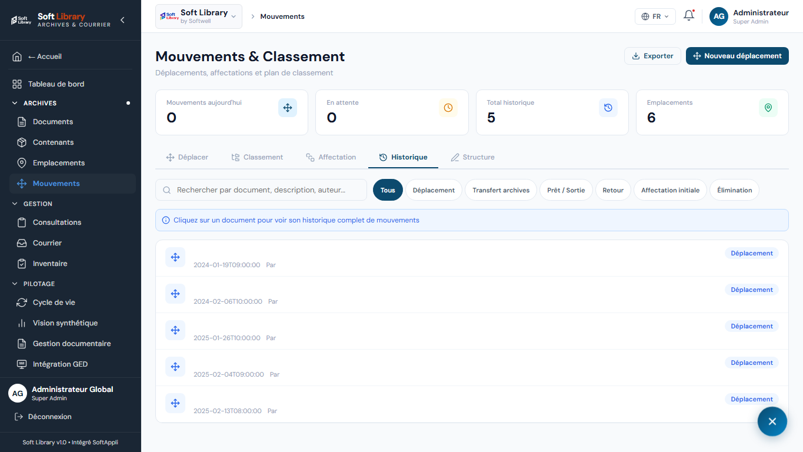

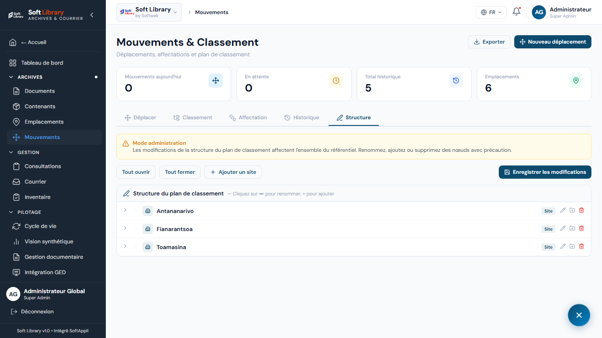

| Onglet | Fonction | Interactions |
|---|---|---|
| Classement | Visualise l'arborescence complète. | Recherche, ouvrir/fermer les branches, consulter les documents. |
| Affectation | Affecte en masse des documents à un emplacement cible. | Sélection de documents, choix emplacement, confirmation. |
| Historique | Journalise les déplacements, retours, prêts ou éliminations. | Recherche par document, auteur ou description. |
| Structure | Modifie le plan de classement. | Ajouter, renommer ou supprimer des nœuds selon droits. |

Relation importante : les mouvements alimentent l'inventaire et l'audit. Si un document est déplacé sans mouvement enregistré, l'inventaire peut détecter un écart.

## 8. Consultations et circulation

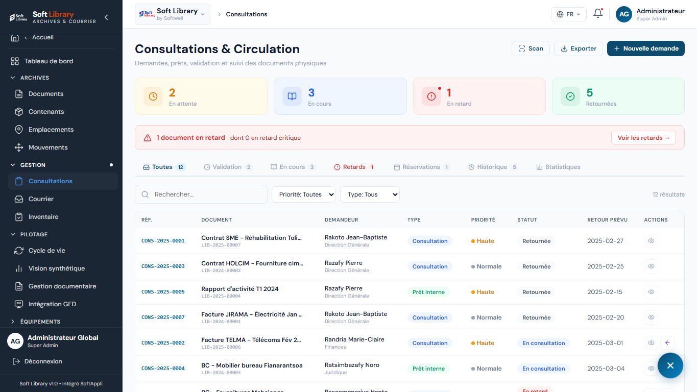

### 8.1 Objectif et utilisateurs

L'écran Consultations & Circulation gère les demandes d'accès aux documents physiques, les prêts internes ou externes, les réservations, les sorties et les retours.

Il est utilisé par les demandeurs, gestionnaires d'archives, validateurs et agents de retrait/retour.

### 8.2 Onglets et filtres

| Élément | Fonction | Interaction |
|---|---|---|
| Toutes | Affiche toutes les demandes. | Vue globale. |
| Validation | Affiche les demandes en attente ou en cours de validation. | Sert aux validateurs. |
| En cours | Affiche les documents sortis ou consultés. | Sert au suivi de détention. |
| Retards | Affiche les retours dépassés. | Permet les relances. |
| Réservations | Affiche les demandes planifiées. | Sert à préparer une mise à disposition. |
| Historique | Affiche les demandes terminées, refusées ou annulées. | Consultation d'audit. |
| Statistiques | Analyse l'activité de consultation. | Pilotage. |

### 8.3 Nouvelle demande de consultation

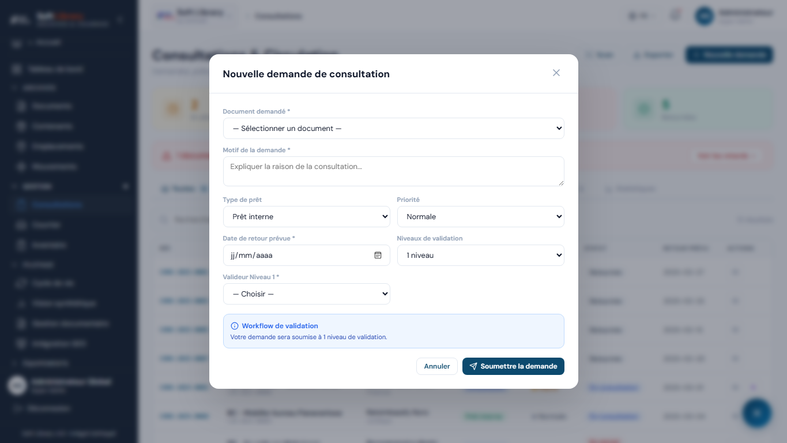

| Champ | Fonction | Format attendu | Obligatoire | Relations |
|---|---|---|---|---|
| Document demandé | Document à consulter ou emprunter. | Liste de documents. | Oui. | Le document doit exister dans SoftLibrary. |
| Motif de la demande | Justification métier. | Texte long. | Oui. | Aide les validateurs à décider. |
| Type de prêt | Consultation, prêt interne, prêt externe ou numérisation. | Liste. | Oui. | Le prêt externe peut déclencher un workflow renforcé. |
| Priorité | Normale, haute ou urgente. | Liste. | Oui. | Les urgences sont mises en avant. |
| Date de retour prévue | Date limite de retour. | Date. | Oui. | Sert au calcul des retards. |
| Niveaux de validation | Nombre d'étapes de validation. | Liste : aucun, 1 niveau, 2 niveaux. | Oui. | Fait apparaître les champs de valideurs. |
| Valideur Niveau 1 | Premier décideur. | Liste utilisateur. | Obligatoire si 1 ou 2 niveaux. | Le bouton Approuver/Refuser est lié à ce niveau. |
| Valideur Niveau 2 | Deuxième décideur. | Liste utilisateur. | Obligatoire si 2 niveaux. | Activé après validation N1. |

Actions :

| Bouton | Rôle | Conditions | Conséquences |
|---|---|---|---|
| Soumettre la demande | Crée la demande. | Document, motif, date retour et valideurs requis renseignés. | Place la consultation en attente ou en validation. |
| Valider / Approuver | Approuve le niveau courant. | Actif pour la demande en validation. | Passe au niveau suivant ou au statut Approuvée. |
| Refuser | Refuse la demande. | Actif pour un valideur. | Passe la demande au statut Refusée. |
| Enregistrer sortie | Déclare la remise physique. | Actif seulement si la demande est Approuvée. | Passe au statut En consultation et renseigne le détenteur. |
| Enregistrer retour | Déclare le retour. | Actif si la demande est En consultation, En retard ou Retard critique. | Passe au statut Retournée et libère le document. |
| Annuler | Annule une demande non clôturée. | Inactif si retournée, refusée ou déjà annulée. | La demande passe en Annulée. |

### 8.4 Scan de sortie ou retour

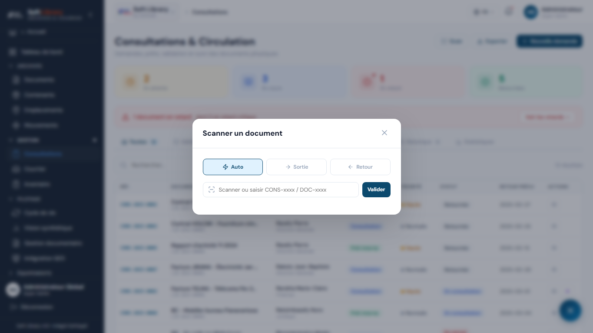

Le scan permet de sécuriser la circulation physique. L'utilisateur scanne ou saisit une référence de consultation ou de document. Selon le statut trouvé, SoftLibrary propose la sortie ou le retour.

Relation importante : une consultation approuvée ne fait pas sortir automatiquement le document. La sortie physique doit être enregistrée. À l'inverse, un retour doit être scanné ou saisi pour lever les retards et remettre le document à disposition.

## 9. Courrier et flux entrants

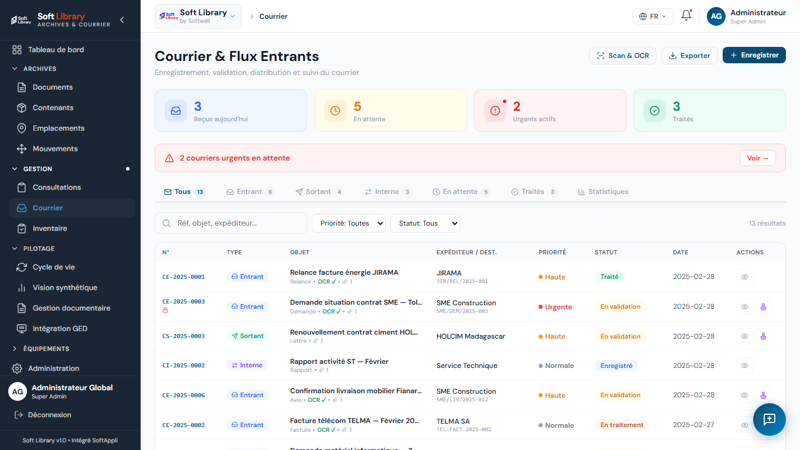

### 9.1 Objectif et utilisateurs

L'écran Courrier & Flux Entrants gère le courrier entrant, sortant et interne : enregistrement, scan OCR, visa, signature, distribution, traitement et archivage.

Il est utilisé par les agents courrier, secrétariats, responsables de service, validateurs et archivistes.

### 9.2 Liste et statuts

| Élément | Signification | Interaction |
|---|---|---|
| Onglets Tous, Entrant, Sortant, Interne | Classent le courrier par sens de circulation. | Un clic filtre la liste. |
| En attente | Courriers enregistrés ou en validation. | Sert aux agents et validateurs. |
| Traités | Courriers traités ou archivés. | Sert à l'historique. |
| Priorité | Normale, haute ou urgente. | Filtre ou alerte les courriers sensibles. |
| Statut | Brouillon, enregistré, validation, visé, signé, distribué, traité, archivé, rejeté. | Indique la prochaine action possible. |

### 9.3 Scan OCR du courrier

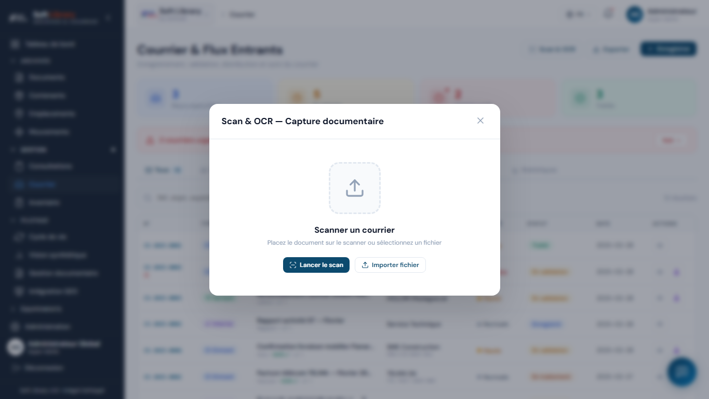

| Action ou champ | Fonction | Conditions | Conséquences |
|---|---|---|---|
| Lancer le scan | Simule ou déclenche la capture documentaire. | Équipement ou fichier disponible. | Produit des informations reconnues par OCR. |
| Importer fichier | Ajoute un fichier déjà numérisé. | Fichier disponible. | Prépare l'enregistrement du courrier. |
| Objet | Objet reconnu ou corrigé. | Texte. | Recommandé. | Devient le titre principal du courrier. |
| Expéditeur | Source du courrier entrant. | Texte. | Recommandé. | Utilisé dans la recherche. |
| Référence | Référence externe reconnue. | Texte. | Optionnel. | Sert au rapprochement. |
| Date document | Date portée sur le courrier. | Date. | Recommandé. | Sert au classement. |
| Nature | Lettre, note, rapport, facture, contrat, etc. | Liste. | Optionnel. | Facilite le filtrage. |
| Priorité | Niveau d'urgence. | Liste. | Oui. | Les urgences sont signalées. |
| Service | Service affecté. | Liste. | Oui. | Sert à la distribution. |

### 9.4 Nouveau courrier

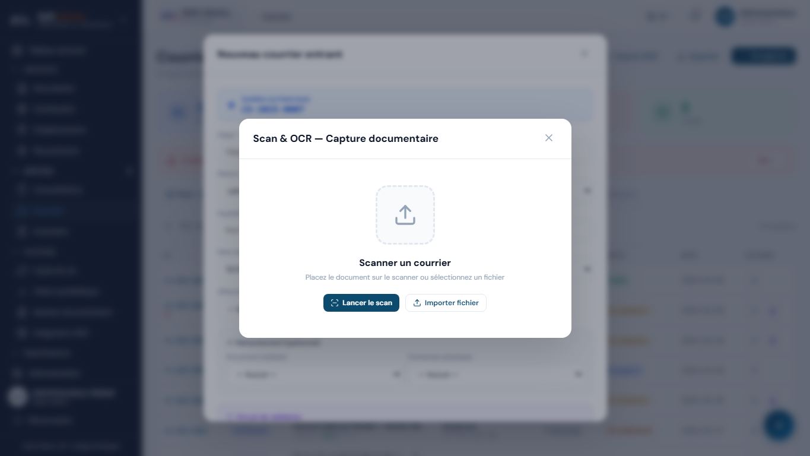

| Champ | Fonction | Format attendu | Obligatoire | Relations |
|---|---|---|---|---|
| Objet | Sujet du courrier. | Texte. | Oui. | Affiché dans la liste et les rapports. |
| Nature | Type de courrier. | Liste. | Optionnel. | Sert au classement. |
| Priorité | Normale, haute, urgente. | Liste. | Oui. | Les courriers urgents sont mis en alerte. |
| Expéditeur | Source du courrier entrant. | Texte. | Oui pour entrant. | Remplacé par destinataire pour sortant ou interne. |
| Destinataire | Personne ou organisation destinataire. | Texte. | Oui pour sortant/interne. | Sert à la distribution. |
| Référence externe | Référence du correspondant. | Texte. | Optionnel. | Utile pour rapprochement. |
| Date document | Date du courrier. | Date. | Oui. | Sert à l'ordre chronologique. |
| Service affecté | Service responsable du traitement. | Liste. | Recommandé. | Alimente distribution et suivi. |
| Affecté à | Agent responsable. | Liste utilisateur. | Optionnel. | Personne chargée du traitement. |
| Confidentiel | Restreint l'accès. | Case à cocher. | Optionnel. | Peut renforcer le circuit de validation. |
| Document existant | Rattache le courrier à une fiche documentaire. | Liste documents. | Optionnel. | Crée un lien avec les archives physiques. |
| Contenant physique | Rattache le courrier à un contenant ouvert. | Liste contenants. | Optionnel. | Organise le classement physique. |
| Niveaux de validation | Aucun, 1 ou 2 niveaux. | Liste. | Optionnel. | Fait apparaître les champs de visa ou signature. |
| Type N1/N2 | Visa ou signature. | Liste. | Obligatoire si niveau concerné. | Détermine le libellé de l'action à effectuer. |
| Valideur N1/N2 | Utilisateur chargé de valider. | Liste. | Obligatoire si niveau concerné. | Contrôle le passage au statut visé ou signé. |

Actions conditionnelles :

| Bouton | Actif quand | Conséquences |
|---|---|---|
| Viser / Signer | Courrier en validation et niveau en attente. | Enregistre la décision et passe au niveau suivant ou au statut visé/signé. |
| Distribuer | Courrier visé ou signé. | Passe au statut Distribué. |
| Marquer traité | Courrier distribué ou en traitement. | Passe au statut Traité. |
| Archiver | Courrier traité. | Classe le courrier comme Archivé. |
| Rejeter | Validation refusée. | Passe au statut Rejeté. |

Relation importante : un courrier peut devenir une archive physique ou être rattaché à une archive existante. Si un contenant est sélectionné, il doit être cohérent avec le classement et rester disponible pour ajout.

## 10. Inventaire physique

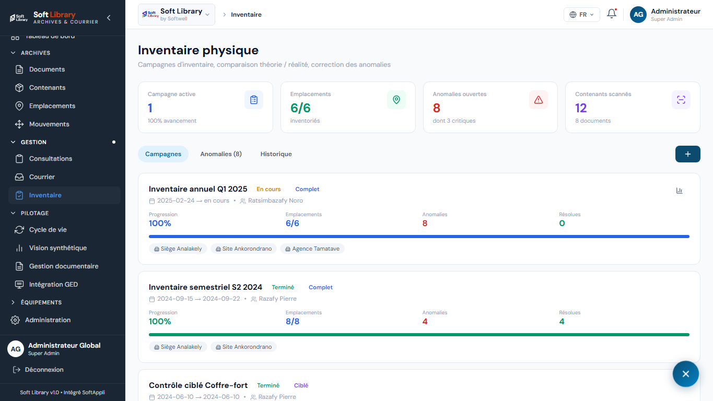

### 10.1 Objectif et utilisateurs

L'écran Inventaire physique sert à comparer ce qui est attendu dans SoftLibrary avec ce qui est réellement trouvé sur le terrain. Il gère les campagnes, anomalies, corrections et rapports d'écarts.

### 10.2 Campagnes

| Élément | Fonction | Interprétation |
|---|---|---|
| Campagne active | Inventaire en cours. | Montre l'avancement global. |
| Emplacements traités | Zones déjà contrôlées. | Sert à suivre le terrain. |
| Anomalies ouvertes | Écarts non résolus. | À traiter en priorité, surtout les critiques. |
| Contenants scannés | Volume contrôlé. | Indique la couverture de l'inventaire. |

### 10.3 Anomalies

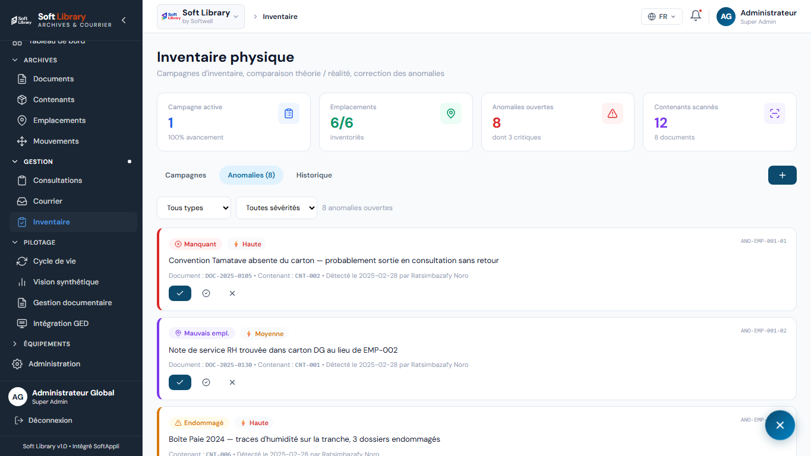

| Type d'anomalie | Signification | Action attendue |
|---|---|---|
| Manquant | Document ou contenant attendu mais non trouvé. | Vérifier consultation, déplacement ou perte. |
| Mauvais emplacement | Élément trouvé dans une mauvaise zone. | Corriger l'emplacement ou déplacer physiquement. |
| Endommagé | État matériel non conforme. | Signaler, protéger ou remplacer le contenant. |
| Excédentaire | Élément trouvé mais non attendu. | Créer, rattacher ou régulariser. |

Actions :

| Bouton | Rôle | Conditions | Conséquences |
|---|---|---|---|
| Corriger | Résout l'écart par une correction. | Anomalie ouverte. | Passe l'anomalie en corrigée. |
| Accepter | Accepte l'écart comme situation validée. | Anomalie ouverte. | Marque l'anomalie comme acceptée. |
| Ignorer | Ne traite pas l'écart. | Anomalie ouverte. | Marque l'anomalie comme ignorée. |
| Rapport | Génère un rapport d'écarts. | Campagne avec anomalies. | Documente les résultats. |

Relation importante : les anomalies sont souvent liées aux consultations non retournées, aux mouvements non enregistrés ou aux contenants déplacés. L'inventaire sert donc aussi à contrôler la qualité des opérations quotidiennes.

## 11. Cycle de vie documentaire

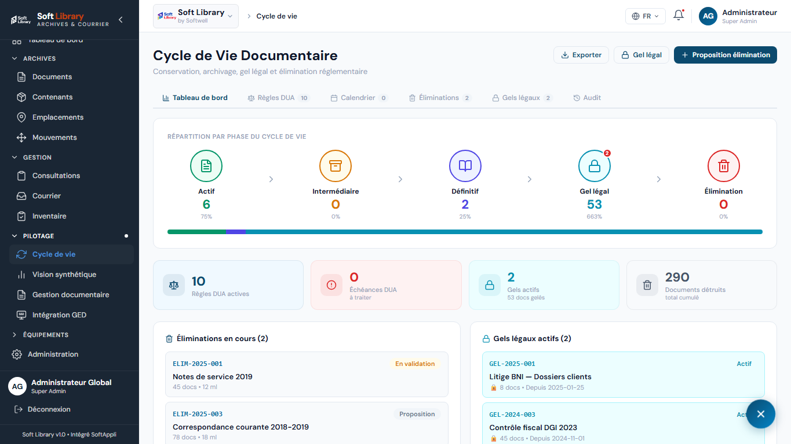

### 11.1 Objectif et utilisateurs

L'écran Cycle de Vie Documentaire pilote les règles de conservation, les échéances, l'archivage, les gels légaux et les éliminations réglementaires.

Il est utilisé par les gestionnaires d'archives, responsables juridiques, DAF, auditeurs et administrateurs fonctionnels.

### 11.2 Tableau de bord du cycle de vie

| Zone | Signification | Relation |
|---|---|---|
| Phase actif | Documents encore utilisés régulièrement. | Correspond aux documents disponibles, consultés ou en traitement. |
| Phase intermédiaire | Documents conservés mais moins utilisés. | Dépend du statut et de la DUA. |
| Phase définitive | Documents à conserver durablement. | Dépend du sort final du type documentaire. |
| Gel légal | Documents bloqués pour raison juridique. | Bloque destruction ou transfert risqué. |
| Élimination | Documents proposés ou détruits. | Suit le workflow d'autorisation. |

### 11.3 Règles DUA

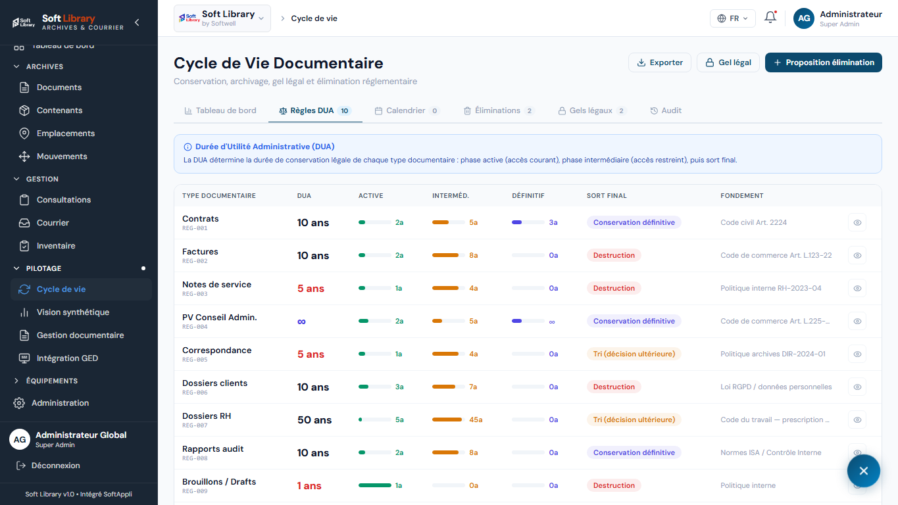

| Champ | Fonction | Format attendu | Obligatoire | Relations |
|---|---|---|---|---|
| Type documentaire | Type auquel s'applique la règle. | Référentiel. | Oui. | Relié au formulaire document et à l'administration. |
| DUA | Durée d'utilité administrative. | Nombre d'années. | Oui. | Calcule les échéances. |
| Phase active | Durée d'utilisation courante. | Nombre d'années. | Oui. | Détermine la phase active. |
| Phase intermédiaire | Durée d'archivage intermédiaire. | Nombre d'années. | Oui. | Prépare l'archivage. |
| Phase définitive | Durée de conservation finale. | Nombre d'années. | Selon sort final. | Utilisée en conservation définitive. |
| Sort final | Conservation, destruction ou tri. | Liste. | Oui. | Déclenche proposition d'élimination ou conservation. |
| Fondement juridique | Base réglementaire. | Texte. | Recommandé. | Justifie la règle en audit. |
| Actif | Indique si la règle est applicable. | Case à cocher. | Oui. | Une règle inactive ne pilote pas les échéances. |

### 11.4 Calendrier, éliminations et gels

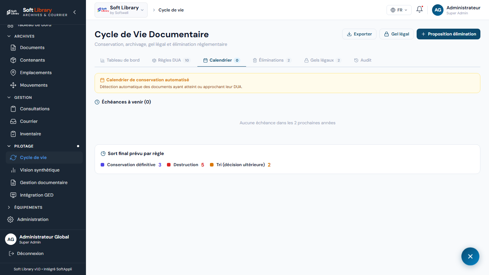

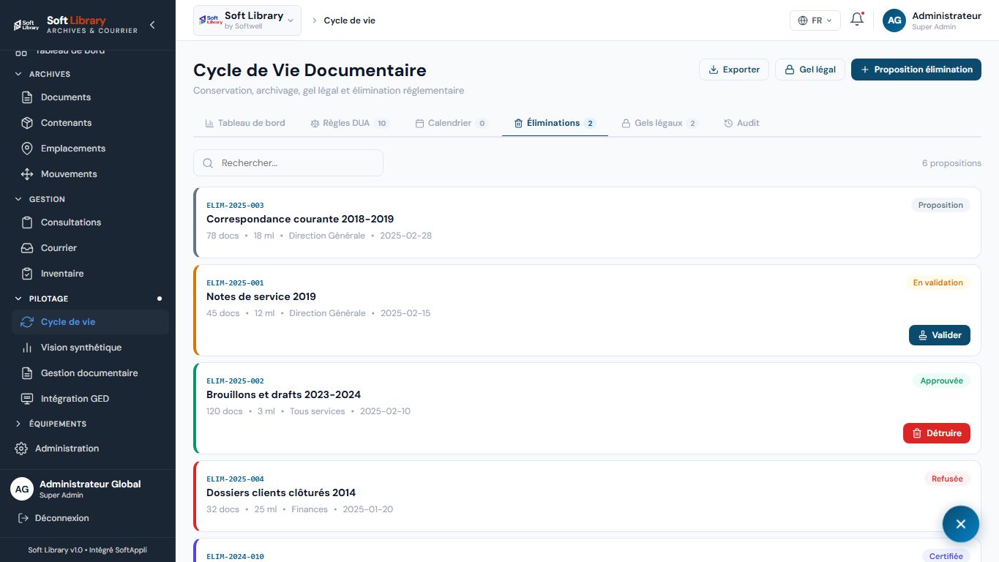

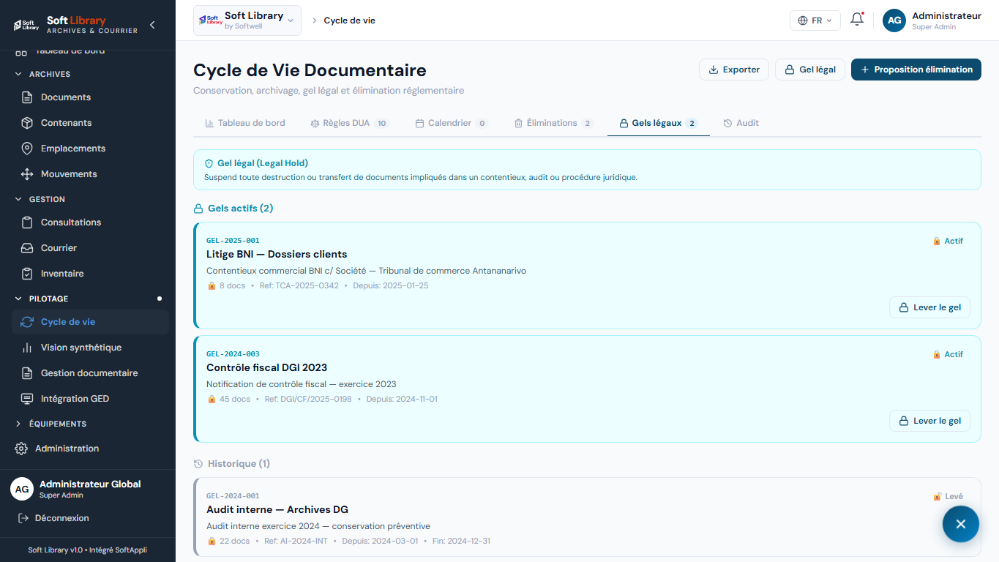

| Écran | Fonction | Relation |
|---|---|---|
| Calendrier | Affiche les documents proches de leur échéance. | Dépend de la date du document et du type documentaire. |
| Éliminations | Suit les propositions de destruction. | Dépend des règles DUA et du workflow d'autorisation. |
| Gels légaux | Bloque certains documents pour raison juridique. | Empêche une élimination ou un transfert risqué tant que le gel est actif. |
| Audit | Conserve les actions de validation, destruction et certification. | Sert aux contrôles réglementaires. |

### 11.5 Proposition d'élimination

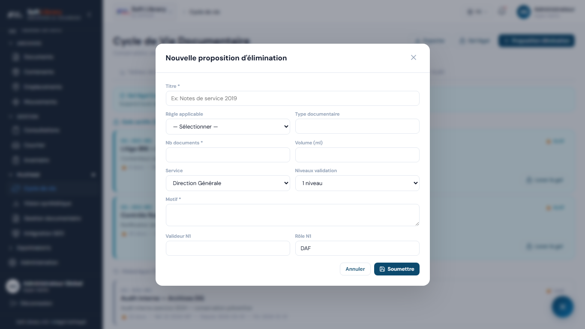

| Champ | Fonction | Format attendu | Obligatoire | Relations |
|---|---|---|---|---|
| Titre | Nom de la proposition. | Texte. | Oui. | Apparaît dans la liste des éliminations. |
| Règle applicable | Règle DUA utilisée. | Liste. | Optionnel mais recommandé. | Remplit ou confirme le type documentaire. |
| Type documentaire | Famille concernée. | Texte ou valeur issue de la règle. | Recommandé. | Relie la proposition aux documents. |
| Nombre de documents | Volume à éliminer. | Nombre. | Oui. | Sert au bordereau. |
| Volume | Métrage ou volume physique. | Nombre. | Optionnel. | Sert au rapport et au certificat. |
| Service | Service concerné. | Liste. | Oui. | Identifie le périmètre. |
| Niveaux validation | Aucun, 1 ou 2 niveaux. | Liste. | Oui. | Fait apparaître les valideurs. |
| Motif | Justification de l'élimination. | Texte long. | Oui. | Obligatoire pour audit. |
| Valideur N1/N2 | Décideurs. | Texte ou utilisateur. | Selon niveau. | Contrôle l'approbation. |

Actions conditionnelles :

| Bouton | Actif quand | Conséquences |
|---|---|---|
| Soumettre | Champs obligatoires remplis. | Crée la proposition ou l'envoie en validation. |
| Valider | Élimination en validation. | Approuve ou refuse le niveau courant. |
| Exécuter | Élimination approuvée. | Déclare la destruction physique. |
| Certifier | Destruction exécutée. | Émet le certificat de destruction. |
| Certificat | Certificat existant. | Affiche ou imprime la preuve. |

Relation importante : si un document est sous gel légal, il ne doit pas être inclus dans une élimination. En cas de refus pour contentieux, l'écran Gels légaux permet d'activer le blocage.

## 12. Vision synthétique

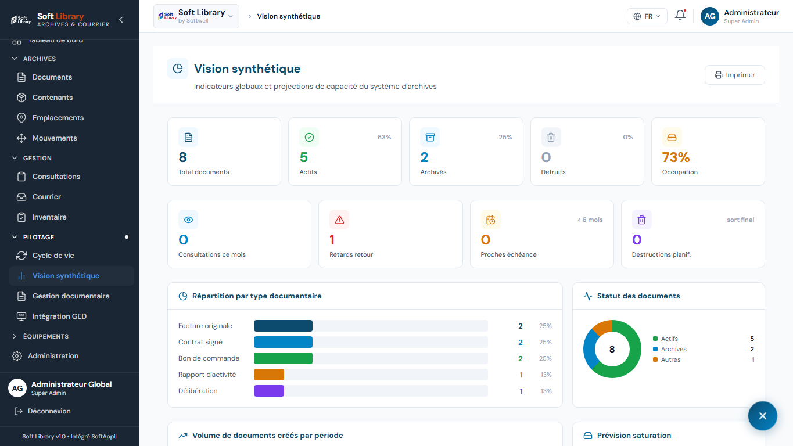

### 12.1 Objectif

La Vision synthétique regroupe les indicateurs de pilotage : total de documents, actifs, archivés, détruits, occupation, consultations du mois, retards, échéances et destructions planifiées.

### 12.2 Interprétation

| Indicateur | Signification | Action possible |
|---|---|---|
| Total documents | Volume global d'archives. | Suivre la croissance. |
| Actifs | Documents encore utilisés. | Surveiller les consultations. |
| Archivés | Documents en conservation. | Prévoir capacité. |
| Détruits | Documents éliminés. | Vérifier les certificats. |
| Occupation | Taux d'utilisation des emplacements. | Réorganiser ou créer des emplacements. |
| Retards retour | Consultations non retournées. | Relancer ou bloquer. |
| Proches échéance | Documents arrivant à échéance DUA. | Préparer archivage ou élimination. |

## 13. Gestion documentaire

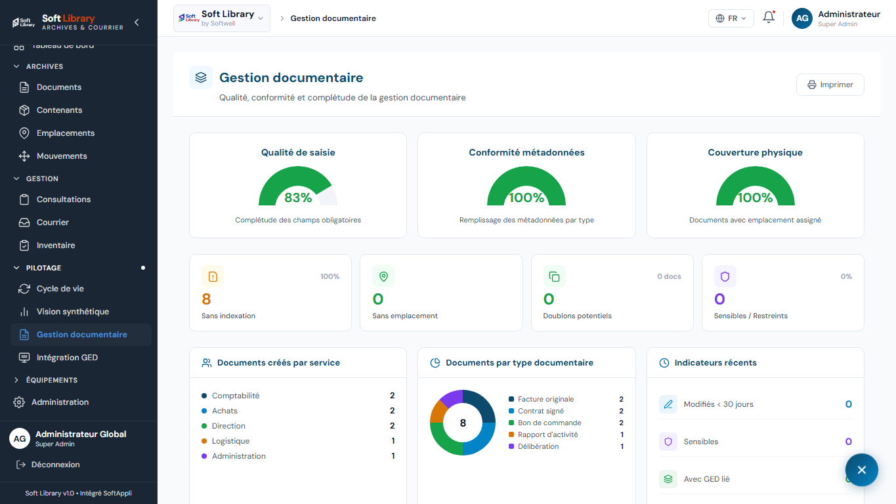

### 13.1 Objectif

Cet écran analyse la qualité des fiches : conformité des métadonnées, couverture physique, documents sans emplacement, doublons potentiels, documents sensibles et documents liés à SoftDocs.

### 13.2 Éléments d'affichage

| Zone | Signification | Relation |
|---|---|---|
| Qualité de saisie | Mesure le remplissage des champs essentiels. | Dépend des fiches Documents. |
| Conformité métadonnées | Vérifie les champs requis par type documentaire. | Dépend de l'administration des types. |
| Couverture physique | Mesure la présence d'une localisation ou d'un contenant. | Dépend des emplacements et contenants. |
| Sans indexation | Documents pauvres en mots-clés ou métadonnées. | À compléter dans la fiche document. |
| Sans emplacement | Documents non localisés. | À affecter dans Documents ou Mouvements. |
| Doublons potentiels | Documents pouvant représenter la même archive. | À contrôler avant consolidation. |
| Avec GED lié | Documents physiques rattachés à SoftDocs. | Dépend de l'écran Intégration GED. |

## 14. Intégration GED SoftDocs

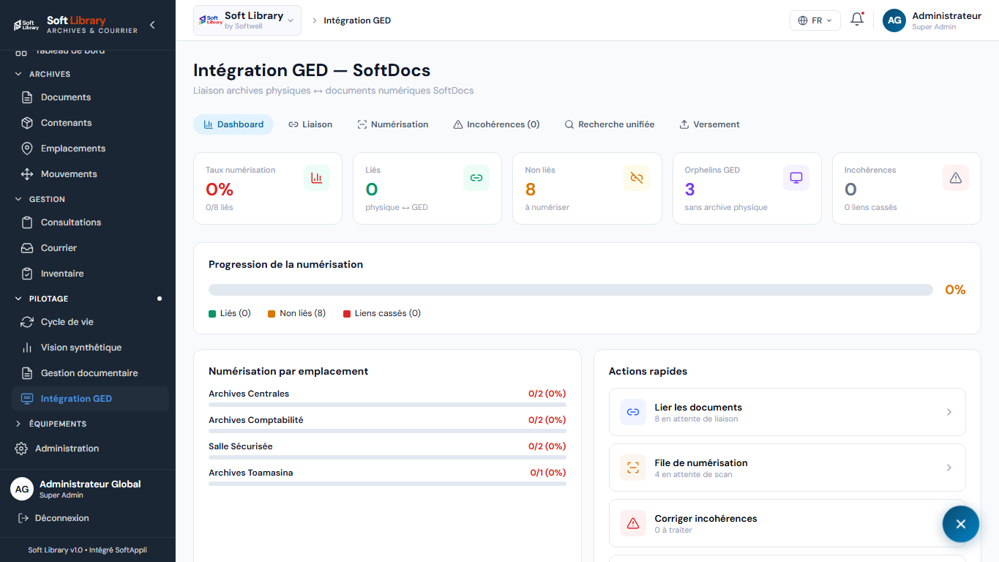

### 14.1 Objectif et utilisateurs

L'écran Intégration GED relie les archives physiques SoftLibrary aux documents numériques SoftDocs. Il permet de voir le taux de numérisation, les documents non liés, les orphelins GED, les incohérences et les files de numérisation.

Il est utilisé par les gestionnaires d'archives, équipes numérisation et administrateurs GED.

### 14.2 Dashboard

| Indicateur | Signification | Relation |
|---|---|---|
| Taux numérisation | Part des documents physiques ayant un lien SoftDocs. | Dépend du champ Lien numérique ou des liaisons manuelles. |
| Liés | Documents physiques avec document GED correspondant. | Visible dans la fiche document et la liaison. |
| Non liés | Archives physiques sans équivalent numérique. | Alimentent la file de numérisation. |
| Orphelins GED | Documents SoftDocs sans archive physique liée. | À rapprocher ou confirmer comme numérique seul. |
| Incohérences | Liens cassés ou divergences de titre/service. | À corriger dans l'onglet Incohérences. |

### 14.3 Liaison

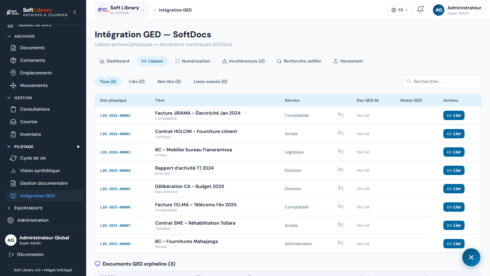

| Action | Rôle | Conditions | Conséquences |
|---|---|---|---|
| Lier | Associe un document physique à un document SoftDocs. | Document physique non lié et document GED disponible. | Le lien apparaît dans Documents et les rapports. |
| Changer | Remplace un lien existant. | Document déjà lié. | Corrige une association erronée. |
| Délier | Supprime le lien. | Document lié. | Le document redevient non lié. |
| Re-lier | Répare un lien cassé. | Lien vers un document GED absent ou incohérent. | Rétablit la cohérence physique-numérique. |

Relation importante : le champ **Lien numérique SoftDocs** dans le formulaire Document et l'écran **Liaison** poursuivent le même objectif. Une liaison manuelle dans Intégration GED peut remplacer ou corriger un lien saisi dans la fiche.

### 14.4 Numérisation, incohérences, recherche et versement

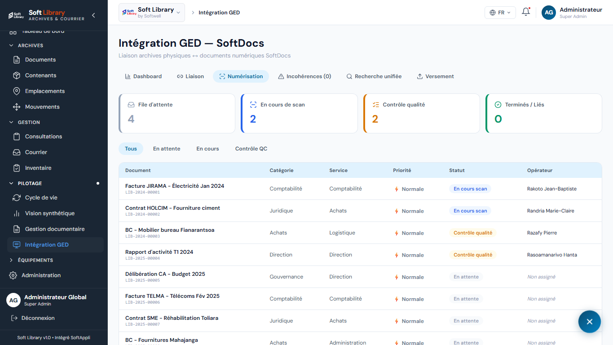

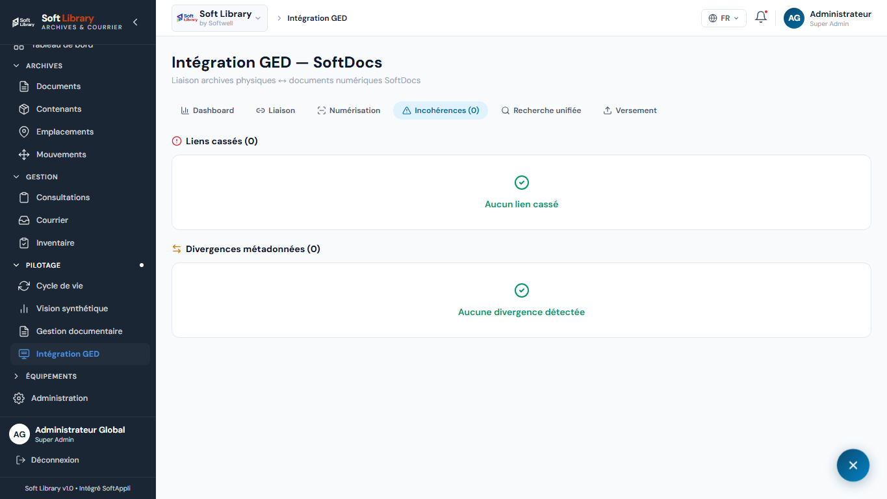

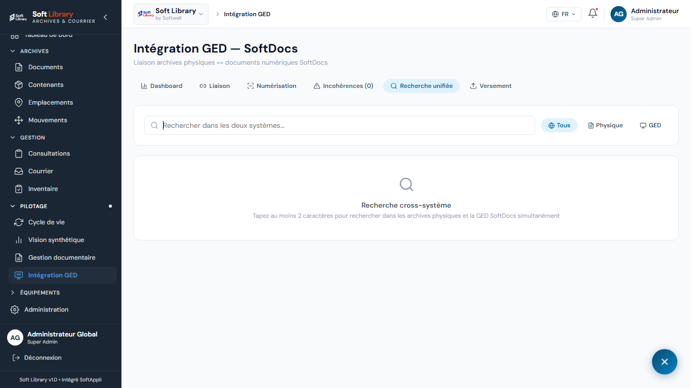

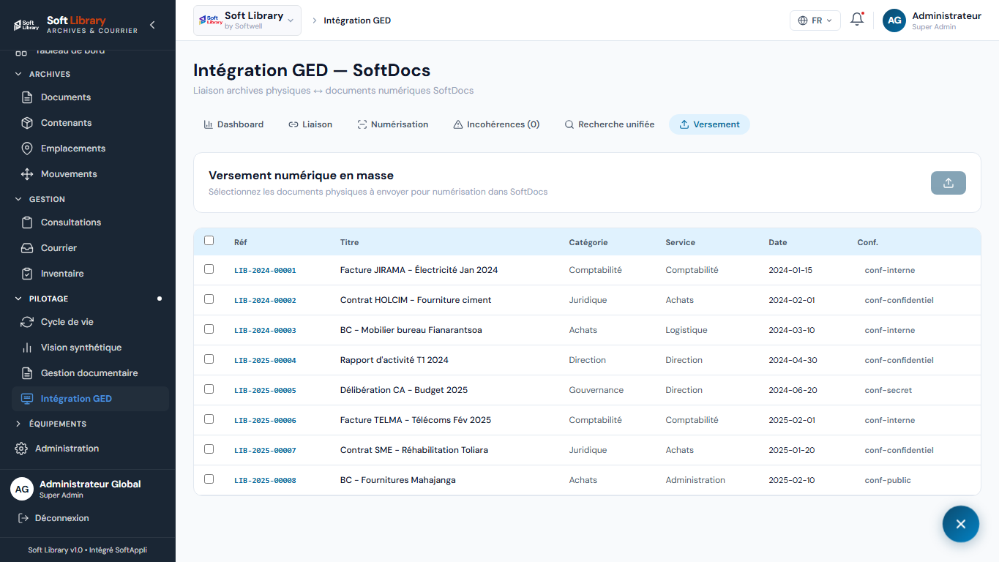

| Onglet | Fonction | Interaction |
|---|---|---|
| Numérisation | Suit les documents physiques à scanner. | Priorités, statut de file, opérateur. |
| Incohérences | Liste les liens cassés et divergences. | Re-lier, supprimer le lien, synchroniser. |
| Recherche unifiée | Recherche dans SoftLibrary et SoftDocs. | Saisie d'un terme commun. |
| Versement | Prépare l'envoi groupé de documents numérisés vers SoftDocs. | Sélection, création de bordereau, confirmation. |

## 15. Équipements MFP

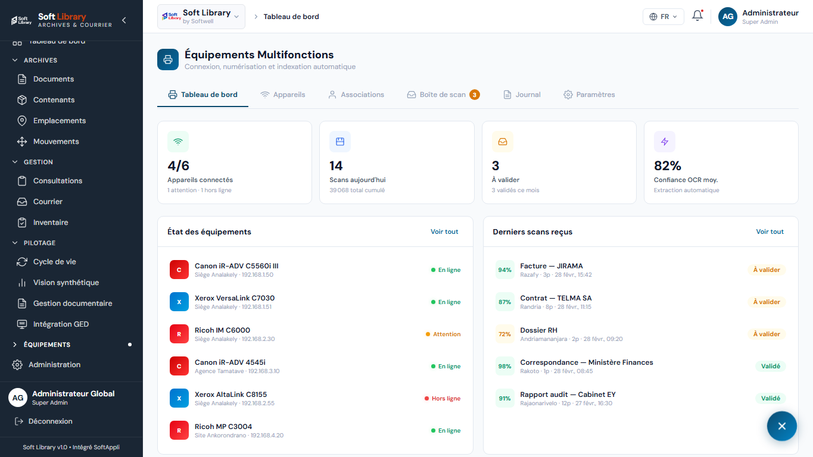

### 15.1 Objectif et utilisateurs

L'écran Équipements MFP connecte SoftLibrary aux copieurs/scanners réseau. Il suit les appareils, utilisateurs associés, scans reçus, journaux machine et paramètres de réception.

Il est utilisé par les gestionnaires d'archives, agents de numérisation et administrateurs.

### 15.2 Appareils et état

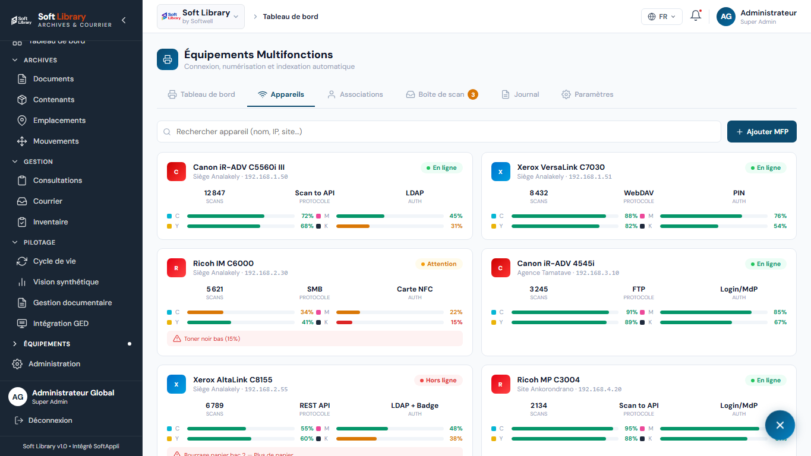

| Élément | Fonction | Interprétation |
|---|---|---|
| Appareil | Nom, marque, modèle et localisation. | Identifie le scanner. |
| Adresse IP ou DNS | Adresse réseau. | Sert à la connexion. |
| Protocole | Scan to API, WebDAV, SMB, FTP ou REST. | Détermine la méthode d'envoi des scans. |
| Statut | En ligne, attention, hors ligne. | Conditionne la réception de scans. |
| Toner et papier | Niveau des consommables. | Les niveaux faibles appellent une action terrain. |
| Dernier contact | Dernière communication avec SoftLibrary. | Aide au diagnostic. |

### 15.3 Boîte de scan, journal et paramètres

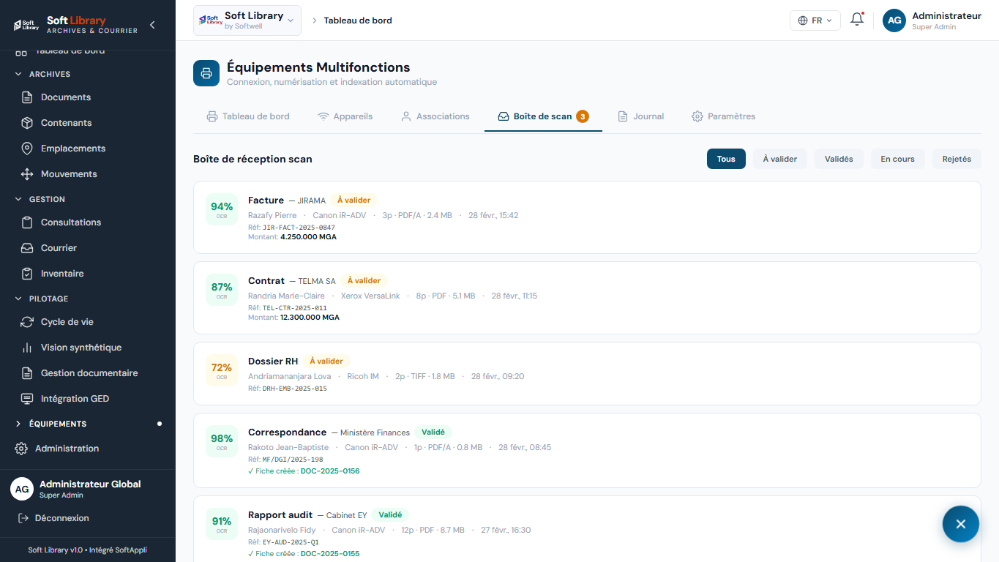

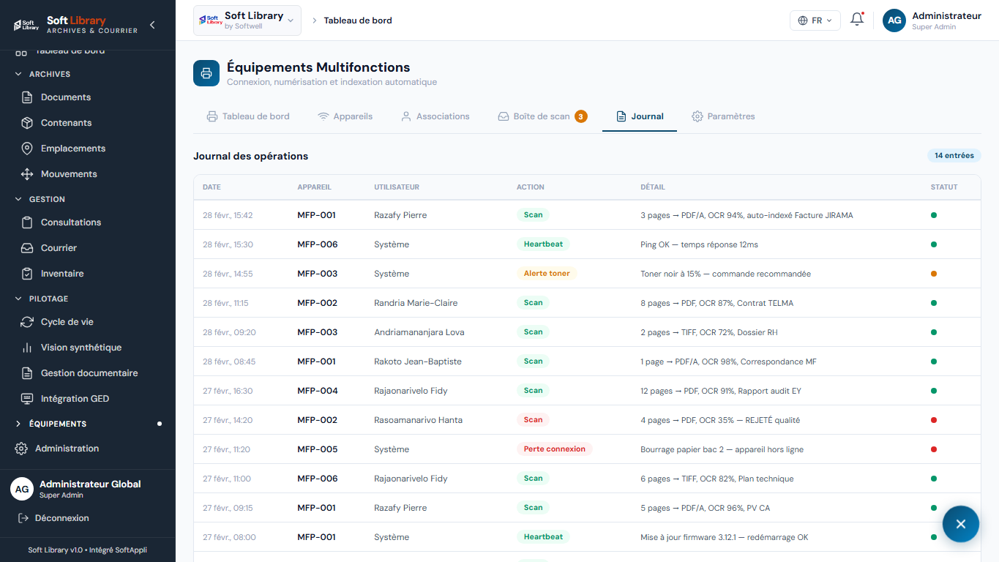

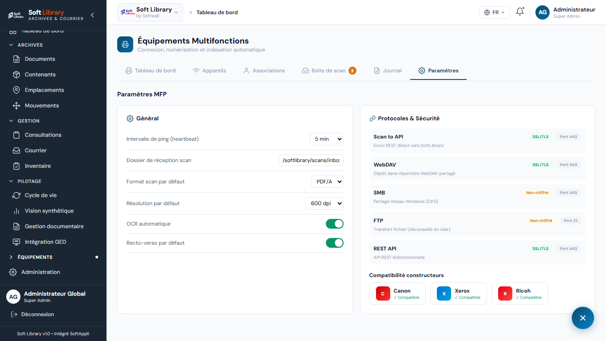

| Onglet | Fonction | Interaction |
|---|---|---|
| Associations | Relie un utilisateur SoftLibrary à un compte copieur. | Permet d'identifier l'auteur du scan. |
| Boîte de scan | Liste les scans reçus. | Valider, rejeter ou créer une fiche documentaire. |
| Journal | Historique des opérations machine. | Suivre les scans, alertes et erreurs. |
| Paramètres | Configure le dossier de réception et les protocoles. | Réservé aux administrateurs. |

Relation importante : un scan validé peut créer ou compléter une fiche Document. Les métadonnées OCR proposées doivent être relues avant validation, car elles influencent la recherche, la DUA et les rapports.

## 16. Administration

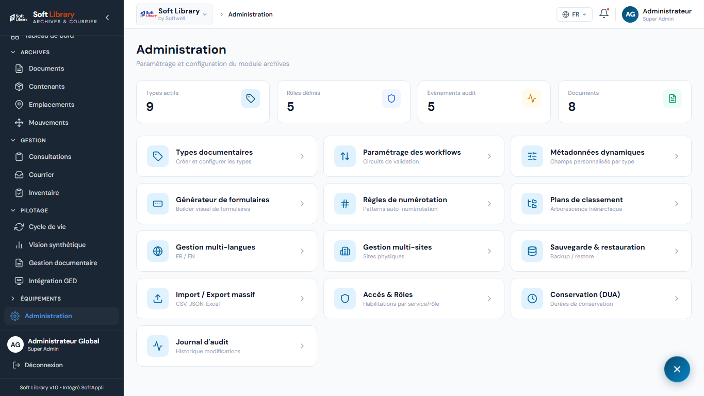

### 16.1 Objectif et utilisateurs

L'administration regroupe les paramètres qui pilotent le comportement de SoftLibrary. Elle est destinée aux administrateurs fonctionnels et responsables du référentiel.

Les modifications dans cet écran ont des conséquences directes sur les formulaires, les validations, les durées de conservation, les droits et les rapports.

### 16.2 Types documentaires

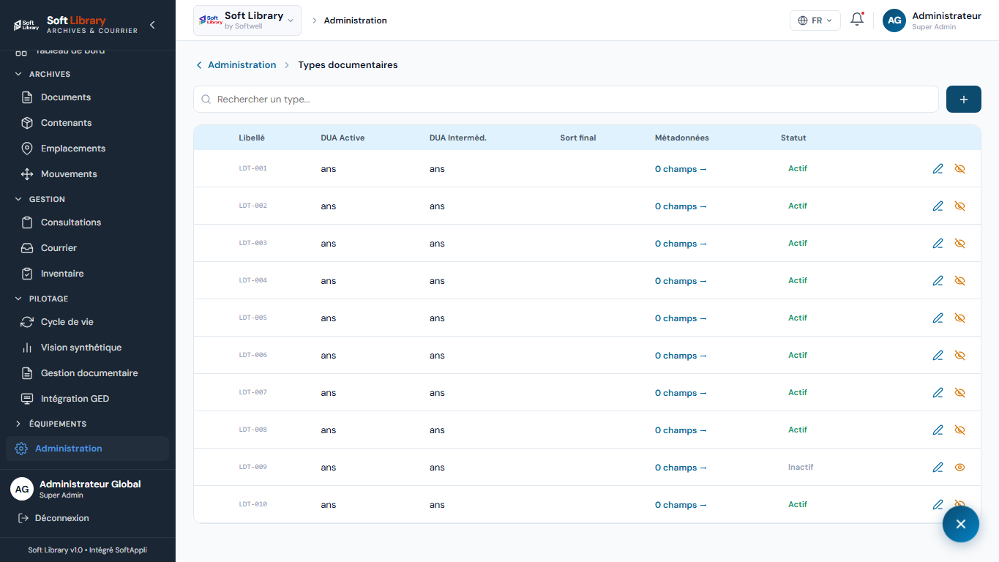

| Champ | Fonction | Format attendu | Obligatoire | Relations |
|---|---|---|---|---|
| Libellé | Nom du type documentaire. | Texte. | Oui. | Apparaît dans le formulaire document. |
| Icône | Repère visuel. | Symbole ou texte court. | Optionnel. | Aide à reconnaître le type. |
| DUA active | Durée de phase active. | Nombre d'années. | Oui. | Alimente le cycle de vie. |
| DUA intermédiaire | Durée de conservation intermédiaire. | Nombre d'années. | Oui. | Alimente le cycle de vie. |
| Sort final | Conservation, destruction ou tri. | Liste. | Oui. | Détermine la fin du cycle de vie. |
| Métadonnées | Champs spécifiques au type. | Liste de champs. | Optionnel. | S'affichent dans le formulaire document. |
| Statut actif | Rend le type utilisable ou non. | Actif/Inactif. | Oui. | Un type inactif ne doit plus être proposé. |

Relation importante : si un champ de métadonnées est marqué requis, il devient obligatoire dans le formulaire Document lorsque ce type documentaire est choisi.

### 16.3 Workflows

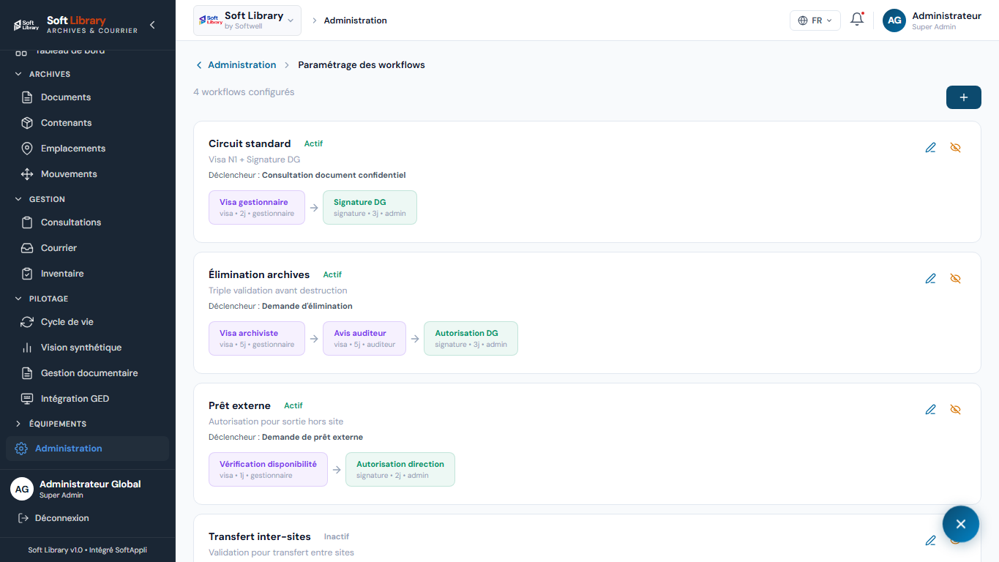

| Champ | Fonction | Format attendu | Obligatoire | Relations |
|---|---|---|---|---|
| Nom | Nom du circuit. | Texte. | Oui. | Identifie le workflow. |
| Déclencheur | Situation qui active le circuit. | Texte fonctionnel. | Recommandé. | Exemple : prêt externe, élimination, courrier confidentiel. |
| Description | Détail du circuit. | Texte. | Optionnel. | Aide les administrateurs. |
| Étapes | Visa, signature, validation ou notification. | Liste ordonnée. | Selon workflow. | Détermine les boutons visibles aux validateurs. |
| Rôle | Rôle chargé de l'étape. | Liste. | Oui pour chaque étape. | Conditionne qui peut agir. |
| Délai | Temps attendu pour l'étape. | Nombre de jours. | Optionnel. | Peut alimenter alertes et relances. |
| Actif | Active ou désactive le workflow. | Bouton état. | Oui. | Un workflow inactif ne doit pas être appliqué. |

Relation importante : les boutons **Approuver**, **Refuser**, **Viser**, **Signer** ou **Exécuter** dans les écrans opérationnels ne sont cohérents que si le workflow associé prévoit l'étape correspondante. Par exemple, une élimination avec deux niveaux de validation ne pourra être exécutée qu'après l'approbation des niveaux attendus.

### 16.4 Conservation DUA

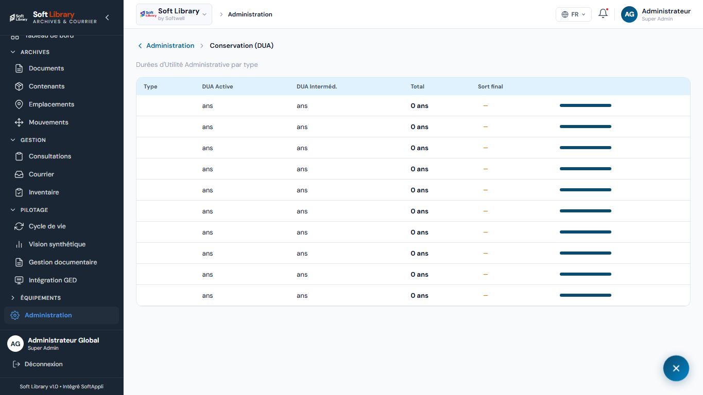

Cet écran paramètre les durées et règles de conservation. Il recoupe le Cycle de vie documentaire mais sert au réglage fonctionnel du référentiel.

| Paramètre | Effet |
|---|---|
| DUA par type | Calcule les échéances dans le calendrier. |
| Sort final | Détermine conservation, destruction ou tri. |
| Statut actif | Indique si la règle s'applique. |
| Fondement juridique | Justifie les décisions en audit. |

## 17. Parcours utilisateur complets

### 17.1 Enregistrer une archive physique liée à SoftDocs

1. Ouvrir **Documents physiques**.
2. Cliquer sur **Nouveau document**.
3. Renseigner titre, type documentaire, service, date du document et confidentialité.
4. Choisir un emplacement ou un contenant ouvert.
5. Saisir le lien numérique SoftDocs si le document existe déjà dans la GED.
6. Compléter les métadonnées dynamiques proposées par le type documentaire.
7. Enregistrer.
8. Contrôler la liaison dans **Intégration GED**.

Résultat : le document apparaît dans SoftLibrary, il est localisable physiquement et peut être retrouvé avec son équivalent numérique.

### 17.2 Classer un lot de documents dans un contenant

1. Créer ou ouvrir un contenant dans **Contenants**.
2. Vérifier son statut : il doit rester ouvert pour recevoir des documents.
3. Associer les documents au contenant.
4. Vérifier la capacité et le taux de remplissage.
5. Fermer ou sceller le contenant lorsque le classement est terminé.
6. Imprimer l'étiquette ou le QR.

Résultat : les documents sont regroupés physiquement et l'inventaire peut contrôler le contenant.

### 17.3 Consulter puis retourner un document

1. Ouvrir **Consultations**.
2. Créer une nouvelle demande en choisissant le document, le motif, le type de prêt, la priorité et la date retour.
3. Renseigner les validateurs si un workflow est nécessaire.
4. Le valideur approuve ou refuse.
5. Si la demande est approuvée, l'agent enregistre la sortie.
6. Au retour, l'agent scanne ou saisit la référence et enregistre le retour.

Résultat : le document est tracé pendant toute sa sortie et les retards sont détectés.

### 17.4 Traiter un courrier entrant

1. Ouvrir **Courrier**.
2. Utiliser **Scan & OCR** ou **Enregistrer > Courrier entrant**.
3. Vérifier l'objet, l'expéditeur, la date, la nature, la priorité et le service affecté.
4. Rattacher si besoin à un document ou un contenant.
5. Définir un circuit de visa ou signature si nécessaire.
6. Distribuer le courrier après validation.
7. Marquer traité puis archiver.

Résultat : le courrier est suivi, rattaché à son dossier et classé.

### 17.5 Réaliser un inventaire

1. Ouvrir **Inventaire physique**.
2. Lancer une campagne complète ou ciblée.
3. Contrôler les emplacements avec les scans de contenants/documents.
4. Examiner les anomalies : manquants, mauvais emplacements, endommagés, excédentaires.
5. Corriger, accepter ou ignorer chaque anomalie.
6. Générer le rapport d'écarts.

Résultat : les écarts entre le système et le terrain sont tracés et résolus.

### 17.6 Gérer une élimination réglementaire

1. Vérifier la règle DUA dans **Cycle de vie** ou **Administration**.
2. Ouvrir **Cycle de vie > Éliminations**.
3. Créer une proposition d'élimination.
4. Renseigner le motif, le nombre de documents, le service et les validateurs.
5. Obtenir les validations requises.
6. Exécuter l'élimination physique.
7. Certifier la destruction.

Résultat : la destruction est autorisée, tracée et justifiée par certificat.

### 17.7 Numériser et rapprocher une archive

1. Scanner le document depuis un MFP ou l'ajouter à la file de numérisation.
2. Valider les métadonnées OCR.
3. Créer ou retrouver le document SoftDocs.
4. Ouvrir **Intégration GED > Liaison**.
5. Lier le document physique au document numérique.
6. Corriger les incohérences de titre ou service si nécessaire.

Résultat : l'utilisateur peut retrouver le document depuis la trace physique ou numérique.

## 18. Bonnes pratiques pour les utilisateurs finaux

- Toujours renseigner le type documentaire et la date du document, car ils alimentent le cycle de vie.
- Choisir un contenant ouvert pour les nouveaux classements.
- Enregistrer chaque sortie et chaque retour de consultation pour éviter les retards fictifs.
- Utiliser le scan QR ou code-barres lors des mouvements et inventaires.
- Ne jamais éliminer un document sous gel légal.
- Vérifier les métadonnées OCR avant de valider un scan.
- Corriger les documents sans emplacement ou sans indexation dans Gestion documentaire.
- Garder les workflows actifs et cohérents avec les circuits réels de validation.

