# Manuel utilisateur SoftPaiement

## 1. Présentation générale du module

SoftPaiement, affiché dans la maquette sous le nom **Soft E-paiement**, est le module utilisé pour suivre les liquidations, préparer les ordres de paiement, initier un paiement mobile, générer des fichiers bancaires XML et consulter les états de pilotage.

Le module intervient après la validation documentaire et financière. Un document validé dans SoftDocs peut devenir une liquidation, la liquidation peut ensuite être clôturée, puis récupérée dans la liste des paiements. Les paramètres de nature de remise, de balises XML et de mappage bancaire permettent de préparer les fichiers de paiement attendus par les banques.

Les utilisateurs principaux sont les gestionnaires financiers, les comptables, les validateurs de liquidation, les responsables financiers, les administrateurs fonctionnels et les utilisateurs de consultation.

| Rôle utilisateur | Utilisation principale | Écrans concernés |
| --- | --- | --- |
| Gestionnaire financier | Créer, compléter et clôturer les liquidations, récupérer les documents SoftDocs, préparer les paiements | Liquidations, Liste des paiements |
| Comptable | Saisir les imputations, contrôler les montants, synchroniser avec TOMPRO | Liquidations, États liquidations |
| Responsable financier | Suivre les paiements, vérifier les montants et les statuts, consulter les états | Tableau de bord, États & Rapports |
| Administrateur SoftPaiement | Paramétrer les natures de remise, les balises XML, les banques et les droits utilisateurs | Paramétrage, Utilisateurs |
| Utilisateur consultation | Consulter les tableaux de bord et rapports sans modifier les données | Tableau de bord, États & Rapports |

## 2. Repères fonctionnels et enchaînement global

Le parcours standard est le suivant :

1. Un document est validé dans SoftDocs et peut porter le statut **BON À PAYER**.
2. Le gestionnaire récupère ce document dans l'écran **Liquidations**, ou saisit une liquidation manuellement.
3. La liquidation est complétée avec ses informations de facture, ses imputations et ses pièces justificatives.
4. La liquidation est synchronisée avec TOMPRO si nécessaire, puis clôturée.
5. Une liquidation clôturée peut être récupérée dans la **Liste des paiements**.
6. Un paiement peut être initié depuis la liste, à condition de sélectionner un seul paiement éligible.
7. Les documents bons à payer peuvent aussi être utilisés pour générer un fichier bancaire XML.
8. Les rapports permettent de suivre l'avancement, les montants, les paiements, les fournisseurs et les sites.

Les relations importantes à retenir :

- L'écran **Récupérer depuis SoftDocs** ne propose que les documents validés et bons à payer qui ne sont pas encore transformés en liquidation.
- L'écran **Liste des paiements** ne récupère que les liquidations clôturées ou déjà payées, et non encore importées dans les paiements.
- Le bouton **Payer** n'est utilisable que si un seul paiement est sélectionné et si ce paiement n'est ni annulé ni déjà payé.
- La génération de fichier bancaire dépend du choix du schéma XML, de la nature de remise, des balises XML et du mappage banque-compte débiteur.
- Les droits définis dans **Utilisateurs Soft E-paiement** conditionnent l'accès aux fonctions de liquidation, paiement, génération XML et paramétrage.

## 3. Navigation SoftPaiement

La barre latérale gauche permet d'accéder aux familles d'écrans :

| Menu | Fonction | Relation avec les autres écrans |
| --- | --- | --- |
| Tableau de bord EP | Vue de synthèse des liquidations et paiements | Reflète les liquidations et paiements créés ailleurs |
| Liquidations | Création, récupération, import et clôture des liquidations | Alimente la liste des paiements après clôture |
| Paiements | Liste des paiements et génération de fichier banque | Reçoit les liquidations clôturées et les documents bons à payer |
| Paramétrage | Nature de remise, balises XML et mappage bancaire | Conditionne la génération des fichiers bancaires |
| États & Rapports | Tableaux de bord détaillés | Exploite les liquidations et paiements existants |
| Utilisateurs | Gestion des accès SoftPaiement | Définit qui peut faire quelle action |

Le bouton **Changer d'application** ramène au portail d'applications SoftAppli. Il est utilisé lorsqu'un utilisateur souhaite passer à SoftDocs, SoftLibrary ou SoftSign.

## 4. Tableau de bord SoftPaiement

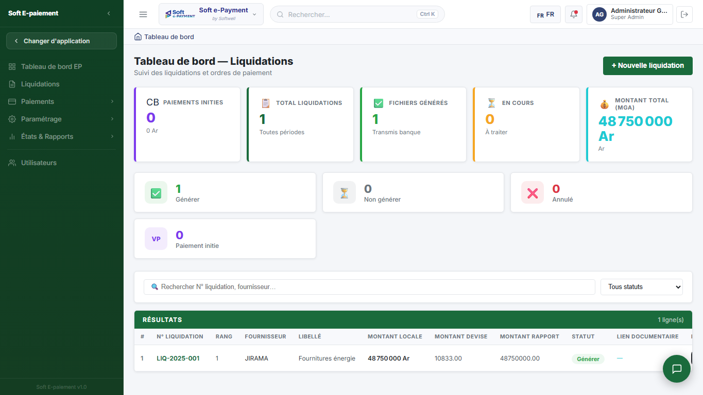

### Présentation de l'écran

Le tableau de bord présente une vue rapide de l'activité : nombre de paiements initiés, total des liquidations, fichiers générés, liquidations en cours et montant total. Il est utilisé en début de journée ou lors d'un suivi d'activité par les responsables financiers, gestionnaires et utilisateurs de consultation.

### Zones et indicateurs

| Zone | Fonction | Format et interprétation | Relation avec les autres écrans |
| --- | --- | --- | --- |
| Paiements initiés | Indique les paiements lancés depuis la liste des paiements | Nombre de paiements | Se met à jour après une confirmation de paiement |
| Total liquidations | Nombre total de liquidations suivies dans SoftPaiement | Nombre | Provient de l'écran Liquidations |
| Fichiers générés | Nombre de transmissions ou générations réalisées | Nombre | Dépend des synchronisations et générations |
| En cours | Liquidations qui ne sont pas finalisées | Nombre | Diminue lorsque les liquidations sont clôturées, payées ou annulées |
| Montant total | Somme des montants suivis | Montant en Ariary | Calculé à partir des liquidations disponibles |
| Répartition par statut | Synthèse des liquidations générées, non générées, annulées ou initiées | Badges colorés | Aide à prioriser les traitements |
| Tableau des résultats | Liste des liquidations visibles | Colonnes : numéro, rang, fournisseur, libellé, montants, statut, lien documentaire | Permet d'identifier les dossiers à ouvrir ou à traiter |

### Champs et filtres

| Champ | Fonction | Format attendu | Obligatoire et relations |
| --- | --- | --- | --- |
| Recherche | Filtrer par numéro de liquidation, fournisseur ou libellé | Texte libre | Optionnel. Réduit la liste affichée sans modifier les données |
| Tous statuts | Filtrer selon le statut de liquidation ou de paiement | Liste de choix | Optionnel. Les valeurs suivent les statuts existants dans les liquidations |

### Boutons et actions

| Bouton | Rôle | Conditions d'utilisation | Conséquence |
| --- | --- | --- | --- |
| Nouvelle liquidation | Accéder à l'écran Liquidations pour créer une nouvelle liquidation | Toujours disponible pour un utilisateur autorisé | Ouvre l'écran Liquidations en mode création |
| Effacer | Réinitialiser les filtres de recherche et de statut | Actif lorsqu'un filtre est saisi | Affiche à nouveau toute la liste |
| Détails | Consulter les informations de la ligne concernée | Disponible sur chaque ligne | Oriente l'utilisateur vers le suivi détaillé de la liquidation |

## 5. Liquidations - Liste

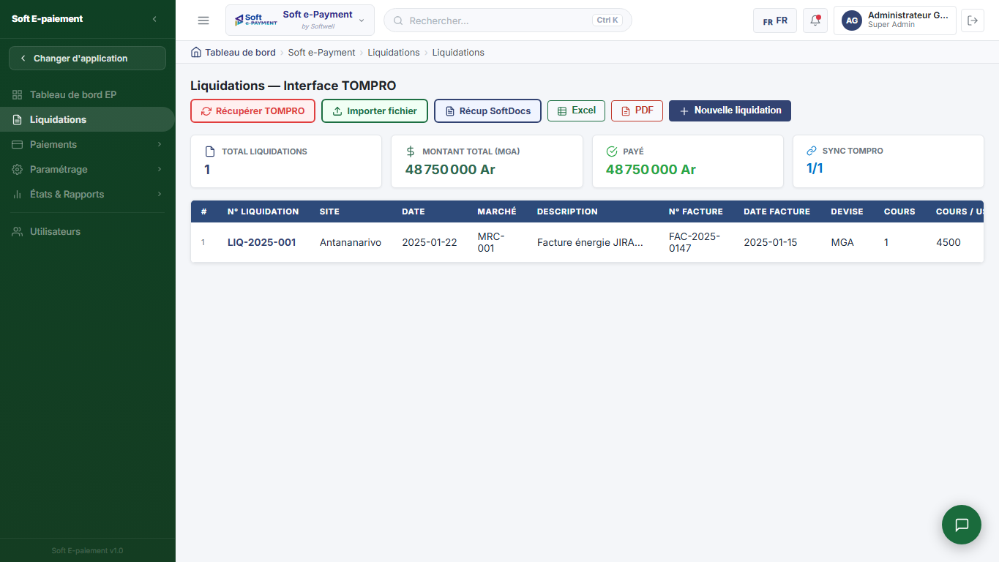

### Présentation de l'écran

L'écran **Liquidations - Interface TOMPRO** est le point d'entrée pour créer, importer, récupérer et suivre les liquidations. Il est principalement utilisé par les gestionnaires financiers et comptables.

### Éléments d'affichage

| Élément | Signification | Interaction |
| --- | --- | --- |
| Cartes de synthèse | Nombre de liquidations, montant total, éléments payés, éléments synchronisés TOMPRO | Lecture directe pour suivre l'activité |
| Tableau des liquidations | Liste des liquidations avec site, date, marché, facture, devise et statut | Cliquer sur une ligne permet d'ouvrir ou modifier la liquidation |
| Colonne Actions | Regroupe les actions disponibles sur chaque liquidation | Permet d'intervenir sur le dossier sélectionné |

### Champs du tableau

| Champ | Fonction | Format attendu | Relation |
| --- | --- | --- | --- |
| N° Liquidation | Identifiant de la liquidation | Texte ou numéro | Sert de référence dans les paiements et rapports |
| Site | Site ou implantation concernée | Liste de sites | Utilisé dans les rapports par site |
| Date | Date de création ou de traitement | Date | Sert aux filtres et suivis chronologiques |
| Marché | Référence du marché ou contrat | Texte | Complète l'identification métier |
| Description | Objet ou résumé de la liquidation | Texte | Repris dans les rapports |
| N° Facture | Numéro de facture fournisseur | Texte | Peut être rempli automatiquement depuis un document SoftDocs |
| Date Facture | Date de la facture | Date | Peut être reprise depuis SoftDocs |
| Devise | Devise de référence | Liste : MGA, USD, EUR, GBP, CHF | Conditionne l'affichage des montants |
| Cours et cours USD | Taux de conversion | Nombre | Utilisé pour les montants en devise et en rapport |
| Date service fait | Date du service fait | Date | Sert au contrôle de conformité |

### Boutons et actions

| Bouton | Rôle | Conditions d'utilisation | Conséquence |
| --- | --- | --- | --- |
| Récupérer TOMPRO | Lancer une synchronisation depuis TOMPRO | Utilisateur autorisé, période choisie dans la fenêtre | Récupère ou met à jour des liquidations TOMPRO |
| Importer fichier | Importer un fichier de liquidations | Un fichier Excel ou CSV doit être sélectionné | Ajoute les liquidations du fichier après import |
| Récup SoftDocs | Récupérer des documents SoftDocs bons à payer | Des documents SoftDocs éligibles doivent exister | Crée des liquidations à partir des documents sélectionnés |
| Export | Exporter les informations visibles | Liste disponible | Produit un fichier de suivi selon le format proposé |
| Nouvelle liquidation | Ouvrir le formulaire de création | Toujours disponible pour un utilisateur autorisé | Affiche le formulaire de liquidation |

## 6. Liquidation - Formulaire de création ou modification

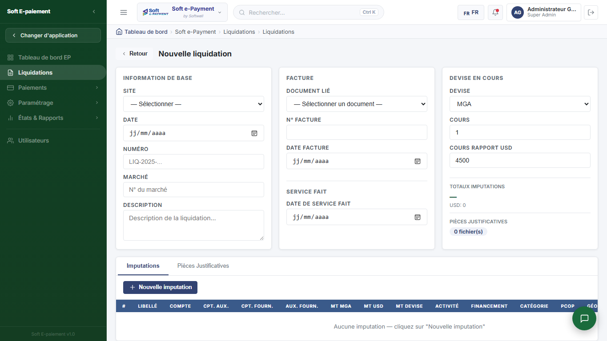

### Présentation de l'écran

Le formulaire permet de saisir toutes les informations nécessaires à la création ou à la mise à jour d'une liquidation. Il est utilisé lorsqu'une liquidation est créée manuellement, récupérée depuis SoftDocs ou modifiée avant clôture.

### Champs principaux

| Champ | Fonction | Format attendu | Obligatoire et relations |
| --- | --- | --- | --- |
| Site | Indique le site concerné par la liquidation | Liste de sites | Obligatoire pour un suivi fiable par site |
| Date | Date de la liquidation | Date | Obligatoire pour le suivi chronologique |
| Numéro | Numéro de liquidation | Texte ou numéro | Obligatoire pour retrouver la liquidation dans les paiements |
| Marché | Référence du marché ou contrat | Texte | Optionnel selon le processus interne |
| Description | Objet de la liquidation | Texte long | Recommandé pour faciliter les contrôles |
| Document lié | Document SoftDocs associé | Liste des documents validés et bons à payer | Optionnel en saisie manuelle. Si choisi, certains champs facture sont remplis automatiquement |
| N° Facture | Référence de la facture | Texte | Peut être rempli automatiquement depuis le document lié |
| Date facture | Date de la facture | Date | Peut être remplie automatiquement depuis le document lié |
| Service fait | Date de service fait | Date | Recommandée pour justifier le paiement |
| Devise | Devise de la liquidation | Liste de devises | Obligatoire pour interpréter les montants |
| Cours | Taux de conversion principal | Nombre | Obligatoire si la devise n'est pas directement utilisée en Ariary |
| Cours Rapport USD | Taux utilisé pour les rapports en USD | Nombre | Recommandé pour les états consolidés |

### Onglet Imputations

L'onglet **Imputations** décrit la ventilation comptable de la liquidation. Chaque ligne représente une imputation.

| Champ d'imputation | Fonction | Format attendu | Obligatoire et relations |
| --- | --- | --- | --- |
| Libellé | Description de la ligne comptable | Texte | Recommandé pour comprendre la dépense |
| Compte | Compte comptable principal | Code ou texte | Obligatoire pour une liquidation complète |
| Compte auxiliaire | Compte complémentaire | Code ou texte | Selon les règles comptables |
| Compte fournisseur | Compte lié au fournisseur | Code ou texte | À renseigner si le fournisseur est suivi comptablement |
| Auxiliaire fournisseur | Détail fournisseur | Code ou texte | Complète le compte fournisseur |
| Montant MGA | Montant en Ariary | Nombre | Sert au total de la liquidation |
| Montant USD | Montant en dollar | Nombre | Utilisé pour le rapport USD |
| Montant devise | Montant dans la devise sélectionnée | Nombre | Lié au champ Devise |
| Activité, financement, catégorie | Axes de suivi budgétaire | Texte ou code | Utilisés pour les rapports et contrôles |
| PCOP, géo, plans 6 à 8 | Axes analytiques | Texte ou code | Selon le plan de suivi de l'organisation |

### Actions du formulaire

| Bouton | Rôle | Conditions d'utilisation | Conséquence |
| --- | --- | --- | --- |
| Nouvelle imputation | Ajouter une ligne comptable | Onglet Imputations ouvert | Ajoute une ligne à compléter |
| Annuler | Quitter le formulaire sans poursuivre | Toujours disponible | Revient à la liste des liquidations |
| Ajouter liquidation | Enregistrer une nouvelle liquidation | Les informations principales doivent être renseignées | Ajoute la liquidation à la liste |
| Enregistrer liquidation | Enregistrer les modifications | Formulaire ouvert sur une liquidation existante | Met à jour la liquidation |
| Synchronisation TOMPRO | Marquer la liquidation comme synchronisée | Liquidation prête à être transmise | Renseigne le suivi TOMPRO et la date de synchronisation |
| Clôturer liquidation | Finaliser la liquidation | La liquidation doit être suffisamment complète | Rend la liquidation disponible pour récupération dans la liste des paiements |

## 7. Liquidation - Pièces justificatives

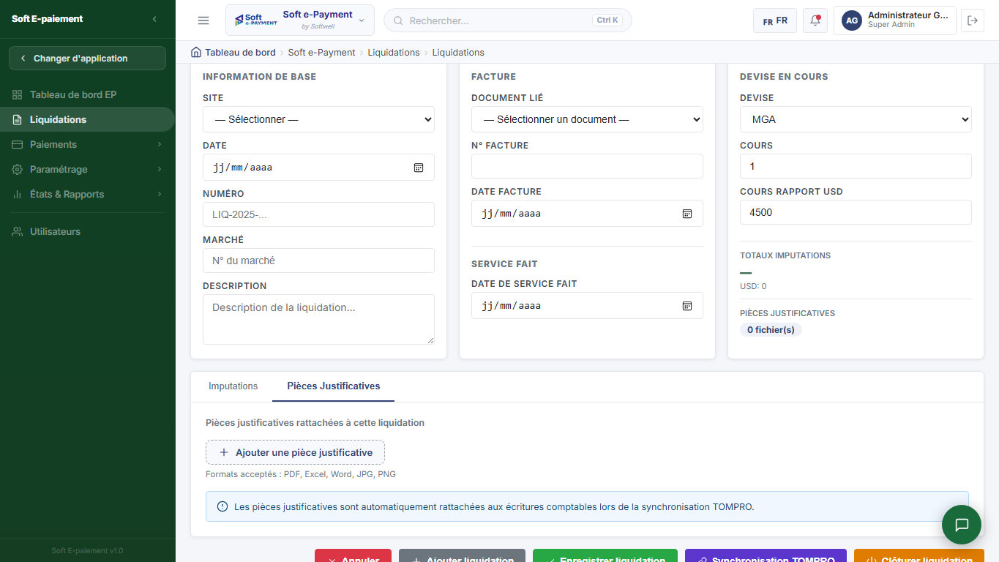

### Présentation de l'écran

L'onglet **Pièces Justificatives** permet d'associer des documents à la liquidation : facture, bon de commande, attestation de service fait, fichier de calcul ou pièce de contrôle. Il est utilisé par les gestionnaires et comptables pour constituer un dossier complet avant clôture.

### Champs et zones

| Zone | Fonction | Format attendu | Obligatoire et relations |
| --- | --- | --- | --- |
| Liste des pièces | Affiche les fichiers déjà associés | Nom de fichier | Optionnel selon le processus, mais fortement recommandé avant clôture |
| Ajouter des fichiers | Permet d'ajouter des justificatifs | PDF, Excel, Word, image | Les fichiers sont rattachés à la liquidation et peuvent accompagner le suivi TOMPRO |
| Nombre de pièces | Indique combien de justificatifs sont joints | Nombre | Se met à jour après ajout ou suppression |

### Actions

| Action | Rôle | Condition | Conséquence |
| --- | --- | --- | --- |
| Ajouter un fichier | Joindre une pièce justificative | Un fichier doit être sélectionné | La pièce apparaît dans la liste |
| Supprimer une pièce | Retirer un justificatif | Une pièce doit exister | La pièce n'est plus associée à la liquidation |
| Enregistrer liquidation | Sauvegarder les pièces ajoutées | Formulaire ouvert | Les justificatifs restent liés à la liquidation |

## 8. Récupération TOMPRO

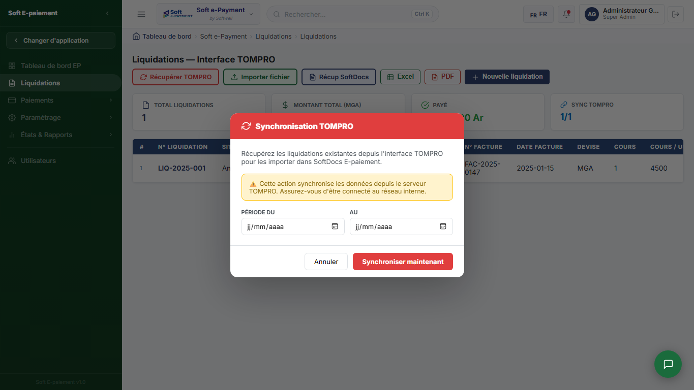

### Présentation de l'écran

La fenêtre **Synchronisation TOMPRO** sert à récupérer des liquidations ou à mettre à jour des informations issues de TOMPRO sur une période donnée. Elle est utilisée par les comptables et gestionnaires lorsque les données comptables existent déjà dans TOMPRO.

### Champs

| Champ | Fonction | Format attendu | Obligatoire et relations |
| --- | --- | --- | --- |
| Période du | Date de début de récupération | Date | Obligatoire pour lancer une synchronisation ciblée |
| Au | Date de fin de récupération | Date | Obligatoire et doit être cohérente avec la date de début |

### Actions

| Bouton | Rôle | Conditions | Conséquence |
| --- | --- | --- | --- |
| Annuler | Fermer la fenêtre | Toujours disponible | Aucune récupération n'est lancée |
| Synchroniser maintenant | Lancer la récupération | Les dates de période doivent être renseignées | Les liquidations disponibles sur la période sont récupérées ou mises à jour |

Une liquidation synchronisée TOMPRO est ensuite visible dans les listes et rapports avec l'indicateur de synchronisation.

## 9. Import de fichier de liquidations

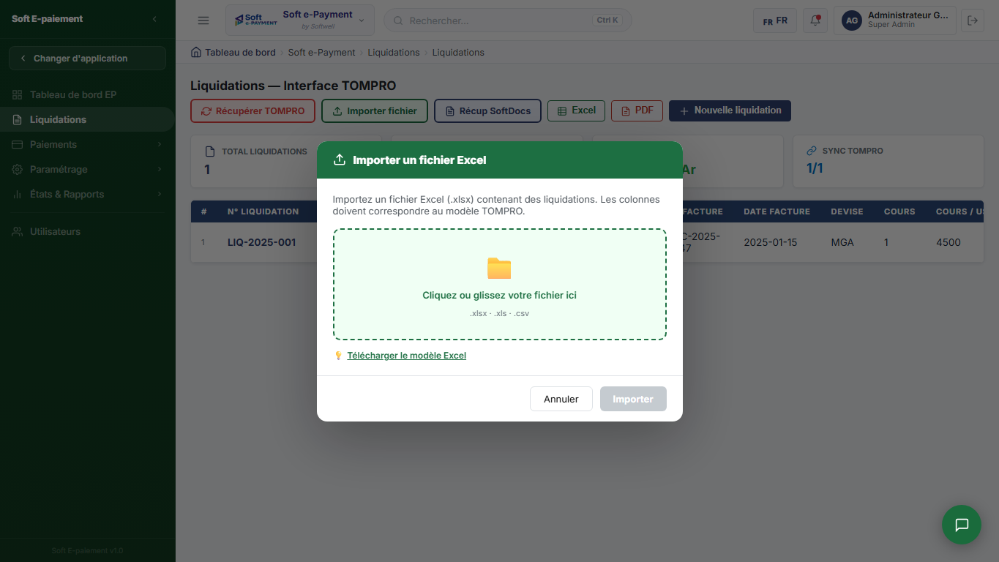

### Présentation de l'écran

L'import de fichier sert à créer ou compléter des liquidations à partir d'un fichier préparé hors du module. Il est utile lors d'une reprise de données, d'un traitement par lot ou d'un échange avec une équipe comptable.

### Champs

| Champ | Fonction | Format attendu | Obligatoire et relations |
| --- | --- | --- | --- |
| Zone de dépôt de fichier | Sélectionner ou déposer le fichier à importer | Excel ou CSV | Obligatoire pour activer l'import |
| Fichier sélectionné | Affiche le nom et la taille du fichier | Nom de fichier | Se remplit automatiquement après sélection |
| Télécharger le modèle Excel | Récupérer un modèle de fichier attendu | Lien d'action | Optionnel, recommandé pour éviter les erreurs de colonnes |

### Actions

| Bouton | Rôle | Conditions | Conséquence |
| --- | --- | --- | --- |
| Importer | Importer le fichier | Actif uniquement lorsqu'un fichier est choisi | Les lignes valides sont ajoutées aux liquidations |
| Annuler | Quitter la fenêtre | Toujours disponible | Le fichier sélectionné n'est pas importé |

Si le format est invalide, un message d'erreur indique que les colonnes doivent être vérifiées.

## 10. Récupération depuis SoftDocs

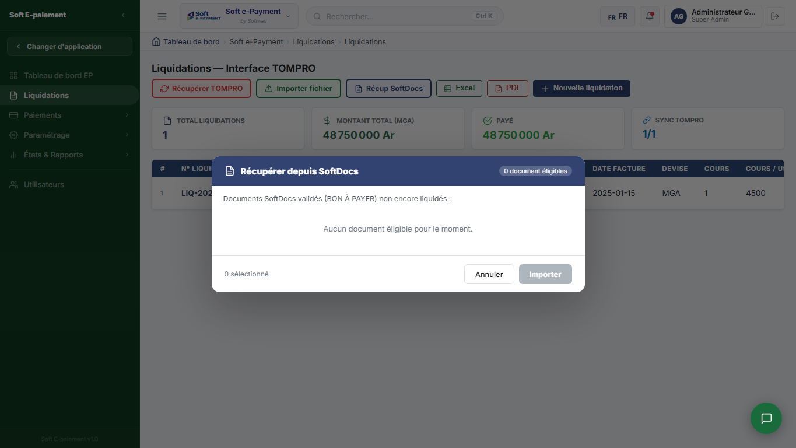

### Présentation de l'écran

Cette fenêtre crée des liquidations à partir de documents SoftDocs déjà validés et marqués **BON À PAYER**. Elle fait le lien entre la validation documentaire et le traitement financier.

### Zones et champs

| Zone | Fonction | Format attendu | Obligatoire et relations |
| --- | --- | --- | --- |
| Documents éligibles | Liste les documents SoftDocs pouvant devenir des liquidations | Liste de documents | Se remplit automatiquement depuis SoftDocs |
| Case de sélection | Choisir les documents à importer | Case à cocher | Au moins un document doit être sélectionné pour importer |
| Référence document | Identifiant du document SoftDocs | Texte | Devient la référence facture ou la source de la liquidation |
| Fournisseur, projet et montant | Résumé du document | Texte et montant | Alimente automatiquement la liquidation créée |

### Actions

| Bouton | Rôle | Conditions | Conséquence |
| --- | --- | --- | --- |
| Importer | Créer une liquidation pour les documents choisis | Au moins un document sélectionné | Ajoute les liquidations à la liste |
| Annuler | Fermer sans récupérer | Toujours disponible | Aucun document n'est transformé en liquidation |

Un document déjà récupéré ou non bon à payer n'apparaît pas dans cette fenêtre. Cette règle évite les doublons et empêche de liquider un document qui n'a pas atteint le bon niveau de validation.

## 11. Liste des paiements

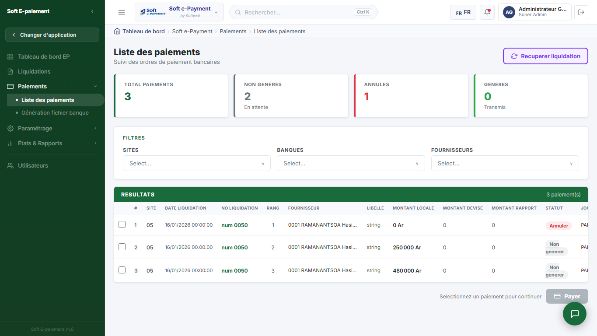

### Présentation de l'écran

La **Liste des paiements** permet de suivre les ordres de paiement bancaires ou mobiles. Elle est utilisée après la clôture des liquidations, au moment où un paiement peut être préparé ou initié.

### Champs, filtres et colonnes

| Élément | Fonction | Format attendu | Obligatoire et relations |
| --- | --- | --- | --- |
| Sites | Filtrer les paiements par site | Liste à choix multiples | Optionnel. Les sites viennent des liquidations |
| Banques | Filtrer selon la banque | Liste à choix multiples | Optionnel. Sert au contrôle des ordres bancaires |
| Fournisseurs | Filtrer selon le fournisseur | Liste à choix multiples | Optionnel. Permet un suivi fournisseur |
| Case de sélection | Sélectionner un paiement à traiter | Case à cocher | Une seule ligne doit être sélectionnée pour lancer un paiement |
| No Liquidation | Référence de la liquidation source | Texte | Relie le paiement à l'écran Liquidations |
| Statut | État du paiement | Badge coloré | Conditionne l'activation du bouton Payer |
| Journal | Journal ou canal de paiement | Texte | Mis à jour après l'initiation d'un paiement |
| Date de génération | Date de création du fichier ou de l'initiation | Date ou tiret | Se renseigne après action |
| Nom du fichier | Fichier généré ou canal utilisé | Texte | Peut indiquer le fichier bancaire ou le paiement initié |
| Notifications | Messages ou indicateurs associés | Texte ou badge | Aide au suivi opérationnel |

### Statuts de paiement

| Statut | Signification | Conséquence fonctionnelle |
| --- | --- | --- |
| Annuler | Le paiement est annulé | Le bouton Payer n'est pas utilisable |
| Non generer | Le paiement est en attente | Peut être sélectionné pour initier un paiement |
| Generer | Un fichier ou ordre a été généré | Sert au suivi bancaire |
| Paiement initie | Le paiement mobile a été lancé | Visible dans le tableau de bord et les états |
| Paye | Le paiement est terminé | Le paiement ne peut plus être relancé |

### Actions

| Bouton | Rôle | Conditions | Conséquence |
| --- | --- | --- | --- |
| Recuperer liquidation | Importer des liquidations clôturées dans la liste des paiements | Des liquidations clôturées ou payées non encore importées doivent exister | Crée des lignes de paiement |
| Payer | Ouvrir le choix d'opérateur mobile | Un seul paiement sélectionné, statut ni annulé ni payé | Ouvre la fenêtre de choix d'opérateur |
| Effacer filtres | Réinitialiser les filtres | Actif si un filtre est appliqué | Réaffiche tous les paiements |

## 12. Récupération des liquidations clôturées vers les paiements

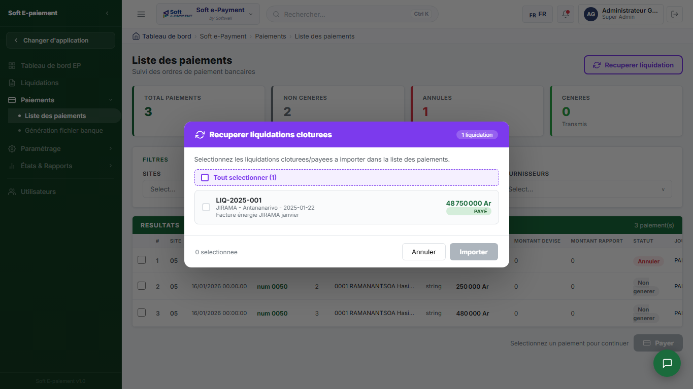

### Présentation de l'écran

Cette fenêtre récupère dans les paiements les liquidations finalisées. Elle matérialise le passage entre la clôture d'une liquidation et la préparation effective de son paiement.

### Zones

| Zone | Fonction | Format attendu | Obligatoire et relations |
| --- | --- | --- | --- |
| Liste des liquidations clôturées | Affiche les liquidations récupérables | Liste de dossiers | Se remplit depuis l'écran Liquidations |
| Case de sélection | Choisir les liquidations à importer | Case à cocher | Au moins une sélection est nécessaire |
| Tout sélectionner | Sélectionner toutes les liquidations disponibles | Action globale | Permet un traitement par lot |

### Actions

| Bouton | Rôle | Conditions | Conséquence |
| --- | --- | --- | --- |
| Importer | Créer les paiements à partir des liquidations choisies | Au moins une liquidation sélectionnée | Les paiements apparaissent dans la liste |
| Annuler | Fermer la fenêtre | Toujours disponible | Aucune ligne de paiement n'est créée |

Une liquidation non clôturée n'est pas proposée. Une liquidation déjà importée n'est pas proposée à nouveau.

## 13. Sélection d'un paiement

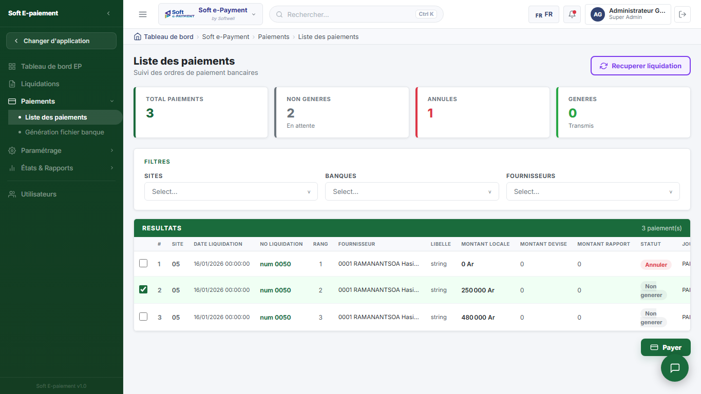

### Présentation de l'écran

Avant d'initier un paiement, l'utilisateur doit sélectionner une seule ligne éligible. Ce contrôle évite de lancer plusieurs paiements en même temps ou de relancer un paiement déjà finalisé.

### Règles d'activation du bouton Payer

| Situation | Bouton Payer | Message fonctionnel |
| --- | --- | --- |
| Aucun paiement sélectionné | Inactif | L'utilisateur doit sélectionner un paiement |
| Un paiement éligible sélectionné | Actif | Le choix d'opérateur peut être ouvert |
| Plusieurs paiements sélectionnés | Inactif | Un seul paiement peut être payé à la fois |
| Paiement annulé sélectionné | Inactif | Un paiement annulé ne peut pas être lancé |
| Paiement déjà payé sélectionné | Inactif | Un paiement payé ne peut pas être relancé |

## 14. Choix de l'opérateur de paiement

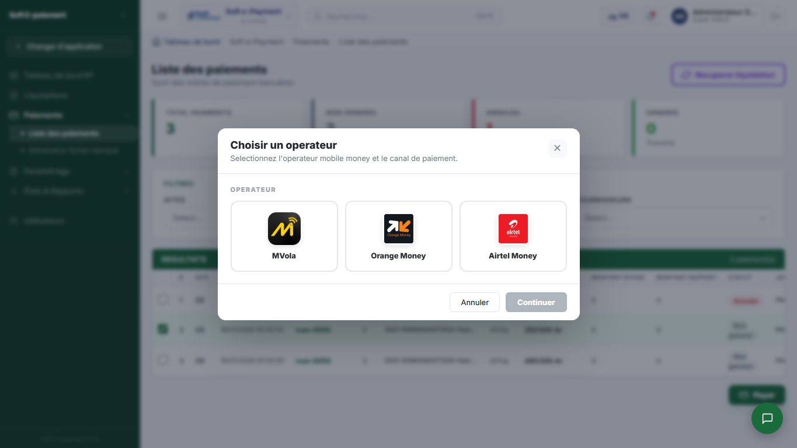

### Présentation de l'écran

Cette fenêtre permet de choisir l'opérateur mobile money et le mode de paiement. Elle s'affiche après clic sur **Payer**.

### Champs

| Champ | Fonction | Format attendu | Obligatoire et relations |
| --- | --- | --- | --- |
| Opérateur | Choisir le réseau de paiement mobile | Choix parmi MVola, Orange Money, Airtel Money | Obligatoire pour continuer |
| Mode de paiement | Choisir le canal d'exécution | Choix parmi Vanilla Pay ou FAI Direct | Obligatoire pour continuer |

### Actions

| Bouton | Rôle | Conditions | Conséquence |
| --- | --- | --- | --- |
| Continuer | Passer à la confirmation du paiement | Actif uniquement après choix d'un opérateur et d'un mode | Ouvre l'écran de confirmation |
| Annuler | Fermer la fenêtre | Toujours disponible | Retour à la liste des paiements |

Dans la maquette, le mode **Vanilla Pay** est le canal opérationnel pour poursuivre jusqu'à la confirmation. **FAI Direct** est présenté comme option de canal mais ne permet pas de finaliser l'initiation dans ce parcours de démonstration.

## 15. Confirmation du paiement

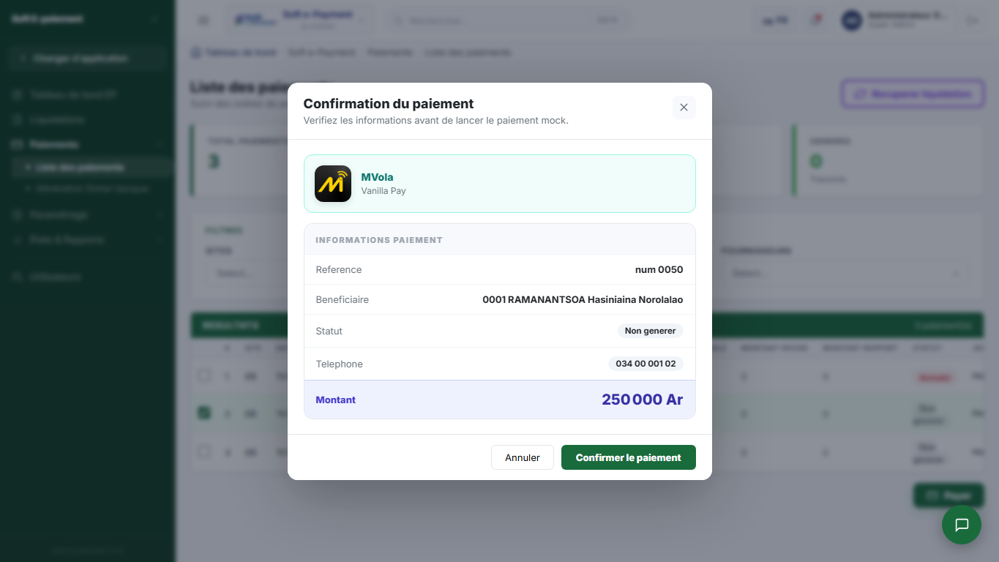

### Présentation de l'écran

La confirmation permet de vérifier les informations avant de lancer le paiement. Elle est utilisée par le gestionnaire ou responsable habilité juste avant l'initiation.

### Informations affichées

| Information | Fonction | Format | Relation |
| --- | --- | --- | --- |
| Opérateur et mode | Rappelle le choix effectué à l'étape précédente | Texte | Provient de la fenêtre de choix d'opérateur |
| Référence | Identifie la liquidation ou le paiement | Texte | Permet de rattacher le paiement au dossier source |
| Bénéficiaire | Fournisseur ou bénéficiaire du paiement | Texte | Provient de la liquidation ou du paiement |
| Statut | Statut courant avant initiation | Badge | Doit permettre l'initiation |
| Téléphone | Numéro de paiement mobile | Numéro ou texte | Utilisé pour le paiement mobile |
| Montant | Montant à payer | Montant en Ariary | Provient de la ligne sélectionnée |

### Actions

| Bouton | Rôle | Conditions | Conséquence |
| --- | --- | --- | --- |
| Confirmer le paiement | Lancer l'initiation du paiement | Les informations doivent être vérifiées | Le paiement passe au statut Paiement initie |
| Annuler | Abandonner l'initiation | Toujours disponible | Le paiement reste dans son statut précédent |

Après confirmation, la liste des paiements, le tableau de bord et l'état des paiements reflètent le paiement initié.

## 16. Génération fichier banque

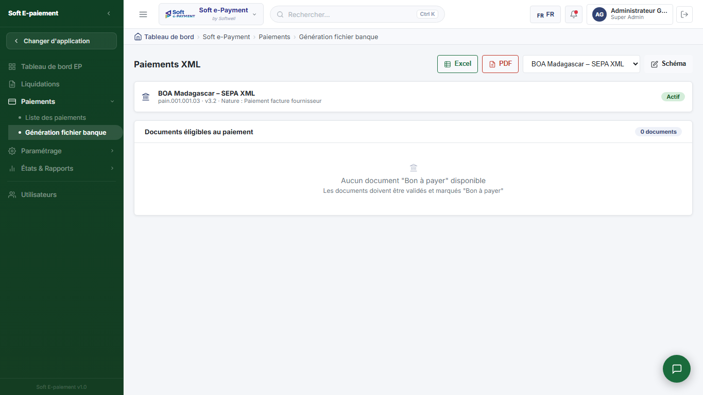

### Présentation de l'écran

L'écran **Paiements XML** sert à préparer un fichier bancaire à partir de documents bons à payer. Il est utilisé par les gestionnaires ou administrateurs autorisés à générer les fichiers à transmettre à la banque.

### Champs et zones

| Champ ou zone | Fonction | Format attendu | Obligatoire et relations |
| --- | --- | --- | --- |
| Schéma | Choisir le format bancaire à utiliser | Liste de schémas bancaires | Obligatoire pour générer un fichier cohérent |
| Informations du schéma | Affiche banque, format, version et nature | Texte | Provient du paramétrage XML |
| Documents éligibles au paiement | Liste les documents bons à payer | Tableau de documents | Se remplit depuis SoftDocs |
| Case de sélection | Choisir les documents à inclure dans le fichier | Case à cocher | Au moins un document doit être sélectionné |
| Montant total sélectionné | Somme des documents choisis | Montant | Se calcule automatiquement selon la sélection |
| IBAN ou compte bénéficiaire | Coordonnées bancaires du fournisseur | Texte bancaire | Nécessaire pour un fichier exploitable |

### Actions

| Bouton | Rôle | Conditions | Conséquence |
| --- | --- | --- | --- |
| Schéma | Ouvrir la configuration du schéma utilisé | Un schéma est sélectionné | Permet d'ajuster banque, format, endpoint et nature de remise |
| Générer XML | Préparer le fichier bancaire | Actif lorsqu'au moins un document est sélectionné | Ouvre une confirmation puis génère le fichier |
| Export | Exporter les données visibles | Liste disponible | Produit un fichier de suivi |

### Relations avec le paramétrage

La génération XML dépend directement de trois écrans de paramétrage :

- **Nature de remise** : définit les natures autorisées par projet.
- **Balise XML** : définit la structure et les valeurs attendues dans le fichier.
- **Mappage XML - Banques** : associe chaque banque à un schéma et à un compte débiteur.

Si un schéma, une nature ou un mappage est mal défini, le fichier généré peut être incomplet ou ne pas correspondre aux attentes de la banque.

## 17. Paramétrage - Nature de remise

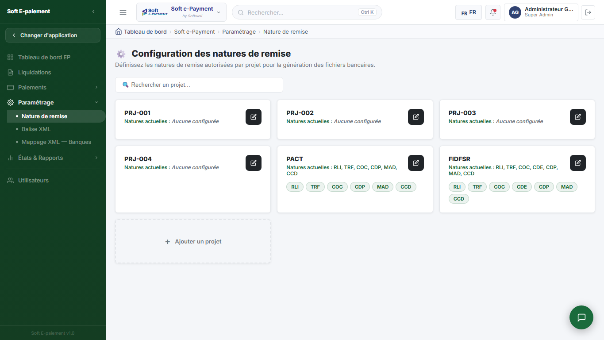

### Présentation de l'écran

L'écran **Configuration des natures de remise** définit les types de remise autorisés par projet. Il est utilisé par les administrateurs fonctionnels ou responsables du paramétrage bancaire.

### Champs et affichages

| Élément | Fonction | Format attendu | Obligatoire et relations |
| --- | --- | --- | --- |
| Recherche projet | Filtrer les projets affichés | Texte | Optionnel |
| Carte projet | Affiche un projet et ses natures de remise autorisées | Carte avec badges | Chaque projet peut avoir ses propres natures |
| Badges de nature | Codes de remise disponibles pour le projet | Codes tels que RLI, TRF, VRT, CHQ | Utilisés lors de la génération bancaire |

### Actions

| Bouton | Rôle | Conditions | Conséquence |
| --- | --- | --- | --- |
| Modifier | Ouvrir la sélection des natures pour un projet | Carte projet disponible | Affiche la fenêtre de choix |
| Ajouter un projet | Ajouter une configuration pour un projet | Projet non encore configuré | Permet de définir les natures du nouveau projet |

## 18. Fenêtre de sélection des natures de remise

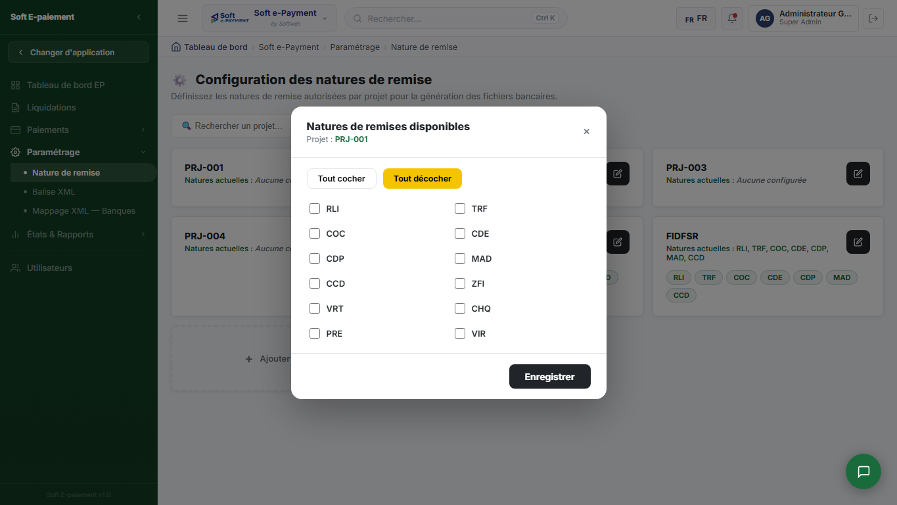

### Présentation de l'écran

La fenêtre permet de cocher les natures de remise autorisées pour un projet précis.

### Champs et actions

| Élément | Fonction | Format attendu | Obligatoire et relations |
| --- | --- | --- | --- |
| Liste des natures | Affiche les codes disponibles | Cases à cocher | Au moins une nature est recommandée pour générer des fichiers |
| Tout cocher | Sélectionner toutes les natures | Action globale | Accélère le paramétrage |
| Tout décocher | Retirer toutes les natures | Action globale | À utiliser avec prudence, car le projet peut ne plus être utilisable pour certaines générations |
| Enregistrer | Valider les choix | Bouton | Met à jour les natures disponibles pour le projet |
| Annuler | Fermer sans enregistrer | Bouton | Conserve l'ancien paramétrage |

Une nature non cochée pour un projet ne doit pas être utilisée dans les fichiers bancaires liés à ce projet.

## 19. Paramétrage - Balises XML

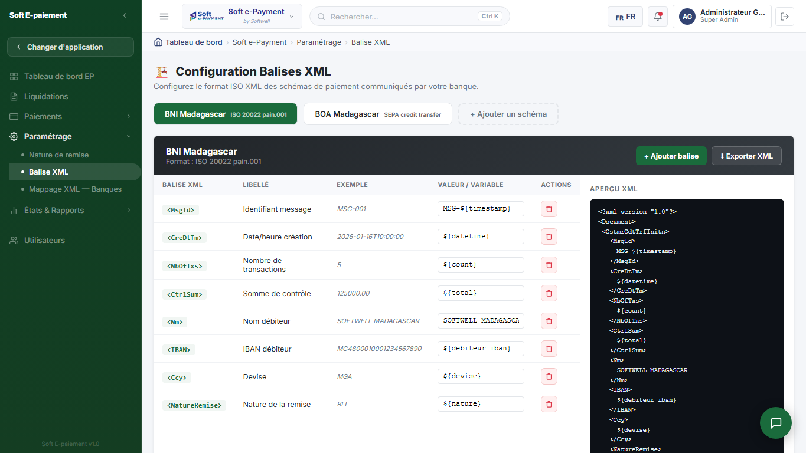

### Présentation de l'écran

L'écran **Configuration Balises XML** permet de définir la structure du fichier bancaire attendu par chaque banque. Il est utilisé par les administrateurs ou responsables du paramétrage bancaire.

### Zones et champs

| Élément | Fonction | Format attendu | Obligatoire et relations |
| --- | --- | --- | --- |
| Sélecteur de schéma | Choisir la banque ou le format XML à paramétrer | Boutons de schéma | Le schéma choisi influence la génération |
| Tableau des balises | Liste les balises attendues dans le fichier | Tableau | Chaque ligne correspond à une information du fichier bancaire |
| Balise XML | Nom de la balise dans le fichier | Texte court | Obligatoire pour construire le fichier |
| Libellé | Description lisible de la balise | Texte | Aide l'utilisateur à comprendre la balise |
| Exemple | Exemple de valeur attendue | Texte | Sert de guide de saisie |
| Valeur ou variable | Valeur fixe ou variable calculée | Texte | Peut utiliser des variables comme date, total ou nombre |
| Aperçu XML | Visualise le résultat attendu | Bloc de prévisualisation | Permet de contrôler la structure avant génération |

### Actions

| Bouton | Rôle | Conditions | Conséquence |
| --- | --- | --- | --- |
| Ajouter balise | Créer une nouvelle balise dans le schéma | Schéma ouvert | Ouvre la fenêtre de création |
| Ajouter un schéma | Créer un nouveau schéma bancaire | Utilisateur autorisé | Ajoute une configuration de banque ou format |
| Exporter XML | Exporter l'aperçu ou la configuration | Schéma disponible | Produit un fichier de référence |
| Modifier une valeur | Changer la valeur d'une balise | Ligne existante | Influence les fichiers générés ensuite |

## 20. Ajout d'une balise XML

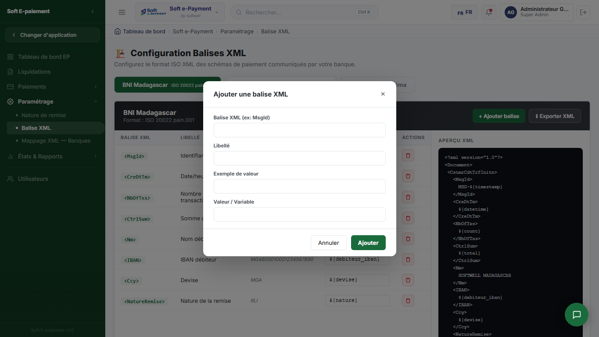

### Présentation de l'écran

Cette fenêtre ajoute une balise au schéma XML sélectionné. Elle est utilisée lorsqu'une banque demande une information supplémentaire ou lorsque le format doit être ajusté.

### Champs

| Champ | Fonction | Format attendu | Obligatoire et relations |
| --- | --- | --- | --- |
| Balise XML | Nom technique attendu par la banque | Texte court | Obligatoire |
| Libellé | Description de la balise | Texte | Obligatoire pour faciliter la lecture |
| Exemple | Valeur d'exemple | Texte | Optionnel mais recommandé |
| Valeur | Valeur fixe ou variable | Texte | Obligatoire pour alimenter la balise |

### Actions

| Bouton | Rôle | Conditions | Conséquence |
| --- | --- | --- | --- |
| Ajouter | Valider la nouvelle balise | Champs principaux renseignés | La balise est ajoutée au tableau |
| Annuler | Fermer sans créer | Toujours disponible | Le schéma reste inchangé |

## 21. Paramétrage - Mappage XML Banques

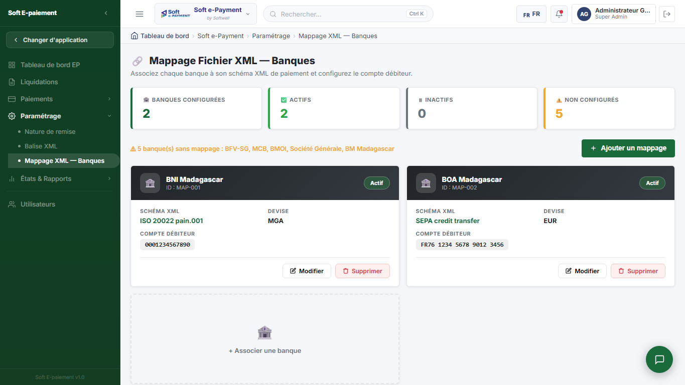

### Présentation de l'écran

L'écran **Mappage Fichier XML - Banques** associe chaque banque à un schéma XML, une devise et un compte débiteur. Il est essentiel pour produire un fichier bancaire exploitable.

### Indicateurs et zones

| Élément | Fonction | Interprétation | Relation |
| --- | --- | --- | --- |
| Banques configurées | Nombre de banques disposant d'un mappage | Plus ce nombre est élevé, plus le paramétrage est complet | Sert à la génération bancaire |
| Actifs | Mappages utilisables | Seuls les mappages actifs doivent être utilisés | Conditionne les choix disponibles |
| Inactifs | Mappages suspendus | À contrôler avant génération | Ne doivent pas être utilisés pour un paiement courant |
| Non configurés | Banques sans mappage | Signal d'alerte | Une banque non configurée peut bloquer la génération |
| Carte banque | Détail d'une banque configurée | Banque, schéma, devise, compte débiteur | Source du fichier XML |

### Actions

| Bouton | Rôle | Conditions | Conséquence |
| --- | --- | --- | --- |
| Ajouter un mappage | Créer une association banque-schématique | Utilisateur autorisé | Ouvre la fenêtre de saisie |
| Modifier | Mettre à jour un mappage existant | Mappage disponible | Modifie la banque, le schéma, le compte ou la devise |
| Supprimer | Retirer un mappage | Mappage disponible | La banque n'est plus configurée |
| Actif/Inactif | Activer ou suspendre un mappage | Mappage existant | Influence son utilisation dans les fichiers |

## 22. Ajout ou modification d'un mappage

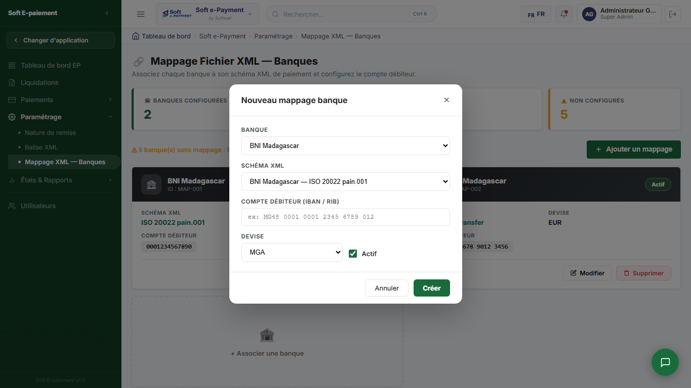

### Présentation de l'écran

La fenêtre de mappage permet d'associer une banque à son format XML et au compte débiteur utilisé dans les fichiers de paiement.

### Champs

| Champ | Fonction | Format attendu | Obligatoire et relations |
| --- | --- | --- | --- |
| Banque | Banque concernée par le mappage | Liste de banques | Obligatoire |
| Schéma XML | Format bancaire à utiliser | Liste de schémas | Obligatoire. Doit correspondre à la banque ou au contrat bancaire |
| Compte débiteur | Compte de l'organisation utilisé pour payer | IBAN ou RIB | Obligatoire pour une génération fiable |
| Devise | Devise du compte ou du fichier | Liste de devises | Obligatoire |
| Actif | Indique si le mappage peut être utilisé | Case à cocher | Si décoché, le mappage est conservé mais suspendu |

### Actions

| Bouton | Rôle | Conditions | Conséquence |
| --- | --- | --- | --- |
| Créer | Enregistrer un nouveau mappage | Banque et schéma renseignés | La banque devient configurée |
| Enregistrer | Sauvegarder une modification | Mappage existant | Les futures générations utilisent les nouvelles valeurs |
| Annuler | Fermer sans enregistrer | Toujours disponible | Aucun changement n'est appliqué |

## 23. États & Rapports - Tableau de bord KPI

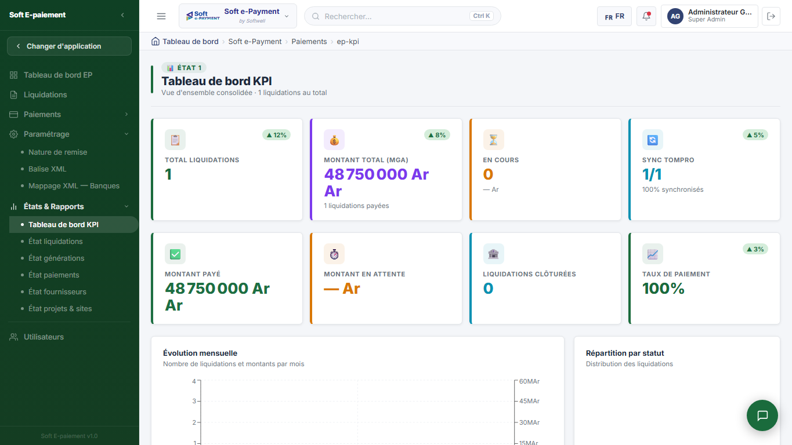

### Présentation de l'écran

Le tableau de bord KPI donne une vue consolidée de l'activité : montants, paiements, synchronisations, liquidations en cours et répartition par statut. Il est destiné aux responsables financiers et au pilotage.

### Indicateurs

| Indicateur | Signification | Interprétation |
| --- | --- | --- |
| Total liquidations | Nombre de liquidations suivies | Mesure le volume d'activité |
| Montant total | Somme globale des liquidations | Sert au suivi financier |
| En cours | Liquidations non finalisées | À surveiller pour éviter les retards |
| Sync TOMPRO | Part des liquidations synchronisées | Mesure l'avancement comptable |
| Montant payé | Somme des liquidations payées | Indique la dépense déjà exécutée |
| Taux de paiement | Pourcentage des liquidations payées | Aide au suivi de performance |

### Graphiques

| Graphique | Fonction | Interaction |
| --- | --- | --- |
| Évolution mensuelle | Montre le nombre de liquidations et les montants par mois | Lecture comparative par période |
| Répartition par statut | Affiche la distribution des statuts | Permet d'identifier les blocages |
| Répartition par devise | Montre les volumes par devise | Utile pour contrôler les paiements en devise |
| Top fournisseurs | Liste les fournisseurs les plus représentés | Aide à analyser les concentrations de paiement |

## 24. États & Rapports - État des liquidations

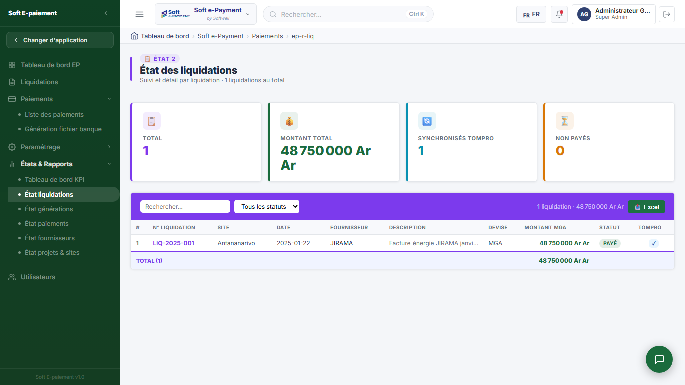

### Présentation de l'écran

L'état des liquidations détaille les liquidations selon les critères de recherche et de statut. Il est utilisé pour contrôler les dossiers, préparer les suivis et exporter les informations.

### Champs et actions

| Élément | Fonction | Format attendu | Obligatoire et relations |
| --- | --- | --- | --- |
| Recherche | Filtrer par numéro ou fournisseur | Texte libre | Optionnel |
| Tous les statuts | Filtrer les liquidations | Liste | Optionnel |
| Export Excel | Exporter l'état filtré | Bouton | Produit un fichier de suivi |
| Tableau détaillé | Affiche numéro, site, date, fournisseur, devise, montant, statut et TOMPRO | Tableau | Reprend les données de l'écran Liquidations |

Le total en bas de tableau se recalcule selon les filtres appliqués.

## 25. États & Rapports - État des générations

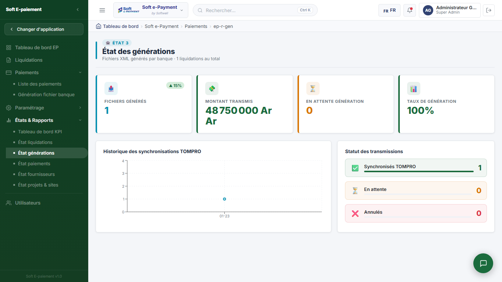

### Présentation de l'écran

L'état des générations suit les transmissions ou synchronisations réalisées et les éléments en attente. Il est utilisé pour savoir quelles liquidations ont été préparées ou transmises.

### Indicateurs

| Indicateur | Signification | Relation |
| --- | --- | --- |
| Fichiers générés | Nombre de liquidations synchronisées ou transmises | Dépend des actions de génération ou synchronisation |
| Montant transmis | Montant total concerné | Reprend les montants liquidés |
| En attente génération | Liquidations non encore générées ou synchronisées | À traiter dans Liquidations ou Paiements XML |
| Taux de génération | Pourcentage d'avancement | Sert au pilotage |

Le tableau des liquidations en attente aide à prioriser les dossiers qui doivent encore être préparés.

## 26. États & Rapports - État des paiements

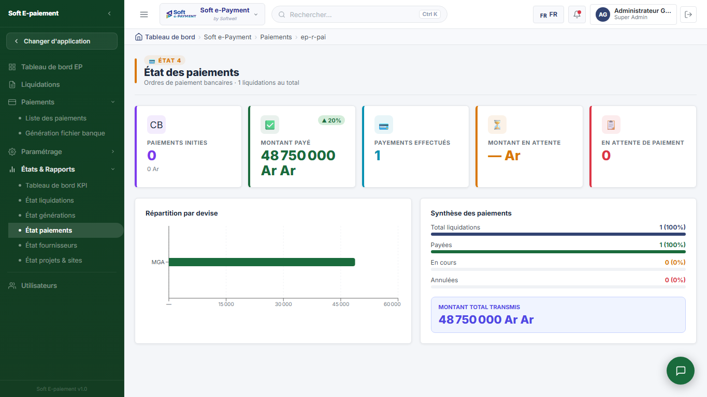

### Présentation de l'écran

L'état des paiements suit les paiements initiés, payés ou en attente. Il est utilisé par les responsables financiers pour contrôler l'avancement des règlements.

### Indicateurs et tableaux

| Élément | Fonction | Relation |
| --- | --- | --- |
| Paiements initiés | Nombre de paiements lancés depuis la liste des paiements | Alimenté par la confirmation de paiement |
| Montant payé | Montant des liquidations payées | Dépend des statuts de liquidation |
| Montant en attente | Montant restant à payer | Aide à planifier les décaissements |
| Ordres de paiement initiés | Tableau des paiements lancés | Reprend opérateur, montant, statut et date |
| Répartition par devise | Montants par devise | Reprend les devises des liquidations |

Un paiement confirmé dans la fenêtre de confirmation apparaît dans cet état avec son opérateur et son statut.

## 27. États & Rapports - État par fournisseur

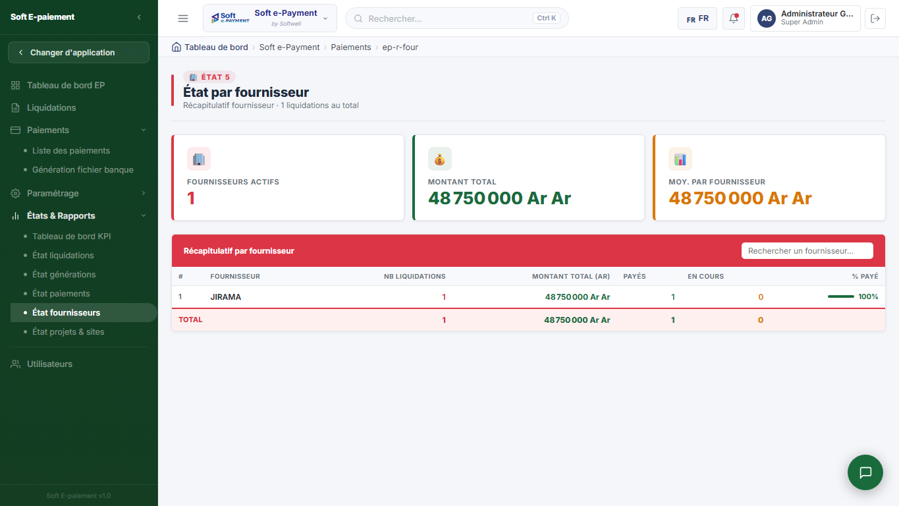

### Présentation de l'écran

L'état par fournisseur agrège les liquidations par bénéficiaire. Il aide à analyser les montants dus ou payés par fournisseur.

### Champs et affichages

| Élément | Fonction | Format | Interaction |
| --- | --- | --- | --- |
| Recherche fournisseur | Filtrer un fournisseur | Texte | Optionnel |
| Fournisseurs actifs | Nombre de fournisseurs concernés | Nombre | Lecture directe |
| Montant total | Total des liquidations tous fournisseurs | Montant | Se recalcule selon les données |
| Tableau fournisseur | Nb liquidations, montant, payés, en cours, pourcentage payé | Tableau | Permet de comparer les fournisseurs |

Cet état est utile pour préparer un point fournisseur ou vérifier qu'un fournisseur n'a pas de paiement en retard.

## 28. États & Rapports - État par projet et site

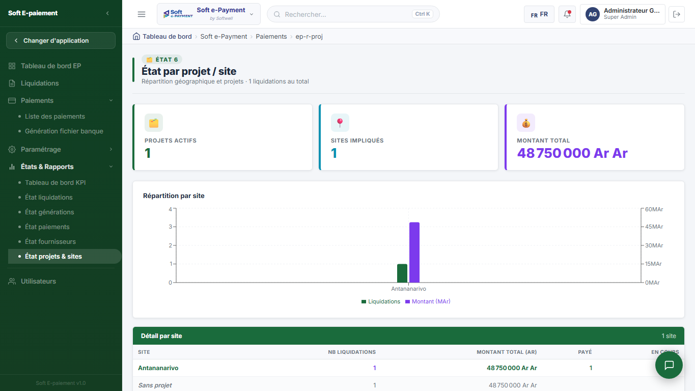

### Présentation de l'écran

L'état par projet et site présente la répartition des liquidations selon l'implantation. Il est utilisé par les responsables projet, les directions financières et les auditeurs.

### Éléments

| Élément | Fonction | Relation |
| --- | --- | --- |
| Projets actifs | Nombre de projets ou sites concernés | Dépend des données de liquidation |
| Sites impliqués | Nombre de sites présents dans les liquidations | Alimenté par le champ Site |
| Montant total | Somme globale des liquidations | Reprend les montants de Liquidations |
| Graphique par site | Compare volumes et montants | Permet d'identifier les sites les plus actifs |
| Tableau détail par site | Nombre de liquidations, montants, payés et en cours | Sert au suivi opérationnel |

Un site mal renseigné dans une liquidation fausse cet état. Il est donc important de vérifier le champ Site lors de la création.

## 29. Utilisateurs SoftPaiement - Liste

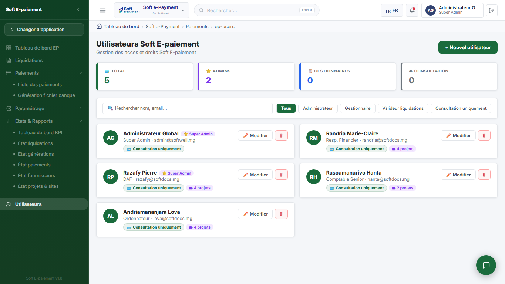

### Présentation de l'écran

L'écran **Utilisateurs Soft E-paiement** permet de gérer les accès, les rôles, les droits, les notifications et les projets accessibles. Il est utilisé par les administrateurs.

### Zones et champs

| Élément | Fonction | Format attendu | Obligatoire et relations |
| --- | --- | --- | --- |
| Total | Nombre d'utilisateurs ayant accès à SoftPaiement | Nombre | Inclut les super administrateurs |
| Admins | Nombre d'administrateurs | Nombre | Ces utilisateurs ont des droits étendus |
| Gestionnaires | Nombre de gestionnaires | Nombre | Utilisateurs de création et traitement |
| Consultation | Nombre d'utilisateurs en lecture | Nombre | Accès limité aux vues de consultation |
| Recherche nom, email | Filtrer les utilisateurs | Texte | Optionnel |
| Filtre rôle | Filtrer par rôle SoftPaiement | Boutons | Optionnel |
| Carte utilisateur | Résumé de l'utilisateur, rôle et projets | Carte | Boutons Modifier ou Supprimer disponibles |

### Actions

| Bouton | Rôle | Conditions | Conséquence |
| --- | --- | --- | --- |
| Nouvel utilisateur | Créer un accès SoftPaiement | Administrateur autorisé | Ouvre le formulaire utilisateur |
| Modifier | Mettre à jour un utilisateur | Carte utilisateur existante | Ouvre le formulaire prérempli |
| Supprimer | Supprimer l'utilisateur | Confirmation demandée | Retire l'utilisateur de la liste |

## 30. Utilisateur - Informations générales

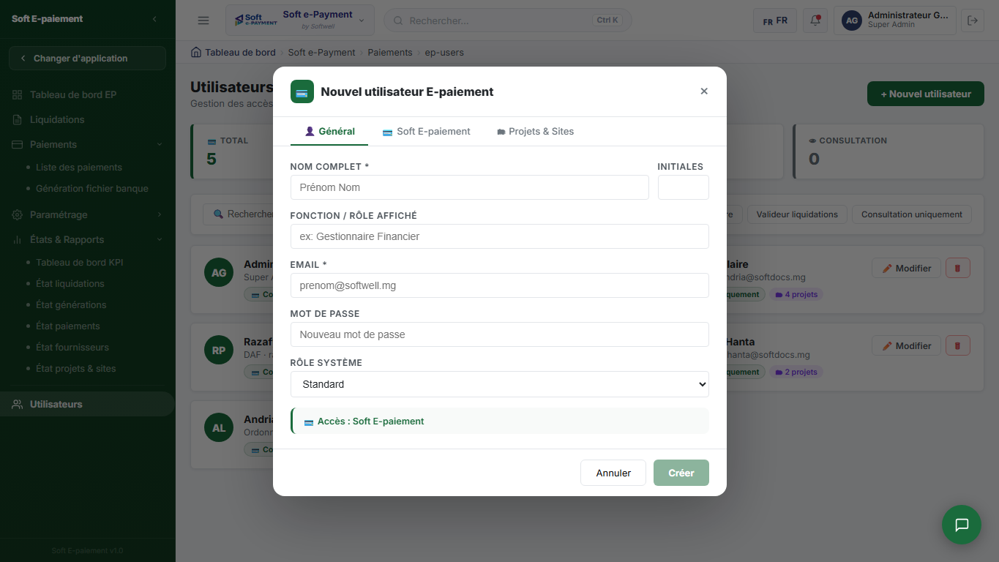

### Présentation de l'écran

L'onglet **Général** contient l'identité et les informations de connexion de l'utilisateur. Il est la première étape de création ou modification d'un accès.

### Champs

| Champ | Fonction | Format attendu | Obligatoire et relations |
| --- | --- | --- | --- |
| Nom complet | Identité de l'utilisateur | Texte | Obligatoire |
| Initiales | Abréviation affichée dans l'interface | 2 à 3 lettres | Peut être proposée automatiquement depuis le nom |
| Fonction / Rôle affiché | Fonction métier visible | Texte | Optionnel |
| Email | Adresse de connexion et de notification | Adresse email | Obligatoire |
| Mot de passe | Mot de passe de l'utilisateur | Texte confidentiel | Obligatoire à la création, optionnel en modification si inchangé |
| Rôle système | Niveau général dans le socle | Liste | Influence les accès globaux |

### Actions

| Bouton | Rôle | Conditions | Conséquence |
| --- | --- | --- | --- |
| Créer | Enregistrer le nouvel utilisateur | Nom et email renseignés | L'utilisateur est ajouté avec accès SoftPaiement |
| Enregistrer | Sauvegarder les modifications | Utilisateur existant | Les changements sont appliqués |
| Annuler | Fermer sans enregistrer | Toujours disponible | Aucun changement n'est appliqué |

## 31. Utilisateur - Droits SoftPaiement

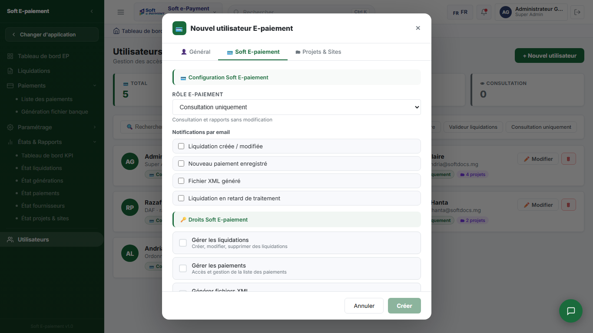

### Présentation de l'écran

L'onglet **Soft E-paiement** définit le rôle métier, les notifications et les droits spécifiques au module.

### Champs et droits

| Champ ou droit | Fonction | Format attendu | Relation |
| --- | --- | --- | --- |
| Rôle E-paiement | Déterminer le profil fonctionnel | Liste : Administrateur, Gestionnaire, Valideur liquidations, Consultation uniquement | Influence l'utilisation quotidienne |
| Notifications par email | Choisir les événements à notifier | Cases à cocher | Envoie des alertes selon les choix |
| Gérer les liquidations | Autoriser création, modification et suppression | Case à cocher | Donne accès aux actions de l'écran Liquidations |
| Gérer les paiements | Autoriser la gestion de la liste des paiements | Case à cocher | Donne accès aux actions de paiement |
| Générer fichiers XML | Autoriser la génération bancaire | Case à cocher | Donne accès aux actions de l'écran Paiements XML |
| Paramétrage avancé | Autoriser natures, balises et mappages | Case à cocher | Donne accès aux écrans de paramétrage |
| Saisie avances | Autoriser la saisie d'avances financières | Case à cocher | Selon processus interne |
| Saisie liquidations | Autoriser la saisie et finalisation des liquidations | Case à cocher | Complète les droits de liquidation |

Un utilisateur sans droit de génération XML ne doit pas pouvoir produire de fichier bancaire, même s'il consulte les documents éligibles.

## 32. Utilisateur - Projets et sites

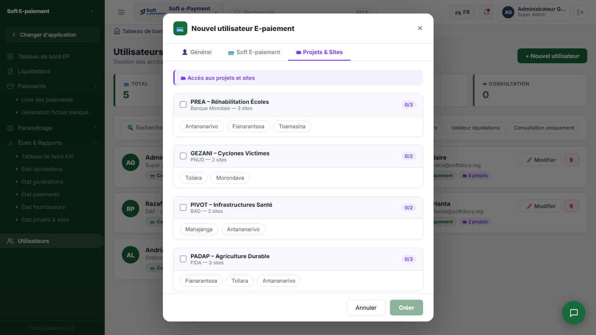

### Présentation de l'écran

L'onglet **Projets & Sites** limite l'accès de l'utilisateur aux projets et sites autorisés. Il est utilisé pour respecter l'organisation interne et éviter qu'un utilisateur consulte ou traite des dossiers hors périmètre.

### Champs

| Champ | Fonction | Format attendu | Obligatoire et relations |
| --- | --- | --- | --- |
| Projet | Regroupe les sites d'un même projet | Case à cocher | Cocher le projet peut sélectionner tous ses sites |
| Site | Autorise un site précis | Badge ou case | Les liquidations et rapports peuvent dépendre de ces sites |
| Compteur de sites | Indique combien de sites sont sélectionnés | Nombre | Aide à vérifier le périmètre |

### Actions

| Action | Rôle | Conditions | Conséquence |
| --- | --- | --- | --- |
| Cocher un projet | Donner accès à tous les sites du projet | Projet disponible | Tous les sites du projet sont sélectionnés |
| Cocher un site | Donner accès à un site précis | Site disponible | L'utilisateur accède à ce site |
| Décocher un site | Retirer l'accès à un site | Site sélectionné | L'utilisateur ne doit plus traiter ce site |

## 33. Parcours utilisateur complet

### Parcours A - Transformer un document SoftDocs en liquidation

1. Le document est validé dans SoftDocs et atteint le statut **BON À PAYER**.
2. Dans SoftPaiement, ouvrir **Liquidations**.
3. Cliquer sur **Récup SoftDocs**.
4. Sélectionner le ou les documents éligibles.
5. Cliquer sur **Importer**.
6. Ouvrir la liquidation créée et compléter site, facture, devise, imputations et pièces justificatives.
7. Enregistrer puis clôturer la liquidation.

Ce parcours relie SoftDocs à SoftPaiement. Un document non validé ou non bon à payer ne doit pas être proposé dans la récupération.

### Parcours B - Créer une liquidation manuellement

1. Ouvrir **Liquidations**.
2. Cliquer sur **Nouvelle liquidation**.
3. Renseigner les informations de base, la facture et la devise.
4. Ajouter les imputations comptables.
5. Ajouter les pièces justificatives.
6. Enregistrer la liquidation.
7. Synchroniser avec TOMPRO si le processus le demande.
8. Clôturer la liquidation lorsqu'elle est prête à payer.

La clôture est l'étape qui rend la liquidation disponible pour la liste des paiements.

### Parcours C - Récupérer une liquidation clôturée dans les paiements

1. Ouvrir **Liste des paiements**.
2. Cliquer sur **Recuperer liquidation**.
3. Sélectionner les liquidations clôturées à importer.
4. Cliquer sur **Importer**.
5. Vérifier que les lignes apparaissent dans la liste des paiements.

Les liquidations non clôturées ou déjà importées ne sont pas proposées.

### Parcours D - Initier un paiement mobile

1. Ouvrir **Liste des paiements**.
2. Sélectionner un seul paiement au statut éligible.
3. Cliquer sur **Payer**.
4. Choisir l'opérateur mobile money.
5. Choisir **Vanilla Pay**.
6. Cliquer sur **Continuer**.
7. Vérifier la référence, le bénéficiaire, le numéro et le montant.
8. Cliquer sur **Confirmer le paiement**.

Après confirmation, le paiement passe au statut **Paiement initie**. Il devient visible dans le tableau de bord et dans l'état des paiements.

### Parcours E - Générer un fichier bancaire XML

1. Vérifier les paramètres dans **Nature de remise**, **Balise XML** et **Mappage XML - Banques**.
2. Ouvrir **Paiements > Génération fichier banque**.
3. Choisir le schéma bancaire adapté.
4. Sélectionner les documents bons à payer à inclure.
5. Contrôler le total sélectionné.
6. Cliquer sur **Générer XML**.
7. Confirmer la génération et télécharger le fichier.

Si la nature de remise ou le mappage bancaire n'est pas conforme, le fichier risque de ne pas répondre aux attentes de la banque.

### Parcours F - Piloter l'activité

1. Consulter le **Tableau de bord EP** pour une synthèse rapide.
2. Ouvrir **État liquidations** pour contrôler les dossiers.
3. Ouvrir **État générations** pour identifier les transmissions en attente.
4. Ouvrir **État paiements** pour suivre les paiements initiés et payés.
5. Ouvrir **État fournisseurs** pour analyser les bénéficiaires.
6. Ouvrir **État projets & sites** pour suivre la répartition opérationnelle.

Les états reposent sur la qualité des données saisies dans Liquidations et Paiements. Les champs Site, Fournisseur, Devise et Montant doivent être renseignés avec attention.

## 34. Bonnes pratiques d'utilisation

- Toujours vérifier qu'un document SoftDocs est bien validé et bon à payer avant de le transformer en liquidation.
- Renseigner le site, le fournisseur, la facture, la devise et les montants avec précision.
- Ajouter les pièces justificatives avant clôture de la liquidation.
- Ne clôturer une liquidation que lorsqu'elle est prête à être récupérée dans les paiements.
- Vérifier le statut avant de cliquer sur **Payer**.
- Utiliser **Vanilla Pay** pour poursuivre le parcours de paiement mobile dans la maquette.
- Contrôler les natures de remise et le mappage bancaire avant toute génération XML.
- Limiter les droits utilisateurs aux besoins réels de chaque rôle.
- Utiliser les rapports pour détecter les liquidations en attente, les paiements non finalisés et les sites à fort volume.

## 35. Glossaire fonctionnel

| Terme | Définition |
| --- | --- |
| Liquidation | Dossier financier préparant le paiement d'une dépense ou facture |
| Bon à payer | Statut indiquant qu'un document est validé pour paiement |
| Imputation | Ligne comptable ou analytique qui ventile le montant d'une liquidation |
| Pièce justificative | Document joint permettant de prouver ou contrôler une liquidation |
| TOMPRO | Outil comptable avec lequel les liquidations peuvent être synchronisées |
| Nature de remise | Code indiquant le type de remise ou d'ordre bancaire |
| Schéma XML | Format de fichier bancaire attendu par une banque |
| Balise XML | Information structurée incluse dans le fichier bancaire |
| Mappage bancaire | Association entre une banque, un schéma XML, une devise et un compte débiteur |
| Paiement initié | Paiement lancé depuis SoftPaiement mais pas nécessairement finalisé comptablement |
