# Manuel utilisateur SoftSign

Ce manuel accompagne les utilisateurs finaux dans l'utilisation quotidienne de SoftSign. Il explique les écrans, les champs, les actions, les statuts et les parcours métier du point de vue de l'utilisateur.

Le périmètre couvert comprend le dépôt de documents, le choix du workflow, la définition des zones de signature ou de paraphe, le traitement des documents internes et externes, la signature interne, la signature externe avec OTP, les délégations, les relances, les notifications, les modèles d'e-mails, les rapports et le paramétrage fonctionnel.

## Repères généraux

SoftSign sert à faire circuler un document dans un circuit de validation, de paraphe, de signature et d'archivage. Le module peut être utilisé par un déposant interne, un receveur, un validateur, un signataire, un délégataire, un administrateur et, dans certains cas, un tiers externe invité à signer.

| Élément | Description fonctionnelle |
|---|---|
| Menu latéral | Donne accès aux grands espaces : tableau de bord, documents, traitement, paramétrage et rapports. Les menus visibles dépendent du rôle et des autorisations de l'utilisateur. |
| Barre supérieure | Affiche la recherche, la langue, les notifications, le profil connecté et la déconnexion. |
| Fil d'Ariane | Indique le chemin de navigation, par exemple Tableau de bord puis SoftSign puis Documents en cours. |
| Badges de compteur | Indiquent le nombre de documents, d'alertes ou de notifications dans une rubrique. |
| Badges de statut | Résument l'état d'un document ou d'une étape : en cours, à traiter, signé, rejeté, archivé, en attente de signature externe. |

Les statuts principaux à connaître sont les suivants.

| Statut | Signification pour l'utilisateur |
|---|---|
| Brouillon | Le dépôt est en préparation et n'a pas encore été lancé dans un workflow. |
| En cours | Le document suit son circuit. Au moins une étape est active ou à venir. |
| À traiter | Une étape attend une action de la part d'un utilisateur autorisé. |
| En attente de signature externe | Le document a été envoyé à un tiers externe. Le workflow est bloqué jusqu'à la signature ou l'expiration de la demande. |
| Signé par un tiers | La signature externe a été réalisée. Le circuit peut continuer selon les étapes restantes. |
| Terminé | Toutes les étapes prévues sont réalisées. Le certificat et l'historique peuvent être consultés. |
| Rejeté | Une étape a été refusée. Le motif de rejet doit être consulté avant toute correction. |
| Archivé | Le document finalisé est conservé avec ses preuves, son certificat et son journal d'audit. |

# Tableau de bord

## Tableau de bord SoftSign

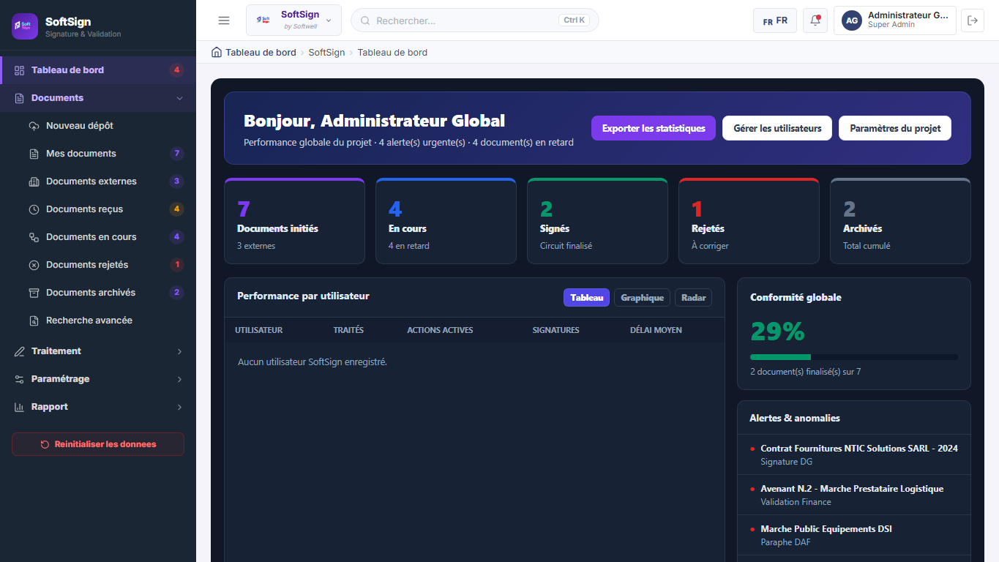

### Présentation générale

Le tableau de bord donne une vision synthétique de l'activité SoftSign. Il est utilisé par les responsables, administrateurs et utilisateurs ayant des actions à suivre pour repérer les documents en cours, les signatures à venir, les retards, les rejets et les documents archivés.

Cet écran intervient au début de la journée de travail ou lors d'un suivi de pilotage. Il permet de savoir rapidement où concentrer l'effort : traiter une action urgente, relancer un signataire ou consulter l'activité d'un projet.

### Zones affichées

| Zone | Fonction | Interprétation |
|---|---|---|
| Documents initiés | Nombre total de documents lancés dans SoftSign. | Donne le volume global d'activité. |
| En cours | Documents dont le workflow n'est pas terminé. | Une valeur élevée peut indiquer une charge importante ou des étapes bloquées. |
| Signés | Documents finalisés ou signés. | Montre la production terminée. |
| Rejetés | Documents refusés dans le circuit. | À analyser pour comprendre les causes de refus. |
| Archivés | Documents conservés après finalisation. | Sert au suivi de conformité et de preuve. |
| Performance par utilisateur | Présente les traitements et signatures par personne. | Permet de suivre la charge des validateurs et signataires. |
| Alertes et anomalies | Liste les documents urgents ou en retard. | Un document listé ici doit être consulté en priorité. |
| Performance par projet ou site | Répartit l'activité par périmètre métier. | Aide à repérer les projets les plus actifs ou les plus en retard. |
| Activité récente | Affiche les derniers événements : relances, signatures, validations. | Sert à comprendre ce qui s'est passé récemment sans ouvrir chaque document. |

### Boutons et actions

| Action | Rôle exact | Conditions et conséquences |
|---|---|---|
| Exporter les statistiques | Génère une extraction des indicateurs visibles. | Disponible pour les utilisateurs autorisés. L'action ne modifie aucun document. |
| Gérer les utilisateurs | Ouvre la gestion des utilisateurs SoftSign. | Visible selon les droits d'administration. |
| Paramètres du projet | Ouvre les réglages liés au périmètre projet. | Réservé aux profils autorisés. |
| Gestion des rôles | Ouvre l'écran des autorisations. | Permet d'ajuster les droits qui conditionnent les menus et actions visibles. |
| Journal d'activité | Ouvre le suivi d'audit lorsqu'il est accessible. | Utilisé pour contrôler les événements enregistrés. |

### Relation avec les autres écrans

Les compteurs du tableau de bord sont alimentés par les documents, les workflows, les relances et les actions de signature. Lorsqu'un workflow prévoit une étape de signature avec OTP, une action peut apparaître dans les alertes si son délai est dépassé. Lorsqu'un document est rejeté ou archivé dans le détail document, les indicateurs sont mis à jour.

# Dépôt et lancement d'un document

## Nouveau dépôt

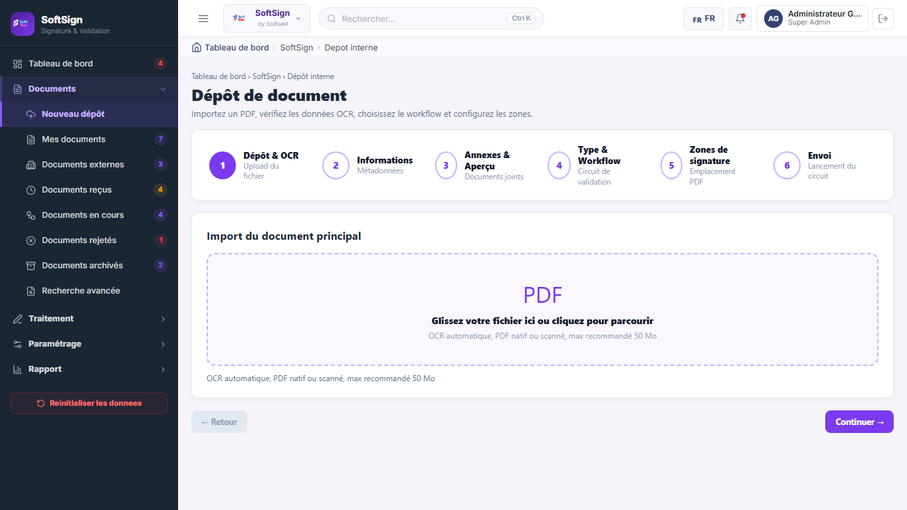

### Présentation générale

L'écran Nouveau dépôt permet de créer un document SoftSign et de le lancer dans un circuit de validation, de paraphe, de signature et d'archivage. Il est utilisé par un déposant interne ou par un gestionnaire qui prépare un document à faire signer.

Le dépôt se déroule en plusieurs étapes guidées : ajout du fichier, saisie des informations, ajout d'annexes, choix du type et du workflow, placement des zones de signature, puis lancement du circuit.

### Étapes du dépôt

| Étape | Objectif | Informations attendues |
|---|---|---|
| Dépôt et lecture automatique | Ajouter le fichier principal et récupérer les informations reconnues. | Fichier autorisé, nom du document, référence éventuelle, date et montant si reconnus. |
| Informations | Compléter les données métier. | Titre, type, projet, site, montant, devise, priorité, commentaire. |
| Annexes et aperçu | Ajouter des pièces jointes et vérifier le document. | Annexes facultatives, aperçu du document principal. |
| Type et workflow | Choisir le type documentaire et le circuit à appliquer. | Type actif et workflow compatible avec le type, le site et les conditions de montant. |
| Zones de signature | Placer les zones de signature ou de paraphe demandées par le workflow. | Page, position, dimensions et signataire concerné. |
| Envoi | Contrôler le récapitulatif et lancer le circuit. | Le bouton final n'est possible que lorsque les champs et zones obligatoires sont renseignés. |

### Champs principaux

| Champ | Fonction | Format attendu | Obligatoire |
|---|---|---|---|
| Fichier principal | Document à faire circuler dans SoftSign. | Fichier PDF ou format autorisé par les paramètres généraux. | Oui |
| Titre | Nom lisible du document dans les listes et le détail. | Texte court et explicite. | Oui |
| Référence | Identifiant du document. | Saisie ou génération selon le paramétrage de référence. | Automatique ou obligatoire selon contexte |
| Type de document | Catégorie fonctionnelle du document. | Liste de types actifs : contrat, facture, avenant, devis, bon de commande, rapport, protocole, autre. | Oui |
| Projet | Périmètre métier concerné. | Liste des projets disponibles. | Oui si le paramétrage l'exige |
| Site | Site rattaché au projet. | Liste dépendante du projet sélectionné. | Oui si le projet contient plusieurs sites |
| Montant | Montant utile au choix du workflow. | Nombre avec devise. | Optionnel, mais peut rendre un workflow applicable |
| Devise | Monnaie du document. | Liste ou valeur affichée selon le document. | Optionnel |
| Priorité | Niveau d'urgence de traitement. | Choix simple : normale, haute, urgente selon la maquette. | Optionnel |
| Workflow | Circuit de validation et signature. | Liste de workflows compatibles. | Oui pour lancer le document |
| Zones de signature | Emplacements où apposer signature ou paraphe. | Page et position visuelle sur le document. | Obligatoire si le workflow contient une étape Signature ou Paraphe |

### Relations entre champs

Le champ Site dépend du Projet choisi. Le workflow proposé dépend du type de document, du montant, du site et des conditions configurées dans l'écran Workflow. Les zones de signature ne sont demandées que pour les étapes de workflow dont l'action est Signature ou Paraphe. Si le workflow contient uniquement des étapes de Validation ou Révision, aucune zone de signature n'est requise.

Les formats acceptés dépendent de l'écran Paramètres généraux. Si un administrateur désactive un format, ce format ne peut plus être déposé. Si un projet ou un site a une règle spécifique de format, cette règle remplace le réglage général.

### Boutons et actions

| Action | Rôle exact | Conditions et conséquences |
|---|---|---|
| Ajouter ou déposer le fichier | Charge le document principal. | Actif si le format est autorisé. Après ajout, le document peut être analysé et préremplir certains champs. |
| Suivant | Passe à l'étape suivante du dépôt. | Actif lorsque les informations obligatoires de l'étape courante sont renseignées. |
| Précédent | Revient à l'étape précédente. | N'efface pas les informations déjà saisies. |
| Ajouter une annexe | Joint un document complémentaire. | Facultatif. Les annexes restent consultables dans l'onglet Documents du détail. |
| Enregistrer la zone | Sauvegarde l'emplacement choisi pour une signature ou un paraphe. | Obligatoire pour chaque étape qui demande une zone. |
| Lancer le circuit | Crée le document et active la première étape du workflow. | Le document apparaît ensuite dans les listes, notamment Documents en cours ou Documents reçus selon le rôle. |

# Listes de documents

## Mes documents

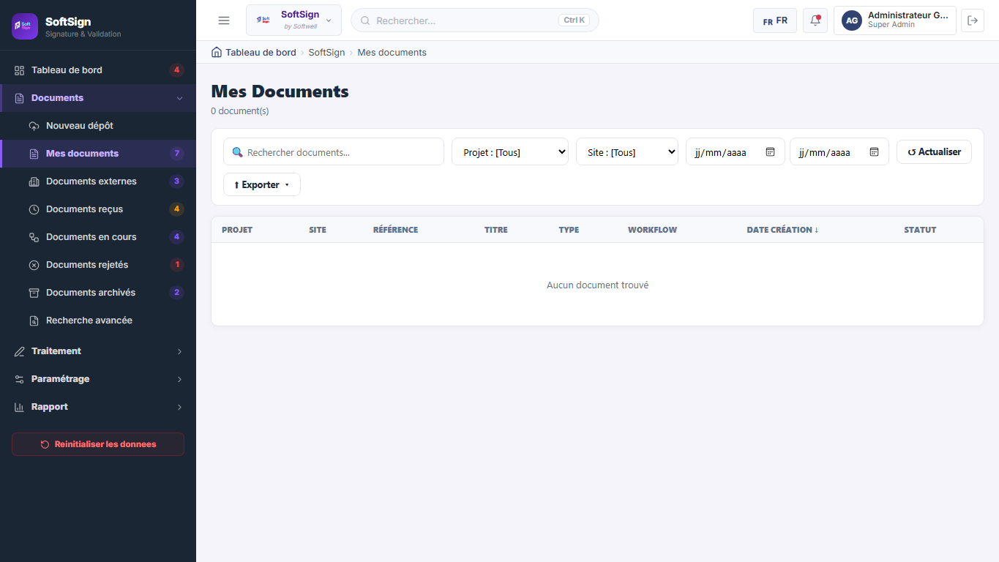

### Présentation générale

La vue Mes documents liste les documents déposés ou initiés par l'utilisateur connecté. Elle est utilisée par un déposant pour suivre ce qu'il a envoyé dans SoftSign.

Si aucun document n'est rattaché au déposant connecté, l'écran affiche une liste vide. Les compteurs du menu peuvent rester supérieurs à zéro car ils représentent l'activité globale du module.

### Filtres et zones de recherche

| Champ ou filtre | Fonction | Format attendu | Obligatoire |
|---|---|---|---|
| Rechercher documents | Recherche par référence, titre, expéditeur ou autre information visible. | Texte libre. | Non |
| Projet | Limite la liste à un projet. | Liste déroulante. | Non |
| Site | Limite la liste à un site. | Liste dépendante des projets et sites disponibles. | Non |
| Date début et date fin | Filtre les documents selon leur période. | Date au format jour, mois, année. | Non |

### Actions

| Action | Rôle exact | Conditions et conséquences |
|---|---|---|
| Actualiser | Recharge la liste affichée. | Disponible sur la liste. N'applique aucune modification métier. |
| Exporter | Exporte les documents correspondant aux filtres. | Disponible lorsque l'utilisateur est autorisé à exporter. |
| Ouvrir une ligne | Affiche le détail du document. | Possible si l'utilisateur a le droit de consulter le document. |

## Documents externes

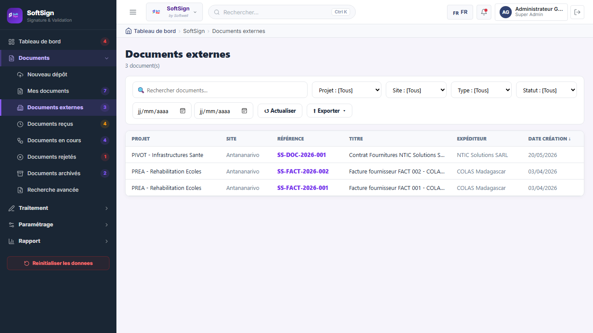

### Présentation générale

La vue Documents externes regroupe les documents déposés par un fournisseur ou un tiers via le portail externe. Elle est utilisée par un receveur ou un gestionnaire pour vérifier les informations, confirmer la réception et lancer le workflow interne.

### Éléments affichés

| Élément | Signification | Interaction |
|---|---|---|
| Expéditeur | Fournisseur ou tiers ayant déposé le document. | Sert à identifier l'origine du document. |
| Projet et site | Périmètre auquel le document est rattaché. | Peut être vérifié ou corrigé lors du traitement. |
| Type | Type documentaire proposé ou reconnu. | Conditionne le workflow recommandé. |
| Statut | Indique si le document est reçu, en attente de traitement ou déjà lancé. | À interpréter avant d'ouvrir le document. |

### Relation avec le workflow

Un document externe n'est pas toujours lancé immédiatement. Le receveur peut d'abord confirmer la conformité, compléter les informations reconnues et choisir le workflow. Une fois lancé, le document rejoint les documents en cours et les étapes prévues deviennent actives.

## Documents reçus

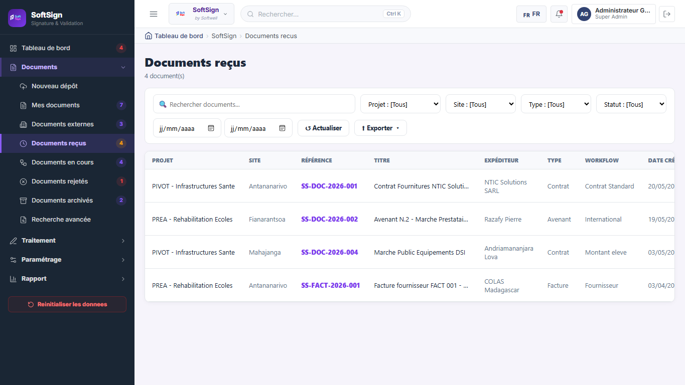

### Présentation générale

La vue Documents reçus présente les documents qui attendent une action ou une prise en charge. Elle est utilisée par les validateurs, signataires et receveurs.

### Éléments d'affichage

| Élément | Signification |
|---|---|
| Référence | Identifiant unique du document. |
| Titre | Objet du document à traiter. |
| Étape actuelle | Étape qui attend une action. |
| Validateur ou signataire | Personne ou groupe attendu sur l'étape. |
| Délai | Date limite prévue par le workflow. |
| Statut | Permet de distinguer une action à traiter, une attente ou un retard. |

### Actions

| Action | Rôle exact | Conditions et conséquences |
|---|---|---|
| Ouvrir ou traiter | Accède au détail document ou à l'action attendue. | Actif si l'utilisateur est concerné ou dispose d'un droit de consultation. |
| Relancer | Envoie une relance à l'acteur attendu. | Disponible selon les droits et la limite définie dans Relances. |

## Documents en cours

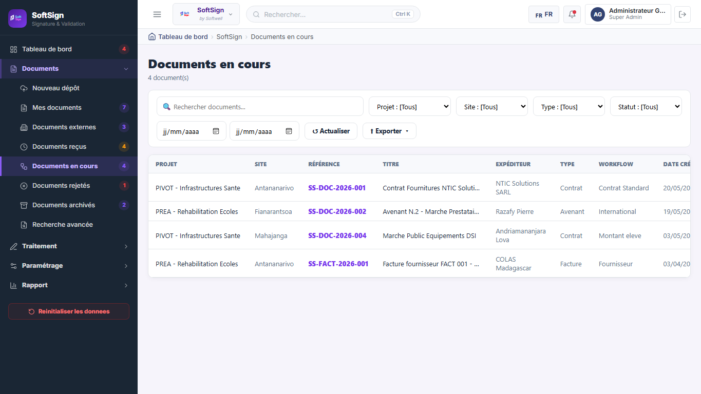

### Présentation générale

Cette vue rassemble les documents dont le circuit n'est pas terminé. Elle est utile pour suivre l'avancement de toutes les validations, paraphes, signatures et archivages.

### Filtres et colonnes

| Élément | Fonction |
|---|---|
| Recherche | Retrouve rapidement un document par référence, titre ou expéditeur. |
| Projet, site, type et statut | Réduisent la liste selon le contexte métier. |
| Référence | Ouvre le document lorsque la ligne est sélectionnée. |
| Expéditeur | Indique la personne ou l'entreprise à l'origine du document. |
| Workflow | Montre le circuit appliqué au document. |
| Date de création | Sert au suivi d'ancienneté. |

### Interprétation

Un document en cours peut contenir plusieurs étapes terminées et une étape active. Si l'étape active est une signature externe, le statut peut indiquer une attente de signature externe. Si l'étape active est en retard, le document peut remonter dans les alertes du tableau de bord.

## Documents rejetés

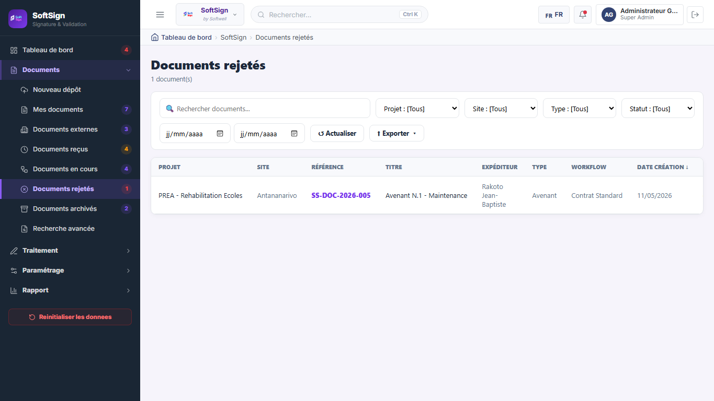

### Présentation générale

La vue Documents rejetés liste les documents refusés pendant leur circuit. Elle est utilisée par les déposants, responsables et administrateurs pour analyser les motifs de rejet et décider d'une correction.

### Éléments à lire

| Élément | Signification |
|---|---|
| Référence et titre | Identifient le document rejeté. |
| Étape de rejet | Indique l'étape où le refus a eu lieu. |
| Motif ou commentaire | Explique la cause du rejet. |
| Date | Permet de retrouver quand le rejet est intervenu. |

### Conséquence métier

Un document rejeté ne continue pas automatiquement son workflow. Le déposant doit consulter le motif, corriger le document ou initier un nouveau circuit selon les règles internes.

## Documents archivés

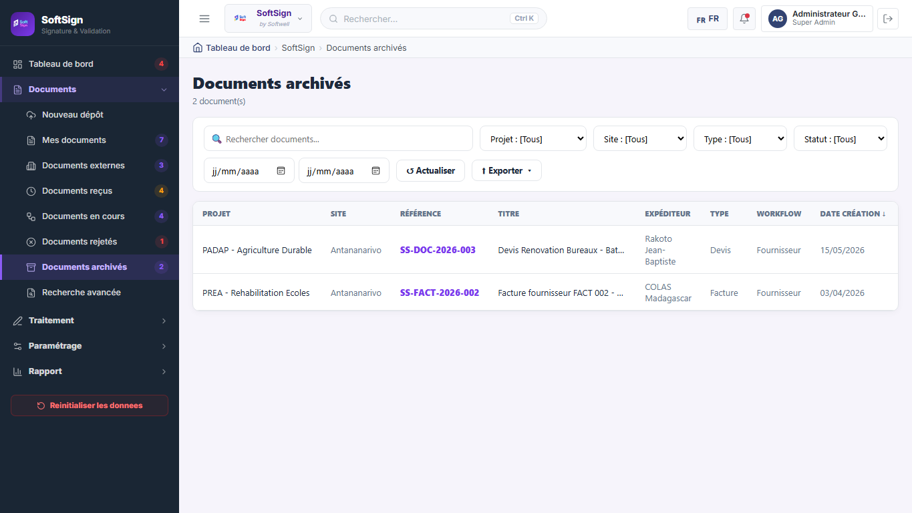

### Présentation générale

La vue Documents archivés sert à consulter les documents terminés et conservés. Elle est utilisée pour la preuve, la conformité, le contrôle et la recherche d'historique.

### Éléments affichés

| Élément | Signification | Interaction |
|---|---|---|
| Document final | Version conservée après validation ou signature. | Peut être consultée ou téléchargée selon les droits. |
| Certificat | Preuve du circuit réalisé. | Permet de vérifier les signataires, dates, actions et OTP éventuels. |
| Journal | Trace des événements du document. | Sert à comprendre le parcours complet. |
| QR Code ou preuve | Élément de vérification du document. | Peut être utilisé lors d'un contrôle. |

### Relation avec le détail document

Lorsqu'un document est terminé ou archivé, les actions de validation ou signature ne sont plus disponibles. Le détail document sert alors surtout à consulter les preuves, télécharger la version finale et vérifier l'historique.

# Fiche détail document

## Onglet Détails

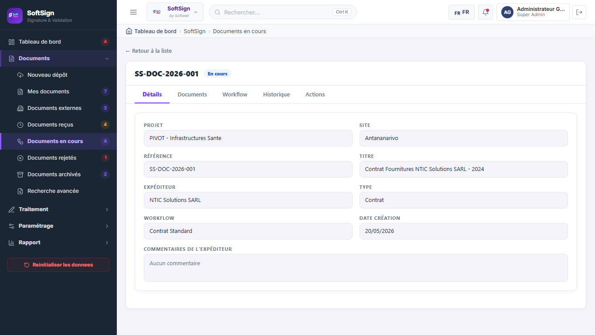

### Présentation générale

La fiche détail document centralise toutes les informations d'un document SoftSign. L'onglet Détails présente les données métier principales. Il est utilisé par tous les utilisateurs autorisés à consulter le document : déposant, validateur, signataire, responsable, administrateur ou auditeur.

### Champs affichés

| Champ | Fonction | Format | Obligatoire |
|---|---|---|---|
| Projet | Indique le projet rattaché au document. | Valeur issue du dépôt ou du traitement externe. | Oui selon le contexte |
| Site | Indique le site concerné. | Valeur dépendante du projet. | Oui selon le contexte |
| Référence | Identifiant du document. | Référence générée ou saisie. | Oui |
| Titre | Nom fonctionnel du document. | Texte. | Oui |
| Expéditeur | Déposant interne ou tiers externe. | Nom d'utilisateur ou raison sociale. | Oui |
| Type | Catégorie documentaire. | Type actif paramétré. | Oui |
| Workflow | Circuit appliqué au document. | Nom du workflow. | Oui si le document est lancé |
| Date création | Date de création ou de lancement. | Date. | Automatique |
| Commentaires de l'expéditeur | Informations complémentaires fournies au dépôt. | Texte libre. | Optionnel |

### Relation avec les autres écrans

Ces informations proviennent du dépôt ou du traitement d'un document externe. Le type et le workflow affichés expliquent ensuite les onglets Workflow et Actions. Par exemple, si le workflow contient une étape Signature DG, l'onglet Actions affichera une action de signature lorsque cette étape devient active.

## Onglet Documents

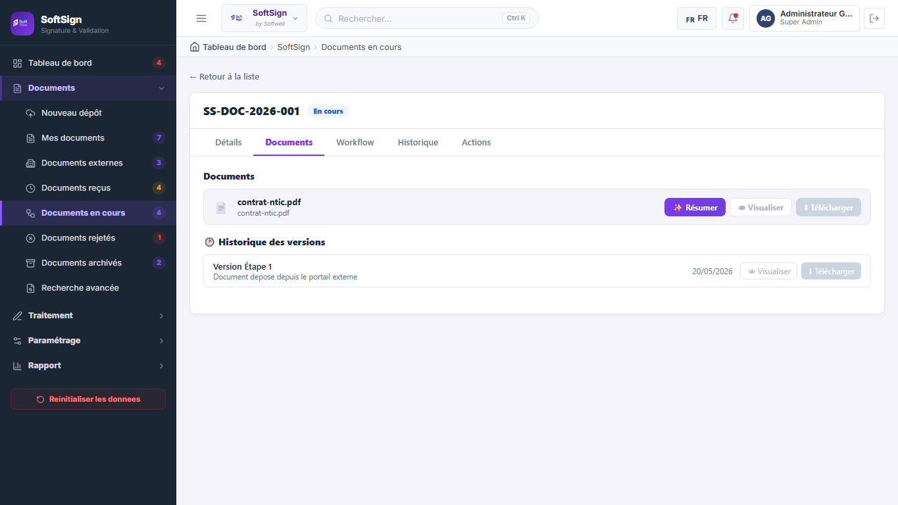

### Présentation générale

L'onglet Documents permet de consulter le fichier principal, les annexes, les versions et les pièces de preuve lorsque le document est finalisé.

### Éléments affichés

| Élément | Signification | Interaction |
|---|---|---|
| Document principal | Fichier soumis au workflow. | Visualiser ou télécharger selon les droits. |
| Annexes | Pièces complémentaires ajoutées au dépôt. | Consulter ou télécharger. |
| Version finale | Document après signature ou validation complète. | Disponible lorsque le circuit est terminé. |
| Certificat | Preuve du circuit et des signatures. | Consultable dans les documents terminés ou archivés. |
| Historique des versions | Liste des changements de version. | Sert à vérifier quelle version a été signée. |

### Conditions d'affichage

Les annexes apparaissent uniquement si elles ont été ajoutées. Le certificat et la version finale apparaissent lorsque le document a atteint un état terminé ou archivé. Un utilisateur en simple consultation peut voir ces éléments sans pouvoir modifier le document.

## Onglet Workflow

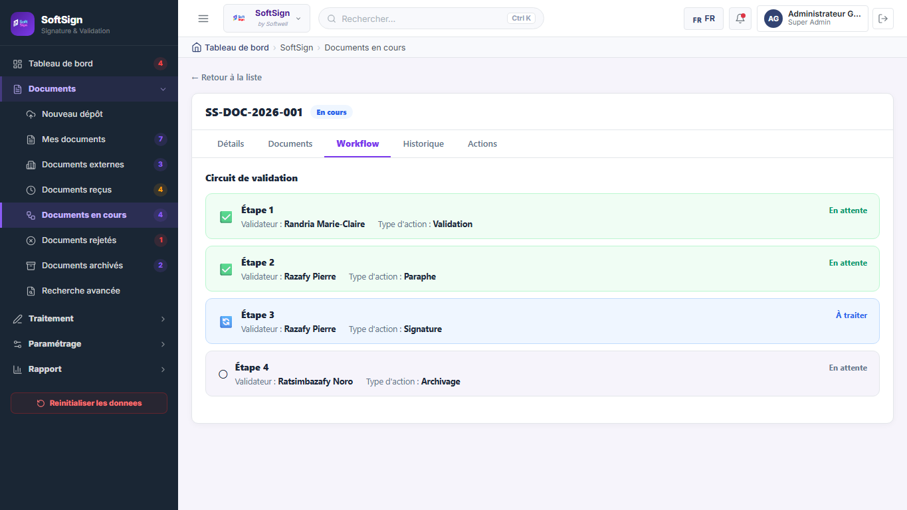

### Présentation générale

L'onglet Workflow montre le circuit appliqué au document étape par étape. Il aide l'utilisateur à comprendre ce qui est déjà fait, ce qui est en attente et ce qui doit être traité.

### Lecture des étapes

| Élément | Signification |
|---|---|
| Étape | Numéro d'ordre dans le circuit. |
| Validateur ou signataire | Personne attendue sur l'étape. |
| Type d'action | Validation, révision, paraphe, signature ou archivage. |
| Statut de l'étape | En attente, à traiter, terminée ou rejetée. |
| Couleur de l'étape | Aide visuelle : terminé, actif, en attente ou bloqué. |

### Règles importantes

Le workflow affiché ici vient de l'écran de paramétrage Workflow. Les règles configurées dans ce paramétrage déterminent ce que l'utilisateur voit ensuite dans l'onglet Actions.

| Paramètre du workflow | Effet dans le détail document |
|---|---|
| Action Validation | L'utilisateur peut valider ou rejeter avec commentaire. Aucune zone de signature n'est demandée. |
| Action Révision | L'utilisateur vérifie le document et peut le faire avancer ou le rejeter. |
| Action Paraphe | Une zone de paraphe doit être définie au dépôt. L'onglet Actions demande un paraphe. |
| Action Signature | Une zone de signature doit être définie au dépôt. L'onglet Actions demande une signature. |
| OTP requis | L'action ne peut être validée qu'après saisie et vérification du code OTP. |
| Signature externe autorisée | Le bouton Envoyer pour signature externe apparaît dans l'onglet Actions. |
| Étape parallèle | Plusieurs acteurs peuvent agir au même niveau. Le workflow passe à la suite lorsque toutes les étapes parallèles requises sont terminées. |
| Durée de traitement | Alimente les échéances, les retards, les alertes et les relances. |

## Onglet Historique

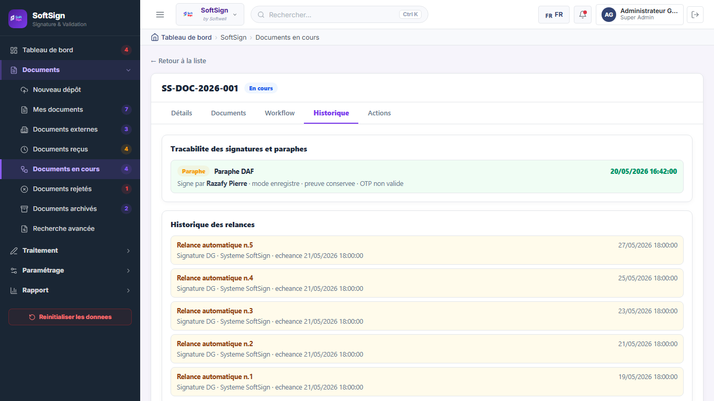

### Présentation générale

L'onglet Historique affiche les traces de traitement : signatures, paraphes, relances, commentaires, événements externes et preuve de parcours. Il est utilisé pour comprendre ce qui s'est passé sur le document.

### Éléments affichés

| Élément | Signification |
|---|---|
| Traçabilité des signatures et paraphes | Indique qui a signé ou paraphé, quand et avec quel mode. |
| Historique des relances | Liste les relances envoyées et leurs dates. |
| Événements du workflow | Montre les validations, refus, archivages et autres actions. |
| Preuves OTP ou signature externe | Indiquent si une validation sécurisée a été utilisée. |

### Comment l'interpréter

Chaque ligne doit être lue comme une preuve d'action. Une relance automatique n'est pas une validation : elle signale seulement qu'une échéance approche ou est dépassée. Une signature ou un paraphe validé prouve qu'une étape du workflow a été réalisée.

## Onglet Actions

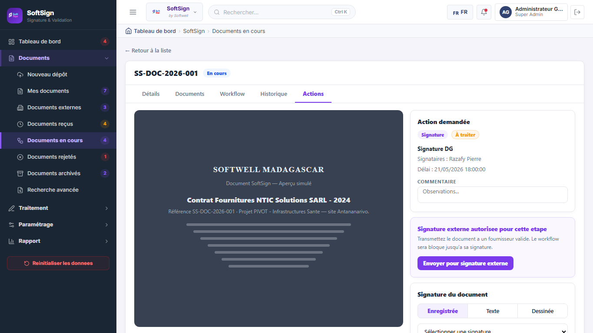

### Présentation générale

L'onglet Actions est l'écran de traitement du document. Il affiche l'action attendue sur l'étape active : valider, parapher, signer, envoyer à un tiers externe, rejeter ou relancer.

Cet écran est utilisé par le validateur ou signataire concerné. Un administrateur peut le consulter, mais l'action de validation dépend des droits et de l'affectation de l'étape.

### Zones affichées

| Zone | Fonction | Relation avec le workflow |
|---|---|---|
| Aperçu du document | Permet de vérifier le contenu avant d'agir. | Toujours utile avant validation ou signature. |
| Action demandée | Résume l'étape active, l'acteur attendu et la date limite. | Reflète l'étape active du workflow. |
| Commentaire | Permet d'ajouter une observation. | Peut accompagner validation, signature ou rejet. |
| Signature externe autorisée | Permet d'envoyer le document à un tiers. | Visible uniquement si l'étape active autorise la signature externe. |
| Signature du document | Permet de choisir une signature enregistrée, de saisir une signature texte ou de dessiner. | Visible uniquement pour les étapes Signature ou Paraphe. |
| OTP | Permet de recevoir et saisir un code de sécurité. | Visible si l'OTP est activé et requis sur l'étape. |

### Champs de traitement

| Champ | Fonction | Format attendu | Obligatoire |
|---|---|---|---|
| Commentaire | Ajoute une observation au traitement. | Texte libre. | Optionnel pour valider, obligatoire ou fortement recommandé pour rejeter |
| Mode de signature | Choix de la manière de signer. | Enregistrée, Texte ou Dessinée. | Obligatoire pour Signature ou Paraphe |
| Signature enregistrée | Sélectionne une signature déjà configurée. | Liste des signatures actives de l'utilisateur. | Obligatoire si le mode Enregistrée est choisi |
| Signature texte | Saisit le nom ou libellé à apposer. | Texte. | Obligatoire si le mode Texte est choisi |
| Signature dessinée | Dessin manuscrit dans la zone prévue. | Trait manuel. | Obligatoire si le mode Dessinée est choisi |
| Code OTP | Code à usage unique reçu par e-mail ou SMS. | Nombre ou code alphanumérique selon le paramétrage. | Obligatoire si l'étape demande OTP |

### Boutons et actions

| Action | Rôle exact | Conditions pour être active | Conséquences |
|---|---|---|---|
| Envoyer pour signature externe | Transmet le document à un tiers externe. | Visible seulement si l'étape active a l'option Signature externe autorisée dans le workflow. | Crée une demande externe et bloque le workflow jusqu'à signature, expiration ou annulation. |
| Générer ou envoyer OTP | Envoie un code de sécurité à l'utilisateur. | Visible si l'étape demande un OTP et si le paramétrage OTP est activé. | Le code doit être saisi avant validation. |
| Vérifier le code | Contrôle le code saisi. | Actif après saisie d'un code. | Si le code est correct, l'action peut être validée. |
| Valider l'action | Termine l'étape active. | Actif lorsque toutes les conditions sont remplies : signature présente si nécessaire, OTP vérifié si requis, utilisateur autorisé. | Le workflow passe à l'étape suivante ou se termine si c'était la dernière étape. |
| Rejeter | Refuse le document à l'étape active. | Disponible selon les droits. Un motif doit être saisi. | Le document passe au statut Rejeté et le workflow ne continue pas automatiquement. |
| Relancer | Envoie une relance à l'acteur attendu. | Disponible selon les droits et dans la limite du nombre maximal de relances. | Ajoute une trace dans l'historique et peut envoyer une notification. |

### Règle clé : activation des actions SoftSign

Le bouton Envoyer pour signature externe n'apparaît pas par hasard. Il est disponible dans le détail document uniquement lorsque l'étape active du workflow possède l'option Signature externe autorisée. Si cette option n'est pas cochée dans le workflow, l'utilisateur ne peut pas envoyer le document à un tiers depuis l'onglet Actions.

De la même manière, le bloc OTP apparaît uniquement si le paramétrage OTP est activé et si l'étape du workflow est marquée OTP requis. Le bouton Valider l'action reste bloqué tant que le code n'est pas vérifié.

# Recherche et traitement

## Recherche avancée

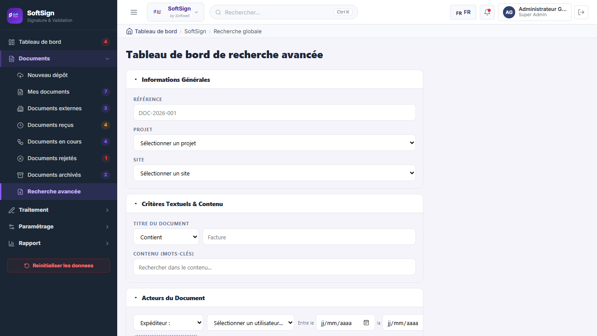

### Présentation générale

La recherche avancée permet de retrouver un document à partir de critères précis. Elle est utilisée par les gestionnaires, responsables, auditeurs et administrateurs lorsqu'une simple recherche par mot-clé ne suffit pas.

### Champs de recherche

| Champ | Fonction | Format attendu | Obligatoire |
|---|---|---|---|
| Référence | Recherche un document par identifiant. | Texte ou partie de référence. | Non |
| Titre | Recherche par intitulé du document. | Texte avec mode contient, commence par ou exact selon l'écran. | Non |
| Mots-clés | Recherche dans plusieurs informations du document. | Texte libre. | Non |
| Projet et site | Limite la recherche à un périmètre. | Listes déroulantes. | Non |
| Type de document | Filtre par catégorie documentaire. | Liste des types actifs. | Non |
| Workflow | Filtre par circuit appliqué. | Liste des workflows. | Non |
| Statuts | Limite aux états sélectionnés. | Cases à cocher. | Non |
| Acteurs | Recherche selon déposant, validateur, signataire ou expéditeur. | Sélection d'un acteur et éventuellement d'une période. | Non |
| Dates | Filtre sur la création, l'échéance ou le traitement. | Dates jour, mois, année. | Non |

### Actions

| Action | Rôle exact | Conséquence |
|---|---|---|
| Rechercher | Lance la recherche avec les critères saisis. | Affiche une liste de résultats consultables. |
| Réinitialiser | Efface les critères. | Revient à une recherche vide. |
| Enregistrer la recherche | Conserve une recherche fréquente. | Permet de la réutiliser plus tard si la fonction est disponible. |
| Modifier la recherche | Revient au formulaire après affichage des résultats. | Les critères peuvent être ajustés. |

## Boîte de réception

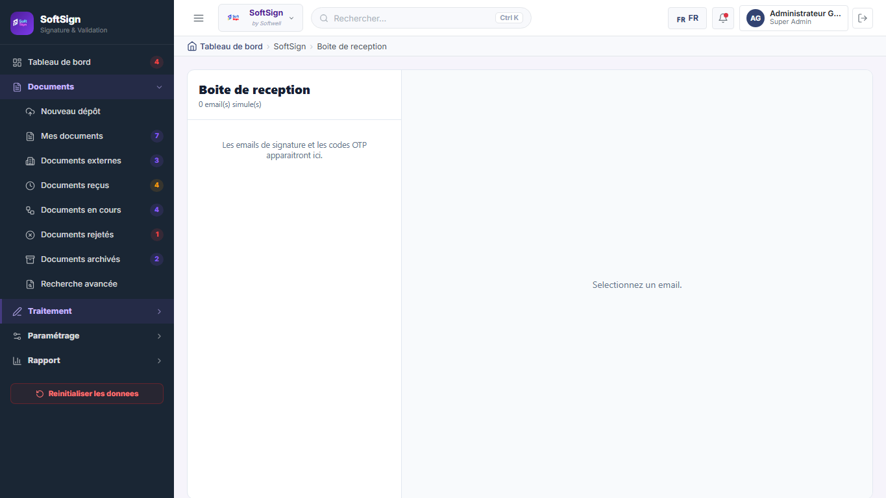

### Présentation générale

La boîte de réception affiche les demandes de signature externe reçues ou suivies dans SoftSign. Elle est utilisée par les tiers invités, les fournisseurs ou les utilisateurs qui consultent les demandes associées à une adresse.

### Éléments affichés

| Élément | Signification |
|---|---|
| Demande de signature | Document pour lequel une signature externe est attendue. |
| Expéditeur | Personne ou organisation ayant envoyé la demande. |
| Échéance | Date limite de validité du lien. |
| Statut | En attente, OTP envoyé, OTP vérifié, signé, expiré ou annulé selon le parcours. |

### Actions

| Action | Rôle exact | Conditions |
|---|---|---|
| Ouvrir | Accède au portail de signature ou au détail de la demande. | Disponible si la demande est encore consultable. |
| Signer | Lance le parcours de signature externe. | Disponible si la demande est active. |
| Relancer ou régénérer | Envoie une nouvelle relance ou recrée un lien. | Disponible selon statut et droits internes. |

# Signature externe et portail tiers

## Portail fournisseur

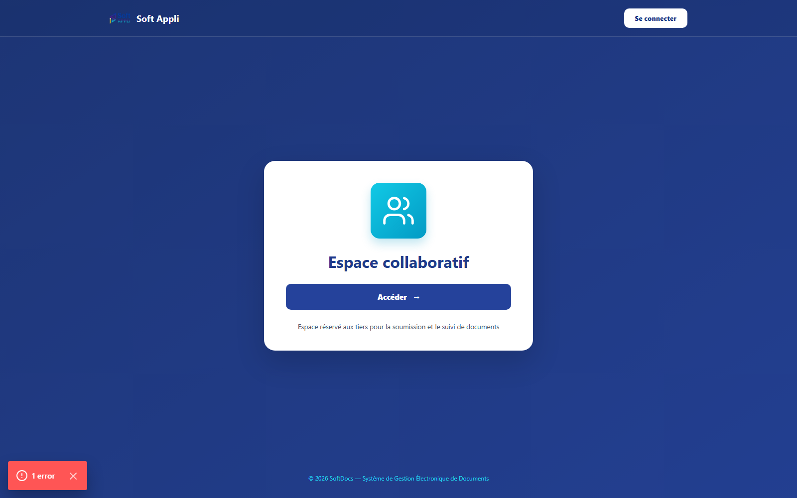

### Présentation générale

Le portail fournisseur permet à un tiers de déposer des documents ou d'accéder aux services autorisés, dont SoftSign. Il est utilisé par les fournisseurs ou partenaires externes après création et validation de leur compte.

### Champs et accès

| Élément | Fonction | Relation avec SoftSign |
|---|---|---|
| Identifiants fournisseur | Permettent au fournisseur de se connecter. | Le compte doit être validé dans Validation fournisseurs. |
| Accès SoftSign | Autorise l'utilisation du module signature. | Si l'accès est en attente ou refusé, le fournisseur ne peut pas signer via le portail. |
| Documents déposés | Documents transmis par le fournisseur. | Ils apparaissent ensuite dans Documents externes côté backoffice. |

## Portail de signature externe avec OTP

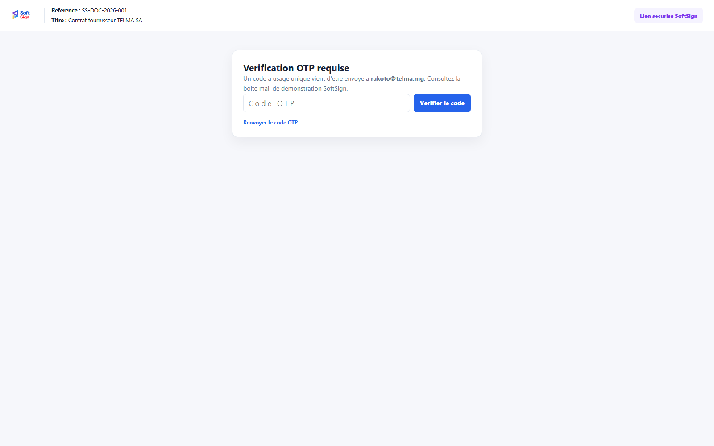

### Présentation générale

Le portail de signature externe est l'écran utilisé par un tiers invité à signer un document. Le tiers reçoit un lien sécurisé et, lorsque l'OTP est requis, doit saisir le code reçu avant de signer.

### Champs et actions

| Élément | Fonction | Obligatoire |
|---|---|---|
| Référence | Identifie le document demandé à la signature. | Automatique |
| Titre | Permet au signataire de reconnaître le document. | Automatique |
| Code OTP | Sécurise l'accès ou la signature. | Oui si demandé |
| Vérifier le code | Confirme que le code est valide. | Oui avant signature si OTP requis |
| Renvoyer le code OTP | Demande un nouveau code. | Optionnel, limité par le paramétrage OTP |
| Lien sécurisé SoftSign | Rappelle que l'accès est dédié à cette demande. | Informatif |

### Relation avec le détail document

Lorsqu'un utilisateur interne clique sur Envoyer pour signature externe dans l'onglet Actions, SoftSign crée une demande externe. Le tiers utilise ensuite ce portail. Pendant ce temps, le document interne reste en attente de signature externe. Lorsque le tiers signe, l'étape concernée est validée et le workflow peut continuer.

# Paramétrage de signature et délégation

## Signatures et paraphes

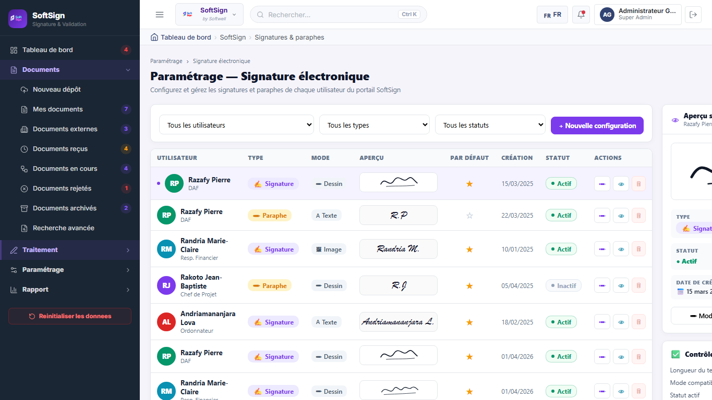

### Présentation générale

L'écran Signatures permet de gérer les signatures et paraphes disponibles pour les utilisateurs. Il est utilisé par les administrateurs ou par les utilisateurs autorisés à préparer leur propre signature.

### Filtres et liste

| Élément | Fonction |
|---|---|
| Tous les utilisateurs | Filtre les signatures d'un utilisateur précis. |
| Tous les types | Filtre entre signature et paraphe. |
| Tous les statuts | Affiche les configurations actives ou inactives. |
| Aperçu | Montre le rendu de la signature ou du paraphe. |
| Par défaut | Indique la signature utilisée en priorité lorsque plusieurs sont disponibles. |
| Statut | Indique si la signature peut être utilisée dans un document. |

### Actions

| Action | Rôle exact | Conditions et conséquences |
|---|---|---|
| Nouvelle configuration | Ouvre le formulaire de création d'une signature ou d'un paraphe. | Disponible selon les droits. |
| Modifier | Change la configuration existante. | Affecte les utilisations futures, pas nécessairement les preuves déjà générées. |
| Aperçu | Affiche la signature sélectionnée. | Sans effet métier. |
| Supprimer | Retire une configuration. | À utiliser avec prudence, car l'utilisateur peut perdre un choix de signature. |

## Formulaire de signature

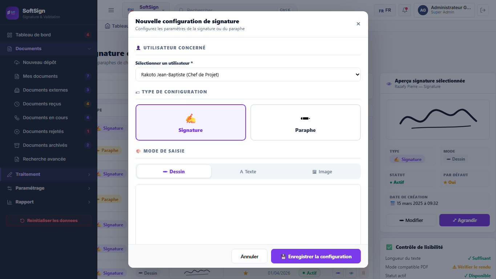

### Champs du formulaire

| Champ | Fonction | Format attendu | Obligatoire |
|---|---|---|---|
| Utilisateur | Personne à laquelle la signature est rattachée. | Liste d'utilisateurs. | Oui |
| Type | Définit s'il s'agit d'une signature ou d'un paraphe. | Choix unique. | Oui |
| Mode | Définit la manière de produire la signature. | Dessin, texte ou image. | Oui |
| Valeur ou dessin | Contenu qui sera apposé sur le document. | Texte, tracé ou image selon le mode. | Oui |
| Aperçu visuel | Montre le rendu attendu dans le document. | Affichage automatique. | Non |
| Par défaut | Définit la signature utilisée en priorité. | Case ou interrupteur. | Optionnel |
| Actif | Autorise l'utilisation de cette signature. | Case ou interrupteur. | Oui pour l'utiliser |

### Relation avec l'onglet Actions

Lorsqu'une étape de document demande une signature ou un paraphe, l'onglet Actions propose les signatures actives de l'utilisateur concerné. Si aucune signature active n'existe, l'utilisateur doit utiliser un autre mode autorisé, par exemple texte ou dessin, ou demander la création d'une configuration.

## Délégations

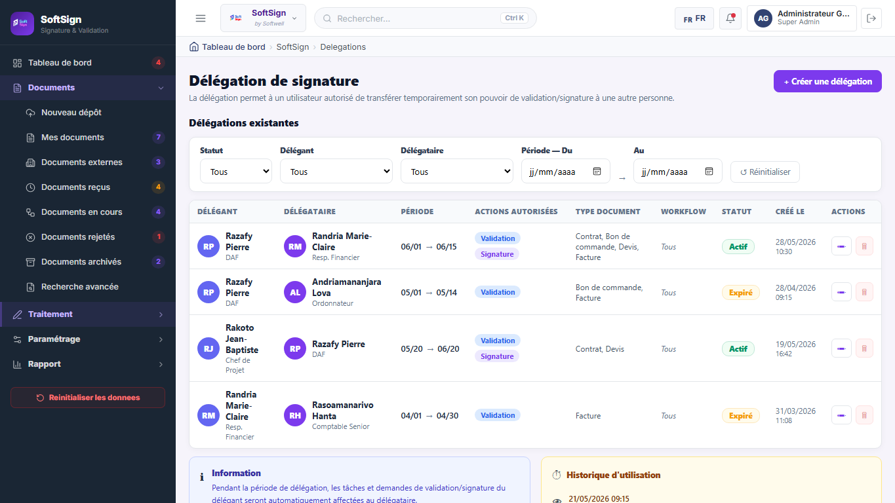

### Présentation générale

L'écran Délégations permet à un utilisateur d'autoriser un autre utilisateur à traiter certaines actions pendant une période donnée. Il est utilisé pour les absences, remplacements, congés ou transferts temporaires de responsabilité.

### Champs de création

| Champ | Fonction | Format attendu | Obligatoire |
|---|---|---|---|
| Délégant | Utilisateur qui délègue ses actions. | Liste d'utilisateurs. | Oui |
| Délégataire | Utilisateur qui reçoit le droit d'agir. | Liste d'utilisateurs. | Oui |
| Date début | Début de validité de la délégation. | Date. | Oui |
| Date fin | Fin de validité de la délégation. | Date. | Oui |
| Types de documents | Documents concernés par la délégation. | Sélection multiple. | Oui |
| Workflows | Circuits concernés. | Sélection dépendante des types choisis. | Oui |
| Actions autorisées | Validation, signature, paraphe, révision. | Cases à cocher. | Oui |
| Site | Périmètre de la délégation. | Liste. | Oui |
| Projet | Projet concerné si la délégation est limitée. | Liste. | Optionnel |
| Commentaire | Justification ou précision. | Texte libre. | Optionnel |
| Active | Indique si la délégation est utilisable. | Interrupteur. | Oui pour l'appliquer |

### Relation avec les documents

Lorsqu'un workflow est lancé, SoftSign vérifie si une délégation active existe pour l'action, le document, le workflow, le site et la période. Si oui, le délégataire peut recevoir ou traiter l'action à la place du délégant. L'historique conserve la trace de la délégation.

# Paramétrage général

## Paramètres généraux - Référence document

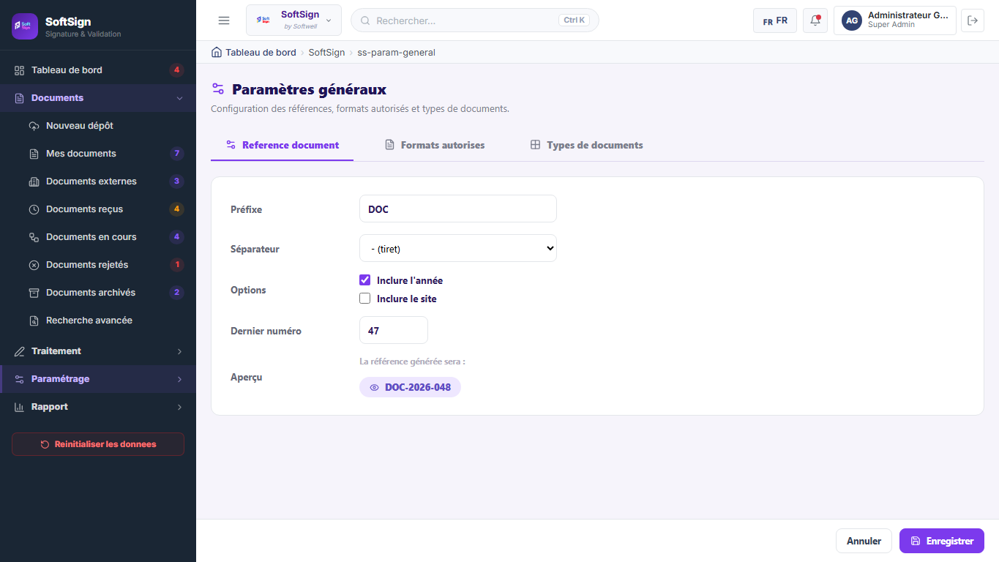

### Présentation générale

Les paramètres généraux définissent les règles communes qui influencent le dépôt et le suivi des documents SoftSign. L'onglet Référence document configure la manière dont les références sont générées.

### Champs

| Champ | Fonction | Format attendu | Obligatoire |
|---|---|---|---|
| Préfixe | Texte placé au début de la référence. | Texte court, par exemple DOC. | Oui |
| Séparateur | Caractère entre les parties de la référence. | Liste : tiret ou autre séparateur proposé. | Oui |
| Inclure l'année | Ajoute l'année dans la référence. | Case à cocher. | Optionnel |
| Inclure le site | Ajoute le site dans la référence. | Case à cocher. | Optionnel |
| Dernier numéro | Numéro déjà utilisé. | Nombre. | Oui |
| Aperçu | Montre la prochaine référence générée. | Automatique. | Informatif |

### Actions

| Action | Rôle exact | Conséquence |
|---|---|---|
| Enregistrer | Sauvegarde la configuration. | Les prochains documents utilisent la nouvelle règle. |
| Annuler | Abandonne les modifications non enregistrées. | Le paramétrage précédent reste actif. |

## Paramètres généraux - Formats autorisés

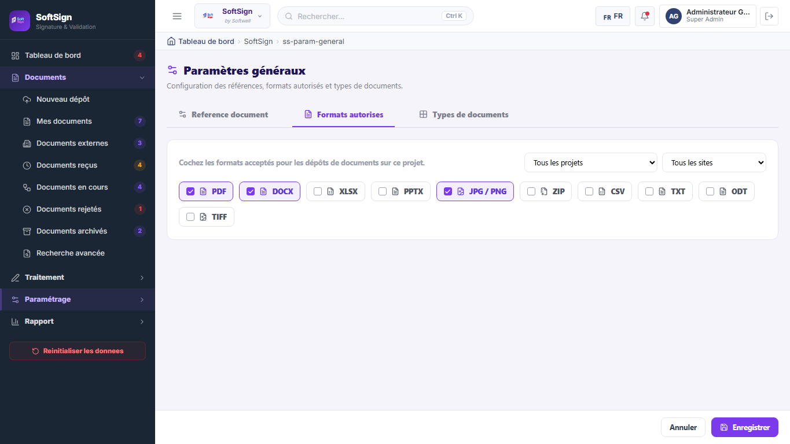

### Présentation générale

Cet onglet définit les formats de fichiers acceptés au dépôt. Il est utilisé par les administrateurs pour contrôler les types de documents que les utilisateurs et fournisseurs peuvent transmettre.

### Champs et relations

| Élément | Fonction | Relation |
|---|---|---|
| Formats globaux | Liste des formats autorisés par défaut. | Appliqués si aucune règle projet ou site ne les remplace. |
| Projet ou site | Permet de définir une règle ciblée. | La règle ciblée peut être plus stricte que la règle globale. |
| Format activé ou désactivé | Autorise ou bloque un format. | Influence directement le bouton de dépôt de fichier. |

Si un format est refusé ici, le dépôt affiche un message d'erreur et le document ne peut pas être lancé tant qu'un fichier conforme n'est pas ajouté.

## Paramètres généraux - Types de documents

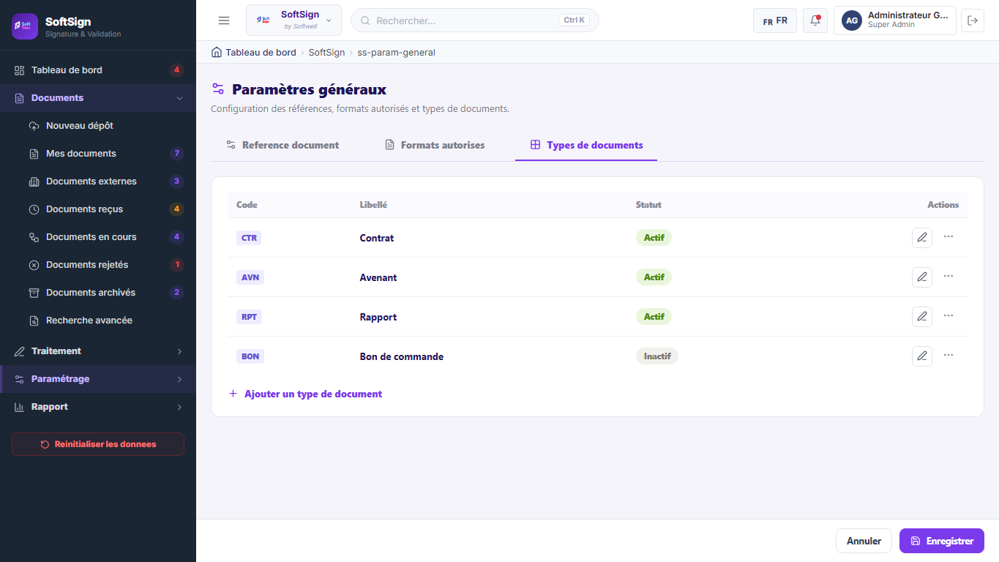

### Présentation générale

Cet onglet permet d'administrer les types documentaires utilisés dans SoftSign. Les types actifs sont proposés au dépôt et dans les workflows.

### Champs

| Champ | Fonction | Format attendu | Obligatoire |
|---|---|---|---|
| Code | Abréviation du type. | Texte court. | Oui |
| Libellé | Nom affiché à l'utilisateur. | Texte. | Oui |
| Actif | Indique si le type peut être utilisé. | Interrupteur ou statut. | Oui pour apparaître au dépôt |

### Relation avec Workflow

Un workflow est rattaché à un ou plusieurs types de documents. Si un type est désactivé, il ne doit plus être choisi lors d'un nouveau dépôt et les workflows associés ne seront plus proposés pour de nouveaux documents de ce type.

# Utilisateurs, rôles et autorisations

## Utilisateurs

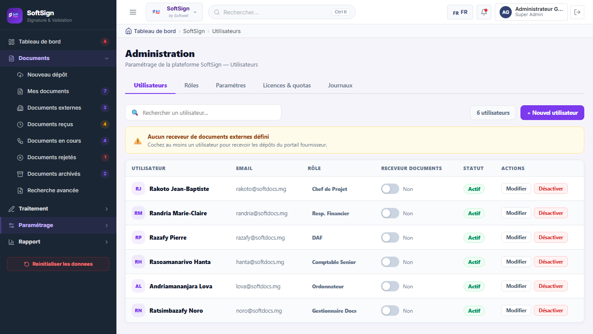

### Présentation générale

L'écran Utilisateurs permet de gérer les personnes qui peuvent utiliser SoftSign. Il est utilisé par les administrateurs pour créer, modifier, activer ou désactiver les comptes.

### Champs principaux

| Champ | Fonction | Format attendu | Obligatoire |
|---|---|---|---|
| Nom | Identité affichée dans SoftSign. | Texte. | Oui |
| Email | Adresse utilisée pour les notifications et OTP. | Adresse e-mail. | Oui |
| Téléphone | Peut servir aux notifications SMS ou OTP si activé. | Numéro de téléphone. | Optionnel selon canal |
| Fonction | Rôle métier de la personne. | Texte. | Optionnel |
| Nom d'utilisateur | Identifiant de connexion. | Texte. | Oui selon le mode de connexion |
| Mot de passe | Mot de passe initial ou modifié. | Texte confidentiel. | Oui à la création |
| Rôle | Niveau de droits : Super Admin, Admin, Standard ou Lecture seule. | Liste. | Oui |
| Statut | Actif ou inactif. | Liste ou interrupteur. | Oui |

### Relation avec les workflows

Les utilisateurs actifs peuvent être sélectionnés comme validateurs, signataires, receveurs ou administrateurs. Si un utilisateur est désactivé, il ne doit plus recevoir de nouvelles actions. Les workflows déjà en cours peuvent nécessiter une délégation ou une correction de paramétrage.

## Autorisations

### Présentation générale

L'écran Autorisation définit ce que chaque rôle peut voir et faire dans SoftSign. Il est utilisé par les administrateurs pour sécuriser les menus et actions.

### Éléments de l'écran

| Élément | Fonction |
|---|---|
| Rôle sélectionné | Rôle dont les droits sont modifiés. |
| Menus | Dépôt, documents, signature, délégations, rapports et paramétrage. |
| Actions | Création, consultation, modification, suppression, téléchargement. |
| Cases cochées | Droit accordé pour le menu et l'action correspondants. |

### Actions

| Action | Rôle exact | Conséquence |
|---|---|---|
| Tout sélectionner | Donne tous les droits au rôle affiché. | À réserver aux profils de confiance. |
| Réinitialiser | Revient aux droits par défaut. | Efface les modifications non voulues. |
| Enregistrer | Sauvegarde les autorisations. | Les menus et boutons visibles peuvent changer pour les utilisateurs de ce rôle. |

### Relation avec les écrans

Si un utilisateur ne voit pas un menu ou un bouton, la cause peut venir de cet écran. Par exemple, un profil Lecture seule peut consulter un document sans pouvoir valider, signer, supprimer ou modifier un workflow.

# Sécurité OTP

## Paramétrage OTP

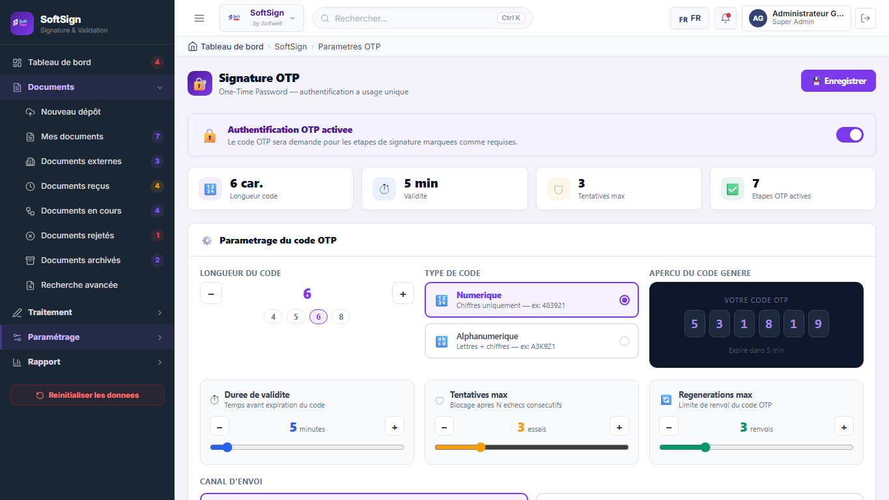

### Présentation générale

L'écran Paramétrage OTP définit les règles du code à usage unique utilisé pour sécuriser certaines signatures ou validations. Il est utilisé par les administrateurs.

### Champs généraux

| Champ | Fonction | Format attendu | Obligatoire |
|---|---|---|---|
| Activer OTP | Active ou désactive la sécurité OTP dans SoftSign. | Interrupteur. | Oui pour utiliser OTP |
| Longueur du code | Nombre de caractères du code. | Nombre. | Oui |
| Type de code | Définit le contenu du code. | Numérique ou alphanumérique. | Oui |
| Durée de validité | Temps pendant lequel le code reste valable. | Nombre de minutes. | Oui |
| Tentatives max | Nombre d'essais autorisés. | Nombre. | Oui |
| Régénérations max | Nombre de renvois possibles. | Nombre. | Oui |
| Canaux | Moyen d'envoi du code. | Email, SMS ou les deux. | Au moins un canal |

### OTP par étape de workflow

La partie OTP par étape de workflow permet d'activer ou désactiver l'OTP sur une étape précise. Cette option est essentielle pour comprendre l'onglet Actions d'un document.

| Paramètre | Effet dans le détail document |
|---|---|
| Étape sans OTP | L'utilisateur peut valider l'étape sans code, si les autres conditions sont remplies. |
| Étape avec OTP requis | L'utilisateur doit recevoir, saisir et vérifier le code avant de valider. |
| OTP global désactivé | Même si une étape est marquée OTP requis, le bloc OTP ne peut pas fonctionner tant que l'OTP global n'est pas activé. |

### Relation avec la signature externe

Lorsqu'une demande de signature externe exige un OTP, le tiers reçoit ou consulte son code puis le saisit dans le portail externe. Sans code valide, il ne peut pas terminer la signature.

# Workflows

## Liste des workflows

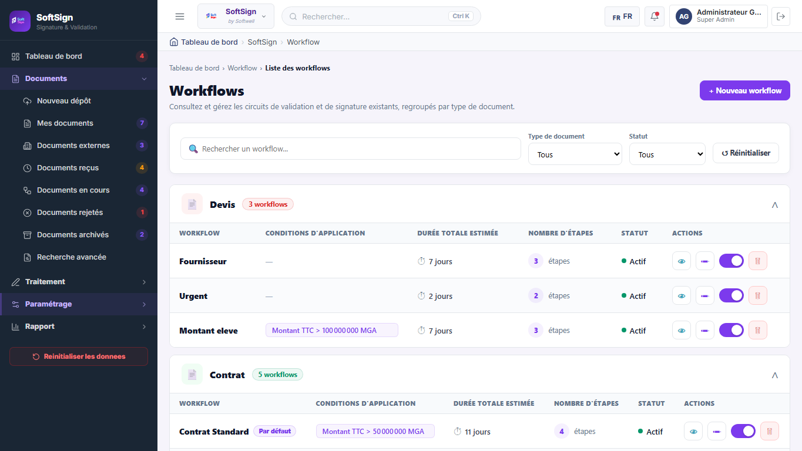

### Présentation générale

L'écran Workflow permet de créer et maintenir les circuits de validation et de signature. Il est central dans SoftSign, car il détermine les actions visibles dans les documents.

### Éléments affichés

| Élément | Signification |
|---|---|
| Type de document | Les workflows sont regroupés par catégorie documentaire. |
| Nom du workflow | Nom utilisé au dépôt et dans le détail document. |
| Conditions d'application | Règles qui permettent de proposer automatiquement le workflow. |
| Durée totale estimée | Somme des durées prévues sur les étapes. |
| Nombre d'étapes | Indique la longueur du circuit. |
| Statut | Actif ou inactif. Seuls les workflows actifs sont proposés aux nouveaux dépôts. |
| Actions | Visualiser, modifier, activer ou désactiver, supprimer selon les droits. |

### Boutons et actions

| Action | Rôle exact | Conditions et conséquences |
|---|---|---|
| Nouveau workflow | Crée un nouveau circuit. | Disponible aux administrateurs autorisés. |
| Rechercher un workflow | Filtre la liste par nom ou contenu. | N'affecte pas les documents. |
| Type de document | Filtre les workflows par catégorie. | Utile si beaucoup de workflows existent. |
| Statut | Filtre actif ou inactif. | Permet de contrôler les circuits utilisables. |
| Visualiser | Affiche le détail sans modifier. | Sans effet sur les documents. |
| Modifier | Ouvre l'éditeur de workflow. | Les changements s'appliquent aux futurs lancements et selon les règles de l'application aux circuits non encore lancés. |
| Activer ou désactiver | Rend le workflow disponible ou non. | Un workflow inactif n'est plus proposé au dépôt. |
| Supprimer | Retire le workflow. | À éviter si le workflow est encore utilisé dans l'organisation. |

## Éditeur de workflow

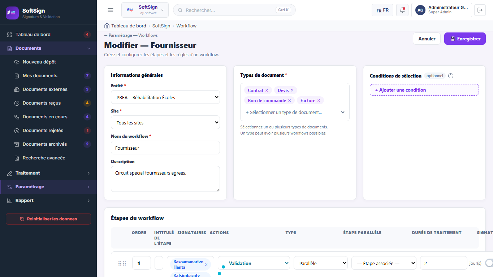

### Présentation générale

L'éditeur de workflow permet de définir les règles métier d'un circuit : périmètre, types de documents, conditions de sélection, étapes, signataires, délais, OTP et signature externe.

### Champs généraux

| Champ | Fonction | Format attendu | Obligatoire |
|---|---|---|---|
| Entité | Périmètre organisationnel du workflow. | Liste. | Oui |
| Site | Site concerné ou tous les sites. | Liste. | Oui |
| Nom du workflow | Libellé affiché au dépôt et dans les listes. | Texte. | Oui |
| Description | Explication du circuit. | Texte libre. | Optionnel |
| Types de document | Types pour lesquels le workflow peut être proposé. | Sélection multiple. | Oui |
| Conditions de sélection | Règles de choix automatique. | Champ, opérateur et valeur. | Optionnel |

### Champs des étapes

| Champ | Fonction | Format attendu | Obligatoire |
|---|---|---|---|
| Ordre | Position de l'étape dans le circuit. | Nombre. | Oui |
| Intitulé de l'étape | Nom lisible de l'étape. | Texte. | Oui |
| Signataires ou validateurs | Personnes attendues. | Sélection d'utilisateurs. | Oui |
| Action | Type d'action à réaliser. | Révision, validation, paraphe, signature ou archivage. | Oui |
| Type | Mode séquentiel ou parallèle. | Liste. | Oui |
| Étape parallèle | Étape associée en cas de traitement parallèle. | Liste. | Obligatoire si l'étape est parallèle selon le paramétrage |
| Durée de traitement | Délai prévu pour l'étape. | Nombre de jours. | Oui |
| Signature externe autorisée | Autorise l'envoi à un tiers externe. | Interrupteur. | Optionnel |
| OTP | Demande un code à usage unique sur l'étape. | Bouton ou interrupteur. | Optionnel |

### Relations essentielles avec les documents

| Réglage dans Workflow | Conséquence dans le détail document |
|---|---|
| Action Signature | L'onglet Actions affiche le bloc Signature du document. Une zone de signature doit être placée au dépôt. |
| Action Paraphe | L'onglet Actions affiche un bloc de paraphe. Une zone de paraphe doit être placée au dépôt. |
| Action Validation | L'onglet Actions affiche une validation sans signature visuelle. |
| OTP activé sur l'étape | Le bouton Valider l'action reste inactif tant que le code OTP n'est pas vérifié. |
| Signature externe autorisée | Le bouton Envoyer pour signature externe apparaît dans l'onglet Actions. |
| Signature externe non autorisée | L'utilisateur ne peut pas envoyer l'étape à un tiers, même si le document est signé dans SoftSign. |
| Durée de traitement | Alimente les alertes, retards et relances. |
| Étape parallèle | Plusieurs utilisateurs doivent agir au même niveau avant le passage à l'étape suivante. |
| Envoi automatique au déposant | À la fin du workflow, SoftSign peut envoyer le document signé, le certificat et le lien de consultation au déposant. |

### Point d'attention

Si un utilisateur ne voit pas le bouton Envoyer pour signature externe dans le détail document, il faut vérifier ici que l'étape active autorise bien la signature externe. Si l'action demandée est une signature et que le bloc OTP apparaît, il faut vérifier ici que l'étape est marquée OTP requis et vérifier aussi l'écran Paramétrage OTP.

# Notifications, relances et modèles

## Notifications

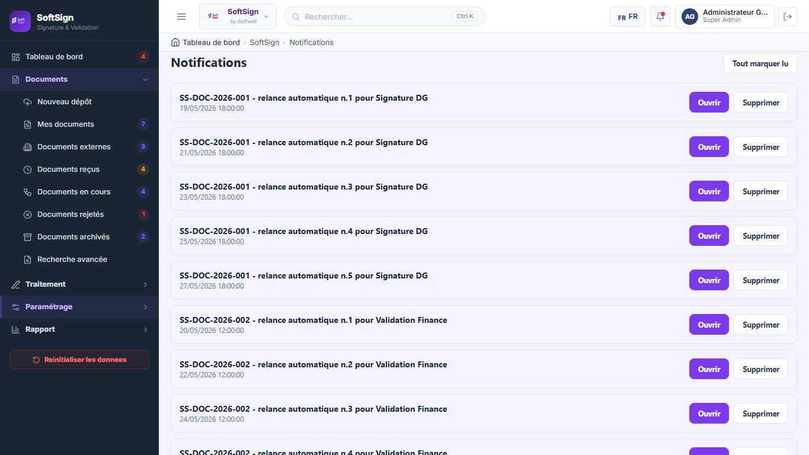

### Présentation générale

L'écran Notifications regroupe les messages générés par SoftSign : nouveau document, action attendue, relance, rejet, finalisation ou e-mail envoyé. Il est utilisé par les utilisateurs pour suivre les événements importants.

### Actions

| Action | Rôle exact | Conséquence |
|---|---|---|
| Ouvrir | Accède à l'écran ou au document concerné. | Permet de traiter rapidement l'élément. |
| Supprimer | Retire la notification de la liste. | Ne supprime pas le document ni l'historique. |

### Relation avec les autres écrans

Les notifications sont déclenchées par le dépôt, les actions dans le détail document, les relances, les signatures externes, les rejets et l'envoi automatique au déposant.

## Relances

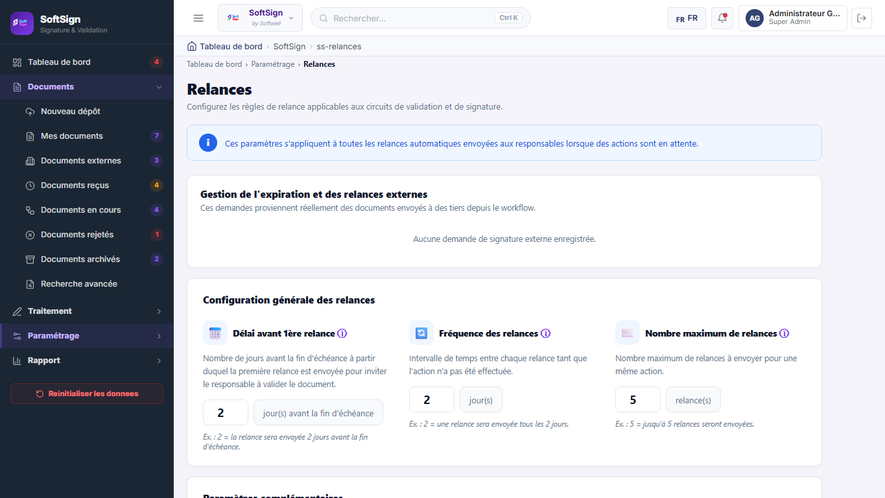

### Présentation générale

L'écran Relances définit les règles de rappel avant ou après échéance. Il est utilisé par les administrateurs pour éviter les blocages de workflow.

### Champs

| Champ | Fonction | Format attendu | Obligatoire |
|---|---|---|---|
| Délai avant première relance | Moment où la première relance doit être envoyée. | Nombre de jours. | Oui |
| Fréquence des relances | Intervalle entre deux relances. | Nombre de jours. | Oui |
| Nombre maximum de relances | Limite totale de rappels. | Nombre. | Oui |
| Notification interne | Envoie une notification dans SoftSign. | Case à cocher. | Optionnel |
| Lien direct | Ajoute un lien vers le document dans la relance. | Case à cocher. | Optionnel |

### Relation avec l'onglet Actions

Le bouton Relancer dans le détail document respecte cette configuration. Après le nombre maximal de relances, SoftSign ne doit plus envoyer de nouvelle relance automatique pour la même action.

## Modèles emails

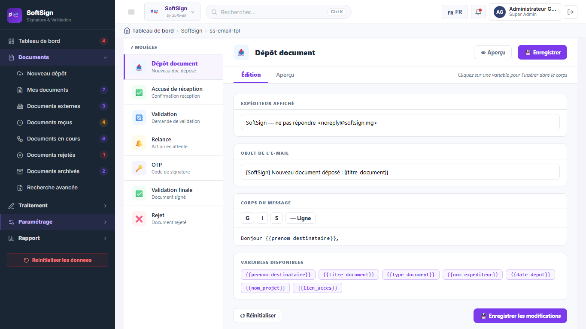

### Présentation générale

L'écran Modèles emails permet de personnaliser les messages envoyés par SoftSign : dépôt, accusé de réception, demande de validation, relance, OTP, validation finale ou rejet.

### Champs

| Champ | Fonction | Format attendu | Obligatoire |
|---|---|---|---|
| Modèle sélectionné | Choisit le type d'e-mail à modifier. | Liste de modèles. | Oui |
| Objet | Sujet de l'e-mail. | Texte avec variables possibles. | Oui |
| Corps | Contenu du message. | Texte libre avec variables. | Oui |
| Variables | Champs automatiquement remplacés. | Sélection ou insertion de variable. | Optionnel |
| Aperçu | Montre le rendu du message. | Affichage automatique. | Informatif |

### Relation avec les parcours

Une modification de modèle change les futurs e-mails envoyés lors des actions correspondantes. Par exemple, le modèle OTP influence le message reçu par un signataire lorsque l'étape demande un code.

## Personnalisation application

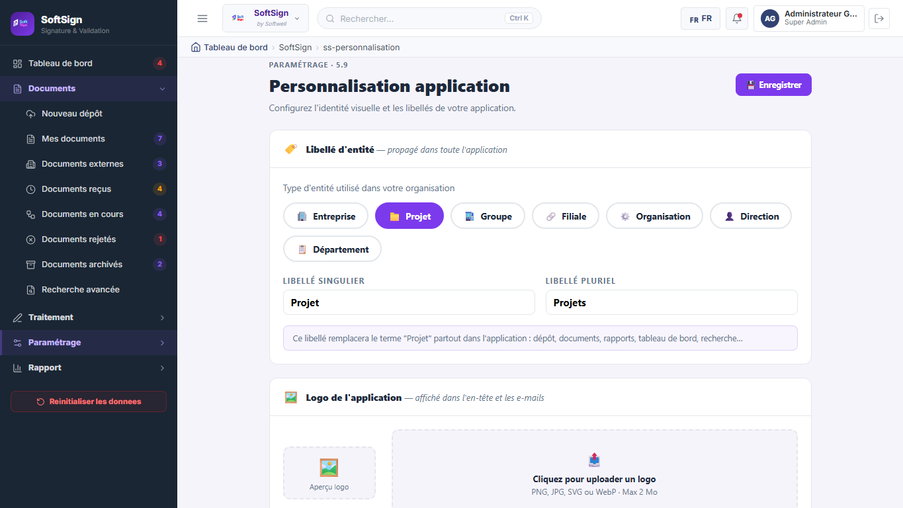

### Présentation générale

L'écran Personnalisation permet d'adapter certains libellés et éléments visuels de SoftSign à l'organisation. Il est utilisé par les administrateurs.

### Éléments personnalisables

| Élément | Fonction | Effet utilisateur |
|---|---|---|
| Libellé d'entité | Adapte les mots utilisés pour représenter l'organisation. | Les utilisateurs voient les termes choisis dans l'application. |
| Logo | Remplace ou ajuste le logo affiché. | Influence l'en-tête et certains supports. |
| Mode clair ou sombre | Définit l'apparence générale. | Change le confort visuel. |
| Couleurs | Ajustent les couleurs principales. | Renforce l'identité visuelle. |

### Conséquence

La personnalisation ne modifie pas les workflows, documents ou autorisations. Elle influence l'apparence et certains libellés visibles.

# Fournisseurs et comptes externes

## Validation fournisseurs

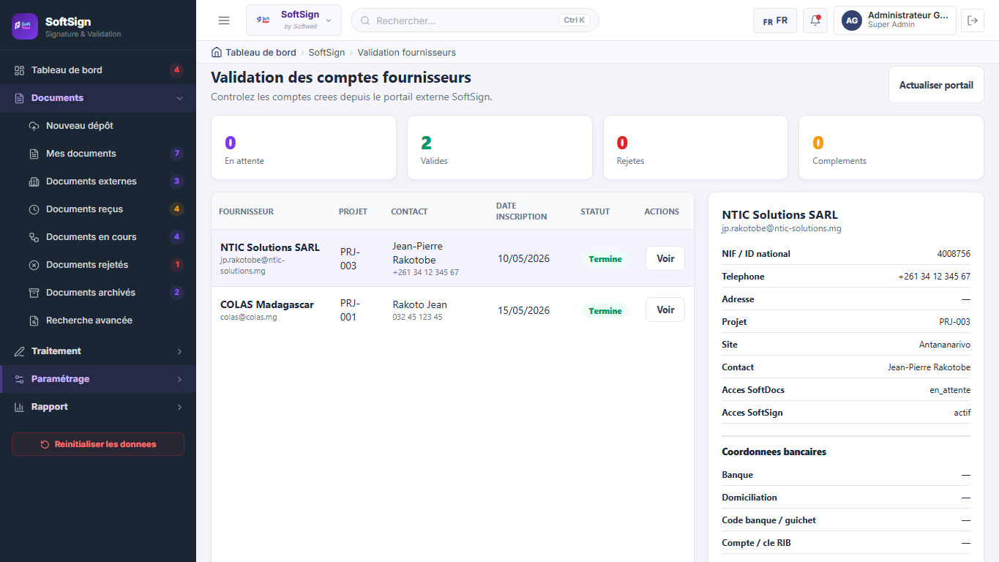

### Présentation générale

L'écran Validation fournisseurs permet de contrôler les comptes externes demandant un accès à SoftSign ou aux autres modules. Il est utilisé par les administrateurs et responsables de relation fournisseur.

### Éléments affichés

| Élément | Signification |
|---|---|
| Fournisseur | Raison sociale du compte externe. |
| Projet et site | Périmètre demandé ou rattaché. |
| Contact | Nom, e-mail et téléphone du représentant. |
| Statut | En attente, actif ou rejeté. |
| Accès SoftDocs | Indique si le fournisseur peut utiliser SoftDocs. |
| Accès SoftSign | Indique si le fournisseur peut utiliser SoftSign. |

### Actions

| Action | Rôle exact | Conséquence |
|---|---|---|
| Voir | Affiche le détail du compte fournisseur. | Permet de contrôler les informations avant décision. |
| Valider ou activer | Donne accès au module autorisé. | Le fournisseur peut accéder au service choisi. |
| Rejeter | Refuse la demande. | Le fournisseur ne peut pas utiliser l'accès concerné. |

### Relation avec les signatures externes

Un tiers externe peut être choisi pour signer si son compte et son accès sont valides selon le fonctionnement de l'organisation. Si l'accès SoftSign est en attente, il peut être impossible de l'utiliser dans un parcours externe complet.

# Rapports

## Situation par validateur

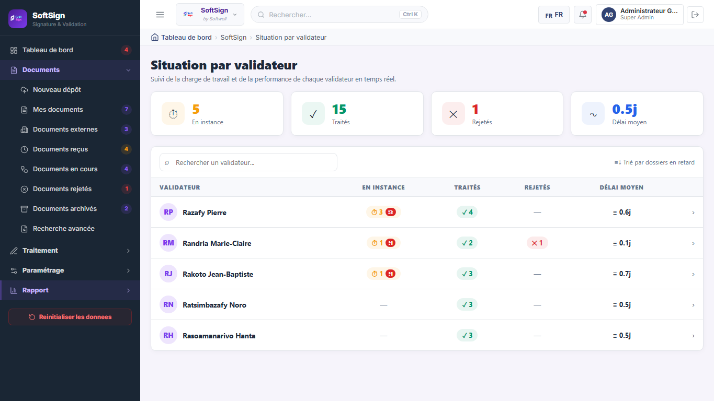

### Présentation générale

Le rapport Situation par validateur présente l'activité par personne : actions en instance, traitées, rejetées et délai moyen. Il est utilisé par les responsables pour suivre la charge et les retards.

### Filtres et indicateurs

| Élément | Fonction |
|---|---|
| Validateur | Filtre sur une personne précise. |
| Période | Analyse l'activité sur une plage de dates. |
| En instance | Actions encore à traiter. |
| Traités | Actions réalisées. |
| Rejetés | Actions refusées. |
| Délai moyen | Temps moyen de traitement. |

### Interaction

Une ligne de validateur peut être ouverte pour voir les documents associés. Cette vue aide à identifier les personnes surchargées ou les étapes fréquemment en retard.

## Situation par expéditeur

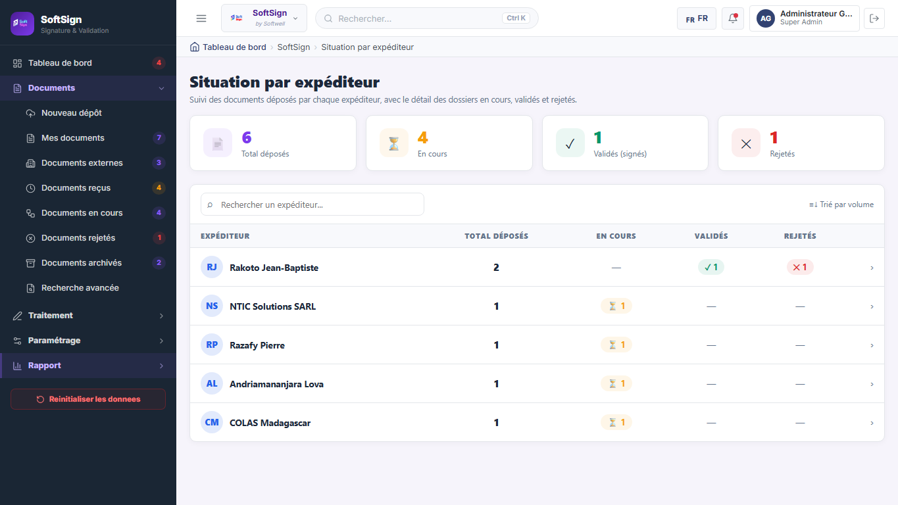

### Présentation générale

Le rapport Situation par expéditeur présente les documents selon leur déposant ou fournisseur. Il est utilisé pour suivre les volumes par origine et repérer les expéditeurs dont les documents sont souvent en cours ou rejetés.

### Indicateurs

| Indicateur | Signification |
|---|---|
| Total déposés | Nombre de documents transmis par l'expéditeur. |
| En cours | Documents encore dans le workflow. |
| Validés ou signés | Documents arrivés à une issue positive. |
| Rejetés | Documents refusés. |
| Délai ou statut | Aide à identifier les dossiers en retard. |

# Relations avec SoftDocs

## Passage d'un document SoftDocs vers SoftSign

SoftSign peut intervenir dans un processus documentaire SoftDocs lorsque le document doit être signé. Dans ce cas, SoftDocs prépare ou envoie le document vers SoftSign. Le bouton d'envoi vers SoftSign dans le détail d'un document SoftDocs dépend du paramétrage du workflow côté SoftDocs et de l'étape concernée.

La règle fonctionnelle est la suivante : l'action d'envoi vers SoftSign n'est disponible que si l'étape de workflow prévoit un document à signer ou une signature SoftSign. Si cette option n'est pas activée dans le workflow, l'utilisateur ne doit pas pouvoir déclencher l'envoi vers SoftSign depuis le détail SoftDocs.

## Retour d'un document signé vers SoftDocs

Après signature dans SoftSign, le document signé, son certificat et son historique peuvent être rattachés au dossier documentaire. Selon le paramétrage, l'envoi au déposant peut être automatique à la fin du workflow.

| Moment | Ce qui se passe |
|---|---|
| SoftDocs demande une signature | Le document est envoyé dans SoftSign et peut être verrouillé côté SoftDocs pendant la signature. |
| SoftSign traite le workflow | Les étapes de validation, paraphe, signature et OTP sont réalisées. |
| SoftSign termine le circuit | Le document signé et le certificat sont générés. |
| Retour vers SoftDocs | Le dossier SoftDocs peut recevoir l'annexe signée et les preuves associées. |

# Parcours utilisateur

## Parcours 1 - Déposer et signer un document interne

1. Le déposant ouvre Nouveau dépôt.
2. Il ajoute le fichier principal et vérifie les informations reconnues.
3. Il complète le type, le projet, le site, le montant et les annexes.
4. SoftSign propose un workflow selon le type, le montant et les conditions de sélection.
5. Le déposant place les zones demandées pour chaque étape Signature ou Paraphe.
6. Il lance le circuit.
7. Les validateurs et signataires reçoivent leurs actions dans Documents reçus ou Documents en cours.
8. Chaque acteur traite son étape dans l'onglet Actions.
9. Si une étape demande OTP, l'acteur saisit et vérifie le code avant validation.
10. À la fin, SoftSign produit le document final, l'historique et le certificat.

## Parcours 2 - Traiter un document externe

1. Le fournisseur dépose un document depuis le portail.
2. Le receveur consulte Documents externes.
3. Il vérifie l'expéditeur, le projet, le site, la conformité et les informations reconnues.
4. Il choisit le type de document et le workflow recommandé ou compatible.
5. Il place les zones de signature ou de paraphe si nécessaire.
6. Il valide et lance le circuit.
7. Le document passe dans Documents en cours.
8. Les étapes internes ou externes se déroulent selon le workflow.

## Parcours 3 - Envoyer à un tiers pour signature externe

1. Le document arrive sur une étape active dont le workflow autorise la signature externe.
2. Dans l'onglet Actions, le bouton Envoyer pour signature externe est visible.
3. L'utilisateur sélectionne ou confirme le tiers externe, l'e-mail, le message, la durée de validité et la zone.
4. SoftSign envoie un lien sécurisé au tiers.
5. Le document passe en attente de signature externe et le workflow est bloqué.
6. Le tiers ouvre le portail externe, vérifie l'OTP si demandé et signe.
7. SoftSign enregistre la preuve, débloque le workflow et passe à l'étape suivante.

## Parcours 4 - Traiter une action par délégation

1. Un administrateur ou utilisateur autorisé crée une délégation avec période, actions, types et workflows.
2. Lorsqu'une action correspond aux règles de délégation, le délégataire peut la traiter.
3. Le détail document conserve la trace de l'action réalisée dans le cadre de la délégation.
4. À la fin de la période, la délégation n'est plus utilisée.

## Parcours 5 - Administrer un circuit complet

1. L'administrateur crée ou met à jour les utilisateurs.
2. Il configure les signatures et paraphes actifs.
3. Il paramètre les types de documents et formats autorisés.
4. Il crée les workflows avec étapes, délais, OTP et signature externe.
5. Il règle les relances, notifications et modèles d'e-mails.
6. Il contrôle les autorisations par rôle.
7. Il suit l'activité dans les rapports.

# Règles fonctionnelles importantes

| Règle | Explication |
|---|---|
| Une signature ou un paraphe nécessite une zone | Si le workflow contient une étape Signature ou Paraphe, le dépôt doit définir où la signature sera apposée. |
| La signature externe dépend du workflow | Le bouton Envoyer pour signature externe n'est disponible que si l'étape active autorise cette option. |
| L'OTP dépend de deux réglages | L'OTP doit être activé dans Paramétrage OTP et requis sur l'étape du workflow. |
| Les relances suivent une limite | Le nombre maximal de relances est défini dans l'écran Relances. |
| Les menus dépendent des autorisations | Un utilisateur peut ne pas voir une action si son rôle ne l'autorise pas. |
| Les formats dépendent du paramétrage général | Un fichier refusé au dépôt doit être remplacé par un format autorisé. |
| Les workflows proposés dépendent du type et des conditions | Type de document, montant, devise, projet et site peuvent orienter le workflow recommandé. |
| Un document rejeté ne continue pas automatiquement | Le rejet met fin au circuit courant, sauf processus interne de correction ou nouveau dépôt. |
| Un document archivé n'est plus traité | Les actions sont remplacées par la consultation des preuves, versions et certificats. |

